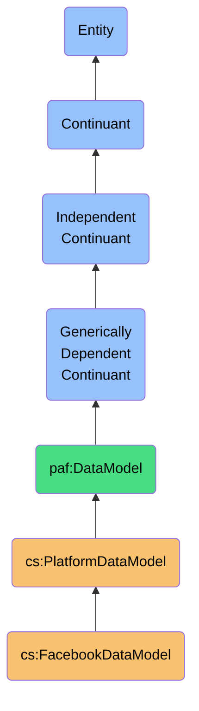
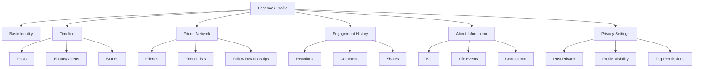
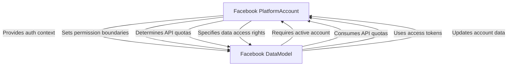

# FacebookDataModel

## Definition
A FacebookDataModel is an independent continuant immaterial entity that represents the platform-specific structure, semantics, and constraints of Facebook's data, including its unique friendship dynamics, visibility controls, reactions system, and social graph concepts.

## Hierarchy in BFO


## Overview
The FacebookDataModel captures the distinct ontological structure and semantics of Facebook's platform data. Unlike generic social platform models, it precisely represents Facebook's personal social networking concepts, including the nuanced friendship system, complex privacy and audience controls, rich reaction types, and the personal relationship graph that defines the Facebook experience.

This model maintains Facebook's native concepts rather than forcing them into generic social constructs, preserving critical semantic distinctions like the difference between a "friend" on Facebook versus a "connection" on professional networks, or Facebook's integrated messaging system distinct from other communication channels. By explicitly modeling Facebook-specific behaviors like reactions, post privacy settings, and the complex friend list management system, the model enables accurate interpretation of Facebook data.

As a platform-specific model, it provides high-fidelity semantic mappings for integrating Facebook data into a sovereign personal data ecosystem, supporting precise reasoning about personal relationships, shared experiences, and community memberships derived from this platform.

## Platform-Specific Properties

### Friendship Properties
| Property | Type | Description | Example |
|----------|------|-------------|---------|
| friendshipStatus | Enum | State of friendship | "FRIENDS", "FRIEND_REQUEST_SENT", "FRIEND_REQUEST_RECEIVED", "UNFRIENDED" |
| friendshipDate | DateTime | When friendship was established | "2018-06-15T12:30:45Z" |
| friendListMemberships | String[] | Custom friend lists | ["Close Friends", "College", "Family"] |
| mutualFriendsCount | Integer | Number of shared friends | 28 |
| friendshipVisibility | Enum | Privacy setting for friendship | "PUBLIC", "FRIENDS", "ONLY_ME" |
| followStatus | Boolean | Whether you follow their posts | true |
| blockedStatus | Boolean | Whether contact is blocked | false |

### Personal Identity Properties
| Property | Type | Description | Example |
|----------|------|-------------|---------|
| name | PersonName | User's full name | {"firstName": "John", "lastName": "Smith", "formatted": "John Smith"} |
| profilePictureUrl | String | Profile photo URL | "https://graph.facebook.com/123456789/picture?type=large" |
| coverPhotoUrl | String | Cover photo URL | "https://graph.facebook.com/123456789/cover_photo" |
| birthday | Date | User's birthday | "1990-04-23" |
| gender | String | User's gender | "Male" |
| hometown | Place | User's hometown | {"name": "Seattle, Washington", "id": "110843418940484"} |
| currentLocation | Place | Current city | {"name": "San Francisco, California", "id": "114952118516947"} |
| relationshipStatus | Enum | Relationship status | "MARRIED", "SINGLE", "IN_A_RELATIONSHIP" |

### Social Engagement Properties
| Property | Type | Description | Example |
|----------|------|-------------|---------|
| postsOnTimeline | Post[] | Timeline content | [{"id": "post123", "message": "Great day!", "created_time": "2023-04-15T14:22:33Z", ...}] |
| reactions | Reaction[] | Reactions to content | [{"type": "LIKE", "postId": "post456", "timestamp": "2023-04-16T08:14:22Z"}] |
| comments | Comment[] | Comments on content | [{"id": "comment789", "message": "Looks fun!", "postId": "post456", ...}] |
| taggedContent | Content[] | Content user is tagged in | [{"id": "photo101", "type": "PHOTO", "createdBy": "user345", ...}] |
| eventParticipation | Event[] | Events attending | [{"id": "event567", "name": "Summer BBQ", "rsvpStatus": "ATTENDING", ...}] |
| groupMemberships | Group[] | Groups user belongs to | [{"id": "group202", "name": "Neighborhood Watch", "role": "MEMBER", ...}] |

## Platform-Specific Entities

### Facebook-Specific Relationship Types
- **Friend**: Bidirectional personal relationship
- **Follow**: Content subscription without friendship
- **Restricted Friend**: Friend with limited content visibility
- **Blocked Contact**: Blocked from all interaction
- **Friend List Membership**: Categorized friendship grouping
- **Family Relationship**: Specified family connection type

### Facebook-Specific Social Entities
- **Facebook Post**: User-generated content
- **Facebook Page**: Brand or public figure presence
- **Facebook Group**: Community of shared interests
- **Facebook Event**: Scheduled gathering
- **Facebook Marketplace Listing**: Item for sale
- **Facebook Comment**: Response to content
- **Facebook Reaction**: Emotional response to content
- **Facebook Story**: Ephemeral 24-hour content

### Facebook-Specific Identity Components


## Semantic Differences

### Platform-Specific Semantics
- **Facebook Friend** vs **LinkedIn Connection**: Personal relationship vs professional relationship
- **Facebook Page** vs **LinkedIn Company**: Multi-purpose presence vs professional entity
- **Facebook Group** vs **LinkedIn Group**: General interest community vs professional interest community
- **Facebook Messenger** vs **LinkedIn InMail**: Personal messaging vs professional context communication
- **Facebook Reaction** vs **LinkedIn Like**: Rich emotional response vs simple endorsement

### Semantic Comparison Table
| Concept | Facebook Semantics | LinkedIn Semantics | Twitter Semantics |
|---------|-------------------|-------------------|-------------------|
| Connection | Personal friendship | Professional relationship | No direct equivalent |
| Following | Content subscription without friendship | Content subscription | Core relationship model |
| Identity | Personal representation | Professional representation | Personal/topical presence |
| Content | Personal life focus | Career/professional focus | Brief, public statements |
| Privacy | Friend-circle sharing | Career-oriented exposure | Public vs private account |

### Semantic Preservation Requirements
- **Friendship Status Preservation**: Maintain distinct meaning of friend relationship
- **Privacy Context Preservation**: Preserve audience and visibility settings
- **Reaction Semantics**: Maintain distinction between reaction types
- **Friend List Semantics**: Preserve friend categorization meaning
- **Timeline Context Preservation**: Maintain personal narrative chronology

## Data Model Schema

### Core Profile Schema
```json
{
  "$id": "https://personal-ai-foundry.org/schemas/facebook/profile-schema",
  "$schema": "http://json-schema.org/draft-07/schema#",
  "title": "Facebook Profile Schema",
  "type": "object",
  "properties": {
    "id": {
      "type": "string",
      "description": "Facebook unique user identifier"
    },
    "name": {
      "type": "string",
      "description": "User's full name"
    },
    "first_name": {
      "type": "string"
    },
    "last_name": {
      "type": "string"
    },
    "middle_name": {
      "type": "string"
    },
    "short_name": {
      "type": "string",
      "description": "User's short name or nickname"
    },
    "picture": {
      "type": "object",
      "properties": {
        "data": {
          "type": "object",
          "properties": {
            "url": {
              "type": "string",
              "format": "uri"
            },
            "width": {
              "type": "integer"
            },
            "height": {
              "type": "integer"
            },
            "is_silhouette": {
              "type": "boolean"
            }
          }
        }
      }
    },
    "birthday": {
      "type": "string",
      "format": "date"
    },
    "email": {
      "type": "string",
      "format": "email"
    },
    "gender": {
      "type": "string"
    },
    "hometown": {
      "type": "object",
      "properties": {
        "id": {
          "type": "string"
        },
        "name": {
          "type": "string"
        }
      }
    },
    "location": {
      "type": "object",
      "properties": {
        "id": {
          "type": "string"
        },
        "name": {
          "type": "string"
        }
      }
    },
    "relationship_status": {
      "type": "string",
      "enum": ["Single", "In a relationship", "Engaged", "Married", "In a civil partnership", "In a domestic partnership", "In an open relationship", "It's complicated", "Separated", "Divorced", "Widowed"]
    },
    "link": {
      "type": "string",
      "format": "uri",
      "description": "Profile URL"
    },
    "about": {
      "type": "string",
      "description": "User's bio"
    },
    "devices": {
      "type": "array",
      "items": {
        "type": "object",
        "properties": {
          "hardware": {
            "type": "string"
          },
          "os": {
            "type": "string"
          }
        }
      }
    },
    "education": {
      "type": "array",
      "items": {
        "type": "object",
        "properties": {
          "school": {
            "type": "object",
            "properties": {
              "id": {
                "type": "string"
              },
              "name": {
                "type": "string"
              }
            }
          },
          "type": {
            "type": "string"
          },
          "year": {
            "type": "object",
            "properties": {
              "id": {
                "type": "string"
              },
              "name": {
                "type": "string"
              }
            }
          },
          "concentration": {
            "type": "array",
            "items": {
              "type": "object",
              "properties": {
                "id": {
                  "type": "string"
                },
                "name": {
                  "type": "string"
                }
              }
            }
          }
        }
      }
    },
    "work": {
      "type": "array",
      "items": {
        "type": "object",
        "properties": {
          "employer": {
            "type": "object",
            "properties": {
              "id": {
                "type": "string"
              },
              "name": {
                "type": "string"
              }
            }
          },
          "position": {
            "type": "object",
            "properties": {
              "id": {
                "type": "string"
              },
              "name": {
                "type": "string"
              }
            }
          },
          "start_date": {
            "type": "string",
            "format": "date"
          },
          "end_date": {
            "type": "string",
            "format": "date"
          },
          "current": {
            "type": "boolean"
          }
        }
      }
    }
  },
  "required": ["id", "name"]
}
```

### Friendship Schema
```json
{
  "$id": "https://personal-ai-foundry.org/schemas/facebook/friendship-schema",
  "$schema": "http://json-schema.org/draft-07/schema#",
  "title": "Facebook Friendship Schema",
  "type": "object",
  "properties": {
    "id": {
      "type": "string",
      "description": "Unique identifier for the friendship relationship"
    },
    "friend": {
      "type": "object",
      "properties": {
        "id": {
          "type": "string",
          "description": "Facebook ID of the friend"
        },
        "name": {
          "type": "string"
        },
        "first_name": {
          "type": "string"
        },
        "last_name": {
          "type": "string"
        },
        "picture": {
          "type": "object",
          "properties": {
            "data": {
              "type": "object",
              "properties": {
                "url": {
                  "type": "string",
                  "format": "uri"
                }
              }
            }
          }
        }
      },
      "required": ["id", "name"]
    },
    "friendship_status": {
      "type": "string",
      "enum": ["FRIENDS", "FRIEND_REQUEST_SENT", "FRIEND_REQUEST_RECEIVED", "NOT_FRIENDS"],
      "description": "Current status of friendship"
    },
    "friendship_date": {
      "type": "string",
      "format": "date-time",
      "description": "When friendship was established"
    },
    "mutual_friends": {
      "type": "object",
      "properties": {
        "summary": {
          "type": "object",
          "properties": {
            "total_count": {
              "type": "integer",
              "description": "Number of mutual friends"
            }
          }
        },
        "data": {
          "type": "array",
          "items": {
            "type": "object",
            "properties": {
              "id": {
                "type": "string"
              },
              "name": {
                "type": "string"
              }
            }
          },
          "description": "Sample of mutual friends"
        }
      }
    },
    "friend_lists": {
      "type": "array",
      "items": {
        "type": "object",
        "properties": {
          "id": {
            "type": "string"
          },
          "name": {
            "type": "string"
          }
        }
      },
      "description": "Friend lists this person belongs to"
    },
    "privacy_setting": {
      "type": "string",
      "enum": ["PUBLIC", "FRIENDS", "RESTRICTED", "CUSTOM"],
      "description": "Visibility setting for this friendship"
    },
    "follow_status": {
      "type": "boolean",
      "description": "Whether you follow their posts"
    },
    "interactions": {
      "type": "object",
      "properties": {
        "recent_interactions_count": {
          "type": "integer",
          "description": "Count of interactions in last 60 days"
        },
        "last_interaction_date": {
          "type": "string",
          "format": "date-time"
        },
        "interaction_strength": {
          "type": "number",
          "minimum": 0,
          "maximum": 1,
          "description": "Facebook's calculated interaction strength (0-1)"
        }
      }
    }
  },
  "required": ["id", "friend", "friendship_status"]
}
```

## Platform-Specific Behaviors

### Data Access Patterns
- **API Rate Limits**: Complex limits based on endpoint and app type
- **Friend Visibility**: Only mutual friends visible through API
- **Privacy Controls**: Audience settings restrict data visibility
- **Content Access**: Limited access to historical posts
- **API Versioning**: Frequent API version changes affecting data model
- **Data Portability**: Archive download with complex format

### Update Mechanisms
- **Profile Information**: Direct API updates or UI-based changes
- **Friend Events**: Limited webhook notifications for friend changes
- **Content Updates**: Real-time updates for certain content types
- **Privacy Changes**: No notification for audience setting changes
- **Graph Changes**: No direct notification for mutual friend changes
- **Ad Preferences**: Separate system for ad targeting preferences

### Platform-Specific Constraints
- **Friend Limits**: Maximum 5,000 friends per user
- **Privacy Complexity**: Multi-level audience control system
- **Content Ownership**: Complex rules about content ownership
- **Tags and Mentions**: Require approval based on settings
- **Content Distribution**: EdgeRank algorithm affects content visibility
- **Authentication Scopes**: Granular permissions with deprecation timelines

## Semantic Mappings

### External Ontology Mappings
```turtle
@prefix fb: <https://graph.facebook.com/schema/> .
@prefix paf: <https://personal-ai-foundry.org/ontology/> .
@prefix schema: <https://schema.org/> .
@prefix foaf: <http://xmlns.com/foaf/0.1/> .
@prefix sioc: <http://rdfs.org/sioc/ns#> .

# Class mappings
fb:User rdfs:subClassOf schema:Person .
fb:User rdfs:subClassOf foaf:Person .
fb:User rdfs:subClassOf paf:SocialIdentity .

fb:Page rdfs:subClassOf schema:Organization .
fb:Group rdfs:subClassOf sioc:Community .
fb:Event rdfs:subClassOf schema:Event .

# Property mappings
fb:first_name schema:sameAs schema:givenName .
fb:last_name schema:sameAs schema:familyName .
fb:birthday schema:sameAs schema:birthDate .
fb:location schema:sameAs schema:homeLocation .

# Relationship mappings
fb:friend rdfs:subClassOf paf:PersonalConnection .
fb:member rdfs:subClassOf sioc:member_of .
fb:attendee rdfs:subClassOf schema:attendee .
```

### PAF Core Model Mappings
| Facebook Entity | PAF Entity | Mapping Type | Notes |
|-----------------|------------|--------------|-------|
| User | Contact | Extension | Facebook User extends generic Contact |
| Friend | Relationship | Specialization | Adds friendship status, lists, privacy settings |
| Post | Content | Specialization | Adds reactions, audience settings |
| Page Like | Interest | Specialization | Represents affinity for topic/brand |
| Event | Engagement | Specialization | Adds RSVP status |
| Group | Community | Specialization | Adds role, notification settings |
| Message | Communication | Specialization | Thread-based messaging model |

### Transformation Examples
```typescript
// Mapping Facebook profile to PAF Contact
function mapFacebookProfileToContact(fbProfile: FacebookProfile): PafContact {
  return {
    id: `facebook-${fbProfile.id}`,
    source: {
      platform: 'Facebook',
      sourceId: fbProfile.id,
      retrievedAt: new Date()
    },
    name: {
      givenName: fbProfile.first_name,
      familyName: fbProfile.last_name,
      middleName: fbProfile.middle_name || undefined,
      formattedName: fbProfile.name
    },
    avatarUrl: fbProfile.picture?.data?.url,
    birthdate: fbProfile.birthday ? new Date(fbProfile.birthday) : undefined,
    gender: fbProfile.gender,
    employment: fbProfile.work?.map(job => ({
      organization: {
        name: job.employer.name,
        externalId: job.employer.id ? `facebook-page-${job.employer.id}` : undefined
      },
      title: job.position?.name,
      period: {
        start: job.start_date ? new Date(job.start_date) : undefined,
        end: job.end_date ? new Date(job.end_date) : undefined
      },
      isCurrent: job.current || false
    })) || [],
    education: fbProfile.education?.map(edu => ({
      institution: {
        name: edu.school.name,
        externalId: edu.school.id ? `facebook-page-${edu.school.id}` : undefined
      },
      degree: edu.type,
      fieldOfStudy: edu.concentration?.map(c => c.name).join(', '),
      year: edu.year?.name
    })) || [],
    locations: [
      ...(fbProfile.hometown ? [{
        type: 'hometown',
        name: fbProfile.hometown.name,
        externalId: fbProfile.hometown.id ? `facebook-place-${fbProfile.hometown.id}` : undefined
      }] : []),
      ...(fbProfile.location ? [{
        type: 'current',
        name: fbProfile.location.name,
        externalId: fbProfile.location.id ? `facebook-place-${fbProfile.location.id}` : undefined
      }] : [])
    ],
    relationshipStatus: fbProfile.relationship_status,
    emails: fbProfile.email ? [{ 
      value: fbProfile.email, 
      type: 'facebook', 
      verified: true 
    }] : [],
    externalUrls: [
      {
        platform: 'Facebook',
        url: fbProfile.link || `https://facebook.com/${fbProfile.id}`,
        label: 'Facebook Profile'
      }
    ],
    relationshipContext: {
      personal: {
        bio: fbProfile.about
      }
    }
  };
}

// Mapping Facebook friendship to PAF Relationship
function mapFacebookFriendshipToPafRelationship(friendship: FacebookFriendship): PafRelationship {
  return {
    id: `facebook-friendship-${friendship.id}`,
    type: 'friendship',
    source: {
      platform: 'Facebook',
      sourceId: friendship.id,
      retrievedAt: new Date()
    },
    contactId: `facebook-${friendship.friend.id}`,
    relationshipStrength: calculateRelationshipStrength(friendship),
    relationshipContext: {
      personal: {
        friendshipStatus: friendship.friendship_status,
        mutualFriends: friendship.mutual_friends?.summary?.total_count || 0,
        friendLists: friendship.friend_lists?.map(list => list.name) || []
      }
    },
    metadata: {
      platform: 'Facebook',
      platformSpecific: {
        friendshipStatus: friendship.friendship_status,
        privacySetting: friendship.privacy_setting,
        followStatus: friendship.follow_status,
        interactionStrength: friendship.interactions?.interaction_strength
      }
    },
    established: friendship.friendship_date ? new Date(friendship.friendship_date) : undefined,
    privacyLevel: mapPrivacySettingToPrivacyLevel(friendship.privacy_setting)
  };
}

// Helper function to calculate relationship strength
function calculateRelationshipStrength(friendship: FacebookFriendship): number {
  // Base strength from friendship status
  let strength = friendship.friendship_status === 'FRIENDS' ? 0.7 : 0.3;
  
  // Adjust for interaction strength if available
  if (friendship.interactions?.interaction_strength !== undefined) {
    strength = (strength + friendship.interactions.interaction_strength) / 2;
  }
  
  // Adjust for friend lists
  if (friendship.friend_lists?.some(list => list.name === 'Close Friends')) {
    strength = Math.min(1.0, strength + 0.2);
  }
  
  return strength;
}

// Map Facebook privacy settings to PAF privacy levels
function mapPrivacySettingToPrivacyLevel(setting?: string): string {
  switch (setting) {
    case 'PUBLIC': return 'public';
    case 'FRIENDS': return 'connections';
    case 'RESTRICTED': return 'restricted';
    case 'CUSTOM': return 'custom';
    default: return 'default';
  }
}
```

## Implementation

### Platform API Integration
```typescript
class FacebookDataModel implements PlatformDataModel {
  readonly id = 'facebook';
  readonly version = '1.0.0';
  readonly schema: Schema;
  
  constructor(private apiClient: FacebookApiClient) {
    this.schema = this.loadSchema();
  }
  
  async getProfile(userId: string): Promise<FacebookProfile> {
    const fields = [
      'id', 'name', 'first_name', 'last_name', 'middle_name', 
      'picture', 'birthday', 'email', 'gender', 'hometown', 
      'location', 'relationship_status', 'link', 'about',
      'education', 'work'
    ].join(',');
    
    const rawProfile = await this.apiClient.get(`/${userId}`, { fields });
    return this.validateAndTransformProfile(rawProfile);
  }
  
  async getFriends(userId: string, options?: FriendsOptions): Promise<FacebookFriendship[]> {
    const fields = [
      'id', 'name', 'first_name', 'last_name', 'picture', 
      'mutual_friends.limit(10)'
    ].join(',');
    
    const rawFriends = await this.apiClient.get(`/${userId}/friends`, {
      fields,
      limit: options?.limit || 100
    });
    
    // Transform API response into friendship objects
    const friendships = await Promise.all(rawFriends.data.map(async friend => {
      // Get additional friendship data when possible
      let friendshipData = {};
      try {
        friendshipData = await this.apiClient.get(`/${userId}/friends/${friend.id}`);
      } catch (error) {
        console.warn(`Couldn't get detailed friendship data for ${friend.id}`, error);
      }
      
      return this.validateAndTransformFriendship({
        id: `${userId}_${friend.id}`,
        friend,
        friendship_status: 'FRIENDS',
        mutual_friends: friend.mutual_friends,
        ...friendshipData
      });
    }));
    
    return friendships;
  }
  
  mapToPAF(sourceData: FacebookProfile): PAFContact {
    return mapFacebookProfileToContact(sourceData);
  }
  
  mapFriendshipToPAF(friendship: FacebookFriendship): PAFRelationship {
    return mapFacebookFriendshipToPafRelationship(friendship);
  }
  
  mapFromPAF(pafContact: PAFContact): Partial<FacebookProfile> {
    // Implementation of reverse mapping...
    return {
      first_name: pafContact.name.givenName,
      last_name: pafContact.name.familyName,
      // Map other fields...
    };
  }
  
  validateData(data: any, schemaType: 'profile' | 'friendship'): ValidationResult {
    return this.schema.validate(data, schemaType);
  }
  
  private validateAndTransformProfile(rawProfile: any): FacebookProfile {
    const validationResult = this.validateData(rawProfile, 'profile');
    if (!validationResult.valid) {
      throw new Error(`Invalid Facebook profile data: ${validationResult.errors.join(', ')}`);
    }
    
    // Transform API response to our internal model
    return rawProfile as FacebookProfile;
  }
  
  private validateAndTransformFriendship(rawFriendship: any): FacebookFriendship {
    const validationResult = this.validateData(rawFriendship, 'friendship');
    if (!validationResult.valid) {
      console.warn(`Invalid Facebook friendship data: ${validationResult.errors.join(', ')}`);
      // Apply fixes for common issues...
    }
    
    return rawFriendship as FacebookFriendship;
  }
  
  private loadSchema(): Schema {
    // Load and return JSON schema for Facebook data
    return new Schema({
      profile: require('./schemas/facebook/profile-schema.json'),
      friendship: require('./schemas/facebook/friendship-schema.json'),
      // Other schemas...
    });
  }
}
```

### Usage Example
```typescript
// Initialize the Facebook-specific data model
const fbApiClient = new FacebookApiClient({
  appId: process.env.FACEBOOK_APP_ID,
  appSecret: process.env.FACEBOOK_APP_SECRET
});

const facebookModel = new FacebookDataModel(fbApiClient);

// Use the platform-specific model for Facebook operations
async function syncFacebookContact(accessToken: string, userId: string) {
  try {
    // Set access token for this operation
    fbApiClient.setAccessToken(accessToken);
    
    // Get profile using platform-specific methods
    const profile = await facebookModel.getProfile(userId);
    
    // Map to PAF model using semantic-preserving transformation
    const pafContact = facebookModel.mapToPAF(profile);
    
    // Get Facebook-specific friendship data
    const friendships = await facebookModel.getFriends(userId);
    
    // Map friendships to PAF relationships
    const relationships = friendships.map(friendship => 
      facebookModel.mapFriendshipToPAF(friendship)
    );
    
    // Store in unified personal data store
    await personalDataStore.storeContact(pafContact);
    await personalDataStore.storeRelationships(relationships);
    
    // Record platform-specific semantics for future reference
    await metadataStore.recordMapping({
      pafContactId: pafContact.id,
      platformContactId: profile.id,
      platform: 'Facebook',
      semanticMappings: {
        friendshipStatusPreservation: true,
        privacySettingsPreservation: true,
        personalContextPreservation: true
      }
    });
    
    // Optionally fetch additional Facebook-specific data
    if (process.env.FETCH_EXTENDED_DATA === 'true') {
      await syncFacebookExtendedData(userId, pafContact.id);
    }
    
    return {
      success: true,
      contactId: pafContact.id,
      relationshipCount: relationships.length
    };
  } catch (error) {
    console.error('Facebook sync error:', error);
    throw new Error(`Facebook synchronization failed: ${error.message}`);
  }
}
```

## Platform Relationship

### Integration with PlatformAccount
- **Authentication Context**: Uses Facebook PlatformAccount for API access
- **Permission Scope**: Requires public_profile, user_friends, email scopes
- **Rate Limiting**: Monitors and respects Facebook API quotas
- **Access Refreshing**: Handles OAuth token refresh cycles
- **Account Linking**: Maps data model to specific account identity

### Account-Model Dependencies


### Account-Specific Customizations
- **Privacy Settings**: User's privacy controls affect data availability
- **Friend List Configuration**: Custom friend list management affects model
- **Public vs. Private Profile**: Visibility settings affect data access
- **App Permission Grants**: Specific permissions granted to the app
- **Legacy REST vs. Graph API**: API version compatibility considerations

## Integration with Other Entities

### Related Platform-Specific Entities
- **FacebookPlatformAccount**: Platform-specific account type
- **FacebookContact**: Platform-specific contact representation
- **FacebookMessage**: Platform-specific message format
- **FacebookPost**: Platform-specific content type
- **FacebookPage**: Platform-specific organization representation

### Other Platform Relationships
- **LinkedIn Connection**: Different semantics for professional relationships
- **Twitter Follow**: Different semantics for asymmetric following
- **Email Contact**: Different semantics for communication context
- **Apple Contact**: Different semantics for personal data representation
- **Instagram Follow**: Related but distinct social relationship model

### Cross-Platform Mappings
- **Identity Resolution**: Mapping Facebook identity to other platforms
- **Relationship Reconciliation**: Combining Facebook data with other sources
- **Personal Network Fusion**: Merging Facebook with other networks
- **Content Correlation**: Linking content across platforms
- **Context Distinction**: Separating personal vs. professional domains

## Governance

### Data Quality Governance
- **Facebook Field Validation**: Platform-specific validation rules
- **Semantic Preservation Policy**: Maintaining Facebook friendship semantics
- **Update Frequency Requirements**: Facebook-specific refresh intervals
- **Completeness Standards**: Required fields for Facebook profiles
- **Integration Quality Metrics**: Success criteria for Facebook model

### Privacy and Compliance
- **Facebook Terms Compliance**: Adherence to platform policies
- **API Usage Guidelines**: Following Facebook developer requirements
- **Data Processing Limitations**: Restrictions on automated processing
- **Data Retention Compliance**: Following Facebook-specific retention
- **Cross-Platform Transfer Guidance**: Rules for sharing Facebook data

### Ethical Considerations
- **Personal Context Preservation**: Respecting personal boundaries
- **Privacy Setting Integrity**: Maintaining audience control meaning
- **Friendship Relationship Ethics**: Respecting Facebook connection semantics
- **Personal Identity Control**: User authority over personal representation
- **Platform-Specific Norms**: Respecting Facebook social conventions

## History

### Conceptual Origin
- **Initial Concept**: Basic Facebook Connect/OpenGraph API (2010s)
- **Evolution**: Facebook Graph API and OAuth 2.0 standards
- **PAF Integration**: Reformulated for ontological alignment (2022)

### Version History
- **v0.1**: Basic profile and friendship schema (2022-Q1)
- **v0.2**: Added semantic mappings to PAF (2022-Q2)
- **v1.0**: Full platform-specific model (2022-Q4)
- **v1.1**: Enhanced with privacy controls (2023-Q1)
- **v1.2**: Added two-way transformation capabilities (2023-Q3)

### Evolution Roadmap
- **Planned v2.0**: Enhanced privacy model integration
- **Planned v2.1**: Rich engagement data modeling
- **Planned v2.2**: Extended social graph relationships
- **Research Area**: Personal identity sovereignty models
- **Exploration**: Multi-app identity consolidation 