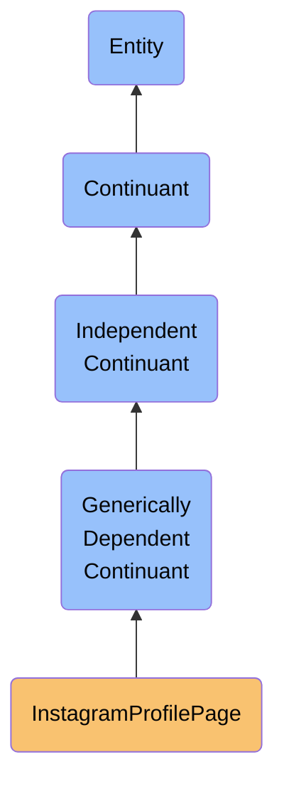

# Instagram Profile Page

## Overview

### Definition
An instagram profile page at a specific point in time, consisting of a unique identifier, visual representation, and metadata about the profile's content and social connections

### Example
A snapshot of John's Instagram profile as viewed on 2023-11-10

### Comment
Not defined.

### Aliases
Not defined.

### Class URI
https://ontology.naas.ai/abi/InstagramProfilePage.ttl

### Subclass of
- [label:PlatformDataModel](https://ontology.naas.ai/cs/PlatformDataModel.ttl)

### Ontology Reference
https://ontology.naas.ai/abi/InstagramOntology.ttl

### Hierarchy

## Properties

### Data Properties
| Predicate | Domain | Range | Label | Definition | Example |
|-----------|---------|--------|---------|------------|---------|
| abi:profile_id | abi:InstagramProfilePage | xsd:string | profile id | A string that is the unique identifier for an Instagram profile and is part of the profile's essential identity | jeremy_lvr | The unique handle that appears in the Instagram profile URL and identifies the account. |
| abi:platform_name | abi:InstagramProfilePage | xsd:string | platform name | A string that is the name of the social media platform where the profile exists and is part of the profile's essential identity | Instagram | Always 'Instagram' for Instagram pages, used for cross-platform compatibility. |
| ig:username | ig:InstagramPage | xsd:string | username | A string that is the unique handle used to identify the profile on Instagram and is part of the profile's essential identity | jeremy_lvr | The alphanumeric username that appears with @ symbol, must be unique across Instagram. |
| abi:display_name | abi:InstagramProfilePage | xsd:string | display name | A string that is the public name shown on the Instagram profile and is part of the profile's essential identity | Jeremy Lvr | The human-readable name displayed at the top of a profile, does not need to be unique. |
| abi:biography | abi:InstagramProfilePage | xsd:string | biography | A string that is a text description of the Instagram profile owner and is part of the profile's essential identity | Don't be dead serious about your life, it's just a play. | Limited to 150 characters, can include emojis and limited formatting. |
| abi:post_count | abi:InstagramProfilePage | xsd:integer | post count | An integer that is the number of posts published by the Instagram profile and is part of the profile's essential identity | 46 | Total count of posts (photos, videos, carousels) published by the account, excluding archived or deleted posts. |
| abi:follower_count | abi:InstagramProfilePage | xsd:integer | follower count | An integer that is the number of accounts following this Instagram profile and is part of the profile's essential identity | 204 | Number of Instagram accounts that have subscribed to see this account's content in their feed. |
| abi:following_count | abi:InstagramProfilePage | xsd:integer | following count | An integer that is the number of accounts this Instagram profile follows and is part of the profile's essential identity | 410 | Number of other Instagram accounts that this account has subscribed to see in their feed. |
| abi:profile_picture_url | abi:InstagramProfilePage | xsd:anyURI | profile picture URL | A URI that is the URL of the profile picture image and is part of the profile's essential identity | https://www.instagram.com/jeremy_lvr/profile_pic/ | Direct link to the user's profile picture at its highest available resolution. |
| abi:is_verified | abi:InstagramProfilePage | xsd:boolean | is verified | A boolean that indicates whether the Instagram account has been verified by Instagram as authentic and is part of the profile's essential identity | false | A verified account has a blue checkmark badge indicating Instagram has confirmed it's the authentic presence of the public figure, celebrity, or global brand it represents. |
| abi:is_private | abi:InstagramProfilePage | xsd:boolean | is private | A boolean that indicates whether the Instagram account is private and is part of the profile's essential identity | false | A private account does not allow other users to view their posts without permission. |

### Object Properties
| Predicate | Domain | Range | Label | Definition | Example |
|-----------|---------|--------|---------|------------|---------|
| abi:has_instagram_post | abi:InstagramProfilePage | abi:InstagramPostPage | has instagram post | An instagram profile page has an instagram post | John's Instagram profile page has a post about his new book |
| abi:has_followers | abi:InstagramProfilePage | abi:InstagramProfilePage | has followers | An instagram profile page has followers | John's Instagram profile page has followers |
| abi:is_following | abi:InstagramProfilePage | abi:InstagramProfilePage | is following | An instagram profile page is following another instagram profile page | John's Instagram profile page is following Jane's Instagram profile page |