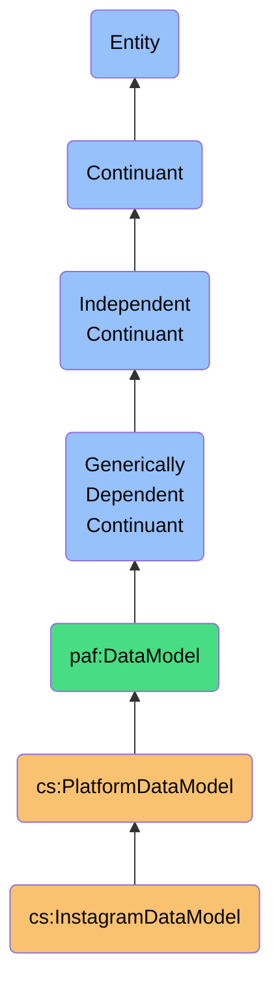
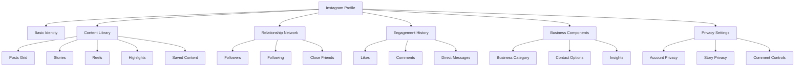

# InstagramDataModel

## Definition (Specificiation: skos:definition)
An InstagramDataModel is an independent continuant immaterial entity that represents the platform-specific structure, semantics, and constraints of Instagram's data, including its unique following/follower dynamics, visual content paradigms, engagement mechanisms, and social graph concepts.

## Hierarchy in BFO


## Overview
The InstagramDataModel captures the distinct ontological structure and semantics of Instagram's platform data. Unlike generic social platform models, it precisely represents Instagram's visual-first social networking concepts, including the asymmetric following/follower system, various content formats (posts, stories, reels), rich engagement mechanisms, and the visually-oriented social graph that defines the Instagram experience.

This model maintains Instagram's native concepts rather than forcing them into generic social constructs, preserving critical semantic distinctions like the difference between a "follower" on Instagram versus a "friend" on Facebook or a "connection" on LinkedIn. By explicitly modeling Instagram-specific behaviors like content formats, comment threading, DM mechanisms, and the discover/explore system, the model enables accurate interpretation of Instagram data.

As a platform-specific model, it provides high-fidelity semantic mappings for integrating Instagram data into a sovereign personal data ecosystem, supporting precise reasoning about asymmetric following relationships, visual content creation/consumption patterns, and interest-based connections derived from this platform.

## Platform-Specific Properties

### Following Properties
| Property | Type | Description | Example |
|----------|------|-------------|---------|
| followStatus | Enum | State of follow relationship | "FOLLOWING", "FOLLOWED_BY", "MUTUAL", "NONE" |
| followDate | DateTime | When follow was established | "2021-08-12T09:23:45Z" |
| followVisibility | Boolean | Whether follow is visible to others | true |
| closeFriends | Boolean | Whether user is in Close Friends list | true |
| mutualFollowersCount | Integer | Number of shared followers | 16 |
| blockedStatus | Boolean | Whether user is blocked | false |
| restrictedStatus | Boolean | Whether user is restricted | false |

### Profile Properties
| Property | Type | Description | Example |
|----------|------|-------------|---------|
| username | String | Instagram handle | "travel_photographer" |
| fullName | String | User's displayed name | "Alex Travel Photography" |
| bio | String | User's biography | "Travel photographer 📸 Based in NYC 🗽 Available for bookings" |
| website | String | External URL | "https://alextravel.com" |
| isPrivate | Boolean | Whether account is private | false |
| isVerified | Boolean | Whether account is verified | true |
| profilePictureUrl | String | Profile photo URL | "https://instagram.com/p/profile_pic.jpg" |
| postCount | Integer | Number of posts | 342 |
| followersCount | Integer | Number of followers | 15243 |
| followingCount | Integer | Number of followed accounts | 876 |
| highlightReels | Highlight[] | Profile highlight collections | [{"id": "highlight123", "title": "Europe", "coverUrl": "..."}, ...] |

### Content Properties
| Property | Type | Description | Example |
|----------|------|-------------|---------|
| posts | Post[] | Grid posts | [{"id": "post123", "type": "CAROUSEL", "mediaUrls": ["https://...", "https://..."], ...}] |
| stories | Story[] | Ephemeral 24-hour content | [{"id": "story456", "expiresAt": "2023-08-22T14:30:00Z", ...}] |
| reels | Reel[] | Short-form video content | [{"id": "reel789", "duration": 27.5, "audioTrack": {"title": "Original Audio", ...}, ...}] |
| savedCollections | Collection[] | Saved content collections | [{"id": "saved123", "name": "Travel Inspo", "items": [{"postId": "post456"}, ...]}] |
| taggedContent | Media[] | Content user is tagged in | [{"id": "post567", "author": {"username": "friend_account"}, ...}] |

## Platform-Specific Entities

### Instagram-Specific Relationship Types
- **Follower**: One-way following relationship (user follows you)
- **Following**: One-way following relationship (you follow user)
- **Mutual Follow**: Two-way following relationship 
- **Close Friend**: Special designation for Stories visibility
- **Restricted Account**: Limited interaction visibility
- **Blocked Account**: Completely blocked from interaction
- **Muted Account**: Content hidden without unfollowing

### Instagram-Specific Content Types
- **Photo Post**: Single image post
- **Video Post**: Single video post
- **Carousel**: Multi-image/video post
- **Story**: 24-hour ephemeral content
- **Reel**: Short-form vertical video
- **IGTV**: Long-form video content
- **Live**: Real-time video broadcast
- **Highlight**: Saved collection of Stories
- **Guide**: Curated collection of posts

### Instagram-Specific Identity Components


## Semantic Differences

### Platform-Specific Semantics
- **Instagram Follow** vs **Facebook Friend**: Asymmetric viewing permission vs bidirectional relationship
- **Instagram Story** vs **Facebook Story**: Visual-first ephemeral content vs multi-format ephemeral content
- **Instagram Comment** vs **Twitter Reply**: Visual context reply vs conversation thread contribution
- **Instagram Direct** vs **Facebook Messenger**: Visual-centric messaging vs full-featured messaging platform
- **Instagram Explore** vs **YouTube Recommendations**: Visual discovery vs video content recommendations

### Semantic Comparison Table
| Concept | Instagram Semantics | Facebook Semantics | LinkedIn Semantics |
|---------|-------------------|-------------------|-------------------|
| Connection | Asymmetric following | Personal friendship | Professional relationship |
| Content | Visual storytelling | Personal life sharing | Professional achievements |
| Identity | Visual self-expression | Personal representation | Professional representation |
| Discovery | Visual exploration | Social connection-based | Industry/skill-based |
| Messaging | Visual-first communication | Text and media messaging | Professional context communication |

### Semantic Preservation Requirements
- **Following Asymmetry Preservation**: Maintain distinct follower/following relationship semantics
- **Visual Content Context Preservation**: Preserve visual nature and intent of content
- **Engagement Type Semantics**: Maintain Instagram-specific like, comment, save paradigms
- **Content Format Semantics**: Preserve distinction between posts, stories, reels, etc.
- **Discover/Hashtag Semantics**: Maintain Instagram's interest and hashtag-based discovery model

## Data Model Schema

### Core Profile Schema
```json
{
  "$id": "https://personal-ai-foundry.org/schemas/instagram/profile-schema",
  "$schema": "http://json-schema.org/draft-07/schema#",
  "title": "Instagram Profile Schema",
  "type": "object",
  "properties": {
    "id": {
      "type": "string",
      "description": "Instagram unique user identifier"
    },
    "username": {
      "type": "string",
      "description": "Instagram handle"
    },
    "full_name": {
      "type": "string",
      "description": "User's displayed name"
    },
    "biography": {
      "type": "string",
      "description": "User's bio text"
    },
    "external_url": {
      "type": "string",
      "format": "uri",
      "description": "User's website"
    },
    "profile_pic_url": {
      "type": "string",
      "format": "uri",
      "description": "Profile picture URL"
    },
    "profile_pic_url_hd": {
      "type": "string",
      "format": "uri",
      "description": "High-definition profile picture URL"
    },
    "is_private": {
      "type": "boolean",
      "description": "Whether account is private"
    },
    "is_verified": {
      "type": "boolean",
      "description": "Whether account is verified"
    },
    "media_count": {
      "type": "integer",
      "description": "Number of posts"
    },
    "follower_count": {
      "type": "integer",
      "description": "Number of followers"
    },
    "following_count": {
      "type": "integer",
      "description": "Number of accounts following"
    },
    "business_category_name": {
      "type": "string",
      "description": "Category for business accounts"
    },
    "category_name": {
      "type": "string",
      "description": "Account category"
    },
    "is_business_account": {
      "type": "boolean",
      "description": "Whether account is a business account"
    },
    "is_professional_account": {
      "type": "boolean",
      "description": "Whether account is a professional account"
    },
    "business_contact_method": {
      "type": "string",
      "description": "Preferred contact method for business"
    },
    "highlight_reels": {
      "type": "array",
      "items": {
        "type": "object",
        "properties": {
          "id": {
            "type": "string"
          },
          "title": {
            "type": "string"
          },
          "cover_media_thumbnail_uri": {
            "type": "string",
            "format": "uri"
          }
        }
      },
      "description": "Profile highlight collections"
    },
    "has_guides": {
      "type": "boolean",
      "description": "Whether profile has guides"
    },
    "has_clips": {
      "type": "boolean",
      "description": "Whether profile has Reels content"
    },
    "has_channel": {
      "type": "boolean",
      "description": "Whether profile has an IGTV channel"
    }
  },
  "required": ["id", "username"]
}
```

### Following Relationship Schema
```json
{
  "$id": "https://personal-ai-foundry.org/schemas/instagram/following-schema",
  "$schema": "http://json-schema.org/draft-07/schema#",
  "title": "Instagram Following Relationship Schema",
  "type": "object",
  "properties": {
    "id": {
      "type": "string",
      "description": "Unique identifier for the following relationship"
    },
    "user": {
      "type": "object",
      "properties": {
        "id": {
          "type": "string",
          "description": "Instagram ID of the user"
        },
        "username": {
          "type": "string"
        },
        "full_name": {
          "type": "string"
        },
        "profile_pic_url": {
          "type": "string",
          "format": "uri"
        },
        "is_private": {
          "type": "boolean"
        },
        "is_verified": {
          "type": "boolean"
        }
      },
      "required": ["id", "username"]
    },
    "relationship_status": {
      "type": "object",
      "properties": {
        "following": {
          "type": "boolean",
          "description": "Whether you follow the user"
        },
        "followed_by": {
          "type": "boolean",
          "description": "Whether user follows you"
        },
        "is_restricted": {
          "type": "boolean",
          "description": "Whether user is restricted"
        },
        "is_blocked": {
          "type": "boolean",
          "description": "Whether user is blocked"
        },
        "is_muted": {
          "type": "boolean",
          "description": "Whether user's content is muted"
        },
        "is_close_friend": {
          "type": "boolean",
          "description": "Whether user is in Close Friends list"
        }
      },
      "required": ["following", "followed_by"]
    },
    "follow_date": {
      "type": "string",
      "format": "date-time",
      "description": "When follow was established"
    },
    "mutual_followers": {
      "type": "object",
      "properties": {
        "count": {
          "type": "integer",
          "description": "Number of mutual followers"
        },
        "users": {
          "type": "array",
          "items": {
            "type": "object",
            "properties": {
              "id": {
                "type": "string"
              },
              "username": {
                "type": "string"
              }
            }
          },
          "description": "Sample of mutual followers"
        }
      }
    },
    "latest_interaction": {
      "type": "object",
      "properties": {
        "interaction_type": {
          "type": "string",
          "enum": ["LIKE", "COMMENT", "DIRECT_MESSAGE", "STORY_VIEW", "MENTION", "TAG"],
          "description": "Type of last interaction"
        },
        "timestamp": {
          "type": "string",
          "format": "date-time",
          "description": "When last interaction occurred"
        },
        "media_id": {
          "type": "string",
          "description": "Related content ID if applicable"
        }
      }
    }
  },
  "required": ["id", "user", "relationship_status"]
}
```

### Media (Post) Schema
```json
{
  "$id": "https://personal-ai-foundry.org/schemas/instagram/media-schema",
  "$schema": "http://json-schema.org/draft-07/schema#",
  "title": "Instagram Media Schema",
  "type": "object",
  "properties": {
    "id": {
      "type": "string",
      "description": "Instagram media identifier"
    },
    "shortcode": {
      "type": "string",
      "description": "Shortcode for media URL"
    },
    "type": {
      "type": "string",
      "enum": ["IMAGE", "VIDEO", "CAROUSEL"],
      "description": "Media type"
    },
    "user": {
      "type": "object",
      "properties": {
        "id": {
          "type": "string"
        },
        "username": {
          "type": "string"
        }
      },
      "required": ["id", "username"]
    },
    "caption": {
      "type": "object",
      "properties": {
        "text": {
          "type": "string"
        },
        "created_at": {
          "type": "string",
          "format": "date-time"
        }
      }
    },
    "taken_at": {
      "type": "string",
      "format": "date-time",
      "description": "When media was posted"
    },
    "location": {
      "type": "object",
      "properties": {
        "id": {
          "type": "string"
        },
        "name": {
          "type": "string"
        },
        "address": {
          "type": "string"
        },
        "lat": {
          "type": "number"
        },
        "lng": {
          "type": "number"
        }
      }
    },
    "image_versions": {
      "type": "array",
      "items": {
        "type": "object",
        "properties": {
          "url": {
            "type": "string",
            "format": "uri"
          },
          "width": {
            "type": "integer"
          },
          "height": {
            "type": "integer"
          }
        }
      }
    },
    "video_versions": {
      "type": "array",
      "items": {
        "type": "object",
        "properties": {
          "url": {
            "type": "string",
            "format": "uri"
          },
          "width": {
            "type": "integer"
          },
          "height": {
            "type": "integer"
          },
          "duration": {
            "type": "number"
          }
        }
      }
    },
    "carousel_media": {
      "type": "array",
      "items": {
        "type": "object",
        "properties": {
          "id": {
            "type": "string"
          },
          "media_type": {
            "type": "string",
            "enum": ["IMAGE", "VIDEO"]
          },
          "image_versions": {
            "type": "array",
            "items": {
              "type": "object",
              "properties": {
                "url": {
                  "type": "string",
                  "format": "uri"
                },
                "width": {
                  "type": "integer"
                },
                "height": {
                  "type": "integer"
                }
              }
            }
          },
          "video_versions": {
            "type": "array",
            "items": {
              "type": "object",
              "properties": {
                "url": {
                  "type": "string",
                  "format": "uri"
                },
                "width": {
                  "type": "integer"
                },
                "height": {
                  "type": "integer"
                },
                "duration": {
                  "type": "number"
                }
              }
            }
          }
        }
      }
    },
    "like_count": {
      "type": "integer",
      "description": "Number of likes"
    },
    "comment_count": {
      "type": "integer",
      "description": "Number of comments"
    },
    "hashtags": {
      "type": "array",
      "items": {
        "type": "string"
      },
      "description": "Hashtags in caption"
    },
    "mentions": {
      "type": "array",
      "items": {
        "type": "object",
        "properties": {
          "user_id": {
            "type": "string"
          },
          "username": {
            "type": "string"
          }
        }
      },
      "description": "Users mentioned in caption"
    },
    "accessibility_caption": {
      "type": "string",
      "description": "Alt text for image"
    }
  },
  "required": ["id", "type", "user"]
}
```

## Platform-Specific Behaviors

### Data Access Patterns
- **API Rate Limits**: Complex tiering based on app type and authentication
- **Content Visibility**: Private accounts restrict content access to followers only
- **Story Visibility**: Stories can have custom audiences (Close Friends)
- **User Discovery**: Limited search capabilities based on username/full name
- **Content Lifespan**: Stories expire after 24 hours unless saved as Highlights
- **Data Portability**: Archive download with complex media organization

### Update Mechanisms
- **Profile Information**: Direct API updates or UI-based changes
- **Follow Events**: Limited webhook notifications for new followers
- **Content Updates**: Real-time updates for new posts from followed accounts
- **Engagement Updates**: Push notifications for likes, comments, mentions
- **Story Updates**: Ephemeral content with 24-hour lifecycle
- **Algorithm Changes**: Frequent feed algorithm adjustments affecting content visibility

### Platform-Specific Constraints
- **Content Ratio Constraints**: Specific aspect ratios for different content types
- **Story Duration Limits**: 15-second clips maximum for Stories
- **Reel Duration Limits**: 60-second maximum for Reels
- **Mention Limits**: Maximum 20 accounts mentioned per post
- **Hashtag Limits**: Maximum 30 hashtags per post
- **API Access Restrictions**: Limited third-party access to certain endpoints

## Semantic Mappings

### External Ontology Mappings
```turtle
@prefix ig: <https://www.instagram.com/schema/> .
@prefix paf: <https://personal-ai-foundry.org/ontology/> .
@prefix schema: <https://schema.org/> .
@prefix foaf: <http://xmlns.com/foaf/0.1/> .
@prefix sioc: <http://rdfs.org/sioc/ns#> .

# Class mappings
ig:User rdfs:subClassOf schema:Person .
ig:User rdfs:subClassOf foaf:Person .
ig:User rdfs:subClassOf paf:SocialIdentity .

ig:Media rdfs:subClassOf schema:CreativeWork .
ig:Post rdfs:subClassOf schema:SocialMediaPosting .
ig:Story rdfs:subClassOf paf:EphemeralContent .

# Property mappings
ig:username schema:alternateName schema:alternateName .
ig:full_name schema:name schema:name .
ig:biography schema:description schema:description .
ig:profile_pic_url schema:image schema:image .

# Relationship mappings
ig:follows rdfs:subClassOf schema:follows .
ig:followed_by rdfs:subClassOf paf:FollowedBy .
ig:tags rdfs:subClassOf schema:mentions .
```

### PAF Core Model Mappings
| Instagram Entity | PAF Entity | Mapping Type | Notes |
|-----------------|------------|--------------|-------|
| User | Contact | Extension | Instagram User extends generic Contact |
| Following | Relationship | Specialization | Adds following status, mutual followers |
| Post | Content | Specialization | Adds Instagram-specific media types |
| Story | EphemeralContent | Specialization | Adds 24-hour lifespan, close friends targeting |
| Reel | VideoContent | Specialization | Adds short-form video characteristics |
| Direct Message | Communication | Specialization | Adds disappearing message options |
| Collection | ContentGroup | Specialization | Adds saved content organization |

### Transformation Examples
```typescript
// Mapping Instagram profile to PAF Contact
function mapInstagramProfileToContact(igProfile: InstagramProfile): PafContact {
  return {
    id: `instagram-${igProfile.id}`,
    source: {
      platform: 'Instagram',
      sourceId: igProfile.id,
      retrievedAt: new Date()
    },
    name: {
      displayName: igProfile.full_name,
      username: igProfile.username
    },
    avatarUrl: igProfile.profile_pic_url_hd || igProfile.profile_pic_url,
    bio: igProfile.biography,
    externalUrls: [
      ...(igProfile.external_url ? [{
        platform: 'Instagram',
        url: igProfile.external_url,
        label: 'Website'
      }] : []),
      {
        platform: 'Instagram',
        url: `https://instagram.com/${igProfile.username}`,
        label: 'Instagram Profile'
      }
    ],
    platformMetadata: {
      isPrivate: igProfile.is_private,
      isVerified: igProfile.is_verified,
      postCount: igProfile.media_count,
      followerCount: igProfile.follower_count,
      followingCount: igProfile.following_count,
      businessCategory: igProfile.business_category_name,
      isBusinessAccount: igProfile.is_business_account,
      isProfessionalAccount: igProfile.is_professional_account
    },
    relationshipContext: {
      social: {
        interactionFrequency: 'unknown',
        platform: 'Instagram'
      }
    }
  };
}

// Mapping Instagram following to PAF Relationship
function mapInstagramFollowingToPafRelationship(following: InstagramFollowing): PafRelationship {
  const relationshipType = getRelationshipType(following.relationship_status);
  
  return {
    id: `instagram-following-${following.id}`,
    type: relationshipType,
    source: {
      platform: 'Instagram',
      sourceId: following.id,
      retrievedAt: new Date()
    },
    contactId: `instagram-${following.user.id}`,
    relationshipStrength: calculateRelationshipStrength(following),
    relationshipContext: {
      social: {
        followStatus: {
          following: following.relationship_status.following,
          followedBy: following.relationship_status.followed_by
        },
        mutualFollowers: following.mutual_followers?.count || 0,
        isCloseFriend: following.relationship_status.is_close_friend || false
      }
    },
    metadata: {
      platform: 'Instagram',
      platformSpecific: {
        isRestricted: following.relationship_status.is_restricted,
        isBlocked: following.relationship_status.is_blocked,
        isMuted: following.relationship_status.is_muted,
        latestInteraction: following.latest_interaction
      }
    },
    established: following.follow_date ? new Date(following.follow_date) : undefined,
    privacyLevel: following.relationship_status.is_close_friend ? 'restricted' : 'standard'
  };
}

// Helper function to determine relationship type
function getRelationshipType(relationshipStatus: any): string {
  if (relationshipStatus.following && relationshipStatus.followed_by) {
    return 'mutual_follow';
  } else if (relationshipStatus.following) {
    return 'following';
  } else if (relationshipStatus.followed_by) {
    return 'follower';
  } else {
    return 'none';
  }
}

// Helper function to calculate relationship strength
function calculateRelationshipStrength(following: InstagramFollowing): number {
  // Base strength from relationship type
  let strength = 0;
  
  if (following.relationship_status.following && following.relationship_status.followed_by) {
    strength = 0.7; // Mutual follow
  } else if (following.relationship_status.following) {
    strength = 0.5; // You follow them
  } else if (following.relationship_status.followed_by) {
    strength = 0.4; // They follow you
  }
  
  // Boost for close friends
  if (following.relationship_status.is_close_friend) {
    strength = Math.min(1.0, strength + 0.3);
  }
  
  // Reduce for restricted/muted
  if (following.relationship_status.is_restricted || following.relationship_status.is_muted) {
    strength = Math.max(0.1, strength - 0.2);
  }
  
  // Zero for blocked
  if (following.relationship_status.is_blocked) {
    strength = 0;
  }
  
  return strength;
}

// Mapping Instagram post to PAF Content
function mapInstagramPostToPafContent(post: InstagramMedia): PafContent {
  return {
    id: `instagram-post-${post.id}`,
    type: mapMediaTypeToContentType(post.type),
    source: {
      platform: 'Instagram',
      sourceId: post.id,
      retrievedAt: new Date()
    },
    creator: {
      id: `instagram-${post.user.id}`,
      username: post.user.username
    },
    created: post.taken_at ? new Date(post.taken_at) : undefined,
    caption: post.caption?.text,
    mediaUrls: getMediaUrls(post),
    engagement: {
      likeCount: post.like_count,
      commentCount: post.comment_count
    },
    location: post.location ? {
      name: post.location.name,
      latitude: post.location.lat,
      longitude: post.location.lng,
      address: post.location.address
    } : undefined,
    tags: {
      hashtags: post.hashtags || [],
      mentions: (post.mentions || []).map(m => m.username)
    },
    accessibility: {
      altText: post.accessibility_caption
    },
    externalUrls: [
      {
        platform: 'Instagram',
        url: `https://instagram.com/p/${post.shortcode}`,
        label: 'Instagram Post'
      }
    ]
  };
}

// Helper function to map Instagram media type to PAF content type
function mapMediaTypeToContentType(mediaType: string): string {
  switch (mediaType) {
    case 'IMAGE': return 'image';
    case 'VIDEO': return 'video';
    case 'CAROUSEL': return 'carousel';
    default: return 'unknown';
  }
}

// Helper function to extract media URLs from Instagram post
function getMediaUrls(post: InstagramMedia): string[] {
  const urls: string[] = [];
  
  if (post.type === 'CAROUSEL' && post.carousel_media) {
    post.carousel_media.forEach(item => {
      if (item.media_type === 'VIDEO' && item.video_versions && item.video_versions.length > 0) {
        urls.push(item.video_versions[0].url);
      } else if (item.image_versions && item.image_versions.length > 0) {
        urls.push(item.image_versions[0].url);
      }
    });
  } else if (post.type === 'VIDEO' && post.video_versions && post.video_versions.length > 0) {
    urls.push(post.video_versions[0].url);
  } else if (post.image_versions && post.image_versions.length > 0) {
    urls.push(post.image_versions[0].url);
  }
  
  return urls;
}
```

## Implementation

### Platform API Integration
```typescript
class InstagramDataModel implements PlatformDataModel {
  readonly id = 'instagram';
  readonly version = '1.0.0';
  readonly schema: Schema;
  
  constructor(private apiClient: InstagramApiClient) {
    this.schema = this.loadSchema();
  }
  
  async getProfile(userId: string): Promise<InstagramProfile> {
    const rawProfile = await this.apiClient.getProfile(userId);
    return this.validateAndTransformProfile(rawProfile);
  }
  
  async getFollowing(userId: string, options?: FollowingOptions): Promise<InstagramFollowing[]> {
    const rawFollowing = await this.apiClient.getFollowing(userId, options);
    return rawFollowing.map(f => this.validateAndTransformFollowing(f));
  }
  
  async getFollowers(userId: string, options?: FollowersOptions): Promise<InstagramFollowing[]> {
    const rawFollowers = await this.apiClient.getFollowers(userId, options);
    return rawFollowers.map(f => this.validateAndTransformFollowing(f));
  }
  
  async getMedia(userId: string, options?: MediaOptions): Promise<InstagramMedia[]> {
    const rawMedia = await this.apiClient.getMedia(userId, options);
    return rawMedia.map(m => this.validateAndTransformMedia(m));
  }
  
  async getStories(userId: string): Promise<InstagramStory[]> {
    const rawStories = await this.apiClient.getStories(userId);
    return rawStories.map(s => this.validateAndTransformStory(s));
  }
  
  mapToPAF(sourceData: InstagramProfile): PafContact {
    return mapInstagramProfileToContact(sourceData);
  }
  
  mapFollowingToPAF(following: InstagramFollowing): PafRelationship {
    return mapInstagramFollowingToPafRelationship(following);
  }
  
  mapMediaToPAF(media: InstagramMedia): PafContent {
    return mapInstagramPostToPafContent(media);
  }
  
  mapFromPAF(pafContact: PafContact): Partial<InstagramProfile> {
    // Implementation of reverse mapping...
    return {
      username: pafContact.name.username,
      full_name: pafContact.name.displayName,
      biography: pafContact.bio,
      // Map other fields...
    };
  }
  
  validateData(data: any, schemaType: 'profile' | 'following' | 'media' | 'story'): ValidationResult {
    return this.schema.validate(data, schemaType);
  }
  
  private validateAndTransformProfile(rawProfile: any): InstagramProfile {
    const validationResult = this.validateData(rawProfile, 'profile');
    if (!validationResult.valid) {
      throw new Error(`Invalid Instagram profile data: ${validationResult.errors.join(', ')}`);
    }
    
    // Transform API response to our internal model
    return rawProfile as InstagramProfile;
  }
  
  private validateAndTransformFollowing(rawFollowing: any): InstagramFollowing {
    const validationResult = this.validateData(rawFollowing, 'following');
    if (!validationResult.valid) {
      console.warn(`Invalid Instagram following data: ${validationResult.errors.join(', ')}`);
      // Apply fixes for common issues...
    }
    
    return rawFollowing as InstagramFollowing;
  }
  
  private validateAndTransformMedia(rawMedia: any): InstagramMedia {
    const validationResult = this.validateData(rawMedia, 'media');
    if (!validationResult.valid) {
      console.warn(`Invalid Instagram media data: ${validationResult.errors.join(', ')}`);
      // Apply fixes for common issues...
    }
    
    // Extract hashtags from caption
    if (rawMedia.caption && rawMedia.caption.text) {
      rawMedia.hashtags = extractHashtags(rawMedia.caption.text);
      rawMedia.mentions = extractMentions(rawMedia.caption.text);
    }
    
    return rawMedia as InstagramMedia;
  }
  
  private validateAndTransformStory(rawStory: any): InstagramStory {
    const validationResult = this.validateData(rawStory, 'story');
    if (!validationResult.valid) {
      console.warn(`Invalid Instagram story data: ${validationResult.errors.join(', ')}`);
      // Apply fixes for common issues...
    }
    
    return rawStory as InstagramStory;
  }
  
  private loadSchema(): Schema {
    // Load and return JSON schema for Instagram data
    return new Schema({
      profile: require('./schemas/instagram/profile-schema.json'),
      following: require('./schemas/instagram/following-schema.json'),
      media: require('./schemas/instagram/media-schema.json'),
      story: require('./schemas/instagram/story-schema.json')
    });
  }
}

// Helper functions for data processing
function extractHashtags(text: string): string[] {
  const hashtagRegex = /#(\w+)/g;
  const matches = text.match(hashtagRegex);
  return matches ? matches.map(tag => tag.substring(1)) : [];
}

function extractMentions(text: string): { username: string }[] {
  const mentionRegex = /@(\w+)/g;
  const matches = text.match(mentionRegex);
  return matches ? matches.map(mention => ({ username: mention.substring(1) })) : [];
}
```

### Usage Example
```typescript
// Initialize the Instagram-specific data model
const igApiClient = new InstagramApiClient({
  appId: process.env.INSTAGRAM_APP_ID,
  appSecret: process.env.INSTAGRAM_APP_SECRET
});

const instagramModel = new InstagramDataModel(igApiClient);

// Use the platform-specific model for Instagram operations
async function syncInstagramContact(accessToken: string, userId: string) {
  try {
    // Set access token for this operation
    igApiClient.setAccessToken(accessToken);
    
    // Get profile using platform-specific methods
    const profile = await instagramModel.getProfile(userId);
    
    // Map to PAF model using semantic-preserving transformation
    const pafContact = instagramModel.mapToPAF(profile);
    
    // Get Instagram-specific relationship data
    const following = await instagramModel.getFollowing(userId);
    const followers = await instagramModel.getFollowers(userId);
    
    // Combine all relationships
    const allRelationships = [
      ...following.map(f => instagramModel.mapFollowingToPAF(f)),
      ...followers
        .filter(f => !following.some(followedUser => followedUser.user.id === f.user.id)) // Remove duplicates
        .map(f => instagramModel.mapFollowingToPAF(f))
    ];
    
    // Get recent media if account is not private or if we have access
    let mediaContent = [];
    if (!profile.is_private || following.some(f => f.user.id === userId && f.relationship_status.following)) {
      const media = await instagramModel.getMedia(userId, { limit: 20 });
      mediaContent = media.map(m => instagramModel.mapMediaToPAF(m));
    }
    
    // Store in unified personal data store
    await personalDataStore.storeContact(pafContact);
    await personalDataStore.storeRelationships(allRelationships);
    if (mediaContent.length > 0) {
      await personalDataStore.storeContent(mediaContent);
    }
    
    // Record platform-specific semantics for future reference
    await metadataStore.recordMapping({
      pafContactId: pafContact.id,
      platformContactId: profile.id,
      platform: 'Instagram',
      semanticMappings: {
        followStatusPreservation: true,
        visualContentPreservation: mediaContent.length > 0,
        socialContextPreservation: true
      }
    });
    
    return {
      success: true,
      contactId: pafContact.id,
      relationshipCount: allRelationships.length,
      contentCount: mediaContent.length
    };
  } catch (error) {
    console.error('Instagram sync error:', error);
    throw new Error(`Instagram synchronization failed: ${error.message}`);
  }
}
```

## Platform Relationship

### Integration with PlatformAccount
- **Authentication Context**: Uses Instagram PlatformAccount for API access
- **Permission Scope**: Requires user_profile, user_media, user_following scopes
- **Rate Limiting**: Monitors and respects Instagram API quotas
- **Access Refreshing**: Handles OAuth token refresh cycles
- **Account Linking**: Maps data model to specific account identity

### Account-Model Dependencies


### Account-Specific Customizations
- **Privacy Settings**: User's privacy controls affect data availability
- **Business vs. Personal**: Different data access based on account type
- **Content Visibility**: Private accounts restrict content access
- **Story Settings**: Close Friends settings affect story visibility
- **Meta Integration**: Cross-platform integration with Facebook ecosystem

## Integration with Other Entities

### Related Platform-Specific Entities
- **InstagramPlatformAccount**: Platform-specific account type
- **InstagramContact**: Platform-specific contact representation
- **InstagramDirectMessage**: Platform-specific message format
- **InstagramPost**: Platform-specific content type
- **InstagramStory**: Platform-specific ephemeral content

### Other Platform Relationships
- **Facebook Friend**: Different semantics for bidirectional relationships
- **TikTok Follow**: Similar but distinct asymmetric following model
- **Twitter Follow**: Similar but contextually different follower dynamics
- **LinkedIn Connection**: Different semantics for professional relationships
- **YouTube Subscription**: Different semantics for content-centric following

### Cross-Platform Mappings
- **Identity Resolution**: Mapping Instagram identity to other platforms
- **Relationship Reconciliation**: Combining Instagram data with other sources
- **Visual Content Correlation**: Linking visual content across platforms
- **Engagement Aggregation**: Combining engagement signals across platforms
- **Context Fusion**: Merging visual social context with other contexts

## Governance

### Data Quality Governance
- **Instagram Field Validation**: Platform-specific validation rules
- **Semantic Preservation Policy**: Maintaining Instagram following semantics
- **Update Frequency Requirements**: Instagram-specific refresh intervals
- **Completeness Standards**: Required fields for Instagram profiles
- **Integration Quality Metrics**: Success criteria for Instagram model

### Privacy and Compliance
- **Instagram Terms Compliance**: Adherence to platform policies
- **API Usage Guidelines**: Following Instagram developer requirements
- **Data Processing Limitations**: Restrictions on automated processing
- **Data Retention Compliance**: Following Instagram-specific retention
- **Cross-Platform Transfer Guidance**: Rules for sharing Instagram data

### Ethical Considerations
- **Visual Identity Preservation**: Respecting visual self-expression
- **Following Relationship Ethics**: Respecting Instagram connection semantics
- **Content Reuse Boundaries**: Ethical limitations on content redistribution
- **Engagement Context Preservation**: Maintaining original engagement context
- **Platform-Specific Norms**: Respecting Instagram social conventions

## History

### Conceptual Origin
- **Initial Concept**: Basic Instagram Graph API integration (2010s)
- **Evolution**: Instagram API changes and Meta platform integration
- **PAF Integration**: Reformulated for ontological alignment (2022)

### Version History
- **v0.1**: Basic profile and following schema (2022-Q1)
- **v0.2**: Added semantic mappings to PAF (2022-Q2)
- **v1.0**: Full platform-specific model (2022-Q4)
- **v1.1**: Enhanced with visual content model (2023-Q1)
- **v1.2**: Added bidirectional transformation capabilities (2023-Q3)

### Evolution Roadmap
- **Planned v2.0**: Enhanced visual content analysis
- **Planned v2.1**: Improved story and reel modeling
- **Planned v2.2**: Advanced hashtag and interest modeling
- **Research Area**: Visual identity sovereignty models
- **Exploration**: Cross-platform visual content correlation 