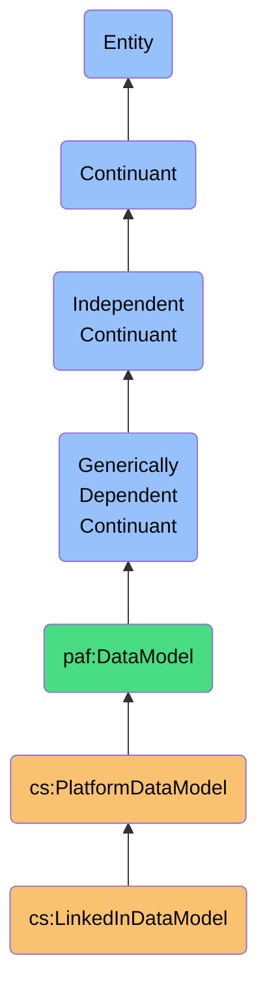
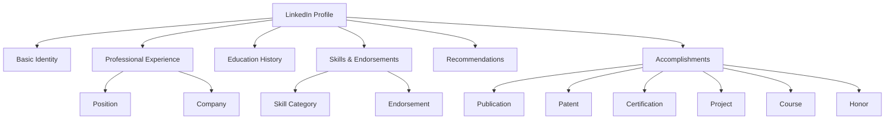
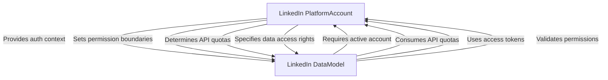

# LinkedInDataModel

## Definition
A LinkedInDataModel is an independent continuant immaterial entity that represents the platform-specific structure, semantics, and constraints of LinkedIn's data, including its unique connection degrees, recommendations, skills taxonomy, and professional graph concepts.

## Hierarchy in BFO


## Overview
The LinkedInDataModel captures the distinct ontological structure and semantics of LinkedIn's platform data. Unlike generic social platform models, it precisely represents LinkedIn's professional networking concepts, including the nuanced connection degree system (1st, 2nd, 3rd+ connections), professional identity constructs (position history, education, skills), and engagement mechanisms specific to professional contexts.

This model maintains LinkedIn's native concepts rather than forcing them into generic social constructs, preserving critical semantic distinctions like the difference between a "connection" on LinkedIn versus a "friend" on other platforms, or LinkedIn's asymmetric follow relationships distinct from its mutual connection system. By explicitly modeling LinkedIn-specific behaviors like recommendations, endorsements, and the professional content engagement system, the model enables accurate interpretation of LinkedIn data.

As a platform-specific model, it provides high-fidelity semantic mappings for integrating LinkedIn data into a sovereign personal data ecosystem, supporting precise reasoning about professional relationships, career history, and industry knowledge graphs derived from this platform.

## Platform-Specific Properties

### Connection Properties
| Property | Type | Description | Example |
|----------|------|-------------|---------|
| connectionDegree | Enum | LinkedIn connection proximity | "FIRST_DEGREE", "SECOND_DEGREE", "THIRD_DEGREE_PLUS" |
| pendingInvitationCount | Integer | Number of pending connection requests | 5 |
| mutualConnectionsCount | Integer | Number of shared connections | 12 |
| connectionDate | DateTime | When connection was established | "2022-03-15T00:00:00Z" |
| connectionSource | Enum | How connection was initiated | "USER_INVITATION", "CONTACT_IMPORT", "RECOMMENDATION" |
| networkSize | Integer | Total connections in network | 867 |

### Professional Identity Properties
| Property | Type | Description | Example |
|----------|------|-------------|---------|
| headline | String | Profile headline | "Senior Software Engineer at Google" |
| industryCategory | String | LinkedIn industry classification | "Computer Software" |
| positions | Position[] | Work experience entries | [{"title": "Senior Engineer", "company": {"name": "Google"}, "startDate": {"year": 2020}, "current": true}] |
| skills | Skill[] | Professional skills | [{"name": "Python", "endorsements": 28}] |
| educations | Education[] | Educational background | [{"school": "Stanford University", "degree": "MS Computer Science", "endDate": {"year": 2015}}] |
| certifications | Certification[] | Professional certifications | [{"name": "AWS Solutions Architect", "authority": "Amazon Web Services", "endDate": {"year": 2023}}] |

### Engagement Properties
| Property | Type | Description | Example |
|----------|------|-------------|---------|
| endorsementsGiven | Endorsement[] | Skills endorsed on others | [{"skillName": "Java", "endorsedProfileId": "profile123"}] |
| endorsementsReceived | Endorsement[] | Skills endorsed by others | [{"skillName": "Python", "endorserCount": 12}] |
| recommendationsGiven | Recommendation[] | Professional recommendations written | [{"recipientProfileId": "profile456", "relationship": "Managed directly"}] |
| recommendationsReceived | Recommendation[] | Received recommendations | [{"authorProfileId": "profile789", "text": "Exceptional team player..."}] |
| contentInteractions | Interaction[] | Posts, comments, reactions | [{"type": "LIKE", "contentId": "post123", "timestamp": "2023-10-15T14:30:00Z"}] |

## Platform-Specific Entities

### LinkedIn-Specific Connection Types
- **First-Degree Connection**: Direct connection with mutual acceptance
- **Second-Degree Connection**: Connection of connection (no direct relationship)
- **Third-Degree+ Connection**: More distant network relationship
- **Out-of-Network**: No connection path within visible network
- **Follow-Only Relationship**: One-way following without connection

### LinkedIn-Specific Professional Entities
- **LinkedIn Company Page**: Organization profile on LinkedIn
- **LinkedIn Group**: Professional interest group
- **LinkedIn InMail**: Direct messaging to non-connections
- **LinkedIn Recommendation**: Professional endorsement with text
- **LinkedIn Skill Endorsement**: Validation of specific skill
- **LinkedIn Post**: Professional content shared on platform
- **LinkedIn Event**: Professional networking event
- **LinkedIn Newsletter**: Professional content series

### LinkedIn-Specific Identity Components


## Semantic Differences

### Platform-Specific Semantics
- **LinkedIn Connection** vs **Facebook Friend**: Professional relationship vs personal relationship
- **LinkedIn Company** vs **Facebook Page**: Professional entity vs multi-purpose presence
- **LinkedIn Skill** vs **Generic Attribute**: Validated professional capability vs self-declared trait
- **LinkedIn Message** vs **Email**: Professional context communication vs generic communication
- **LinkedIn Group** vs **Facebook Group**: Professional interest community vs general interest community

### Semantic Comparison Table
| Concept | LinkedIn Semantics | Facebook Semantics | Twitter Semantics |
|---------|-------------------|-------------------|-------------------|
| Connection | Mutual professional relationship | Personal friendship | No direct equivalent |
| Following | Content subscription | Friend alternative | Core relationship model |
| Identity | Professional representation | Personal representation | Personal/topical presence |
| Content | Career/professional focus | Personal life focus | Brief, public statements |
| Privacy | Career-oriented exposure | Friend-circle sharing | Public vs private account |

### Semantic Preservation Requirements
- **Connection Degree Preservation**: Maintain distinct meaning of connection proximity
- **Professional Context Preservation**: Preserve career-oriented nature of relationships
- **Skill Validation Semantics**: Maintain endorsement count and source information
- **Position Hierarchy Semantics**: Preserve reporting relationship and organizational context
- **Industry Classification Semantics**: Maintain LinkedIn's industry taxonomy meanings

## Data Model Schema

### Core Profile Schema
```json
{
  "$id": "https://personal-ai-foundry.org/schemas/linkedin/profile-schema",
  "$schema": "http://json-schema.org/draft-07/schema#",
  "title": "LinkedIn Profile Schema",
  "type": "object",
  "properties": {
    "profileId": {
      "type": "string",
      "description": "LinkedIn unique profile identifier"
    },
    "vanityName": {
      "type": "string",
      "description": "Custom LinkedIn profile URL identifier"
    },
    "firstName": {
      "type": "string"
    },
    "lastName": {
      "type": "string"
    },
    "headline": {
      "type": "string",
      "description": "Professional headline shown under name"
    },
    "industry": {
      "type": "string",
      "description": "LinkedIn industry category"
    },
    "location": {
      "type": "object",
      "properties": {
        "country": { "type": "string" },
        "geographicArea": { "type": "string" }
      }
    },
    "positions": {
      "type": "array",
      "items": {
        "type": "object",
        "properties": {
          "companyName": { "type": "string" },
          "companyId": { "type": "string" },
          "title": { "type": "string" },
          "description": { "type": "string" },
          "startDate": {
            "type": "object",
            "properties": {
              "year": { "type": "integer" },
              "month": { "type": "integer" }
            },
            "required": ["year"]
          },
          "endDate": {
            "type": "object",
            "properties": {
              "year": { "type": "integer" },
              "month": { "type": "integer" }
            }
          },
          "isCurrent": { "type": "boolean" },
          "location": { "type": "string" }
        },
        "required": ["title"]
      }
    },
    "educations": {
      "type": "array",
      "items": {
        "type": "object",
        "properties": {
          "schoolName": { "type": "string" },
          "schoolId": { "type": "string" },
          "degree": { "type": "string" },
          "fieldOfStudy": { "type": "string" },
          "startDate": {
            "type": "object",
            "properties": {
              "year": { "type": "integer" }
            }
          },
          "endDate": {
            "type": "object",
            "properties": {
              "year": { "type": "integer" }
            }
          }
        },
        "required": ["schoolName"]
      }
    },
    "skills": {
      "type": "array",
      "items": {
        "type": "object",
        "properties": {
          "name": { "type": "string" },
          "endorsementCount": { "type": "integer" }
        },
        "required": ["name"]
      }
    },
    "recommendations": {
      "type": "object",
      "properties": {
        "received": {
          "type": "array",
          "items": {
            "type": "object",
            "properties": {
              "recommenderId": { "type": "string" },
              "recommenderName": { "type": "string" },
              "relationship": { "type": "string" },
              "text": { "type": "string" }
            }
          }
        },
        "given": {
          "type": "array",
          "items": {
            "type": "object",
            "properties": {
              "recommendeeId": { "type": "string" },
              "recommendeeName": { "type": "string" },
              "relationship": { "type": "string" },
              "text": { "type": "string" }
            }
          }
        }
      }
    },
    "publicProfileUrl": {
      "type": "string",
      "format": "uri"
    }
  },
  "required": ["profileId", "firstName", "lastName"]
}
```

### Connection Schema
```json
{
  "$id": "https://personal-ai-foundry.org/schemas/linkedin/connection-schema",
  "$schema": "http://json-schema.org/draft-07/schema#",
  "title": "LinkedIn Connection Schema",
  "type": "object",
  "properties": {
    "connectionId": {
      "type": "string",
      "description": "Unique identifier for the connection relationship"
    },
    "profileId": {
      "type": "string",
      "description": "LinkedIn ID of the connected profile"
    },
    "connectionDegree": {
      "type": "string",
      "enum": ["FIRST_DEGREE", "SECOND_DEGREE", "THIRD_DEGREE_PLUS", "OUT_OF_NETWORK"],
      "description": "LinkedIn connection proximity"
    },
    "connectionDate": {
      "type": "string",
      "format": "date-time",
      "description": "When connection was established"
    },
    "mutualConnectionCount": {
      "type": "integer",
      "description": "Number of shared connections"
    },
    "mutualConnections": {
      "type": "array",
      "items": {
        "type": "string",
        "description": "Profile IDs of mutual connections"
      },
      "maxItems": 100,
      "description": "Sample of mutual connections (limited by API)"
    },
    "interactionStats": {
      "type": "object",
      "properties": {
        "messagesExchanged": { "type": "integer" },
        "lastInteractionDate": { "type": "string", "format": "date-time" },
        "endorsementsGiven": { "type": "integer" },
        "endorsementsReceived": { "type": "integer" }
      }
    },
    "profile": {
      "type": "object",
      "description": "Simplified profile data",
      "properties": {
        "firstName": { "type": "string" },
        "lastName": { "type": "string" },
        "headline": { "type": "string" },
        "industry": { "type": "string" },
        "location": { "type": "string" },
        "profilePictureUrl": { "type": "string", "format": "uri" },
        "publicProfileUrl": { "type": "string", "format": "uri" }
      },
      "required": ["firstName", "lastName"]
    }
  },
  "required": ["connectionId", "profileId", "connectionDegree", "profile"]
}
```

## Platform-Specific Behaviors

### Data Access Patterns
- **API Rate Limits**: 100 profile calls/day for standard accounts
- **Connection Visibility**: Only 1st-degree connections fully visible
- **Search Restrictions**: Limited visibility of 3rd-degree+ connections
- **Content Access**: Limited historical post visibility
- **Profile View Notifications**: Visibility notifications to viewed profiles
- **Data Portability**: Archive download with limited connection data

### Update Mechanisms
- **Profile Information**: Direct API updates or UI-based changes
- **Connection Events**: Asynchronous webhook notifications for new connections
- **Content Updates**: Polling required for content engagement changes
- **Skill Endorsements**: Push notifications available for new endorsements
- **Company Updates**: Subscription-based updates from followed companies
- **Network Changes**: No direct notification for 2nd/3rd degree changes

### Platform-Specific Constraints
- **Connection Limits**: Maximum ~30,000 1st-degree connections
- **InMail Limitations**: Restricted direct messaging to non-connections
- **Endorsement Source Control**: Limited ability to manage incoming endorsements
- **Content Resharing Restrictions**: Platform policies on content redistribution
- **API Authorization Scopes**: Granular permissions for different data types

## Semantic Mappings

### External Ontology Mappings
```turtle
@prefix linkedin: <https://www.linkedin.com/schema/> .
@prefix paf: <https://personal-ai-foundry.org/ontology/> .
@prefix schema: <https://schema.org/> .
@prefix foaf: <http://xmlns.com/foaf/0.1/> .
@prefix prov: <http://www.w3.org/ns/prov#> .

# Class mappings
linkedin:Profile rdfs:subClassOf schema:Person .
linkedin:Profile rdfs:subClassOf paf:ProfessionalIdentity .

linkedin:Position rdfs:subClassOf schema:WorkPosition .
linkedin:Company rdfs:subClassOf schema:Organization .
linkedin:School rdfs:subClassOf schema:EducationalOrganization .

# Property mappings
linkedin:firstName schema:sameAs schema:givenName .
linkedin:lastName schema:sameAs schema:familyName .
linkedin:headline schema:sameAs schema:jobTitle .
linkedin:skill schema:sameAs schema:skills .

# Relationship mappings
linkedin:firstDegreeConnection rdfs:subClassOf paf:DirectConnection .
linkedin:secondDegreeConnection rdfs:subClassOf paf:IndirectConnection .
linkedin:follows rdfs:subClassOf schema:follows .
```

### PAF Core Model Mappings
| LinkedIn Entity | PAF Entity | Mapping Type | Notes |
|-----------------|------------|--------------|-------|
| Profile | Contact | Extension | LinkedIn Profile extends generic Contact |
| Position | Employment | Extension | LinkedIn Position has additional fields |
| Connection | Relationship | Specialization | Adds connection degree, mutual connections |
| Skill | Capability | Specialization | Adds endorsements and validation |
| Message | Communication | Specialization | InMail vs. Connection message distinction |
| Company | Organization | Specialization | Company Page with followers, admins |
| Recommendation | Endorsement | Platform-specific | No direct equivalent in generic model |

### Transformation Examples
```typescript
// Mapping LinkedIn profile to PAF Contact
function mapLinkedInProfileToContact(linkedInProfile: LinkedInProfile): PafContact {
  return {
    id: `linkedin-${linkedInProfile.profileId}`,
    source: {
      platform: 'LinkedIn',
      sourceId: linkedInProfile.profileId,
      retrievedAt: new Date()
    },
    name: {
      givenName: linkedInProfile.firstName,
      familyName: linkedInProfile.lastName,
      formattedName: `${linkedInProfile.firstName} ${linkedInProfile.lastName}`
    },
    employment: linkedInProfile.positions.map(position => ({
      organization: {
        name: position.companyName,
        externalId: position.companyId ? `linkedin-company-${position.companyId}` : undefined
      },
      title: position.title,
      period: {
        start: position.startDate ? new Date(position.startDate.year, (position.startDate.month || 1) - 1) : undefined,
        end: position.endDate ? new Date(position.endDate.year, (position.endDate.month || 1) - 1) : undefined
      },
      isCurrent: position.isCurrent || false
    })),
    education: linkedInProfile.educations.map(education => ({
      institution: {
        name: education.schoolName,
        externalId: education.schoolId ? `linkedin-school-${education.schoolId}` : undefined
      },
      degree: education.degree,
      fieldOfStudy: education.fieldOfStudy,
      period: {
        start: education.startDate?.year ? new Date(education.startDate.year, 0) : undefined,
        end: education.endDate?.year ? new Date(education.endDate.year, 0) : undefined
      }
    })),
    capabilities: linkedInProfile.skills.map(skill => ({
      name: skill.name,
      endorsements: [{
        platform: 'LinkedIn',
        count: skill.endorsementCount || 0
      }]
    })),
    externalUrls: [
      {
        platform: 'LinkedIn',
        url: linkedInProfile.publicProfileUrl,
        label: 'LinkedIn Profile'
      }
    ],
    relationshipContext: {
      professional: {
        industry: linkedInProfile.industry,
        headline: linkedInProfile.headline
      }
    }
  };
}

// Mapping LinkedIn connection to PAF Relationship
function mapLinkedInConnectionToPafRelationship(connection: LinkedInConnection): PafRelationship {
  return {
    id: `linkedin-connection-${connection.connectionId}`,
    type: 'connection',
    source: {
      platform: 'LinkedIn',
      sourceId: connection.connectionId,
      retrievedAt: new Date()
    },
    contactId: `linkedin-${connection.profileId}`,
    relationshipStrength: mapConnectionDegreeToStrength(connection.connectionDegree),
    relationshipContext: {
      professional: {
        connectionDegree: connection.connectionDegree,
        mutualConnections: connection.mutualConnectionCount || 0
      }
    },
    metadata: {
      platform: 'LinkedIn',
      platformSpecific: {
        connectionDegree: connection.connectionDegree,
        mutualConnectionCount: connection.mutualConnectionCount,
        interactionStats: connection.interactionStats
      }
    },
    established: connection.connectionDate ? new Date(connection.connectionDate) : undefined
  };
}

// Helper function to map LinkedIn connection degree to relationship strength
function mapConnectionDegreeToStrength(degree: string): number {
  switch (degree) {
    case 'FIRST_DEGREE': return 1.0;
    case 'SECOND_DEGREE': return 0.5;
    case 'THIRD_DEGREE_PLUS': return 0.2;
    case 'OUT_OF_NETWORK': return 0.0;
    default: return 0.0;
  }
}
```

## Implementation

### Platform API Integration
```typescript
class LinkedInDataModel implements PlatformDataModel {
  readonly id = 'linkedin';
  readonly version = '1.0.0';
  readonly schema: Schema;
  
  constructor(private apiClient: LinkedInApiClient) {
    this.schema = this.loadSchema();
  }
  
  async getProfile(profileId: string): Promise<LinkedInProfile> {
    const rawProfile = await this.apiClient.getProfile(profileId);
    return this.validateAndTransformProfile(rawProfile);
  }
  
  async getConnections(profileId: string, options?: ConnectionOptions): Promise<LinkedInConnection[]> {
    const rawConnections = await this.apiClient.getConnections(profileId, options);
    return rawConnections.map(c => this.validateAndTransformConnection(c));
  }
  
  mapToPAF(sourceData: LinkedInProfile): PAFContact {
    return mapLinkedInProfileToContact(sourceData);
  }
  
  mapConnectionToPAF(connection: LinkedInConnection): PAFRelationship {
    return mapLinkedInConnectionToPafRelationship(connection);
  }
  
  mapFromPAF(pafContact: PAFContact): Partial<LinkedInProfile> {
    // Implementation of reverse mapping...
    return {
      firstName: pafContact.name.givenName,
      lastName: pafContact.name.familyName,
      headline: pafContact.relationshipContext?.professional?.headline,
      // Map other fields...
    };
  }
  
  validateData(data: any): ValidationResult {
    return this.schema.validate(data);
  }
  
  private validateAndTransformProfile(rawProfile: any): LinkedInProfile {
    const validationResult = this.validateData(rawProfile);
    if (!validationResult.valid) {
      throw new Error(`Invalid LinkedIn profile data: ${validationResult.errors.join(', ')}`);
    }
    
    // Transform API response to our internal model
    return {
      profileId: rawProfile.id,
      firstName: rawProfile.localizedFirstName,
      lastName: rawProfile.localizedLastName,
      // Transform other fields...
    };
  }
  
  private validateAndTransformConnection(rawConnection: any): LinkedInConnection {
    // Similar validation and transformation logic
    return {
      connectionId: rawConnection.id,
      profileId: rawConnection.miniProfile.id,
      connectionDegree: rawConnection.connectionDegree,
      // Transform other fields...
    };
  }
  
  private loadSchema(): Schema {
    // Load and return JSON schema for LinkedIn data
    return new Schema({
      profile: require('./schemas/linkedin/profile-schema.json'),
      connection: require('./schemas/linkedin/connection-schema.json'),
      // Other schemas...
    });
  }
}
```

### Usage Example
```typescript
// Initialize the LinkedIn-specific data model
const linkedInApiClient = new LinkedInApiClient({
  clientId: process.env.LINKEDIN_CLIENT_ID,
  clientSecret: process.env.LINKEDIN_CLIENT_SECRET
});

const linkedInModel = new LinkedInDataModel(linkedInApiClient);

// Use the platform-specific model for LinkedIn operations
async function syncLinkedInContact(accountId: string, profileId: string) {
  try {
    // Get profile using platform-specific methods
    const profile = await linkedInModel.getProfile(profileId);
    
    // Map to PAF model using semantic-preserving transformation
    const pafContact = linkedInModel.mapToPAF(profile);
    
    // Get LinkedIn-specific connection data
    const connections = await linkedInModel.getConnections(profileId);
    
    // Map connections to PAF relationships
    const relationships = connections.map(conn => 
      linkedInModel.mapConnectionToPAF(conn)
    );
    
    // Store in unified personal data store
    await personalDataStore.storeContact(pafContact);
    await personalDataStore.storeRelationships(relationships);
    
    // Record platform-specific semantics for future reference
    await metadataStore.recordMapping({
      pafContactId: pafContact.id,
      platformContactId: profile.profileId,
      platform: 'LinkedIn',
      semanticMappings: {
        connectionDegreePreservation: true,
        endorsementCountPreservation: true,
        professionalContextPreservation: true
      }
    });
    
    return {
      success: true,
      contactId: pafContact.id,
      relationshipCount: relationships.length
    };
  } catch (error) {
    console.error('LinkedIn sync error:', error);
    throw new Error(`LinkedIn synchronization failed: ${error.message}`);
  }
}
```

## Platform Relationship

### Integration with PlatformAccount
- **Authentication Context**: Uses LinkedIn PlatformAccount for API access
- **Permission Scope**: Requires r_emailaddress, r_liteprofile, r_basicconnections scopes
- **Rate Limiting**: Monitors and respects LinkedIn API quotas
- **Access Refreshing**: Handles OAuth token refresh cycles
- **Account Linking**: Maps data model to specific account identity

### Account-Model Dependencies


### Account-Specific Customizations
- **Premium vs. Basic Account**: Different data access based on subscription
- **Open Profile Setting**: Affects visibility settings in the model
- **Privacy Controls**: Account settings influence data availability
- **Network Size**: Affects scope of accessible connections
- **Recruiter Account**: Specialized data model for recruiter features

## Integration with Other Entities

### Related Platform-Specific Entities
- **LinkedInPlatformAccount**: Platform-specific account type
- **LinkedInContact**: Platform-specific contact representation
- **LinkedInMessage**: Platform-specific message format
- **LinkedInPost**: Platform-specific content type
- **LinkedInCompany**: Platform-specific organization representation

### Other Platform Relationships
- **Facebook Connection**: Different semantics for social relationships
- **Twitter Follow**: Different semantics for asymmetric following
- **Email Contact**: Different semantics for communication context
- **Apple Contact**: Different semantics for personal data representation
- **Microsoft Graph Contact**: Different semantics for enterprise context

### Cross-Platform Mappings
- **Identity Resolution**: Mapping LinkedIn identity to other platforms
- **Contact Reconciliation**: Combining LinkedIn data with other sources
- **Professional Network Fusion**: Merging LinkedIn with other networks
- **Content Correlation**: Linking content across platforms
- **Context Separation**: Maintaining professional vs. personal boundaries

## Governance

### Data Quality Governance
- **LinkedIn Field Validation**: Platform-specific validation rules
- **Semantic Preservation Policy**: Maintaining LinkedIn connection semantics
- **Update Frequency Requirements**: LinkedIn-specific refresh intervals
- **Completeness Standards**: Required fields for LinkedIn profiles
- **Integration Quality Metrics**: Success criteria for LinkedIn model

### Privacy and Compliance
- **LinkedIn Terms Compliance**: Adherence to platform policies
- **API Usage Guidelines**: Following LinkedIn developer requirements
- **Data Processing Limitations**: Restrictions on automated processing
- **Data Retention Compliance**: Following LinkedIn-specific retention
- **Cross-Platform Transfer Guidance**: Rules for sharing LinkedIn data

### Ethical Considerations
- **Professional Context Preservation**: Respecting professional boundaries
- **Endorsement Integrity**: Maintaining skill validation meaning
- **Network Relationship Ethics**: Respecting LinkedIn connection semantics
- **Professional Identity Control**: User authority over professional representation
- **Platform-Specific Norms**: Respecting LinkedIn social conventions

## History

### Conceptual Origin
- **Initial Concept**: Basic LinkedIn API integration (2010s)
- **Evolution**: LinkedIn's v2 API and OAuth 2.0 standards
- **PAF Integration**: Reformulated for ontological alignment (2022)

### Version History
- **v0.1**: Basic profile and connection schema (2022-Q1)
- **v0.2**: Added semantic mappings to PAF (2022-Q2)
- **v1.0**: Full platform-specific model (2022-Q4)
- **v1.1**: Enhanced with privacy controls (2023-Q1)
- **v1.2**: Added two-way transformation capabilities (2023-Q3)

### Evolution Roadmap
- **Planned v2.0**: LinkedIn API v2 migration
- **Planned v2.1**: Enhanced professional network modeling
- **Planned v2.2**: Company and skill taxonomy integration
- **Research Area**: Professional identity sovereignty models
- **Exploration**: Professional knowledge graph integration 