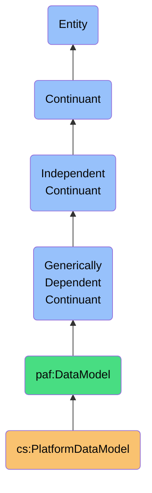

# PlatformDataModel

## Definition
A PlatformDataModel is an independent continuant immaterial entity that defines the structural, semantic, and relational framework through which platform-specific data is organized, constrained, and interpreted, providing the ontological basis for data transformation across system boundaries.

## Hierarchy in BFO


## Overview
A PlatformDataModel exists as an independent immaterial entity that embodies the structural patterns, semantic meanings, and logical constraints of a specific platform's data representation. Unlike processes or dependent continuants, this model has an independent existence that persists regardless of particular data instances or synchronization activities.

It serves as the ontological bridge between platform-specific data formats and the unified personal AI data ecosystem, providing the interpretive framework necessary for meaningful data exchange. The model defines not just the schema of data but its deeper semantic structure, relationships, constraints, and behavioral expectations within the platform's domain.

This entity is critical for data sovereignty because it captures the distinct "world view" of each platform, allowing the personal AI system to understand how different platforms conceptualize the same real-world entities. By explicitly modeling these differences, it enables preservation of semantic meaning across system boundaries without forcing homogenization.

## Properties

### Structural Properties
| Property | Type | Description | Example |
|----------|------|-------------|---------|
| modelIdentifier | String | Unique identifier for data model | "linkedin-contact-model-v3.2" |
| platformType | Enum | Associated platform type | "SocialNetwork", "EmailProvider", "CRM" |
| versionInfo | VersionData | Version metadata | {"major": 3, "minor": 2, "released": "2023-05-15"} |
| schemaFormat | Enum | Format of schema definition | "JSON-Schema", "GraphQL", "XML-Schema" |
| modelNamespace | URI | Namespace for model elements | "https://api.linkedin.com/schemas/v2" |

### Element Properties
| Property | Type | Description | Example |
|----------|------|-------------|---------|
| entityTypes | Map<String, EntityDefinition> | Defined entity types | {"Person": {...}, "Company": {...}, "Position": {...}} |
| attributes | Map<String, AttributeDefinition> | Defined attribute types | {"email": {...}, "phoneNumber": {...}} |
| relationships | Map<String, RelationshipDefinition> | Inter-entity relationships | {"worksAt": {...}, "connects": {...}} |
| enumerations | Map<String, EnumDefinition> | Enumerated value sets | {"connectionType": ["1ST", "2ND", "3RD"]} |
| constraints | ConstraintSet | Data validity rules | {"email": ["format:email", "required"], ...} |

### Semantic Properties
| Property | Type | Description | Example |
|----------|------|-------------|---------|
| semanticMappings | Map<String, URI> | Links to standard ontologies | {"Person": "http://schema.org/Person"} |
| domainTerminology | Map<String, Definition> | Platform-specific terms | {"connection": "A direct relationship between two users"} |
| equivalenceRules | Map<String, String> | Cross-platform equivalences | {"LinkedIn.firstName": "Facebook.givenName"} |
| representationRules | Rule[] | Data encoding rules | [{"rule": "dates formatted as ISO-8601"}] |
| semanticConstraints | SemanticRule[] | Meaning-based constraints | [{"rule": "workPosition requires company"}] |

## Model Components

### Core Abstractions
- **Data Entities**: Fundamental object types in the platform model
- **Attributes**: Properties and characteristics of entities
- **Relationships**: Connections between entities
- **Operations**: Actions that can be performed within the model
- **Constraints**: Rules governing data validity and relationships

### Specialized Elements
- **Composite Types**: Complex structured data types
- **Collection Types**: Arrays, lists, sets, and other collections
- **Extension Mechanisms**: Ways to extend the base model
- **Type Hierarchies**: Inheritance and subsumption relationships
- **Behavioral Patterns**: Expected interaction patterns

### Model Boundaries
- **Domain Coverage**: Scope of real-world concepts represented
- **Temporal Model**: How time and change are represented
- **Privacy Boundaries**: How sensitive data is demarcated
- **Access Control Model**: Authorization model for data access
- **Consistency Rules**: Rules ensuring data coherence

## Relationship to Real-World Entities

### Entity Representation
- **Contact Representation**: How a person/organization is modeled
- **Identity Model**: How unique identity is established
- **Relationship Graph**: How connections between entities are modeled
- **Activity Representation**: How interactions and events are captured
- **Content Model**: How shared content is structured

### Semantic Grounding
- **Real-World Mapping**: How model connects to real entities
- **Contextual Semantics**: How meaning varies by context
- **Cultural Assumptions**: Implicit cultural dimensions of the model
- **Ambiguity Handling**: How uncertain meanings are represented
- **Reference Resolution**: How entities are referenced across contexts

### Platform Variations
| Platform | Contact Entity | Identity Key | Relationship Model | Privacy Model |
|----------|---------------|--------------|-------------------|---------------|
| LinkedIn | Profile | ProfileID | Connection Degree | Visibility Settings |
| Gmail | Contact + EmailAddress | Email | None/Implicit | Label-based |
| Facebook | Profile | ProfileID | Friendship + Following | Audience Settings |
| Salesforce | Lead/Contact | RecordID | Account Hierarchy | Sharing Rules |
| Twitter | User | Handle | Following/Followers | Public/Private |

## Transformation Framework

### Mapping Types
- **Direct Mappings**: One-to-one field correspondences 
- **Structural Transformations**: Changes in data organization
- **Semantic Translations**: Shifts in meaning across contexts
- **Functional Mappings**: Computed or derived values
- **Contextual Mappings**: Context-dependent interpretations

### Transformation Rules
```typescript
interface TransformationRule {
  sourceField: FieldPath;
  targetField: FieldPath;
  transformation: Transformation;
  conditions?: Condition[];
  priority: number;
  metadata: {
    confidenceLevel: number;
    rationale: string;
    limitations: string[];
  };
}

type Transformation = 
  | DirectMapping
  | ValueTransformation
  | StructuralTransformation
  | ConditionalTransformation;
```

### Mapping Examples
- **Name Mapping**: LinkedIn's `firstName` + `lastName` → PAF's `personName`
- **Address Transformation**: Converting platform-specific address formats
- **Relationship Mapping**: Translating platform-specific connection types
- **Temporal Normalization**: Standardizing date/time representations
- **Identity Resolution**: Cross-referencing identifiers across platforms

## Schema Implementation

### Platform Schema Definition
```json
{
  "$id": "https://personal-ai-foundry.org/schemas/linkedin-contact-schema",
  "$schema": "http://json-schema.org/draft-07/schema#",
  "title": "LinkedIn Contact Model",
  "type": "object",
  "properties": {
    "id": {
      "type": "string",
      "description": "LinkedIn member identifier"
    },
    "firstName": {
      "type": "string",
      "description": "Contact's first name"
    },
    "lastName": {
      "type": "string",
      "description": "Contact's last name"
    },
    "profilePicture": {
      "type": "object",
      "properties": {
        "displayImage": {
          "type": "string",
          "format": "uri"
        }
      }
    },
    "publicIdentifier": {
      "type": "string",
      "description": "LinkedIn public profile name"
    },
    "connectionDegree": {
      "type": "integer",
      "enum": [1, 2, 3],
      "description": "Connection proximity (1st, 2nd, 3rd)"
    },
    "positions": {
      "type": "array",
      "items": {
        "type": "object",
        "properties": {
          "companyName": { "type": "string" },
          "title": { "type": "string" },
          "startDate": {
            "type": "object",
            "properties": {
              "year": { "type": "integer" },
              "month": { "type": "integer" }
            }
          },
          "endDate": {
            "type": "object",
            "properties": {
              "year": { "type": "integer" },
              "month": { "type": "integer" }
            }
          },
          "isCurrent": { "type": "boolean" }
        }
      }
    },
    "emailAddresses": {
      "type": "array",
      "items": {
        "type": "object",
        "properties": {
          "type": { "type": "string" },
          "address": { 
            "type": "string",
            "format": "email"
          }
        }
      }
    }
  },
  "required": ["id", "firstName", "lastName"]
}
```

### Transformation Mapping
```json
{
  "mappingId": "linkedin-to-paf-contact",
  "source": "LinkedInContactModel",
  "target": "PAFContactModel",
  "version": "1.2.0",
  "rules": [
    {
      "sourceField": "firstName",
      "targetField": "name.givenName",
      "transformation": {
        "type": "direct"
      },
      "priority": 1
    },
    {
      "sourceField": "lastName",
      "targetField": "name.familyName",
      "transformation": {
        "type": "direct"
      },
      "priority": 1
    },
    {
      "sourceFields": ["firstName", "lastName"],
      "targetField": "name.displayName",
      "transformation": {
        "type": "concatenate",
        "separator": " "
      },
      "priority": 2
    },
    {
      "sourceField": "positions[?(@.isCurrent==true)]",
      "targetField": "employment.current",
      "transformation": {
        "type": "structure",
        "mapping": {
          "companyName": "organization.name",
          "title": "role.title",
          "startDate": "period.start"
        }
      },
      "priority": 3
    },
    {
      "sourceField": "emailAddresses",
      "targetField": "contactPoints.emailAddresses",
      "transformation": {
        "type": "arrayTransform",
        "elementMapping": {
          "address": "value",
          "type": "label"
        }
      },
      "priority": 2
    }
  ]
}
```

## Semantic Integration

### Ontological Alignment
- **Cross-Platform Alignments**: Mappings between platform concepts
- **Standard Ontology Mappings**: Links to Schema.org, FOAF, etc.
- **Semantic Preservation Rules**: Maintaining meaning during transformation
- **Inference Rules**: Deriving implicit information from explicit data
- **Semantic Enrichment**: Adding context during transformation

### Concept Mappings
```
LinkedIn:Position ≡ PAF:Employment
LinkedIn:connectionDegree[1] ⊂ PAF:DirectConnection
LinkedIn:{firstName,lastName} ≡ PAF:PersonName
LinkedIn:publicIdentifier ≡ PAF:SocialHandle
LinkedIn:messagesSent ⊂ PAF:Communication
```

### Knowledge Representation
```turtle
@prefix linkedin: <https://api.linkedin.com/schemas/v2/> .
@prefix paf: <https://personal-ai-foundry.org/ontology/> .
@prefix schema: <http://schema.org/> .

# Class alignments
linkedin:Person rdfs:subClassOf paf:Contact .
linkedin:Person rdfs:subClassOf schema:Person .

# Property alignments
linkedin:firstName schema:equivalentProperty paf:givenName .
linkedin:lastName schema:equivalentProperty paf:familyName .
linkedin:position schema:equivalentProperty paf:employment .

# Instance transformation
?person a linkedin:Person ;
        linkedin:firstName ?first ;
        linkedin:lastName ?last .
        
THEN
?contact a paf:Contact ;
         paf:givenName ?first ;
         paf:familyName ?last .
```

## Data Quality Framework

### Quality Dimensions
- **Structural Validity**: Conformance to structural constraints
- **Semantic Accuracy**: Correctness of semantic interpretation
- **Completeness**: Coverage of required information
- **Consistency**: Internal coherence of data representation
- **Temporal Accuracy**: Correctness of time-related aspects

### Data Cleansing Rules
- **Normalization Rules**: Standardizing data formats
- **Deduplication Rules**: Identifying and removing duplicates
- **Format Correction**: Fixing common format errors
- **Default Values**: Handling missing information
- **Consistency Enforcement**: Ensuring relational integrity

### Quality Metrics
| Metric | Description | Calculation |
|--------|-------------|-------------|
| Structural Compliance | Schema validation success rate | Valid records / Total records |
| Semantic Correctness | Correctly interpreted fields | Correctly mapped fields / Total mapped fields |
| Transformation Coverage | Fields successfully transformed | Transformed fields / Total source fields |
| Information Preservation | Semantic information retained | Information content after / Information content before |
| Error Rate | Transformation failures | Failed transformations / Total transformation attempts |

## Technical Implementation

### Model Implementation
```typescript
class PlatformDataModel {
  readonly id: string;
  readonly platform: PlatformType;
  readonly version: string;
  readonly schema: Schema;
  readonly semantics: SemanticModel;
  
  constructor(config: DataModelConfig) {
    this.id = config.id;
    this.platform = config.platform;
    this.version = config.version;
    this.schema = this.loadSchema(config.schemaSource);
    this.semantics = this.loadSemantics(config.semanticsSource);
  }
  
  validateData(data: any): ValidationResult {
    return this.schema.validate(data);
  }
  
  mapToPAF(sourceData: any): MappingResult {
    const transformer = new DataTransformer(this, PAFCoreModel);
    return transformer.transform(sourceData);
  }
  
  mapFromPAF(pafData: any): MappingResult {
    const transformer = new DataTransformer(PAFCoreModel, this);
    return transformer.transform(pafData);
  }
  
  getFieldSemantics(fieldPath: string): FieldSemantics {
    return this.semantics.getFieldMeaning(fieldPath);
  }
  
  findEquivalentField(targetModel: DataModel, sourceField: string): string {
    return this.semantics.findEquivalent(targetModel.semantics, sourceField);
  }
}
```

### Usage Examples
```typescript
// Creating a platform data model
const linkedInModel = new PlatformDataModel({
  id: "linkedin-contact-model",
  platform: PlatformType.LinkedIn,
  version: "3.2.0",
  schemaSource: "schemas/linkedin/contact-schema.json",
  semanticsSource: "semantics/linkedin/contact-semantics.ttl"
});

// Validating platform data
const contact = fetchContactFromLinkedIn(contactId);
const validation = linkedInModel.validateData(contact);
if (!validation.isValid) {
  handleValidationErrors(validation.errors);
}

// Transforming to PAF model
const pafContact = linkedInModel.mapToPAF(contact);

// Semantic query
const workPosition = linkedInModel.getFieldSemantics("positions[0].title");
console.log(workPosition.equivalentTo); // "http://schema.org/jobTitle"
```

## Integration with Other Entities

### Relates to Material Entities
- **PlatformAccount**: Model interprets data owned by account
- **PlatformContactStore**: Physical storage implementing this model
- **User**: Person whose information is modeled
- **ComputingDevice**: Devices storing or processing this model

### Relates to Processes
- **ContactSynchronizationProcess**: Uses model for transformation
- **IdentityResolutionProcess**: Uses model for field comparison
- **DataValidationProcess**: Uses model to validate data
- **SchemaEvolutionProcess**: Process of model version changes
- **DataMigrationProcess**: Process of adapting to model changes

### Relates to Qualities
- **DataQuality**: Conformance to the data model
- **SchemaCompleteness**: Coverage of the model
- **SemanticClarity**: Precision of meaning in the model
- **ModelCoherence**: Internal consistency of the model
- **CrossPlatformCompatibility**: Alignment with other models

## Governance

### Management Policies
- **Version Control**: Policy for model versioning
- **Deprecation Process**: Handling deprecated model elements
- **Extension Guidelines**: Rules for model extensions
- **Compatibility Requirements**: Cross-version compatibility rules
- **Documentation Standards**: Requirements for model documentation

### Ethical Considerations
- **Privacy Implications**: Identifying sensitive data in the model
- **Bias Identification**: Detecting biased assumptions in the model
- **Inclusivity Review**: Ensuring model accommodates diversity
- **Power Dynamics**: How model reflects platform power structures
- **User Agency**: How model supports or constrains user choice

### Compliance Aspects
- **GDPR Compliance**: Alignment with data protection requirements
- **Data Minimization**: Supporting collection limitations
- **Purpose Limitation**: Enforcing intended data use
- **Interoperability Standards**: Compliance with exchange standards
- **Industry-Specific Regulations**: Specialized compliance needs

## History

### Conceptual Origin
- **Initial Concept**: Data exchange formats between systems
- **Evolution**: Semantic web and linked data approaches
- **PAF Integration**: Reformulated as independent continuant (2022)

### Version History
- **v0.1**: Basic structural schema definitions (2022-Q1)
- **v0.2**: Added semantic mappings to standard ontologies (2022-Q2)
- **v1.0**: Full model with transformation framework (2022-Q3)
- **v1.1**: Enhanced with data quality dimensions (2023-Q1)
- **v1.2**: Added cross-platform semantic alignments (2023-Q2)

### Evolution Roadmap
- **Planned v2.0**: Dynamic schema adaptation capabilities
- **Planned v2.1**: AI-assisted semantic mapping
- **Planned v2.2**: Federated model discovery and sharing
- **Research Area**: Ontology-driven data transformation
- **Exploration**: Self-describing data with embedded semantics 