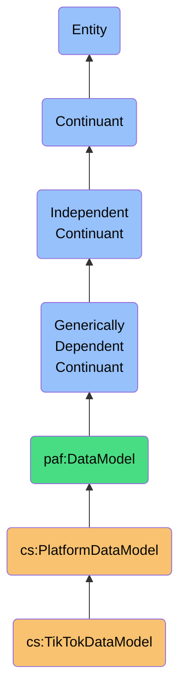
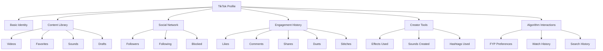

# TikTokDataModel

## Definition
A TikTokDataModel is an independent continuant immaterial entity that represents the platform-specific structure, semantics, and constraints of TikTok's data, including its unique creator-follower dynamics, short-form video paradigms, algorithm-driven discovery mechanisms, and social engagement concepts.

## Hierarchy in BFO


## Overview
The TikTokDataModel captures the distinct ontological structure and semantics of TikTok's platform data. Unlike generic social platform models, it precisely represents TikTok's short-form video-first networking concepts, including the asymmetric creator-follower system, algorithm-driven content discovery, unique engagement mechanisms, and the content-oriented social graph that defines the TikTok experience.

This model maintains TikTok's native concepts rather than forcing them into generic social constructs, preserving critical semantic distinctions like the difference between a "follower" on TikTok versus a "friend" on Facebook or Instagram's following model. By explicitly modeling TikTok-specific behaviors like duets, stitches, sounds, effects, and the algorithmic For You Page (FYP) system, the model enables accurate interpretation of TikTok data.

As a platform-specific model, it provides high-fidelity semantic mappings for integrating TikTok data into a sovereign personal data ecosystem, supporting precise reasoning about creator-follower relationships, content creation patterns, and interest-based algorithmic experiences derived from this platform.

## Platform-Specific Properties

### Following Properties
| Property | Type | Description | Example |
|----------|------|-------------|---------|
| followStatus | Enum | State of follow relationship | "FOLLOWING", "FOLLOWED_BY", "MUTUAL", "NONE" |
| followDate | DateTime | When follow was established | "2022-03-18T14:22:33Z" |
| followerCount | Integer | Number of followers | 1250 |
| followingCount | Integer | Number of accounts followed | 348 |
| blockedStatus | Boolean | Whether user is blocked | false |
| mutedStatus | Boolean | Whether user is muted | false |

### Creator Properties
| Property | Type | Description | Example |
|----------|------|-------------|---------|
| username | String | TikTok handle | "@dancecreator22" |
| nickname | String | User's displayed name | "Dance Creator" |
| bio | String | User's biography | "Dancing every day 💃 #foryou #dancer" |
| avatarUrl | String | Profile photo URL | "https://p16-sign.tiktokcdn-us.com/musically-maliva-obj/12345678~c5_100x100.webp" |
| signature | String | Profile signature/status | "✨ Professional Dancer ✨" |
| verified | Boolean | Whether account is verified | true |
| secUid | String | Security user ID | "MS4wLjABAAAA1234567890abcdef1234567890abcdef" |
| privateAccount | Boolean | Whether account is private | false |
| businessAccount | Boolean | Whether account is business | true |
| businessCategory | String | Business category | "Dancer" |

### Content Properties
| Property | Type | Description | Example |
|----------|------|-------------|---------|
| videos | Video[] | Posted videos | [{"id": "7042345671234567890", "desc": "Try this dance #fyp", ...}] |
| favorites | Video[] | Favorited videos | [{"id": "7042345671234567890", "author": {"uniqueId": "othercreator"}, ...}] |
| sounds | Sound[] | Created/used sounds | [{"id": "7042345671234567890", "title": "Original Sound - dancecreator22", ...}] |
| hashtags | Hashtag[] | Frequently used hashtags | [{"id": "12345", "name": "dance", "videoCount": 56}, ...] |
| effects | Effect[] | Used effects | [{"id": "123456", "name": "Slow Motion", ...}] |
| drafts | Draft[] | Unpublished content | [{"id": "draft123", "createTime": "2023-01-15T12:30:00Z", ...}] |

## Platform-Specific Entities

### TikTok-Specific Relationship Types
- **Follower**: One-way following relationship (user follows you)
- **Following**: One-way following relationship (you follow user)
- **Mutual Follow**: Two-way following relationship
- **Blocked Account**: Completely blocked from interaction
- **Muted Account**: Content hidden from your FYP
- **Collaborator**: Account you've done duets/stitches with

### TikTok-Specific Content Types
- **TikTok Video**: Short-form vertical video (primary content unit)
- **Duet**: Side-by-side video with another creator
- **Stitch**: Video that incorporates part of another video
- **Sound**: Audio track used in videos
- **Effect**: Visual filter or AR effect
- **Hashtag Challenge**: Trend-based participatory content
- **Live Stream**: Real-time broadcast
- **Story**: Short-lived temporary content
- **Comment**: Response to a video
- **Series**: Episodic content collection

### TikTok-Specific Identity Components


## Semantic Differences

### Platform-Specific Semantics
- **TikTok Follower** vs **Instagram Follower**: Algorithm-driven content push vs chronological feed
- **TikTok Duet** vs **Instagram Collab**: Side-by-side creation vs joint authorship
- **TikTok Sound** vs **Instagram Music**: Reusable audio identity vs background enhancement
- **TikTok FYP** vs **Instagram Explore**: Primary discovery method vs supplementary discovery
- **TikTok Engagement** vs **YouTube Engagement**: Rapid interactive loop vs longer engagement cycle

### Semantic Comparison Table
| Concept | TikTok Semantics | Instagram Semantics | YouTube Semantics |
|---------|------------------|---------------------|-------------------|
| Content | Short-form videos | Visual storytelling | Long-form videos |
| Discovery | Algorithm-driven FYP | Social graph + Explore | Subscription + recommendation |
| Identity | Creator persona | Visual lifestyle | Channel brand |
| Following | Content subscription | Social connection | Channel subscription |
| Engagement | Rapid cycles, trends | Aesthetic appreciation | In-depth commentary |

### Semantic Preservation Requirements
- **Content Format Preservation**: Maintain short-form vertical video context
- **Sound Attribution Preservation**: Preserve sound credits and viral audio context
- **Algorithm Context Preservation**: Maintain FYP discovery context
- **Trend Participation Context**: Preserve hashtag challenge participation
- **Creator Attribution Preservation**: Maintain duet/stitch relationship context

## Data Model Schema

### Core Profile Schema
```json
{
  "$id": "https://personal-ai-foundry.org/schemas/tiktok/user-schema",
  "$schema": "http://json-schema.org/draft-07/schema#",
  "title": "TikTok User Schema",
  "type": "object",
  "properties": {
    "id": {
      "type": "string",
      "description": "TikTok unique user identifier"
    },
    "secUid": {
      "type": "string",
      "description": "TikTok security user identifier"
    },
    "uniqueId": {
      "type": "string",
      "description": "TikTok username (with @)"
    },
    "nickname": {
      "type": "string",
      "description": "User's display name"
    },
    "signature": {
      "type": "string",
      "description": "User's bio text"
    },
    "avatarThumb": {
      "type": "string",
      "format": "uri",
      "description": "Thumbnail profile picture URL"
    },
    "avatarMedium": {
      "type": "string",
      "format": "uri",
      "description": "Medium-sized profile picture URL"
    },
    "avatarLarger": {
      "type": "string",
      "format": "uri",
      "description": "Large profile picture URL"
    },
    "verified": {
      "type": "boolean",
      "description": "Whether account is verified"
    },
    "privateAccount": {
      "type": "boolean",
      "description": "Whether account is private"
    },
    "followInfo": {
      "type": "object",
      "properties": {
        "following": {
          "type": "integer",
          "description": "Number of accounts followed"
        },
        "followers": {
          "type": "integer",
          "description": "Number of followers"
        },
        "followingVisibility": {
          "type": "integer",
          "description": "Visibility of following list (0=private, 1=public)"
        },
        "followerVisibility": {
          "type": "integer",
          "description": "Visibility of follower list (0=private, 1=public)"
        }
      }
    },
    "statsInfo": {
      "type": "object",
      "properties": {
        "followerCount": {
          "type": "integer",
          "description": "Number of followers"
        },
        "followingCount": {
          "type": "integer",
          "description": "Number of following"
        },
        "heartCount": {
          "type": "integer",
          "description": "Total number of likes received"
        },
        "videoCount": {
          "type": "integer",
          "description": "Number of videos posted"
        },
        "diggCount": {
          "type": "integer",
          "description": "Number of likes given"
        }
      }
    },
    "isBusinessAccount": {
      "type": "boolean",
      "description": "Whether account is a business account"
    },
    "businessCategory": {
      "type": "string",
      "description": "Business category name"
    },
    "commerceInfo": {
      "type": "object",
      "properties": {
        "commerceUser": {
          "type": "boolean",
          "description": "Whether user has commerce features"
        },
        "commerceUserType": {
          "type": "integer",
          "description": "Type of commerce user"
        }
      }
    },
    "bioLink": {
      "type": "object",
      "properties": {
        "link": {
          "type": "string",
          "format": "uri",
          "description": "URL in bio"
        },
        "title": {
          "type": "string",
          "description": "Link display text"
        }
      }
    },
    "createTime": {
      "type": "string",
      "format": "date-time",
      "description": "When account was created"
    }
  },
  "required": ["id", "secUid", "uniqueId"]
}
```

### Video Schema
```json
{
  "$id": "https://personal-ai-foundry.org/schemas/tiktok/video-schema",
  "$schema": "http://json-schema.org/draft-07/schema#",
  "title": "TikTok Video Schema",
  "type": "object",
  "properties": {
    "id": {
      "type": "string",
      "description": "TikTok video identifier"
    },
    "desc": {
      "type": "string",
      "description": "Video description/caption"
    },
    "createTime": {
      "type": "string",
      "format": "date-time",
      "description": "When video was posted"
    },
    "author": {
      "type": "object",
      "properties": {
        "id": {
          "type": "string"
        },
        "uniqueId": {
          "type": "string"
        },
        "nickname": {
          "type": "string"
        },
        "avatarThumb": {
          "type": "string",
          "format": "uri"
        }
      },
      "required": ["id", "uniqueId"]
    },
    "music": {
      "type": "object",
      "properties": {
        "id": {
          "type": "string"
        },
        "title": {
          "type": "string"
        },
        "authorName": {
          "type": "string"
        },
        "original": {
          "type": "boolean",
          "description": "Whether sound is original to this video"
        },
        "album": {
          "type": "string"
        },
        "playUrl": {
          "type": "string",
          "format": "uri"
        },
        "coverThumb": {
          "type": "string",
          "format": "uri"
        },
        "duration": {
          "type": "integer",
          "description": "Sound duration in seconds"
        }
      },
      "required": ["id", "title"]
    },
    "stats": {
      "type": "object",
      "properties": {
        "diggCount": {
          "type": "integer",
          "description": "Number of likes"
        },
        "shareCount": {
          "type": "integer",
          "description": "Number of shares"
        },
        "commentCount": {
          "type": "integer",
          "description": "Number of comments"
        },
        "playCount": {
          "type": "integer",
          "description": "Number of views/plays"
        }
      }
    },
    "videoUrl": {
      "type": "string",
      "format": "uri",
      "description": "Video content URL"
    },
    "coverUrl": {
      "type": "string",
      "format": "uri",
      "description": "Video thumbnail URL"
    },
    "width": {
      "type": "integer",
      "description": "Video width in pixels"
    },
    "height": {
      "type": "integer",
      "description": "Video height in pixels"
    },
    "duration": {
      "type": "integer",
      "description": "Video duration in seconds"
    },
    "hashtags": {
      "type": "array",
      "items": {
        "type": "object",
        "properties": {
          "id": {
            "type": "string"
          },
          "name": {
            "type": "string"
          },
          "title": {
            "type": "string"
          }
        }
      },
      "description": "Hashtags used in video"
    },
    "mentions": {
      "type": "array",
      "items": {
        "type": "object",
        "properties": {
          "userId": {
            "type": "string"
          },
          "uniqueId": {
            "type": "string"
          },
          "nickname": {
            "type": "string"
          }
        }
      },
      "description": "Users mentioned in video"
    },
    "duetInfo": {
      "type": "object",
      "properties": {
        "duetFromId": {
          "type": "string",
          "description": "ID of original video if this is a duet"
        }
      },
      "description": "Duet information if applicable"
    },
    "stitchInfo": {
      "type": "object",
      "properties": {
        "stitchFromId": {
          "type": "string",
          "description": "ID of original video if this is a stitch"
        }
      },
      "description": "Stitch information if applicable"
    },
    "effectInfo": {
      "type": "array",
      "items": {
        "type": "object",
        "properties": {
          "id": {
            "type": "string"
          },
          "name": {
            "type": "string"
          },
          "desc": {
            "type": "string"
          }
        }
      },
      "description": "Effects used in video"
    },
    "isOriginalSound": {
      "type": "boolean",
      "description": "Whether video uses original sound"
    },
    "isAd": {
      "type": "boolean",
      "description": "Whether video is an advertisement"
    },
    "isPrivate": {
      "type": "boolean",
      "description": "Whether video is private"
    },
    "shareUrl": {
      "type": "string",
      "format": "uri",
      "description": "URL for sharing video"
    }
  },
  "required": ["id", "author", "createTime"]
}
```

## Platform-Specific Behaviors

### Data Access Patterns
- **API Rate Limits**: Strict rate limiting with complex tier system
- **Content Visibility**: Public by default with optional private account setting
- **Algorithm-Driven Discovery**: For You Page as primary content discovery
- **Sound Attribution**: Detailed sound usage and attribution tracking
- **Trend Participation**: Hashtag challenge and trend participation tracking
- **Data Portability**: Account data download with limited metadata

### Update Mechanisms
- **Profile Information**: API updates with signature verification
- **Follower Events**: Limited webhook notifications for new followers
- **Content Updates**: Push notifications for new content from followed accounts
- **Engagement Updates**: Real-time notifications for video engagement
- **Algorithm Updates**: Black-box algorithm updates affecting content distribution
- **Trend Changes**: Rapid evolution of trending content and hashtags

### Platform-Specific Constraints
- **Video Duration Limits**: 3-minute maximum for standard videos
- **Content Restrictions**: Complex content moderation system
- **Sound Usage Limitations**: Music licensing restrictions vary by region
- **Commercial Use Restrictions**: Specific rules for business accounts
- **Algorithm Opacity**: Limited transparency into recommendation system
- **API Access Limitations**: Restricted third-party API access

## Semantic Mappings

### External Ontology Mappings
```turtle
@prefix tt: <https://www.tiktok.com/schema/> .
@prefix paf: <https://personal-ai-foundry.org/ontology/> .
@prefix schema: <https://schema.org/> .
@prefix foaf: <http://xmlns.com/foaf/0.1/> .
@prefix sioc: <http://rdfs.org/sioc/ns#> .

# Class mappings
tt:User rdfs:subClassOf schema:Person .
tt:User rdfs:subClassOf foaf:Person .
tt:User rdfs:subClassOf paf:SocialIdentity .

tt:Video rdfs:subClassOf schema:VideoObject .
tt:Sound rdfs:subClassOf schema:AudioObject .
tt:Hashtag rdfs:subClassOf schema:CreativeWork .

# Property mappings
tt:uniqueId schema:alternateName schema:alternateName .
tt:nickname schema:name schema:name .
tt:signature schema:description schema:description .
tt:avatarLarger schema:image schema:image .

# Relationship mappings
tt:follows rdfs:subClassOf schema:follows .
tt:duetsWith rdfs:subClassOf paf:CreativeCollaboration .
tt:stitchesWith rdfs:subClassOf paf:CreativeDerivation .
```

### PAF Core Model Mappings
| TikTok Entity | PAF Entity | Mapping Type | Notes |
|---------------|------------|--------------|-------|
| User | Contact | Extension | TikTok User extends generic Contact |
| Following | Relationship | Specialization | Adds algorithm-driven content delivery |
| Video | Content | Specialization | Adds TikTok-specific engagement metrics |
| Sound | AudioAsset | Specialization | Adds viral sound attribution patterns |
| Duet | Collaboration | Specialization | Adds side-by-side creative context |
| Stitch | Derivative | Specialization | Adds partial content reuse context |
| Hashtag | Tag | Specialization | Adds trend participation context |

### Transformation Examples
```typescript
// Mapping TikTok profile to PAF Contact
function mapTikTokProfileToContact(ttProfile: TikTokUser): PafContact {
  return {
    id: `tiktok-${ttProfile.id}`,
    source: {
      platform: 'TikTok',
      sourceId: ttProfile.id,
      retrievedAt: new Date()
    },
    name: {
      displayName: ttProfile.nickname,
      username: ttProfile.uniqueId
    },
    avatarUrl: ttProfile.avatarLarger || ttProfile.avatarMedium || ttProfile.avatarThumb,
    bio: ttProfile.signature,
    externalUrls: [
      ...(ttProfile.bioLink?.link ? [{
        platform: 'TikTok',
        url: ttProfile.bioLink.link,
        label: ttProfile.bioLink.title || 'Website'
      }] : []),
      {
        platform: 'TikTok',
        url: `https://tiktok.com/@${ttProfile.uniqueId}`,
        label: 'TikTok Profile'
      }
    ],
    platformMetadata: {
      isPrivate: ttProfile.privateAccount,
      isVerified: ttProfile.verified,
      contentCount: ttProfile.statsInfo?.videoCount,
      followerCount: ttProfile.statsInfo?.followerCount,
      followingCount: ttProfile.statsInfo?.followingCount,
      likeCount: ttProfile.statsInfo?.heartCount,
      businessCategory: ttProfile.businessCategory,
      isBusinessAccount: ttProfile.isBusinessAccount
    },
    relationshipContext: {
      social: {
        interactionFrequency: 'unknown',
        platform: 'TikTok'
      }
    }
  };
}

// Mapping TikTok follow relationship to PAF Relationship
function mapTikTokFollowToPafRelationship(follow: TikTokFollowRelationship): PafRelationship {
  const relationshipType = getRelationshipType(follow);
  
  return {
    id: `tiktok-follow-${follow.id}`,
    type: relationshipType,
    source: {
      platform: 'TikTok',
      sourceId: follow.id,
      retrievedAt: new Date()
    },
    contactId: `tiktok-${follow.targetUser.id}`,
    relationshipStrength: calculateRelationshipStrength(follow),
    relationshipContext: {
      social: {
        followStatus: {
          following: follow.isFollowing,
          followedBy: follow.isFollowedBy
        },
        contentInteraction: follow.interactionMetrics?.interactionCount || 0
      }
    },
    metadata: {
      platform: 'TikTok',
      platformSpecific: {
        isBlocked: follow.isBlocked,
        isMuted: follow.isMuted,
        latestInteraction: follow.latestInteraction
      }
    },
    established: follow.followDate ? new Date(follow.followDate) : undefined
  };
}

// Helper function to determine relationship type
function getRelationshipType(follow: TikTokFollowRelationship): string {
  if (follow.isFollowing && follow.isFollowedBy) {
    return 'mutual_follow';
  } else if (follow.isFollowing) {
    return 'following';
  } else if (follow.isFollowedBy) {
    return 'follower';
  } else if (follow.isBlocked) {
    return 'blocked';
  } else {
    return 'none';
  }
}

// Helper function to calculate relationship strength
function calculateRelationshipStrength(follow: TikTokFollowRelationship): number {
  // Base strength from relationship type
  let strength = 0;
  
  if (follow.isFollowing && follow.isFollowedBy) {
    strength = 0.7; // Mutual follow
  } else if (follow.isFollowing) {
    strength = 0.5; // You follow them
  } else if (follow.isFollowedBy) {
    strength = 0.4; // They follow you
  }
  
  // Adjust based on interaction level
  if (follow.interactionMetrics) {
    // Normalize interaction count (0-100 scale)
    const normalizedInteraction = Math.min(1, follow.interactionMetrics.interactionCount / 100);
    strength = (strength + normalizedInteraction) / 2;
  }
  
  // Zero for blocked
  if (follow.isBlocked) {
    strength = 0;
  }
  
  // Reduce for muted
  if (follow.isMuted) {
    strength = Math.max(0.1, strength - 0.2);
  }
  
  return strength;
}

// Mapping TikTok video to PAF Content
function mapTikTokVideoToPafContent(video: TikTokVideo): PafContent {
  return {
    id: `tiktok-video-${video.id}`,
    type: 'video',
    source: {
      platform: 'TikTok',
      sourceId: video.id,
      retrievedAt: new Date()
    },
    creator: {
      id: `tiktok-${video.author.id}`,
      username: video.author.uniqueId,
      displayName: video.author.nickname
    },
    created: video.createTime ? new Date(video.createTime) : undefined,
    caption: video.desc,
    mediaUrls: [
      {
        type: 'video',
        url: video.videoUrl,
        width: video.width,
        height: video.height,
        duration: video.duration
      }
    ],
    thumbnailUrl: video.coverUrl,
    engagement: {
      likeCount: video.stats?.diggCount,
      commentCount: video.stats?.commentCount,
      shareCount: video.stats?.shareCount,
      viewCount: video.stats?.playCount
    },
    audioTrack: video.music ? {
      id: video.music.id,
      title: video.music.title,
      artist: video.music.authorName,
      url: video.music.playUrl,
      isOriginal: video.music.original
    } : undefined,
    tags: {
      hashtags: (video.hashtags || []).map(tag => tag.name),
      mentions: (video.mentions || []).map(mention => mention.uniqueId)
    },
    collaborations: getCollaborations(video),
    externalUrls: [
      {
        platform: 'TikTok',
        url: video.shareUrl,
        label: 'TikTok Video'
      }
    ],
    platformSpecific: {
      duetInfo: video.duetInfo,
      stitchInfo: video.stitchInfo,
      effectInfo: video.effectInfo,
      isOriginalSound: video.isOriginalSound,
      isPrivate: video.isPrivate
    }
  };
}

// Helper function to extract collaboration information
function getCollaborations(video: TikTokVideo): any[] {
  const collaborations = [];
  
  if (video.duetInfo && video.duetInfo.duetFromId) {
    collaborations.push({
      type: 'duet',
      sourceContentId: video.duetInfo.duetFromId,
      platform: 'TikTok'
    });
  }
  
  if (video.stitchInfo && video.stitchInfo.stitchFromId) {
    collaborations.push({
      type: 'stitch',
      sourceContentId: video.stitchInfo.stitchFromId,
      platform: 'TikTok'
    });
  }
  
  return collaborations;
}
```

## Implementation

### Platform API Integration
```typescript
class TikTokDataModel implements PlatformDataModel {
  readonly id = 'tiktok';
  readonly version = '1.0.0';
  readonly schema: Schema;
  
  constructor(private apiClient: TikTokApiClient) {
    this.schema = this.loadSchema();
  }
  
  async getProfile(userId: string): Promise<TikTokUser> {
    const rawProfile = await this.apiClient.getUser(userId);
    return this.validateAndTransformProfile(rawProfile);
  }
  
  async getFollowing(userId: string, options?: FollowingOptions): Promise<TikTokFollowRelationship[]> {
    const rawFollowing = await this.apiClient.getFollowing(userId, options);
    return rawFollowing.map(f => this.validateAndTransformFollowRelationship(f));
  }
  
  async getFollowers(userId: string, options?: FollowersOptions): Promise<TikTokFollowRelationship[]> {
    const rawFollowers = await this.apiClient.getFollowers(userId, options);
    return rawFollowers.map(f => this.validateAndTransformFollowRelationship(f));
  }
  
  async getVideos(userId: string, options?: VideoOptions): Promise<TikTokVideo[]> {
    const rawVideos = await this.apiClient.getUserVideos(userId, options);
    return rawVideos.map(v => this.validateAndTransformVideo(v));
  }
  
  async getLikedVideos(userId: string, options?: VideoOptions): Promise<TikTokVideo[]> {
    // This endpoint might be restricted based on user privacy settings
    try {
      const rawLikedVideos = await this.apiClient.getUserLikedVideos(userId, options);
      return rawLikedVideos.map(v => this.validateAndTransformVideo(v));
    } catch (error) {
      if (error.code === 'PRIVACY_SETTING') {
        return []; // User has private likes
      }
      throw error;
    }
  }
  
  mapToPAF(sourceData: TikTokUser): PafContact {
    return mapTikTokProfileToContact(sourceData);
  }
  
  mapFollowToPAF(follow: TikTokFollowRelationship): PafRelationship {
    return mapTikTokFollowToPafRelationship(follow);
  }
  
  mapVideoToPAF(video: TikTokVideo): PafContent {
    return mapTikTokVideoToPafContent(video);
  }
  
  mapFromPAF(pafContact: PafContact): Partial<TikTokUser> {
    // Implementation of reverse mapping...
    return {
      uniqueId: pafContact.name.username,
      nickname: pafContact.name.displayName,
      signature: pafContact.bio,
      // Map other fields...
    };
  }
  
  validateData(data: any, schemaType: 'user' | 'follow' | 'video'): ValidationResult {
    return this.schema.validate(data, schemaType);
  }
  
  private validateAndTransformProfile(rawProfile: any): TikTokUser {
    const validationResult = this.validateData(rawProfile, 'user');
    if (!validationResult.valid) {
      throw new Error(`Invalid TikTok user data: ${validationResult.errors.join(', ')}`);
    }
    
    // Transform API response to our internal model
    return rawProfile as TikTokUser;
  }
  
  private validateAndTransformFollowRelationship(rawFollow: any): TikTokFollowRelationship {
    const validationResult = this.validateData(rawFollow, 'follow');
    if (!validationResult.valid) {
      console.warn(`Invalid TikTok follow relationship data: ${validationResult.errors.join(', ')}`);
      // Apply fixes for common issues...
    }
    
    return rawFollow as TikTokFollowRelationship;
  }
  
  private validateAndTransformVideo(rawVideo: any): TikTokVideo {
    const validationResult = this.validateData(rawVideo, 'video');
    if (!validationResult.valid) {
      console.warn(`Invalid TikTok video data: ${validationResult.errors.join(', ')}`);
      // Apply fixes for common issues...
    }
    
    // Extract hashtags from description if not provided directly
    if (!rawVideo.hashtags && rawVideo.desc) {
      rawVideo.hashtags = extractHashtags(rawVideo.desc).map(tag => ({
        name: tag
      }));
    }
    
    // Extract mentions from description if not provided directly
    if (!rawVideo.mentions && rawVideo.desc) {
      rawVideo.mentions = extractMentions(rawVideo.desc).map(mention => ({
        uniqueId: mention
      }));
    }
    
    return rawVideo as TikTokVideo;
  }
  
  private loadSchema(): Schema {
    // Load and return JSON schema for TikTok data
    return new Schema({
      user: require('./schemas/tiktok/user-schema.json'),
      follow: require('./schemas/tiktok/follow-schema.json'),
      video: require('./schemas/tiktok/video-schema.json')
    });
  }
}

// Helper functions for data processing
function extractHashtags(text: string): string[] {
  const hashtagRegex = /#(\w+)/g;
  const matches = text.match(hashtagRegex);
  return matches ? matches.map(tag => tag.substring(1)) : [];
}

function extractMentions(text: string): string[] {
  const mentionRegex = /@(\w+)/g;
  const matches = text.match(mentionRegex);
  return matches ? matches.map(mention => mention.substring(1)) : [];
}
```

### Usage Example
```typescript
// Initialize the TikTok-specific data model
const ttApiClient = new TikTokApiClient({
  appId: process.env.TIKTOK_APP_ID,
  appSecret: process.env.TIKTOK_APP_SECRET
});

const tiktokModel = new TikTokDataModel(ttApiClient);

// Use the platform-specific model for TikTok operations
async function syncTikTokContact(accessToken: string, userId: string) {
  try {
    // Set access token for this operation
    ttApiClient.setAccessToken(accessToken);
    
    // Get profile using platform-specific methods
    const profile = await tiktokModel.getProfile(userId);
    
    // Map to PAF model using semantic-preserving transformation
    const pafContact = tiktokModel.mapToPAF(profile);
    
    // Get TikTok-specific relationship data
    const following = await tiktokModel.getFollowing(userId);
    const followers = await tiktokModel.getFollowers(userId);
    
    // Combine all relationships
    const allRelationships = [
      ...following.map(f => tiktokModel.mapFollowToPAF(f)),
      ...followers
        .filter(f => !following.some(followedUser => followedUser.targetUser.id === f.targetUser.id)) // Remove duplicates
        .map(f => tiktokModel.mapFollowToPAF(f))
    ];
    
    // Get recent videos
    const videos = await tiktokModel.getVideos(userId, { limit: 20 });
    const videoContent = videos.map(v => tiktokModel.mapVideoToPAF(v));
    
    // Get liked videos if accessible
    let likedVideos = [];
    if (!profile.privateAccount) {
      try {
        const likes = await tiktokModel.getLikedVideos(userId, { limit: 20 });
        likedVideos = likes.map(v => tiktokModel.mapVideoToPAF(v));
      } catch (error) {
        console.warn('Could not access liked videos:', error.message);
      }
    }
    
    // Store in unified personal data store
    await personalDataStore.storeContact(pafContact);
    await personalDataStore.storeRelationships(allRelationships);
    await personalDataStore.storeContent([...videoContent, ...likedVideos]);
    
    // Record platform-specific semantics for future reference
    await metadataStore.recordMapping({
      pafContactId: pafContact.id,
      platformContactId: profile.id,
      platform: 'TikTok',
      semanticMappings: {
        followStatusPreservation: true,
        videoContextPreservation: true,
        soundAttributionPreservation: true,
        collaborationContextPreservation: videoContent.some(v => v.collaborations?.length > 0)
      }
    });
    
    return {
      success: true,
      contactId: pafContact.id,
      relationshipCount: allRelationships.length,
      contentCount: videoContent.length + likedVideos.length
    };
  } catch (error) {
    console.error('TikTok sync error:', error);
    throw new Error(`TikTok synchronization failed: ${error.message}`);
  }
}
```

## Platform Relationship

### Integration with PlatformAccount
- **Authentication Context**: Uses TikTok PlatformAccount for API access
- **Permission Scope**: Requires user_info, video_list, follow_list scopes
- **Rate Limiting**: Monitors and respects TikTok API quotas
- **Access Refreshing**: Handles OAuth token refresh cycles
- **Account Linking**: Maps data model to specific account identity

### Account-Model Dependencies


### Account-Specific Customizations
- **Privacy Settings**: User's privacy controls affect data availability
- **Business vs. Creator Account**: Different data access based on account type
- **Content Visibility**: Private accounts restrict content access
- **Regional Restrictions**: Different data availability based on region
- **Age Restrictions**: Age-based content visibility restrictions

## Integration with Other Entities

### Related Platform-Specific Entities
- **TikTokPlatformAccount**: Platform-specific account type
- **TikTokUser**: Platform-specific user representation
- **TikTokVideo**: Platform-specific content type
- **TikTokSound**: Platform-specific audio asset
- **TikTokEffect**: Platform-specific visual effect

### Other Platform Relationships
- **Instagram Follower**: Similar but visually-oriented asymmetric following
- **YouTube Subscriber**: Content-focused subscription relationship
- **Twitter Follow**: Text and conversation-oriented following
- **Snapchat Friend**: Private ephemeral content relationship
- **Facebook Friend**: Bidirectional personal relationship

### Cross-Platform Mappings
- **Identity Resolution**: Mapping TikTok identity to other platforms
- **Content Correlation**: Identifying cross-posted content
- **Sound Attribution**: Tracing sound usage across platforms
- **Trend Mapping**: Correlating hashtag trends across platforms
- **Audience Overlap**: Identifying shared audience across platforms

## Governance

### Data Quality Governance
- **TikTok Field Validation**: Platform-specific validation rules
- **Semantic Preservation Policy**: Maintaining TikTok-specific content context
- **Update Frequency Requirements**: TikTok-specific refresh intervals
- **Completeness Standards**: Required fields for TikTok profiles and videos
- **Integration Quality Metrics**: Success criteria for TikTok model

### Privacy and Compliance
- **TikTok Terms Compliance**: Adherence to platform policies
- **API Usage Guidelines**: Following TikTok developer requirements
- **Data Processing Limitations**: Restrictions on automated processing
- **Data Retention Compliance**: Following TikTok-specific retention
- **Cross-Platform Transfer Guidance**: Rules for sharing TikTok data
- **Age-Restricted Content Handling**: Processing rules for content with age restrictions

### Ethical Considerations
- **Creator Attribution Preservation**: Respecting content creation context
- **Algorithm Context Preservation**: Maintaining FYP discovery context
- **Sound Attribution Ethics**: Respecting audio creation and usage
- **Trend Participation Context**: Preserving hashtag challenge participation context
- **Platform-Specific Norms**: Respecting TikTok social conventions

## History

### Conceptual Origin
- **Initial Concept**: Basic TikTok API integration (2020s)
- **Evolution**: TikTok API expansion and third-party integration
- **PAF Integration**: Reformulated for ontological alignment (2023)

### Version History
- **v0.1**: Basic profile and video schema (2023-Q1)
- **v0.2**: Added semantic mappings to PAF (2023-Q2)
- **v1.0**: Full platform-specific model (2023-Q3)
- **v1.1**: Enhanced with collaboration context (2023-Q4)
- **v1.2**: Added bidirectional transformation capabilities (2024-Q1)

### Evolution Roadmap
- **Planned v2.0**: Enhanced sound attribution modeling
- **Planned v2.1**: Improved algorithm context representation
- **Planned v2.2**: Advanced trend participation modeling
- **Research Area**: Short-form video sovereignty models
- **Exploration**: Cross-platform content correlation 