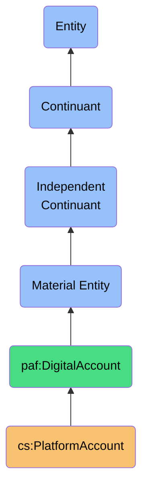

# PlatformAccount

## Definition
A PlatformAccount is an independent continuant material entity that represents a user's authenticated presence on a digital platform, mediating access to platform-specific resources and bearing identity credentials, configuration preferences, and usage rights.

## Hierarchy in BFO


## Overview
A PlatformAccount is the foundational independent entity that represents the user's authenticated existence within a third-party digital ecosystem. Unlike processes or dependent qualities, a PlatformAccount exists autonomously with its own lifecycle, characteristics, and boundaries within the platform's domain.

This entity serves as a critical bridge between the personal AI ecosystem and external digital services, functioning as the primary container for platform-specific identities, credentials, and access rights. It maintains a persistent existence independent of synchronization processes or identity resolution activities, while providing the necessary authorization context for data exchange.

As a material entity, the PlatformAccount encapsulates not just conceptual identity but the actual computational resources, storage allocations, and technical artifacts associated with the user's presence on a platform. It represents the user's digital footprint within a platform's technical infrastructure, including security tokens, profile data, usage metrics, and subscription details.

## Properties

### Identity Properties
| Property | Type | Description | Example |
|----------|------|-------------|---------|
| accountIdentifier | String | Platform-specific unique identifier | "user123456" |
| platformType | Enum | Classification of platform | "SocialNetwork", "EmailProvider", "CRM" |
| accountName | String | User-facing account name | "john.smith@gmail.com" |
| domain | String | Platform domain | "linkedin.com", "gmail.com" |
| creationDate | DateTime | When account was created | "2018-03-12T08:13:22Z" |

### Authentication Properties
| Property | Type | Description | Example |
|----------|------|-------------|---------|
| authenticationMethod | Enum | How account authenticates | "OAuth2", "AppPassword", "APIKey" |
| credentialStore | Reference | Reference to securely stored credentials | "vault://platform_creds/linkedin/user123" |
| authenticationState | Enum | Current auth status | "Authenticated", "Expired", "Revoked" |
| lastAuthenticated | DateTime | When last successfully authenticated | "2023-11-10T22:15:48Z" |
| permissionScopes | String[] | Granted access permissions | ["contacts_read", "email_basic", "profile"] |

### Capability Properties
| Property | Type | Description | Example |
|----------|------|-------------|---------|
| dataAccessRights | Map<DataType, AccessLevel> | Data access capabilities | {"contacts": "ReadWrite", "posts": "ReadOnly"} |
| apiQuotaLimits | Map<String, Integer> | API usage limits | {"dailyRequests": 5000, "ratePerMinute": 60} |
| serviceFeatures | String[] | Available platform features | ["contactSync", "groupManagement", "contactPhotos"] |
| tierLevel | String | Account subscription tier | "Free", "Professional", "Enterprise" |
| featureRestrictions | String[] | Features unavailable to account | ["bulkExport", "advancedAnalytics"] |

## Material Components

### Digital Components
- **Authentication Tokens**: Security credentials enabling API access
- **Profile Data**: User-identifying information on the platform
- **Connection Graph**: Network of relationships within the platform
- **Data Storage**: Allocated space for user's platform-specific data
- **Computational Resources**: Processing capabilities associated with account

### Resource Manifestations
- **API Quotas**: Quantified access to platform computational resources
- **Storage Allocations**: Physical or virtual storage space on platform servers
- **Bandwidth Allocations**: Network transfer capacity for account operations
- **Processing Time**: Computational time allotted for account operations
- **Data Retention Policies**: Material constraints on data preservation

### Boundary Manifestations
- **Cross-Platform Authentication**: SSO tokens that connect platform identities
- **Data Access Endpoints**: APIs and interfaces for accessing platform data
- **Integration Interfaces**: Mechanisms for connecting to other systems
- **Export/Import Channels**: Pathways for data movement in/out of platform
- **Notification Channels**: Methods for receiving platform communications

## Lifecycle Management

### Creation Process
- **Account Registration**: Initial establishment of platform identity
- **Authentication Setup**: Configuration of security credentials
- **Permission Granting**: Establishment of data access rights
- **Profile Configuration**: Setup of basic account parameters
- **Integration Authorization**: Connecting account to personal AI ecosystem

### Maintenance Activities
- **Credential Renewal**: Refreshing authentication tokens
- **Permission Updates**: Modifying data access rights
- **Profile Updates**: Keeping account information current
- **Subscription Management**: Changing account tier or features
- **Usage Monitoring**: Tracking API and resource utilization

### Termination Process
- **Authentication Revocation**: Removing security credentials
- **Data Export**: Retrieving user data before account closure
- **Account Deactivation**: Temporary suspension of account
- **Account Deletion**: Permanent removal of account
- **Termination Verification**: Confirming successful account closure

## Platform Relationships

### Platform Type Categories
- **Social Networks**: LinkedIn, Facebook, Twitter, Instagram
- **Communication Platforms**: Gmail, Outlook, Slack, Microsoft Teams
- **Professional Services**: Salesforce, HubSpot, Zoho CRM
- **Content Platforms**: Dropbox, Google Drive, OneDrive
- **Collaborative Tools**: Notion, Trello, Asana, GitHub

### Platform Features
| Platform Type | Authentication Methods | Data Models | API Limitations |
|---------------|------------------------|-------------|-----------------|
| Social Networks | OAuth2, SAML | Graph-based connections | Rate limits, privacy restrictions |
| Email Providers | OAuth2, App Passwords | Mailbox, contacts, calendar | Storage quotas, attachment limits |
| Cloud Storage | API Keys, OAuth2 | File hierarchy, sharing | Storage quotas, bandwidth limits |
| CRM Systems | OAuth2, API Keys | Contacts, companies, deals | Record limits, field restrictions |
| Productivity Tools | OAuth2, SSO | Tasks, projects, documents | Workspace limits, integration caps |

### Cross-Platform Relationships
- **Identity Federation**: SSO and identity relationships between platforms
- **Data Flow Pathways**: Established data exchange routes
- **Integration Dependencies**: Platform-to-platform dependencies
- **Sharing Agreements**: Cross-platform data sharing permissions
- **Access Hierarchies**: Primary-secondary account relationships

## Data Custodianship

### Data Storage
- **Contact Records**: Platform-specific contact data format and storage
- **Interaction History**: Records of communications within platform
- **Content Repository**: User-generated content stored in platform
- **Preference Storage**: User settings and configurations
- **Metadata Archive**: Data about user's platform activity

### Data Governance
- **Platform Terms of Service**: Legal framework governing account
- **Data Retention Policies**: Rules for how long data is kept
- **Privacy Controls**: User-configurable privacy settings
- **Access Permissions**: Rules for data access by third parties
- **Export/Portability Rights**: User's rights to retrieve their data

### Data Sovereignty Implications
- **Territorial Data Storage**: Where platform physically stores user data
- **Legal Jurisdiction**: Governing laws applicable to account data
- **Ownership Assertions**: Platform claims on user-generated content
- **Interoperability Restrictions**: Limitations on moving data across platforms
- **Identity Autonomy**: User's control over their platform identity

## Technical Implementation

### Account Representation
```typescript
interface PlatformAccount {
  // Identity
  id: string;
  platformType: PlatformType;
  accountName: string;
  domain: string;
  createdAt: Date;
  
  // Authentication
  authMethod: AuthenticationMethod;
  authState: AuthenticationState;
  lastAuthenticated: Date;
  permissionScopes: string[];
  
  // Capabilities
  dataAccessRights: Map<DataType, AccessLevel>;
  apiQuotaLimits: Map<string, number>;
  features: Set<Feature>;
  tierLevel: SubscriptionTier;
  
  // Methods
  authenticate(): Promise<AuthenticationResult>;
  refreshCredentials(): Promise<void>;
  checkPermission(dataType: DataType, operation: Operation): boolean;
  getApiQuotaRemaining(): Map<string, number>;
  getRateLimitStatus(): RateLimitStatus;
}
```

### Storage Schema
```json
{
  "platformAccounts": [
    {
      "id": "linkedin-acct-12345",
      "platformType": "SocialNetwork",
      "platformId": "LinkedIn",
      "accountName": "john.smith@example.com",
      "domain": "linkedin.com",
      "createdAt": "2018-03-12T08:13:22Z",
      "authentication": {
        "method": "OAuth2",
        "credentialRef": "vault://platform_creds/linkedin/john.smith",
        "state": "Authenticated",
        "lastAuthenticated": "2023-11-10T22:15:48Z",
        "permissionScopes": ["r_emailaddress", "r_liteprofile", "r_basicconnections"]
      },
      "capabilities": {
        "dataAccess": {
          "connections": "ReadOnly",
          "profile": "ReadOnly",
          "email": "ReadOnly"
        },
        "quotaLimits": {
          "dailyRequests": 100,
          "requestsPerMinute": 20
        },
        "features": ["basicProfile", "connections", "emailAccess"],
        "tier": "Basic",
        "restrictions": ["messaging", "companyAccess"]
      },
      "lastSyncedAt": "2023-11-12T08:45:22Z",
      "status": "Active"
    }
  ]
}
```

## Security & Privacy

### Security Considerations
- **Credential Protection**: Secure storage of authentication tokens
- **Access Scoping**: Minimum necessary permission requests
- **Refresh Management**: Secure handling of credential refresh flows
- **Revocation Procedures**: Process for emergency credential revocation
- **Audit Logging**: Recording of all account access events

### Privacy Controls
- **Data Minimization**: Limiting collected platform data to necessary elements
- **Platform Isolation**: Preventing unintended cross-platform data leakage
- **Permission Transparency**: Clear disclosure of requested access rights
- **Preference Preservation**: Maintaining user privacy preferences during sync
- **Access Limitation**: Restricting account access to authorized processes

### Risk Mitigation
- **Token Expiration**: Time-limiting authentication credentials
- **Account Monitoring**: Detecting unusual account activity
- **Secure Storage**: Encrypted storage of account credentials
- **Access Compartmentalization**: Limiting process access to accounts
- **Authentication Fallbacks**: Alternative methods if primary auth fails

## Integration Patterns

### Synchronization Integration
- **Account as Data Source**: Platform account as origin for contact data
- **Authentication Provider**: Account as authentication context for sync
- **Rate Limit Management**: Account-specific API usage governance
- **Change Detection Anchor**: Account as reference point for change tracking
- **Sync Boundary Definer**: Account permissions defining sync scope

### Resolution Integration
- **Identity Context Provider**: Account as context for identity resolution
- **Authority Heuristic**: Account characteristics informing trust level
- **Cross-Platform Bridge**: Account connections enabling identity links
- **Confidence Factor**: Account type influencing resolution confidence
- **Merge Authority**: Account standing affecting merge decisions

### Interface Integration
- **Authenticator**: Interface with platform authentication systems 
- **API Client**: Standardized interaction with platform APIs
- **Event Listener**: Receptor for platform change notifications
- **Quota Manager**: Monitor and manager of API usage limits
- **Status Reporter**: Provider of account health information

## Usage

### Primary Use Cases
- **Data Source Authentication**: Providing secure access to platform data
- **API Interaction Context**: Providing context for platform API calls
- **Permission Management**: Controlling data access rights
- **Resource Allocation**: Managing platform usage quotas
- **Platform Identity**: Representing user identity within platform

### Integration Touchpoints
- **ContactSynchronizationProcess**: Uses account for authentication and access
- **IdentityResolutionProcess**: References account for identity context
- **PlatformDataModel**: Relates to account for schema understanding
- **ContactMergingDisposition**: Uses account for authority determination
- **AuthenticationRepository**: Stores and manages account credentials

### Query Patterns
```sparql
# Find all platform accounts with expired authentication
SELECT ?account ?platform ?lastAuthenticated
WHERE {
  ?account a cs:PlatformAccount ;
           cs:hasPlatformType ?platform ;
           cs:hasAuthenticationState "Expired" ;
           cs:lastAuthenticated ?lastAuthenticated .
}

# Get contact data access capabilities by platform
SELECT ?platform ?contactAccess
WHERE {
  ?account a cs:PlatformAccount ;
           cs:hasPlatformType ?platform ;
           cs:hasDataAccessRight "contacts" ?contactAccess .
}
```

## Governance

### Management Policies
- **Renewal Schedule**: Policy for credential refresh timing
- **Permission Review**: Periodic review of granted permissions
- **Usage Monitoring**: Tracking of API consumption patterns
- **Inactivity Handling**: Procedure for dormant accounts
- **Multiple Account Policy**: Rules for managing duplicate platform accounts

### Ethical Considerations
- **Data Independence**: Maintaining user sovereignty over platform data
- **Transparency**: Clear disclosure of account access patterns
- **Minimal Access**: Requesting only necessary platform permissions
- **Deletion Rights**: Honoring user requests to remove platform connections
- **Lock-in Prevention**: Avoiding dependency on specific platform accounts

### Compliance Aspects
- **Terms of Service Adherence**: Compliance with platform requirements
- **API Usage Compliance**: Adherence to platform rate limits and quotas
- **Auth Flow Standards**: Following OAuth and authentication best practices
- **Data Use Restrictions**: Honoring platform data usage limitations
- **Regional Compliance**: Addressing region-specific account requirements

## History

### Conceptual Origin
- **Initial Concept**: OAuth-based platform integrations (2010s)
- **Evolution**: Multi-platform identity management frameworks
- **PAF Integration**: Reformulated as independent continuant (2022)

### Version History
- **v0.1**: Basic account credential management (2022-Q1)
- **v0.2**: Enhanced with permission scopes model (2022-Q2)
- **v1.0**: Full independent entity model with lifecycle (2022-Q4)
- **v1.1**: Added platform-specific capability modeling (2023-Q1)
- **v1.2**: Enhanced security and privacy controls (2023-Q3)

### Evolution Roadmap
- **Planned v2.0**: Account federation and relationship modeling
- **Planned v2.1**: Dynamic permission optimization
- **Planned v2.2**: Cross-account identity resolution
- **Research Area**: Sovereign identity integration
- **Exploration**: Decentralized platform authentication 