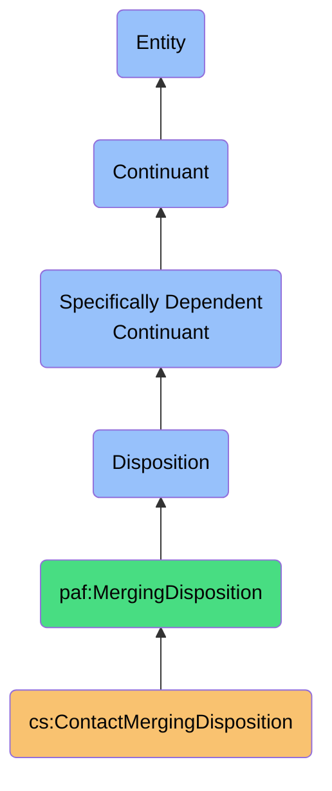
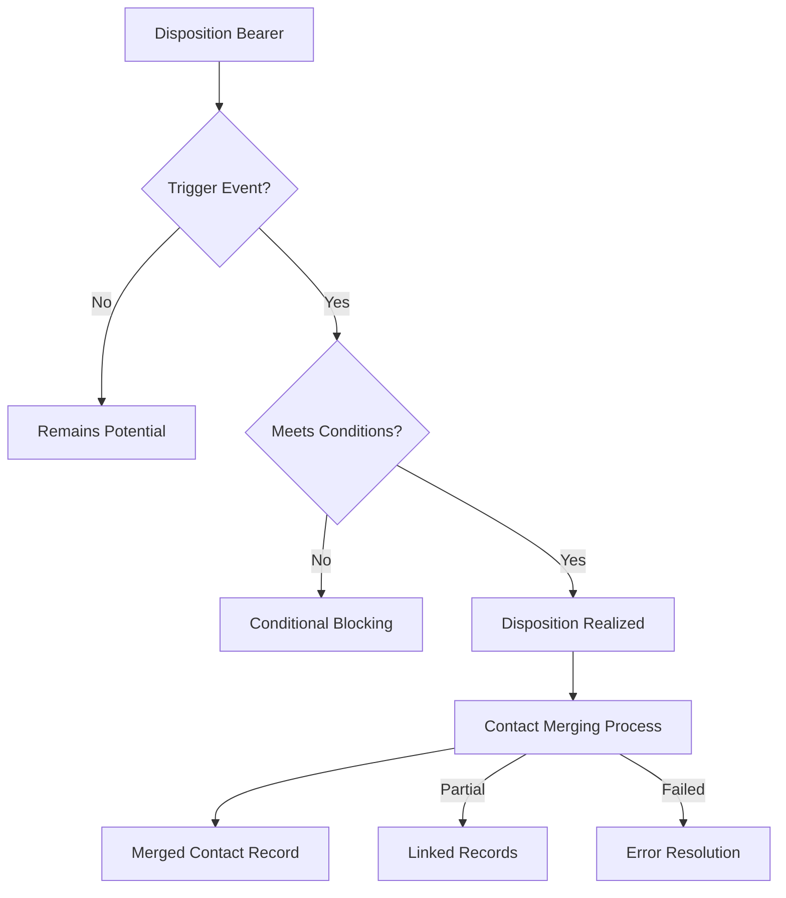

# ContactMergingDisposition

## Definition
ContactMergingDisposition is a specifically dependent continuant disposition that represents the propensity of contact records to be merged based on their similarity characteristics, match confidence, and user-defined preferences, manifesting when appropriate trigger conditions are met.

## Hierarchy in BFO


## Overview
ContactMergingDisposition embodies the potential for contact records to be unified into a cohesive representation of a single entity based on their inherent similarities and established confidence levels. Unlike a simple property or relationship, this disposition represents the latent readiness of contact data to coalesce when triggered by appropriate conditions such as confidence thresholds, user actions, or system events.

This disposition is a key component in the Personal AI Foundry's identity management framework, enabling the system to manage fragmented digital identities while respecting user sovereignty. It balances automated efficiency with user control by encoding preferences about when and how contacts should be merged, while remaining in a potential state until activated.

The disposition's strength varies based on multiple factors including match confidence, data completeness, user preferences, and historical interactions, leading to different manifestation pathways when realized.

## Properties

### Core Properties
| Property | Type | Description | Example |
|----------|------|-------------|---------|
| dispositionStrength | Decimal | Overall merging propensity (0-1) | 0.88 |
| mergeReadiness | Enum | Categorical readiness level | "Ready", "Conditional", "Resistant" |
| autoMergeEligible | Boolean | Whether eligible for automatic merging | true |
| userPreference | Enum | User's preference for this merge | "Approved", "Unknown", "Rejected" |
| conflictLevel | Decimal | Degree of conflicting information (0-1) | 0.15 |

### Trigger Conditions
| Property | Type | Description | Example |
|----------|------|-------------|---------|
| confidenceThreshold | Decimal | Min confidence to trigger merge | 0.85 |
| triggerEvents | Event[] | Events that can trigger realization | ["UserApproval", "SystemSync"] |
| blockerConditions | Condition[] | Conditions that prevent merging | ["MissingPrimaryEmail", "LegalCompliance"] |
| requiresUserConfirmation | Boolean | Whether user must confirm before merging | false |
| overrideSettings | Map<String, Boolean> | User-configurable override settings | {"allowPartialMatch": true, "requireEmailMatch": true} |

### Realization Properties
| Property | Type | Description | Example |
|----------|------|-------------|---------|
| mergeBehavior | MergeStrategy | How records should be merged | "PreserveBoth", "PreferNewer", "Custom" |
| conflictResolutionPolicy | Map<Field, Strategy> | How to resolve field conflicts | {"name": "PreferLongerForm", "email": "PreferVerified"} |
| resultingRecordTemplateId | UUID | Template for resulting record structure | "7f8d9e0a-3b5c-42a1-9f8d-5c3b7a2e8f9a" |
| postMergeActions | Action[] | Actions to take after successful merge | ["NotifyUser", "UpdateRelatedConnections"] |
| mergeFallbackBehavior | FallbackStrategy | What to do if merge fails | "CreateLink", "PreserveSeparate", "Retry" |

## Disposition Bearers

### Primary Bearers
- **ContactRecord**: The individual contact records that possess merging dispositions
- **ContactPair**: The specific pair of contacts with a disposition to merge together
- **ContactGroup**: A group of related contacts with collective merging disposition

### Secondary Bearers
- **IdentityResolutionProcess**: Process that evaluates and updates merging dispositions
- **UserProfile**: Contains preferences affecting merging dispositions
- **ContactDatabase**: The broader context housing contacts with merging dispositions

### Disposition Transfer
- **Transmitted to** newly created merged contacts (inheritance of merger history)
- **Affected by** changes in related contacts (network effects)
- **Diminished by** negative feedback on similar merges

## Realization Pathways

### Activation Conditions
- **Confidence Threshold**: When match confidence exceeds configured threshold
- **User Action**: Explicit user approval of suggested merge
- **System Event**: Scheduled synchronization or database maintenance
- **New Evidence**: Discovery of new linking information between contacts
- **Pattern Recognition**: Recognition of merge pattern from previous user behavior

### Realization Process


### Manifestation Types
| Type | Description | Outcome | Trigger |
|------|-------------|---------|---------|
| Automatic | System-initiated complete merge | Single unified record | High confidence (>0.95) |
| Suggested | User-prompted merge | Merged after approval | Medium confidence (0.75-0.95) |
| Partial | Limited information sharing | Linked but separate records | Low confidence or conflicts |
| Failed | Unsuccessful merge attempt | Unchanged, logged error | Conflicting critical fields |
| Deferred | Postponed until conditions met | Flagged for future review | Missing required data |

## Disposition Dynamics

### Strengthening Factors
- **Increasing Match Confidence**: Higher identity resolution confidence scores
- **Complementary Information**: Records with non-overlapping information
- **User Behavior Patterns**: Past user acceptance of similar merges
- **Source Reliability**: Higher reliability of data sources
- **Historical Interaction**: Previous interactions between the contact entities

### Weakening Factors
- **Conflicting Critical Data**: Contradictory information in key fields
- **Negative User Feedback**: Previous rejection of similar merge suggestions
- **Changing Contact Data**: Diverging information over time
- **Privacy Policies**: More restrictive privacy requirements
- **Source Inconsistency**: Decreasing reliability of data sources

### Disposition Lifecycle
- **Formation**: Created when possible match is identified
- **Strengthening**: Increases as additional confirming evidence appears
- **Weakening**: Decreases as contradictory evidence emerges
- **Realization**: Manifests when triggered by appropriate conditions
- **Post-Realization**: Transforms into merge history quality of new contact

## Implementation

### Disposition Calculation
```typescript
function calculateMergingDisposition(
  contact1: ContactRecord, 
  contact2: ContactRecord,
  matchConfidence: number,
  userPreferences: UserMergePreferences
): MergingDisposition {
  // Base disposition from match confidence
  let dispositionStrength = matchConfidence;
  
  // Adjust for conflicting information
  const conflicts = detectConflicts(contact1, contact2);
  dispositionStrength *= (1 - (conflicts.severity * 0.5));
  
  // Adjust for user preferences
  if (userPreferences.hasPreferenceFor(contact1, contact2)) {
    dispositionStrength *= userPreferences.getPreferenceWeight(contact1, contact2);
  }
  
  // Determine merge readiness
  let mergeReadiness;
  if (dispositionStrength > 0.85) {
    mergeReadiness = "Ready";
  } else if (dispositionStrength > 0.5) {
    mergeReadiness = "Conditional";
  } else {
    mergeReadiness = "Resistant";
  }
  
  return {
    dispositionStrength,
    mergeReadiness,
    autoMergeEligible: dispositionStrength > userPreferences.autoMergeThreshold,
    conflictLevel: conflicts.severity,
    // Additional properties...
  };
}
```

### Trigger Evaluation
```typescript
function shouldTriggerMerge(
  mergingDisposition: MergingDisposition,
  triggerEvent: MergeEvent
): boolean {
  // Event-based triggering
  if (!mergingDisposition.triggerEvents.includes(triggerEvent.type)) {
    return false;
  }
  
  // Check for blockers
  for (const blocker of mergingDisposition.blockerConditions) {
    if (blocker.isActive()) {
      return false;
    }
  }
  
  // Check confidence threshold
  if (mergingDisposition.dispositionStrength < mergingDisposition.confidenceThreshold) {
    return false;
  }
  
  // Check user confirmation requirement
  if (mergingDisposition.requiresUserConfirmation && !triggerEvent.hasUserConfirmation) {
    return false;
  }
  
  return true;
}
```

### Disposition Serialization
```json
{
  "dispositionStrength": 0.88,
  "mergeReadiness": "Ready",
  "autoMergeEligible": true,
  "userPreference": "Unknown",
  "conflictLevel": 0.15,
  "confidenceThreshold": 0.85,
  "triggerEvents": ["UserApproval", "SystemSync"],
  "blockerConditions": [],
  "requiresUserConfirmation": false,
  "overrideSettings": {
    "allowPartialMatch": true,
    "requireEmailMatch": true
  },
  "mergeBehavior": "PreferVerified",
  "conflictResolutionPolicy": {
    "name": "PreferLongerForm",
    "email": "PreferVerified",
    "phone": "PreserveAll",
    "address": "PreferMoreComplete"
  },
  "postMergeActions": ["NotifyUser", "UpdateRelatedConnections"],
  "lastEvaluated": "2023-11-12T08:45:22Z"
}
```

## Interactions

### Interacts With
- **IdentityResolutionConfidence**: Directly influences disposition strength
- **ContactQuality**: Higher quality contacts more readily merge
- **UserPreferencesProfile**: User settings affect trigger conditions
- **ContactMergingProcess**: Process that realizes this disposition
- **PrivacyDisposition**: May counteract merging disposition for sensitive data

### Used By
- **Contact Management Systems**: To determine when to merge contacts
- **User Interfaces**: To present merge suggestions appropriately
- **Synchronization Services**: To handle record merging during sync
- **Activity Planning Systems**: To consolidate activities across contact versions
- **Discovery Tools**: To suggest connections between contacts

### Contributes To
- **Identity Graph Cohesion**: Stronger dispositions lead to more unified graphs
- **Data Enrichment**: Realized dispositions produce richer contact profiles
- **Cross-platform Identity**: Enables coherent identity across digital boundaries
- **Search Relevance**: Affects how contacts are ranked in search results
- **Context Awareness**: Enables consistent contextualization of communications

## Governance

### Disposition Policies
- **Conservative Merging**: Higher thresholds for automated disposition realization
- **Aggressive Consolidation**: Lower thresholds prioritizing unified records
- **User-Centric Control**: Strong preference for user involvement
- **Domain-Specific Rules**: Different disposition realization rules by domain
- **Temporal Policies**: Time-based strengthening or weakening of dispositions

### Ethical Considerations
- **Autonomy Preservation**: Respecting user choices about identity boundaries
- **Data Integrity**: Preventing inappropriate merges that mix distinct identities
- **Sovereignty Principles**: Ensuring user remains final authority over identity
- **Transparency**: Making disposition strength and rationale clear to users
- **Contestability**: Allowing users to challenge and override disposition realizations

### Compliance Aspects
- **GDPR Right to Rectification**: Supporting accurate data through appropriate merging
- **Data Minimization**: Reducing duplicate records while preserving fidelity
- **Purpose Limitation**: Restricting merges to compatible data purposes
- **Consent Alignment**: Ensuring merged records respect consent boundaries
- **Records Management**: Maintaining audit trail of disposition realizations

## History

### Conceptual Origin
- **Initial Concept**: Database record deduplication practices
- **Evolution**: Entity resolution frameworks in master data management
- **PAF Adaptation**: Reformulated with user sovereignty principles (2022)

### Version History
- **v0.1**: Basic merge readiness indicator (2022-Q3)
- **v0.2**: Added user preference integration (2022-Q4)
- **v1.0**: Full disposition model with confidence integration (2023-Q1)
- **v1.1**: Added conflict resolution policies (2023-Q2)
- **v1.2**: Enhanced with disposition lifecycle tracking (2023-Q3)

### Evolution Roadmap
- **Planned v2.0**: Context-aware disposition strength modulation
- **Planned v2.1**: Learning from user merge decisions
- **Planned v2.2**: Social network validation factors
- **Research Area**: Privacy-preserving disposition calculation
- **Exploration**: Cross-foundry merging dispositions 