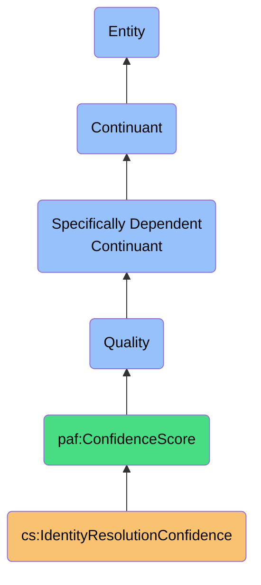
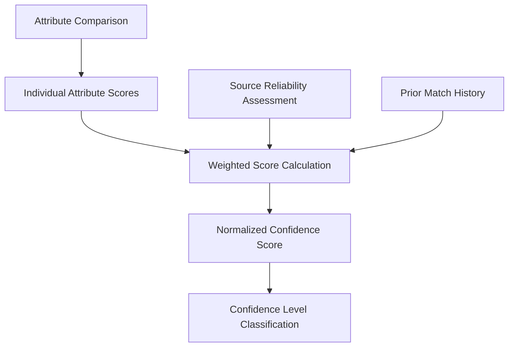

# IdentityResolutionConfidence

## Definition
IdentityResolutionConfidence is a specifically dependent continuant quality that represents the degree of certainty that two contact records from different sources represent the same real-world entity, derived from multiple weighted evidence factors and expressed as a numeric score.

## Hierarchy in BFO


## Overview
IdentityResolutionConfidence is a critical quality in the Personal AI ecosystem that quantifies the system's certainty when determining that two digitally fragmented contact records represent the same person. This quality emerges from the systematic evaluation of multiple attributes, weighted by reliability and importance, to produce a normalized score between 0 and 1.

Unlike binary match/no-match determinations, IdentityResolutionConfidence represents a nuanced spectrum of certainty, allowing for more sophisticated decision-making, user-involvement thresholds, and continuous refinement through feedback. It embodies the epistemological uncertainty inherent in cross-platform identity resolution while providing actionable confidence levels.

This quality is essential for preserving user sovereignty by enabling transparent, explainable identity connections across fragmented digital representations, with appropriate caution for automated decisions.

## Properties

### Core Properties
| Property | Type | Description | Example |
|----------|------|-------------|---------|
| confidenceScore | Decimal | Overall confidence value (0-1) | 0.92 |
| confidenceLevel | Enum | Categorical confidence level | "High", "Medium", "Low" |
| confidenceThreshold | Decimal | Minimum score for automatic acceptance | 0.85 |
| userVerified | Boolean | Whether match has user confirmation | true |
| lastCalculated | DateTime | When confidence was last computed | "2023-11-10T14:30:00Z" |

### Component Properties
| Property | Type | Description | Example |
|----------|------|-------------|---------|
| attributeScores | Map<Attribute, Decimal> | Confidence by attribute | {"email": 0.95, "name": 0.85, "phone": 0.70} |
| matchingStrategies | MatchingStrategy[] | Strategies used in calculation | ["exactEmail", "fuzzyName", "socialGraph"] |
| weightingFactors | Map<Attribute, Decimal> | Importance weight of each attribute | {"email": 0.5, "name": 0.3, "phone": 0.2} |
| evidenceStrength | Enum | Qualitative strength of evidence | "Strong", "Moderate", "Weak" |
| conflictingEvidence | Map<Attribute, String> | Attributes with contradictions | {"title": "Different job titles"} |

### Contextual Properties
| Property | Type | Description | Example |
|----------|------|-------------|---------|
| sourceReliability | Map<Platform, Decimal> | Reliability score of source platforms | {"LinkedIn": 0.9, "Facebook": 0.7} |
| domainContext | String | Context where confidence applies | "Professional", "Personal", "General" |
| temporalRelevance | Decimal | How recent/relevant the data is | 0.85 |
| confidenceTrend | Enum | How confidence is changing over time | "Increasing", "Stable", "Decreasing" |
| situationalModifiers | Map<String, Decimal> | Context-specific adjustments | {"sharedWorkplace": +0.1, "rareName": +0.15} |

## Quality Bearers

### Primary Bearers
- **MatchResult**: The match result instance that holds this confidence quality
- **ContactPair**: The pair of contacts being compared

### Secondary Bearers
- **IdentityResolutionProcess**: The process that calculated this confidence
- **ContactMergingProcess**: The process that uses this confidence for merging
- **UserDecisionProcess**: The process where a user reviews this confidence

### Quality Inheritance
- **Inherited by** merged ContactRecord (as historical match confidence)
- **Contributes to** overall Contact Quality assessment
- **Influences** future matching confidence calculations

## Measurement & Evaluation

### Measurement Methods
- **Attribute Similarity Metrics**: String similarity, pattern matching, semantic equivalence
- **Probabilistic Models**: Bayesian probability of match given evidence
- **Machine Learning Classifiers**: Trained models for match prediction
- **Graph Algorithms**: Social network-based similarity measures
- **Ensemble Methods**: Weighted combination of multiple methods

### Evaluation Criteria
- **Precision**: Proportion of true matches among all predicted matches
- **Recall**: Proportion of predicted matches among all true matches
- **F1 Score**: Harmonic mean of precision and recall
- **ROC Curve**: True positive rate vs. false positive rate at different thresholds
- **User Agreement Rate**: Percentage of matches confirmed by users

### Confidence Levels
| Level | Score Range | Description | Action |
|-------|------------|-------------|--------|
| Very High | 0.95-1.00 | Nearly certain match | Automatic merging |
| High | 0.85-0.94 | Strong evidence of match | Suggested merging |
| Medium | 0.70-0.84 | Probable match | User review recommended |
| Low | 0.50-0.69 | Possible match | Manual review required |
| Very Low | 0.00-0.49 | Unlikely match | No action |

## Quality Dynamics

### Formation Process


### Influencing Factors
- **Data Completeness**: More complete records typically yield higher confidence
- **Attribute Uniqueness**: Unique identifiers provide stronger evidence
- **Source Reliability**: More reliable sources increase confidence
- **Consistency**: Consistent information across attributes raises confidence
- **Time Factors**: Recent data may be weighted more heavily

### Confidence Decay
- **Temporal Decay**: Confidence may decrease over time without reinforcement
- **Contradicting Evidence**: New conflicting data reduces confidence
- **Source Changes**: Changes in source reliability affect confidence
- **User Feedback**: Negative user feedback dramatically lowers confidence
- **Algorithm Improvements**: Model updates may recalibrate confidence scores

## Visualization

### Confidence Visualization Options
- **Color Gradient**: Red-yellow-green spectrum representing confidence levels
- **Confidence Meter**: Visual gauge showing confidence score
- **Component Breakdown**: Stacked bar chart of attribute contributions
- **Confidence Timeline**: Graph showing confidence evolution over time
- **Relationship Network**: Node connection strength based on confidence

### Sample Visualizations
```
Contact Match Confidence: John Smith (LinkedIn) ↔ J. Smith (Facebook)
┌──────────────────────────────────────────────────────────┐
│ Overall Confidence: 0.87 (High)                          │
├──────────────┬─────────────┬────────────┬───────────────┤
│ Attribute    │ Similarity  │ Weight     │ Contribution  │
├──────────────┼─────────────┼────────────┼───────────────┤
│ Email        │ 0.95        │ 0.50       │ 0.475         │
│ Name         │ 0.80        │ 0.30       │ 0.240         │
│ Company      │ 0.90        │ 0.15       │ 0.135         │
│ Location     │ 0.75        │ 0.05       │ 0.038         │
└──────────────┴─────────────┴────────────┴───────────────┘
```

## Implementation

### Calculation Algorithm
```typescript
function calculateConfidence(contact1: ContactRecord, contact2: ContactRecord): number {
  let weightedSum = 0;
  let totalWeight = 0;
  
  // Calculate attribute similarities
  const emailSimilarity = compareEmails(contact1.emails, contact2.emails);
  const nameSimilarity = compareNames(contact1.name, contact2.name);
  const phoneSimilarity = comparePhones(contact1.phones, contact2.phones);
  
  // Apply weights
  weightedSum += emailSimilarity * WEIGHTS.email;
  totalWeight += WEIGHTS.email;
  
  weightedSum += nameSimilarity * WEIGHTS.name;
  totalWeight += WEIGHTS.name;
  
  weightedSum += phoneSimilarity * WEIGHTS.phone;
  totalWeight += WEIGHTS.phone;
  
  // Normalize and return
  return totalWeight > 0 ? weightedSum / totalWeight : 0;
}
```

### Threshold Configuration
```typescript
interface ConfidenceThresholds {
  automaticMerge: number;       // Threshold for automatic merging
  suggestedMerge: number;       // Threshold for suggested merging
  possibleMatch: number;        // Threshold for possible match detection
  minimumReportable: number;    // Minimum confidence to report at all
}

const defaultThresholds: ConfidenceThresholds = {
  automaticMerge: 0.95,
  suggestedMerge: 0.85,
  possibleMatch: 0.70,
  minimumReportable: 0.50
};
```

### Quality Serialization
```json
{
  "overallScore": 0.87,
  "confidenceLevel": "High",
  "attributeScores": {
    "email": 0.95,
    "name": 0.80,
    "company": 0.90,
    "location": 0.75
  },
  "attributeWeights": {
    "email": 0.50,
    "name": 0.30,
    "company": 0.15,
    "location": 0.05
  },
  "matchStrategies": ["exactEmailMatch", "fuzzyNameMatch", "companyMatch"],
  "sourceReliability": {
    "LinkedIn": 0.90,
    "Facebook": 0.75
  },
  "userVerified": false,
  "calculatedAt": "2023-11-10T14:30:00Z"
}
```

## Interactions

### Interacts With
- **IdentityResolutionProcess**: Generated by and guides this process
- **ContactMergingProcess**: Informs whether and how to merge contacts
- **UserFeedbackProcess**: Updated based on user confirmations/rejections
- **PrivacyControl**: Higher confidence may be required for sensitive data

### Used By
- **Contact Applications**: To display match certainty to users
- **Search Functions**: To rank potential match results
- **Synchronization Services**: To make merging decisions
- **Analytics Tools**: To measure identity resolution effectiveness
- **Privacy Controls**: To determine appropriate data sharing boundaries

### Contributes To
- **Data Quality Metrics**: Overall quality of the contact database
- **User Trust**: Transparency about match certainty builds trust
- **AI System Reliability**: Appropriate caution in identity decisions
- **Personalization Accuracy**: Better identity resolution improves personalization
- **Cross-Domain Enrichment**: Enables confident cross-domain data connections

## Governance

### Quality Standards
- **Minimum Threshold Policy**: Required minimum confidence for different actions
- **Validation Requirements**: When human verification is required
- **Calibration Process**: Regular recalibration against known matches
- **Audit Requirements**: Logging and review of high-impact confidence decisions
- **Review Process**: Periodic review of confidence calculation methods

### Ethical Considerations
- **False Positive Risks**: Incorrectly merging different people's data
- **False Negative Risks**: Failing to connect fragmented identity data
- **Privacy Implications**: Higher confidence requirements for sensitive data
- **Transparency Requirements**: Clear explanation of confidence derivation
- **User Control**: User ability to override confidence determinations

### Compliance Aspects
- **GDPR Relevance**: Relates to accurate data subject identification
- **Explainability Requirements**: Must be able to explain confidence calculations
- **Audit Trail**: Maintain history of confidence calculations and changes
- **Bias Monitoring**: Regular monitoring for demographic biases in confidence

## History

### Conceptual Origin
- **Initial Concept**: Probabilistic record linkage research (1960s)
- **Modern Development**: Machine learning approaches to entity resolution (2010s)
- **PAF Integration**: Adapted for personal identity sovereignty (2022)

### Version History
- **v0.1**: Simple weighted attribute matching (2022-Q4)
- **v0.2**: Added source reliability factors (2023-Q1)
- **v1.0**: Incorporated machine learning confidence models (2023-Q2)
- **v1.1**: Added user feedback reinforcement (2023-Q3)
- **v1.2**: Enhanced with social graph confidence factors (2023-Q4)

### Evolution Roadmap
- **Planned v2.0**: Contextual confidence models
- **Planned v2.1**: Multi-modal confidence integration (text, image, behavior)
- **Planned v2.2**: Federated confidence calculation across trusted networks
- **Research Area**: Privacy-preserving confidence calculation
- **Exploration**: Confidence calibration across domains 