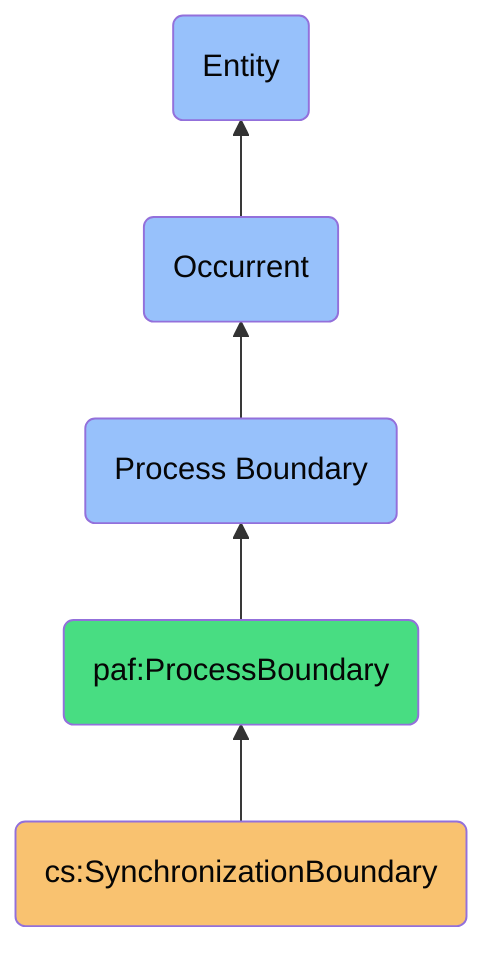
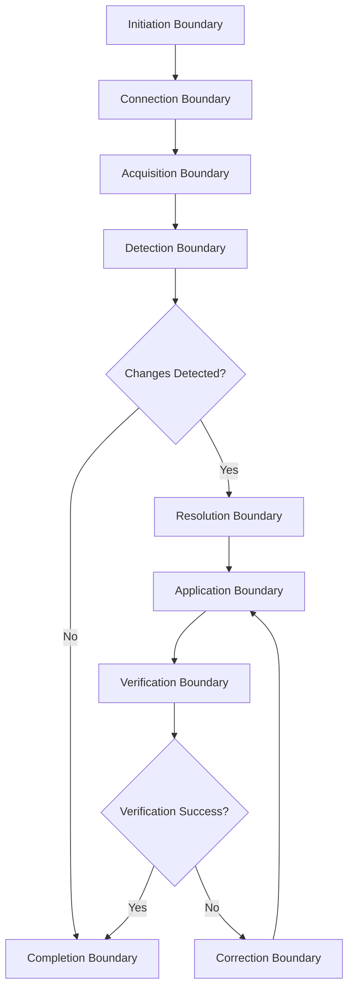

# SynchronizationBoundary

## Definition
A SynchronizationBoundary is an occurrent process boundary that represents the precise temporal demarcation and contextual edge conditions that define the initiation, transitions between stages, and completion of a contact synchronization process, establishing crucial state changes and decision points.

## Hierarchy in BFO


## Overview
A SynchronizationBoundary represents the critical junctures in time and state where distinct changes occur during contact synchronization processes. Unlike the processes themselves, which have temporal duration, these boundaries are instantaneous occurrents that mark significant transitions in the synchronization workflow.

These boundaries are essential for reasoning about the precise moments of state change, transaction integrity, error conditions, and authorization checks in synchronization processes. By explicitly modeling boundaries, the system can maintain a clear record of when synchronization states changed, what conditions existed at those moments, what decisions were made, and what triggered transitions between process phases.

This approach enables sophisticated governance of synchronization processes, providing the foundation for atomicity, isolation, resumption, and accountability in cross-platform data operations, while supporting fine-grained user sovereignty through boundary-specific permission enforcement and intervention points.

## Properties

### Temporal Properties
| Property | Type | Description | Example |
|----------|------|-------------|---------|
| boundaryTimestamp | DateTime | Exact moment of boundary | "2023-11-15T08:00:12.345Z" |
| boundaryType | Enum | Category of boundary | "Initiation", "StageTransition", "Completion", "Abort" |
| processStage | Enum | Process stage at boundary | "PreSync", "DataAcquisition", "ConflictResolution" |
| nextProcessStage | Enum | Stage after boundary | "DataAcquisition", "ChangeDetection", "PostSync" |
| durationSincePrevious | Duration | Time since previous boundary | "PT5M12.345S" (5 minutes, 12.345 seconds) |

### State Properties
| Property | Type | Description | Example |
|----------|------|-------------|---------|
| processState | Map<String, Any> | Process state at boundary | {"processed": 45, "pending": 78, "failed": 2} |
| platformStates | Map<Platform, State> | Platform states at boundary | {"LinkedIn": {"connected": true, "rateLimit": 95%}} |
| dataSnapshot | Reference | Reference to data state | "snapshot://sync-123/boundary-456" |
| resourceUtilization | ResourceStats | System resources at boundary | {"memory": "245MB", "connections": 3, "threads": 2} |
| metricValues | Map<String, Number> | Metrics at boundary point | {"syncSpeed": 12.5, "conflictRate": 0.03} |

### Control Properties
| Property | Type | Description | Example |
|----------|------|-------------|---------|
| transitionTrigger | TriggerInfo | What caused the boundary | {"type": "UserAction", "action": "StartSync"} |
| decisionContext | Decision | Decision made at boundary | {"type": "ConflictResolution", "strategy": "PreferNewer"} |
| authorizationContext | Authorization | Auth details at boundary | {"user": "user-123", "permissions": ["read", "write"]} |
| preconditions | Condition[] | Conditions before transition | [{"check": "PlatformConnected", "result": true}] |
| postconditions | Condition[] | Conditions after transition | [{"check": "DataConsistency", "result": true}] |

## Boundary Types

### Process Lifecycle Boundaries
- **Sync Initiation Boundary**: Marks the beginning of synchronization
- **Sync Completion Boundary**: Marks successful synchronization completion
- **Sync Abortion Boundary**: Marks premature process termination
- **Sync Suspension Boundary**: Marks temporary process halting
- **Sync Resumption Boundary**: Marks process continuation after suspension

### Stage Transition Boundaries


### Event-Triggered Boundaries
- **User Intervention Boundary**: Created by user action during sync
- **Error Boundary**: Created when errors occur
- **Timeout Boundary**: Created when time limits are reached
- **Resource Limit Boundary**: Created when resource limits are hit
- **External Interruption Boundary**: Created by external system events

## Boundary Content

### State Capture
- **Pre-Transition State**: System state before boundary
- **Post-Transition State**: System state after boundary
- **Delta Representation**: Changes occurring at boundary
- **Context Snapshot**: Environmental factors at boundary
- **Causal Factors**: What led to the boundary

### Decision Recording
```typescript
interface BoundaryDecision {
  // What decision was made
  decisionType: DecisionType;
  
  // Available options at decision point
  availableOptions: Option[];
  
  // Selected option
  selectedOption: Option;
  
  // Rationale for selection
  selectionRationale: string;
  
  // Who/what made the decision
  decisionMaker: DecisionMaker;
  
  // Factors considered in decision
  considerationFactors: Factor[];
}
```

### Exception Conditions
- **Error States**: Error conditions at boundary
- **Validation Failures**: Failed validations at boundary
- **Resource Constraints**: Resource limits reached at boundary
- **Authorization Failures**: Permission issues at boundary
- **Consistency Violations**: Data inconsistencies at boundary

## Transaction Boundaries

### Atomicity Guarantees
- **All-or-Nothing Operations**: Operations that must complete fully
- **Rollback Points**: States to return to if operations fail
- **Compensating Actions**: Actions to undo partial operations
- **Data Integrity Checks**: Validations ensuring data consistency
- **Idempotency Controls**: Protections against duplicate operations

### Transaction Patterns
| Boundary Pattern | Description | Use Case |
|------------------|-------------|----------|
| Two-Phase Commit | Prepare then commit across platforms | Multi-platform updates |
| Saga Pattern | Sequence of local transactions with compensations | Long-running sync |
| Optimistic Locking | Assume no conflicts, verify at completion | Fast syncs with rare conflicts |
| Validation Boundary | Check preconditions before proceeding | Data quality enforcement |
| Checkpoint Boundary | Save state for potential resumption | Interruptible synchronization |

### Isolation Levels
- **Read Uncommitted**: Boundaries allowing dirty reads
- **Read Committed**: Boundaries requiring committed data
- **Repeatable Read**: Boundaries preventing phantom reads
- **Serializable**: Boundaries enforcing full isolation
- **Snapshot Isolation**: Boundaries using point-in-time snapshots

## User Intervention Points

### Interaction Boundaries
- **Confirmation Boundaries**: Requiring user approval to continue
- **Conflict Resolution Boundaries**: Needing user decision on conflicts
- **Error Handling Boundaries**: Requiring user input on errors
- **Privacy Decision Boundaries**: Needing privacy-related decisions
- **Permission Elevation Boundaries**: Requiring additional authorizations

### Notification Conditions
- **Progress Notifications**: Informing about process milestones
- **Warning Notifications**: Alerting about potential issues
- **Completion Notifications**: Informing about process completion
- **Error Notifications**: Alerting about failures
- **Action Required Notifications**: Requesting user intervention

### Intervention Controls
```json
{
  "boundaryId": "sync-1234-conflict-resolution-5",
  "boundaryType": "UserInterventionRequired",
  "processStage": "ConflictResolution",
  "timestamp": "2023-11-15T08:22:45.123Z",
  "userContext": {
    "userId": "user-789",
    "sessionId": "session-456",
    "deviceInfo": "iPhone 12, iOS 15.4"
  },
  "interventionType": "ConflictDecision",
  "interventionData": {
    "conflictId": "conflict-12345",
    "field": "emailAddress",
    "sourceValue": "john.smith@work.com",
    "targetValue": "john.smith@newwork.com",
    "options": [
      {"id": "opt1", "label": "Keep work.com", "description": "Last used 15 days ago"},
      {"id": "opt2", "label": "Use newwork.com", "description": "From recent LinkedIn update"},
      {"id": "opt3", "label": "Keep both", "description": "Store as separate contact points"}
    ],
    "recommendedOption": "opt2",
    "decisionTimeout": "2023-11-15T08:32:45.123Z",
    "defaultAction": "opt2"
  }
}
```

## Implementation Aspects

### Boundary Implementation
```typescript
class SynchronizationBoundary {
  readonly id: string;
  readonly type: BoundaryType;
  readonly timestamp: Date;
  readonly processId: string;
  readonly fromStage: ProcessStage;
  readonly toStage: ProcessStage | null;
  readonly stateSnapshot: StateSnapshot;
  readonly trigger: Trigger;
  readonly decisions: Decision[];
  readonly conditions: ConditionEvaluation[];
  
  constructor(config: BoundaryConfig) {
    this.id = config.id;
    this.type = config.type;
    this.timestamp = new Date(config.timestamp);
    this.processId = config.processId;
    this.fromStage = config.fromStage;
    this.toStage = config.toStage || null;
    this.stateSnapshot = config.stateSnapshot;
    this.trigger = config.trigger;
    this.decisions = config.decisions || [];
    this.conditions = config.conditions || [];
  }
  
  isTerminal(): boolean {
    return [
      BoundaryType.Completion, 
      BoundaryType.Abortion, 
      BoundaryType.FatalError
    ].includes(this.type);
  }
  
  requiresUserIntervention(): boolean {
    return this.decisions.some(d => d.requiresUserInput && !d.userDecision);
  }
  
  wasSuccessful(): boolean {
    return this.type === BoundaryType.Completion || 
           (this.type === BoundaryType.StageTransition && !this.conditions.some(c => !c.met));
  }
  
  getFailureReasons(): string[] {
    if (this.wasSuccessful()) return [];
    return this.conditions
      .filter(c => !c.met)
      .map(c => c.description);
  }
  
  recordUserDecision(decisionId: string, choice: any): void {
    const decision = this.decisions.find(d => d.id === decisionId);
    if (decision) {
      decision.userDecision = {
        choice,
        timestamp: new Date(),
        userId: getCurrentUserId()
      };
    }
  }
}
```

### Boundary Usage Examples
```typescript
// Creating a boundary
const boundary = boundaryService.createBoundary({
  type: BoundaryType.StageTransition,
  processId: "sync-process-123",
  fromStage: ProcessStage.DataAcquisition,
  toStage: ProcessStage.ConflictResolution,
  trigger: {
    type: TriggerType.Automatic,
    cause: "DataAcquisitionComplete"
  }
});

// Checking if we can proceed
if (boundary.requiresUserIntervention()) {
  await userNotificationService.requestDecision(boundary);
  return; // Will resume after user decides
}

// Proceeding to next stage
if (boundary.wasSuccessful()) {
  processManager.advanceToStage(boundary.processId, boundary.toStage);
} else {
  errorHandlingService.handleFailedTransition(boundary);
}

// Finding boundary history
const processBoundaries = await boundaryRepository.findByProcessId("sync-process-123");
const userDecisionPoints = processBoundaries.filter(b => b.decisions.some(d => d.requiresUserInput));
```

## Integration with Other Entities

### Relates to Processes
- **ContactSynchronizationProcess**: Primary process with boundaries
- **IdentityResolutionProcess**: Process with resolution boundaries
- **ContactMergingProcess**: Process with merge boundaries
- **ErrorHandlingProcess**: Process initiated at error boundaries
- **UserDecisionProcess**: Process initiated at intervention boundaries

### Relates to Independent Continuants
- **PlatformAccount**: Accessed at platform connection boundaries
- **ContactRecord**: Modified at data update boundaries
- **PlatformDataModel**: Used at transformation boundaries
- **User**: Makes decisions at intervention boundaries
- **ComputingResource**: Consumed at resource-sensitive boundaries

### Relates to Temporal Regions
- **SynchronizationDuration**: Time between initiation and completion
- **StageDuration**: Time between stage transition boundaries
- **UserResponseTime**: Time between request and decision boundaries
- **PlatformResponseTime**: Time waiting for platform at connection boundaries
- **ValidityPeriod**: New validity periods created at update boundaries

## Sovereignty Implications

### User Control Points
- **Initiation Control**: User permission at sync initiation boundary
- **Decision Points**: User input at decision boundaries
- **Abort Capability**: User-triggered abortion boundaries
- **Progress Visibility**: Boundary-based progress indicators
- **Outcome Verification**: Completion boundary inspection

### Data Governance
- **Provenance Tracking**: Source information at acquisition boundaries
- **Modification Auditability**: Change records at update boundaries
- **Error Transparency**: Full context at error boundaries
- **Quality Control**: Validation results at quality check boundaries
- **Permission Enforcement**: Authorization checks at access boundaries

### Privacy Protection
- **Data Minimization**: Field filtering at acquisition boundaries
- **Purpose Limitation**: Purpose checks at stage transitions
- **Consent Verification**: Consent checks at permission boundaries
- **Retention Control**: Expiration at completion boundaries
- **Access Control**: Authorization at data access boundaries

## Governance

### Policy Implementation
- **Boundary-Specific Policies**: Rules that apply at specific boundaries
- **Transition Approval Requirements**: Who must approve transitions
- **Exception Handling Rules**: How to handle boundary exceptions
- **Auditing Requirements**: What must be recorded at boundaries
- **Timeout Policies**: Maximum durations between boundaries

### Ethical Considerations
- **User Burden Management**: Minimizing unnecessary interventions
- **Transparency Requirements**: Clear explanation of boundary conditions
- **Fallback Mechanisms**: Safe defaults at unresolved boundaries
- **System vs. User Authority**: Balance of decision power at boundaries
- **Error Handling Ethics**: Responsibility for boundary errors

### Compliance Aspects
- **Regulatory Checkpoints**: Compliance checks at specific boundaries
- **Documentation Requirements**: Required records of boundary states
- **Cross-Border Data Transfers**: International concerns at transfer boundaries
- **Data Subject Rights**: Implementation at rights-exercise boundaries
- **Security Incident Handling**: Response at security error boundaries

## History

### Conceptual Origin
- **Initial Concept**: Transaction boundaries in distributed systems
- **Evolution**: Process boundaries in business process management
- **PAF Integration**: Reformulated for personal data sovereignty (2022)

### Version History
- **v0.1**: Basic initiation/completion boundaries (2022-Q2)
- **v0.2**: Added stage transition boundaries (2022-Q3)
- **v1.0**: Full boundary model with transaction semantics (2023-Q1)
- **v1.1**: Enhanced with user intervention points (2023-Q2)
- **v1.2**: Added decision recording and state capture (2023-Q3)

### Evolution Roadmap
- **Planned v2.0**: Intelligent boundary-based process optimization
- **Planned v2.1**: Advanced boundary-based recovery mechanisms
- **Planned v2.2**: User-defined custom boundaries
- **Research Area**: Predictive boundary detection
- **Exploration**: Federated boundaries across trusted networks 