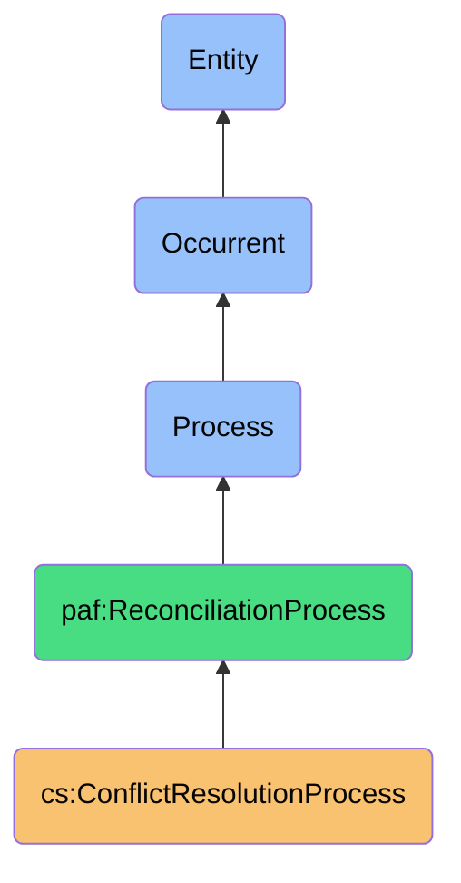
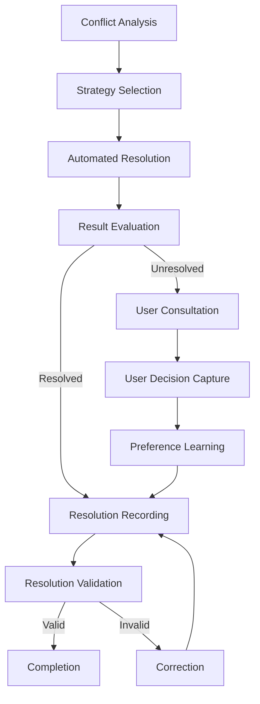

# ConflictResolutionProcess

## Definition
ConflictResolutionProcess is an occurrent process that systematically identifies, analyzes, and resolves data conflicts between contact records from multiple sources, applying user preferences and resolution strategies to establish data consistency while preserving data sovereignty.

## Hierarchy in BFO


## Overview
The ConflictResolutionProcess is responsible for addressing and resolving data inconsistencies that emerge when integrating contact information from multiple platforms. This process is triggered when conflicting attribute values are detected during the ContactMergingProcess or when synchronization reveals inconsistencies between platforms.

This process employs sophisticated strategies to resolve conflicts, ranging from automated rule-based approaches to user-guided decision making. It considers attribute quality, source reliability, update timestamps, and user preferences to determine the most appropriate resolution for each conflict. The process respects data sovereignty principles by ensuring users maintain ultimate control over conflict resolution decisions while providing intelligent assistance.

By systematically addressing conflicts, this process ensures data consistency across the personal contact ecosystem while maintaining data integrity and user trust in the integrated contact representation.

## Properties

### Input Properties
| Property | Type | Description | Example |
|----------|------|-------------|---------|
| conflictSet | Conflict[] | Set of identified conflicts to be resolved | [{"id": "conflict123", "attribute": "workPhone", "values": ["+1555123456", "+1555789012"]}] |
| resolutionRules | Rule[] | Rules defining resolution strategies | ["preferNewerTimestamp", "preferHigherQuality"] |
| userPreferences | Preference[] | User's preferred resolution strategies | ["preferLinkedInForProfessional", "preserveAllEmails"] |
| conflictContext | Context | Contextual information for conflict resolution | {"contact": "John Doe", "platforms": ["LinkedIn", "Gmail"]} |

### Process Properties
| Property | Type | Description | Example |
|----------|------|-------------|---------|
| resolutionStatus | Status | Current status of the resolution process | "InProgress", "AwaitingUserInput", "Completed" |
| resolutionProgress | Decimal | Completion percentage of resolution | 0.75 |
| userInterventionCount | Integer | Number of conflicts requiring user input | 3 |
| activeConflict | Conflict | Currently active conflict being resolved | {"attribute": "title", "values": ["Director", "VP"]} |

### Output Properties
| Property | Type | Description | Example |
|----------|------|-------------|---------|
| resolvedConflicts | Resolution[] | Conflicts with their resolution results | [{"conflict": "conflict123", "selectedValue": "+1555123456", "strategy": "UserSelected"}] |
| resolutionMetadata | Metadata | Metadata about the resolution process | {"timestamp": "2023-11-01T15:45:00Z", "userDecisions": 2} |
| unresolvedConflicts | Conflict[] | Conflicts that couldn't be resolved | [{"id": "conflict456", "reason": "InsuffcientData"}] |
| newUserPreferences | Preference[] | New user preferences learned during resolution | ["preferPersonalEmailForGoogle"] |
| resolutionError | Error | Error encountered during resolution | {"code": "AMBIGUOUS_CONFLICT", "message": "Cannot determine best resolution"} |

## Security

### Access Control
- **Owner Control**: Only the data owner can resolve their contact conflicts
- **Resolution Boundaries**: Resolution occurs within the personal data boundary
- **Decision Privacy**: Conflict resolution decisions are private to the owner
- **Rule Authority**: Only authorized rules can be applied to sensitive conflicts
- **History Protection**: Resolution history is protected from unauthorized access

### Privacy Controls
- **Minimal Disclosure**: Only necessary information shown during resolution
- **Sensitive Attribute Protection**: Special handling for sensitive conflicts
- **Context Preservation**: Maintaining contextual boundaries during resolution
- **Decision Isolation**: Resolution decisions don't expose unnecessary data
- **Preference Protection**: User preferences for resolution are protected

### Protection Mechanisms
- **Decision Verification**: Validation that resolutions maintain data integrity
- **Reversion Capability**: Ability to undo resolutions
- **Impact Analysis**: Evaluating consequences of resolution decisions
- **Fallback Protection**: Safe defaults when resolution is uncertain
- **Audit Trail**: Secure logging of resolution decisions

## Datasources

### Conflict Types
| Conflict Type | Description | Example | Typical Resolution |
|--------------|-------------|---------|-------------------|
| Value Conflict | Different values for same attribute | Phone: +1555123456 vs +1555789012 | User selection or rule-based |
| Format Conflict | Same data in different formats | Date: "Jan 1, 2023" vs "2023-01-01" | Standardization |
| Presence Conflict | Attribute exists in one source but not another | LinkedIn has job title, Gmail doesn't | Keep existing or mark optional |
| Update Conflict | Different update timestamps for same attribute | Phone updated: Yesterday vs Last week | Prefer newer |
| Completeness Conflict | Varying levels of completeness | Address with/without apartment number | Prefer more complete |

### Resolution Sources
- **User Decisions**: Direct input from users resolving conflicts
- **Resolution Rules**: Predefined strategies for automatic resolution
- **Historical Decisions**: Past conflict resolutions by the user
- **Platform Metadata**: Information about data quality from platforms
- **Timestamp Data**: Update timing information for conflicting values

### Quality Indicators
- **Source Reliability**: Historical accuracy of the data source
- **Update Recency**: How recently the data was updated
- **Data Completeness**: How complete the attribute information is
- **Format Standards**: Conformance to standard formats
- **Consistency**: Alignment with other related attributes

## Capabilities

### Resolution Strategies
- **Rule-Based Resolution**: Applying predefined rules to resolve conflicts
- **User-Guided Resolution**: Facilitating user decision making
- **Multi-Factor Analysis**: Considering multiple factors in resolution
- **Context-Aware Resolution**: Applying context to improve decisions
- **Preference Learning**: Learning from past decisions to improve future resolution

### Decision Support
- **Conflict Visualization**: Clearly displaying conflicts for user understanding
- **Resolution Recommendations**: Suggesting appropriate resolutions
- **Impact Preview**: Showing consequences of resolution choices
- **Batch Resolution**: Handling similar conflicts together
- **Decision Explanation**: Explaining rationale for recommendations

### Learning Capabilities
- **Pattern Recognition**: Identifying patterns in user resolution decisions
- **Preference Extraction**: Learning preferences from decisions
- **Resolution Prediction**: Predicting likely user decisions
- **Rule Refinement**: Improving resolution rules based on outcomes
- **Context Sensitivity**: Learning contextual factors affecting decisions

## Process Flow

### Process Stages


### Stage Details
1. **Conflict Analysis**
   - Analyze conflict types and severity
   - Evaluate attribute importance
   - Assess resolution complexity

2. **Strategy Selection**
   - Determine appropriate resolution strategy
   - Apply user preferences to strategy selection
   - Select automatic or user-guided approach

3. **Automated Resolution**
   - Apply resolution rules to conflicts
   - Evaluate multiple resolution options
   - Select optimal resolution based on rules

4. **Result Evaluation**
   - Assess confidence in automated resolution
   - Determine if user input is required
   - Prepare for user consultation if needed

5. **User Consultation**
   - Present conflict with context to user
   - Provide resolution recommendations
   - Display impact of different choices

6. **User Decision Capture**
   - Record user's resolution choice
   - Capture reasoning if provided
   - Note decision confidence

7. **Preference Learning**
   - Extract resolution patterns from decision
   - Update user preference models
   - Enhance future resolution capabilities

8. **Resolution Recording**
   - Document final resolution decision
   - Record resolution method and justification
   - Update resolution history

9. **Resolution Validation**
   - Verify resolution maintains data integrity
   - Check for consistency with other attributes
   - Confirm resolution meets quality standards

### Decision Flow
- **Triage**: Categorizing conflicts by complexity and importance
- **Automation**: Resolving simple conflicts automatically
- **Escalation**: Elevating complex conflicts for user input
- **Learning**: Capturing decisions to improve future resolution
- **Feedback**: Providing confirmation of successful resolution

## Interfaces

### Conflict Management Interface
```typescript
interface ConflictManager {
  getConflicts(filters: ConflictFilters): Conflict[];
  classifyConflict(conflict: Conflict): Classification;
  prioritizeConflicts(conflicts: Conflict[]): PrioritizedConflicts;
  assignResolutionStrategy(conflict: Conflict): Strategy;
  trackConflictStatus(conflict: Conflict): StatusUpdate;
}
```

### Resolution Interface
```typescript
interface ConflictResolver {
  resolveAutomatically(conflict: Conflict): Resolution;
  presentConflictToUser(conflict: Conflict): PresentationData;
  captureUserDecision(conflict: Conflict, decision: Decision): Resolution;
  applyResolution(conflict: Conflict, resolution: Resolution): Result;
  validateResolution(resolution: Resolution): ValidationResult;
}
```

### Learning Interface
```typescript
interface ResolutionLearner {
  extractPreferences(decision: Decision, context: Context): Preference[];
  updatePreferenceModel(preferences: Preference[]): ModelUpdate;
  predictResolution(conflict: Conflict): PredictedResolution;
  evaluatePredictionAccuracy(prediction: Prediction, actual: Resolution): Accuracy;
  improveResolutionRules(history: ResolutionHistory[]): RuleImprovements;
}
```

## Materializations

### Process Materializations
- **Conflict Resolution Session**: Interactive session for resolving conflicts
- **Resolution Engine**: Component applying resolution strategies
- **Decision Recorder**: Component capturing resolution decisions
- **Preference Learner**: Component learning from resolution patterns
- **Validation Checker**: Component verifying resolution integrity

### Result Materializations
- **Resolution Record**: Documentation of how conflicts were resolved
- **Preference Profile**: User's preferences for conflict resolution
- **Resolution History**: Archive of past conflict resolutions
- **Resolution Statistics**: Analysis of resolution patterns
- **Unresolved Conflicts**: Record of conflicts pending resolution

### Integration Materializations
- **Conflict UI**: Interface for visualizing and resolving conflicts
- **Resolution Dashboard**: Overview of conflict status and history
- **Decision Assistant**: Tool providing resolution recommendations
- **Preference Editor**: Interface for managing resolution preferences
- **Batch Resolution Tool**: Interface for resolving multiple similar conflicts

## Automations

### Process Automations
- **Conflict Detection**: Automatic identification of conflicts
- **Resolution Prioritization**: Ordering conflicts by importance
- **Batch Resolution**: Applying similar resolutions to related conflicts
- **Rule Application**: Automatically applying resolution rules
- **Post-Resolution Verification**: Checking resolution quality

### Decision Automations
- **Resolution Suggestion**: Recommending likely conflict resolutions
- **Decision Prediction**: Anticipating user's resolution preferences
- **Similar Conflict Identification**: Grouping related conflicts
- **Decision Impact Analysis**: Evaluating consequences of resolutions
- **Pattern-Based Resolution**: Applying recognized patterns to new conflicts

### Integration Automations
- **Resolution Notification**: Alerting users to resolved conflicts
- **Unresolved Alert**: Notifying about conflicts requiring attention
- **Decision Summary**: Generating reports on resolution decisions
- **Preference Update**: Suggesting preference updates based on decisions
- **Resolution Propagation**: Applying resolutions across the contact system

## Usage

### Primary Use Cases
- **Contact Merging Support**: Resolving conflicts during contact merging
- **Synchronization Reconciliation**: Addressing conflicts during platform synchronization
- **Data Quality Improvement**: Resolving inconsistencies to improve data quality
- **User Preference Refinement**: Learning and applying user preferences
- **Cross-Platform Consistency**: Maintaining consistent data across platforms

### Integration Points
- **Works with Contact Merging**: Resolves conflicts identified during merging
- **Supports Synchronization**: Addresses conflicts during platform synchronization
- **Feeds Contact Write**: Provides resolved data for writing to platforms
- **Informs Verification**: Supplies resolution decisions for verification
- **Interacts with User Interface**: Presents conflicts and captures decisions

### Query Patterns
```sparql
# Find all conflicts resolved by user decision
SELECT ?conflict ?attribute ?selectedValue ?timestamp
WHERE {
  ?resolution a cs:ConflictResolution ;
              cs:resolvesConflict ?conflict ;
              cs:hasResolutionMethod "UserDecision" ;
              cs:hasTimestamp ?timestamp .
  ?conflict cs:involvesAttribute ?attribute ;
            cs:hasSelectedValue ?selectedValue .
}

# Find conflicts automatically resolved by specific rule
SELECT ?conflict ?rule ?confidence
WHERE {
  ?resolution a cs:ConflictResolution ;
              cs:resolvesConflict ?conflict ;
              cs:hasResolutionMethod "Automatic" ;
              cs:appliesRule ?rule ;
              cs:hasConfidence ?confidence .
}
```

## History

### Conceptual Origin
- **Initial Concept**: Basic conflict identification and resolution (2010s)
- **Evolution**: User-guided resolution with preference learning (2015-2020)
- **PAF Integration**: Enhanced with sovereignty principles (2022)

### Version History
- **v0.1**: Basic conflict detection and manual resolution (2022-Q3)
- **v0.2**: Added rule-based automated resolution (2022-Q4)
- **v1.0**: Full preference learning and resolution prediction (2023-Q1)
- **v1.1**: Enhanced with conflict visualization and impact analysis (2023-Q2)
- **v1.2**: Added batch resolution capabilities (2023-Q3)

### Future Development
- **Planned v2.0**: Context-aware intelligent conflict resolution
- **Planned v2.1**: Predictive conflict prevention
- **Planned v2.2**: Cross-user collaborative resolution patterns
- **Research Area**: Semantic understanding of attribute relationships
- **Exploration**: Confidence-based probabilistic resolution 