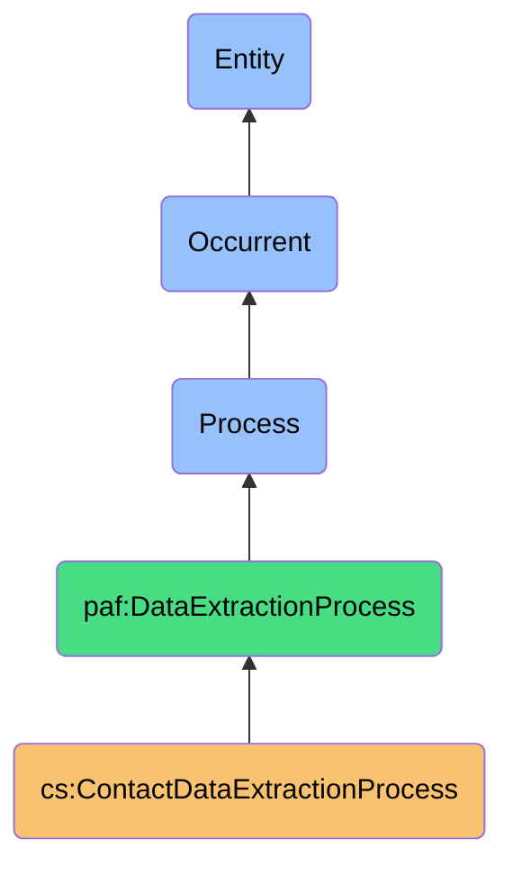
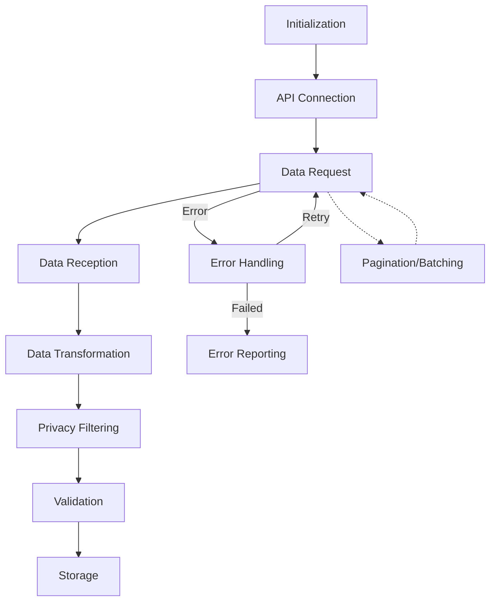

# ContactDataExtractionProcess

## Definition
ContactDataExtractionProcess is an occurrent process responsible for securely retrieving contact information from various digital platforms, transforming it into a standardized format, applying privacy filters, and preparing it for further processing while maintaining data provenance.

## Hierarchy in BFO


## Overview
The ContactDataExtractionProcess orchestrates the retrieval of contact information from digital platforms like LinkedIn, Gmail, Facebook, and others. It represents the first active data handling stage in the contact synchronization workflow after authentication.

This process manages the challenges of platform-specific API constraints, varying data formats, rate limitations, and evolving endpoints. It employs multiple extraction methods to accommodate different platform interfaces, from modern RESTful APIs to legacy formats and even email parsing when necessary.

Beyond simple data retrieval, this process includes privacy filtering, format normalization, and provenance tracking - ensuring that each contact attribute can be traced back to its original source. This provenance information is crucial for later stages such as conflict resolution and data sovereignty enforcement.

## Properties

### Input Properties
| Property | Type | Description | Example |
|----------|------|-------------|---------|
| sourcePlatform | Platform | Platform from which to extract contacts | "LinkedIn", "Gmail" |
| extractionFilter | Filter | Criteria for which contacts to extract | {"groups": ["Work"], "modifiedSince": "2023-01-01"} |
| dataFields | Fields[] | Specific fields to extract | ["name", "email", "phone", "company"] |
| authenticationToken | Token | Authentication token for platform access | "eyJhbGciOiJIUzI1NiIsInR5cCI6..." |
| batchSize | Integer | Number of contacts to extract per batch | 50 |

### Process Properties
| Property | Type | Description | Example |
|----------|------|-------------|---------|
| extractionMethod | Method | Method used for extraction | "API", "FileImport", "WebScraping" |
| extractionStatus | Status | Current status of the extraction | "InProgress", "Completed", "Failed" |
| progress | Decimal | Percentage of extraction completed | 0.75 |
| rateLimitStatus | Status | Status of API rate limiting | {"remaining": 45, "resetTime": "2023-11-01T15:00:00Z"} |
| privacyFilter | Filter | Applied privacy constraints | {"excludeFields": ["birthday", "address"]} |

### Output Properties
| Property | Type | Description | Example |
|----------|------|-------------|---------|
| extractedContacts | Contact[] | Contacts retrieved from the platform | [{"id": "123", "name": "John Doe", "email": "john@example.com"}] |
| extractionMetadata | Metadata | Metadata about the extraction process | {"timestamp": "2023-11-01T14:30:00Z", "source": "LinkedIn"} |
| extractionError | Error | Error encountered during extraction | {"code": "API_LIMIT", "message": "Rate limit exceeded"} |
| contactCount | Integer | Number of contacts extracted | 157 |
| limitedExtractionWarning | Warning | Warning if extraction was limited | {"reason": "API_LIMIT", "estimatedMissing": 20} |

## Security

### Access Control
- **Authentication Requirement**: Extraction only with valid authentication
- **Minimal Access**: Using read-only permissions when possible
- **Platform Policies**: Compliance with platform data access policies
- **User Authorization**: Extraction only for authorized platforms
- **Access Revocation**: Support for immediate access termination

### Privacy Controls
- **Data Minimization**: Extraction of only necessary contact fields
- **Field Filtering**: Removal of sensitive fields based on privacy settings
- **Pseudonymization**: Optional pseudonymization of identifiers
- **Purpose Limitation**: Extraction only for specified synchronization purpose
- **Retention Control**: No persistent storage of extracted data beyond necessity

### Protection Mechanisms
- **Secure Transport**: Data extraction over encrypted channels
- **Rate Limiting**: Respect for platform rate limits to prevent blocking
- **Request Throttling**: Controlled request pacing
- **Error Handling**: Secure handling of extraction errors
- **Platform Protection**: Prevention of excessive platform load

## Datasources

### Platform API Types
| Platform | API Type | Rate Limits | Format | Authentication |
|----------|----------|-------------|--------|---------------|
| LinkedIn | REST API | 100/day | JSON | OAuth 2.0 |
| Gmail | Google Contacts API | 10,000/day | JSON | OAuth 2.0 |
| Facebook | Graph API | 200/hour | JSON | OAuth 2.0 |
| Microsoft | Microsoft Graph | 10,000/10min | JSON | OAuth 2.0 |
| Apple | CloudKit | Adaptive | JSON | API Key |

### Data Field Mapping
- **Core Fields**: Name, email, phone with good standardization
- **Extended Fields**: Organization, role, profile images with varied support
- **Social Fields**: Connections, relationships, contexts with limited availability
- **Platform-Specific Fields**: Skills (LinkedIn), groups (Facebook), etc.
- **Metadata Fields**: Last contact, frequency, importance with varied support

### Platform Constraints
- **API Limitations**: Restricted data access based on platform policies
- **Rate Controls**: Varying request quotas and throttling
- **Data Completeness**: Platform-specific limitations on accessible fields
- **Update Frequency**: Different recency of data across platforms
- **Format Variations**: Platform-specific data structures requiring normalization

## Capabilities

### Extraction Methods
- **API Extraction**: Direct retrieval using platform APIs
- **File Import**: Parsing exported files (.vcf, .csv, etc.)
- **Web Scraping**: Controlled extraction from web interfaces (with consent)
- **Email Parsing**: Extraction from email signatures and message content
- **Contact Database**: Direct database extraction for local sources

### Transformation Functions
- **Format Normalization**: Converting to standard contact format
- **Data Cleansing**: Removing duplicates and inconsistencies
- **Field Standardization**: Normalizing field formats (phone, email, etc.)
- **Enrichment**: Adding metadata about source and extraction context
- **Provenance Tracking**: Adding source attribution to each field

### Filtering Capabilities
- **Field Selection**: Extracting only specified fields
- **Contact Selection**: Filtering based on groups, tags, or criteria
- **Time-Based Filtering**: Extracting contacts modified since last sync
- **Privacy Filtering**: Applying privacy rules to extracted data
- **Quality Filtering**: Filtering based on data completeness or quality

## Process Flow

### Process Stages


### Stage Details
1. **Initialization**
   - Initialize extraction parameters
   - Prepare platform-specific request templates
   - Set up extraction context and tracking

2. **API Connection**
   - Establish secure connection to platform API
   - Validate authentication and permissions
   - Prepare request headers and security context

3. **Data Request**
   - Construct and send data request to platform
   - Include filters, field selections, and pagination
   - Track request metadata for logging

4. **Data Reception**
   - Receive data response from platform
   - Handle pagination and partial responses
   - Monitor rate limits and response status

5. **Data Transformation**
   - Convert platform-specific format to standard model
   - Normalize field formats (phone numbers, emails, etc.)
   - Associate source platform with each field

6. **Privacy Filtering**
   - Apply privacy rules to filter sensitive data
   - Implement field-level privacy controls
   - Track applied privacy transformations

7. **Validation**
   - Validate extracted data for completeness
   - Check for structural and semantic correctness
   - Identify potential data quality issues

8. **Storage**
   - Prepare data for next synchronization stage
   - Associate extraction metadata with contacts
   - Maintain complete provenance information

### Error Handling
- **Transient Errors**: Automatic retry with exponential backoff
- **Authentication Errors**: Re-authentication flow trigger
- **Rate Limit Handling**: Adaptive throttling and scheduling
- **Partial Data Handling**: Processing available data despite errors
- **Degraded Operation**: Fallback extraction patterns for critical failures

## Interfaces

### Extraction Controller Interface
```typescript
interface ContactDataExtractionController {
  startExtraction(platform: Platform, options: ExtractionOptions): ProcessId;
  pauseExtraction(processId: string): boolean;
  resumeExtraction(processId: string): boolean;
  cancelExtraction(processId: string): boolean;
  getExtractionStatus(processId: string): ExtractionStatus;
}
```

### Data Transformation Interface
```typescript
interface DataTransformer {
  transformContact(platformData: any, platform: Platform): StandardContact;
  normalizeFields(contact: StandardContact): StandardContact;
  applyPrivacyFilters(contact: StandardContact, filters: PrivacyFilter[]): StandardContact;
  addProvenance(contact: StandardContact, source: Platform): StandardContact;
  validateContact(contact: StandardContact): ValidationResult;
}
```

### Extraction Configuration Interface
```typescript
interface ExtractionConfiguration {
  setSourcePlatform(platform: Platform): void;
  setExtractionFields(fields: string[]): void;
  setFilters(filters: Filter[]): void;
  setBatchSize(size: number): void;
  setPrivacyRules(rules: PrivacyRule[]): void;
  setExtractionMethod(method: ExtractionMethod): void;
}
```

## Materializations

### Process Materializations
- **Extraction Job**: Background task instance of extraction process
- **API Request**: Concrete request to platform API
- **Data Transformer**: Component that converts between formats
- **Privacy Filter Engine**: Component applying privacy rules
- **Extraction Monitor**: Dashboard showing extraction progress

### Result Materializations
- **Contact Collection**: Set of extracted contacts
- **Extraction Report**: Detailed report of the extraction process
- **Error Log**: Record of extraction errors and warnings
- **Data Quality Report**: Assessment of extracted data quality
- **Provenance Record**: Detailed source attribution for each field

### Integration Materializations
- **Platform Connector**: Reusable connection to specific platform
- **Rate Limit Monitor**: Tool for tracking API usage limits
- **Format Converter**: Utility for standardizing contact formats
- **Extraction Queue**: Queue of pending extraction requests
- **Scheduler**: Component for coordinating extraction timing

## Automations

### Process Automations
- **Scheduled Extraction**: Regular extraction on timed intervals
- **Change-Triggered Extraction**: Extraction when platform signals changes
- **Smart Batching**: Optimal batch sizes based on platform behavior
- **Progressive Extraction**: Extracting most important contacts first
- **Adaptive Rate Control**: Dynamically adjusting request rates

### Recovery Automations
- **Retry Logic**: Smart retry patterns for failed requests
- **Partial Extraction Recovery**: Continuing from last successful position
- **Alternative Method Fallback**: Switching methods on primary failure
- **Degraded Mode Operation**: Reduced functionality during constraints
- **Quota Preservation**: Preserving API quota for high-priority operations

### Data Enhancement Automations
- **Field Inference**: Deriving missing fields from available data
- **Format Correction**: Automatically fixing common format issues
- **Deduplication**: Identifying duplicate entries within a platform
- **Quality Scoring**: Automatically rating data quality and completeness
- **Anomaly Detection**: Flagging unusual patterns in extracted data

## Usage

### Primary Use Cases
- **Initial Platform Import**: First-time extraction of all contacts
- **Incremental Synchronization**: Extracting only changed contacts
- **Platform Migration**: Moving contacts between platforms
- **Contact Enrichment**: Supplementing existing contacts with new data
- **Social Graph Reconstruction**: Building relationship networks from contacts

### Integration Points
- **Follows Authentication Process**: Consumes authentication tokens
- **Precedes Identity Resolution**: Provides contacts for resolution
- **Provides Data to Merging**: Feeds contact data to merging process
- **Integrates with Privacy Framework**: Applies privacy policies
- **Provides Context to Conflict Resolution**: Supplies data quality information

### Query Patterns
```sparql
# Find all contacts extracted from LinkedIn in the last month
SELECT ?contact ?name ?email ?extractionTime
WHERE {
  ?extraction a cs:ContactDataExtractionProcess ;
              cs:hasSourcePlatform ex:LinkedIn ;
              cs:producesExtractedContacts ?contacts ;
              cs:hasExtractionTime ?extractionTime .
  ?contacts cs:containsContact ?contact .
  ?contact cs:hasName ?name ;
           cs:hasEmail ?email .
  FILTER(?extractionTime > "2023-10-01T00:00:00Z"^^xsd:dateTime)
}

# Find all extraction errors for Gmail platform
SELECT ?errorCode ?errorMessage ?timestamp
WHERE {
  ?extraction a cs:ContactDataExtractionProcess ;
              cs:hasSourcePlatform ex:Gmail ;
              cs:encountersError ?error ;
              cs:hasTimestamp ?timestamp .
  ?error cs:hasErrorCode ?errorCode ;
         cs:hasErrorMessage ?errorMessage .
}
```

## History

### Conceptual Origin
- **Initial Concept**: Basic API data extraction (2010s)
- **Evolution**: Multi-platform standardization efforts (2015-2020)
- **PAF Integration**: Enhanced with provenance tracking (2022)

### Version History
- **v0.1**: Basic extraction from major platforms (2022-Q2)
- **v0.2**: Added format standardization and privacy filtering (2022-Q3)
- **v1.0**: Full provenance tracking and error recovery (2023-Q1)
- **v1.1**: Enhanced with field-level privacy controls (2023-Q2)
- **v1.2**: Added alternative extraction methods for resilience (2023-Q3)

### Future Development
- **Planned v2.0**: AI-enhanced data extraction and inference
- **Planned v2.1**: Cross-platform data quality comparison
- **Planned v2.2**: Predictive extraction based on user patterns
- **Research Area**: Extraction from unstructured sources
- **Exploration**: Federated extraction with local privacy computation 