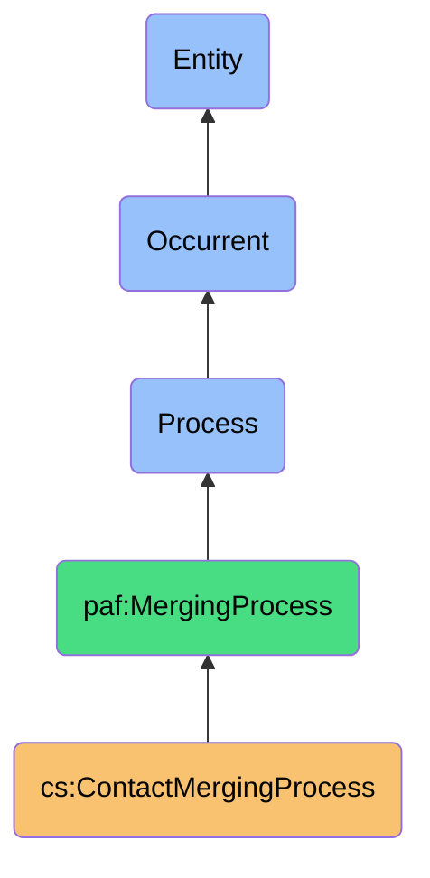
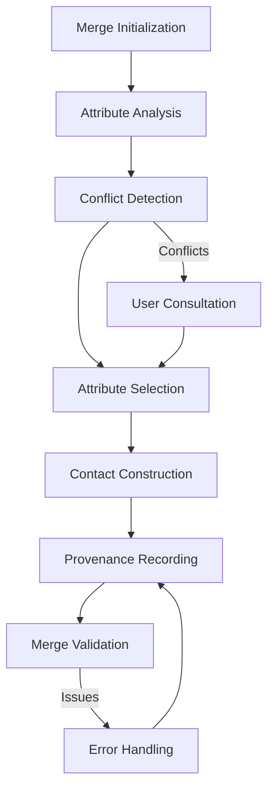

# ContactMergingProcess

## Definition
ContactMergingProcess is an occurrent process that systematically combines information from multiple records of the same contact entity across different platforms, applying configurable merge rules to create a unified, enriched contact representation while preserving attribute provenance.

## Hierarchy in BFO


## Overview
The ContactMergingProcess builds on the results of the IdentityResolutionProcess by taking sets of contact records determined to represent the same entity and intelligently combining their attributes into a single, enriched representation. This process is central to creating a unified view of contacts across digital platforms.

Unlike simpler approaches that might overwrite attributes or arbitrarily choose data sources, this process employs sophisticated rules and strategies to make optimal decisions about which attributes to retain, how to handle conflicts, and how to preserve the origin of each piece of information. It maintains attribute-level provenance, allowing users to understand where each piece of contact information originated.

This process embodies the sovereignty principle by creating a unified contact representation that transcends platform boundaries while allowing users to maintain awareness and control of their contact data's origins and quality.

## Properties

### Input Properties
| Property | Type | Description | Example |
|----------|------|-------------|---------|
| matchedContacts | ContactSet[] | Sets of contacts determined to be the same entity | [{"id": "set1", "contacts": ["linkedinContact123", "gmailContact456"]}] |
| mergeRules | MergeRule[] | Rules defining how to combine attributes | ["preferLinkedInForProfessional", "preferNewerPhone"] |
| attributePreferences | Map<Attribute, Source> | Preferred sources for specific attributes | {"workEmail": "LinkedIn", "mobilePhone": "Phone"} |
| mergeConflictStrategy | Strategy | Strategy for resolving conflicting attributes | "PreferNewer", "PreserveAll", "UserPrompt" |

### Process Properties
| Property | Type | Description | Example |
|----------|------|-------------|---------|
| mergeStatus | Status | Current status of the merging process | "InProgress", "Completed", "AwaitingUserInput" |
| mergeProgress | Decimal | Completion percentage of the merge | 0.65 |
| userInterventionRequired | Boolean | Whether user input is needed for conflicts | true |
| activeConflictResolution | Resolution | Currently active conflict resolution | {"attribute": "workPhone", "values": ["+1555123456", "+1555789012"]} |

### Output Properties
| Property | Type | Description | Example |
|----------|------|-------------|---------|
| mergedContacts | Contact[] | Resulting unified contact records | [{"id": "unified123", "name": "John Doe", "emails": ["john@work.com", "johnd@gmail.com"]}] |
| attributeProvenance | Map<Attribute, Source> | Record of where each attribute came from | {"workEmail": "LinkedIn", "mobilePhone": "iPhone"} |
| mergeConflicts | Conflict[] | Conflicts encountered during merging | [{"attribute": "title", "values": ["Director", "VP"], "resolution": "UserSelected"}] |
| mergeMetadata | Metadata | Metadata about the merging process | {"timestamp": "2023-11-01T15:45:00Z", "mergeRulesVersion": "1.2"} |
| mergeError | Error | Error encountered during merging | {"code": "CONFLICT_UNRESOLVED", "message": "Could not auto-resolve name conflict"} |

## Security

### Access Control
- **Owner Control**: Only the data owner can merge their contacts
- **Execution Boundaries**: Merging occurs within the personal data boundary
- **Result Visibility**: Merged results are private to the owner
- **Merge Rule Control**: Only authorized rules can be applied to sensitive data
- **History Control**: Owner can view and manage merge history

### Privacy Controls
- **Data Minimization**: Merge retains only necessary attributes
- **Source Verification**: Validation of attribute sources before merging
- **Attribute Sensitivity Awareness**: Special handling for sensitive attributes
- **Contextual Boundaries**: Respect for context-specific privacy expectations
- **Provenance Preservation**: Maintaining clear origin for each attribute

### Protection Mechanisms
- **Data Integrity**: Verification that merged results maintain correctness
- **Reversion Capability**: Ability to undo merges and restore previous states
- **Conflict Isolation**: Preventing cascading errors from unresolved conflicts
- **Attribute Validation**: Ensuring merged attributes meet format standards
- **Source Credibility Scoring**: Weighting sources by reliability

## Datasources

### Primary Sources
| Source | Attribute Types | Typical Quality | Update Frequency |
|--------|-----------------|-----------------|-----------------|
| LinkedIn | Professional, Education | High for professional | Low-Medium |
| Gmail | Email, Communication | Medium-High | High |
| Facebook | Personal, Social | Medium | Medium |
| Phone Contacts | Phone, Address | Variable | High |
| CRM Systems | Business, Interaction | High for business | Medium-High |

### Merge Rule Types
- **Source Priority Rules**: Preference order for specific platforms
- **Freshness Rules**: Preference for more recently updated data
- **Completeness Rules**: Preference for more complete information
- **Attribute-Specific Rules**: Special rules for particular attributes (email, phone, etc.)
- **Multi-Value Rules**: Handling of multiple values for the same attribute type

### Quality Assessment
- **Source Reliability**: Historical accuracy of the data source
- **Data Freshness**: Recency of the attribute
- **Data Completeness**: How complete the attribute information is
- **Format Conformance**: How well the data conforms to expected formats
- **Consistency**: Consistency with other attributes from the same source

## Capabilities

### Merging Strategies
- **Source-Driven Merging**: Prioritizing certain platforms for specific data
- **Attribute-Driven Merging**: Different strategies for different attribute types
- **Quality-Driven Merging**: Selecting attributes based on data quality
- **Temporal Merging**: Using time-based rules to resolve conflicts
- **Context-Aware Merging**: Applying context-specific merging logic

### Conflict Resolution
- **Automatic Resolution**: Rule-based resolution without user intervention
- **Manual Resolution**: User-guided decision making for conflicts
- **Hybrid Resolution**: Automatic for clear cases, manual for ambiguous ones
- **Value Preservation**: Keeping alternative values as secondary attributes
- **Resolution Learning**: Improving resolution based on past decisions

### Provenance Tracking
- **Attribute-Level Provenance**: Recording source for each individual attribute
- **Resolution Documentation**: Capturing how conflicts were resolved
- **Confidence Scoring**: Indicating confidence in merged attributes
- **Update History**: Tracking changes to merged contacts over time
- **Merge Explanation**: Human-readable explanations of merge decisions

## Process Flow

### Process Stages


### Stage Details
1. **Merge Initialization**
   - Load matched contact sets
   - Prepare merge rule engine
   - Set up merge context and tracking

2. **Attribute Analysis**
   - Analyze all attributes from source contacts
   - Compare attribute values across sources
   - Evaluate attribute quality and completeness

3. **Conflict Detection**
   - Identify contradicting attribute values
   - Classify conflicts by type and severity
   - Determine if automatic resolution is possible

4. **Attribute Selection**
   - Apply merge rules to select attributes
   - Resolve conflicts based on strategies
   - Record resolution decisions and justifications

5. **Contact Construction**
   - Create unified contact structure
   - Populate with selected attributes
   - Maintain multi-value attributes where appropriate

6. **Provenance Recording**
   - Associate source with each attribute
   - Record confidence scores
   - Document merge decisions

7. **Merge Validation**
   - Validate merged contact integrity
   - Check for logical inconsistencies
   - Verify all required attributes present

### User Interaction
- **Conflict Presentation**: Showing conflicting attributes with context
- **Resolution Options**: Presenting ways to resolve each conflict
- **Bulk Resolution**: Applying similar decisions to groups of conflicts
- **Decision Impact**: Showing consequences of resolution choices
- **Learning Preferences**: Option to remember decisions for future merges

## Interfaces

### Merging Controller Interface
```typescript
interface ContactMergingController {
  startMerging(matchedSets: ContactSet[], options: MergeOptions): ProcessId;
  pauseMerging(processId: string): boolean;
  resumeMerging(processId: string): boolean;
  cancelMerging(processId: string): boolean;
  getMergeStatus(processId: string): MergeStatus;
}
```

### Conflict Resolution Interface
```typescript
interface ConflictResolver {
  resolveConflict(conflict: Conflict, resolution: Resolution): boolean;
  getConflicts(processId: string): Conflict[];
  suggestResolution(conflict: Conflict): Resolution;
  applyBulkResolution(conflicts: Conflict[], strategy: ResolutionStrategy): ResolutionResults;
  saveResolutionPreference(conflict: Conflict, resolution: Resolution): boolean;
}
```

### Merge Rule Configuration Interface
```typescript
interface MergeRuleConfiguration {
  setSourcePriorities(priorityOrder: Platform[]): void;
  setAttributePreferences(attributeSources: Map<Attribute, Platform>): void;
  setConflictStrategy(strategy: ConflictStrategy): void;
  addCustomRule(rule: MergeRule): void;
  loadRuleSet(ruleSetId: string): boolean;
}
```

## Materializations

### Process Materializations
- **Merge Job**: Background task instance of the merging process
- **Conflict Resolution Session**: Interactive session for resolving conflicts
- **Merge Rule Engine**: Component applying merge rules
- **Contact Builder**: Component constructing unified contacts
- **Provenance Recorder**: Component tracking attribute sources

### Result Materializations
- **Unified Contact**: Integrated contact representation
- **Attribute Source Map**: Mapping of attributes to their sources
- **Merge Decision Record**: Record of how merge decisions were made
- **Quality Assessment**: Evaluation of the merged contact quality
- **Alternative Values**: Secondary attribute values not selected as primary

### Integration Materializations
- **Contact Display Adapter**: Component for viewing merged contacts
- **Conflict UI**: Interface for visualizing and resolving conflicts
- **Source Indicator**: Visual indicator of attribute sources
- **Rule Editor**: Interface for configuring merge rules
- **History Browser**: Tool for reviewing past merge decisions

## Automations

### Process Automations
- **Batch Merging**: Automatic merging of multiple contact sets
- **Incremental Merging**: Processing only new or changed contacts
- **Rule Optimization**: Tuning merge rules based on results
- **Quality Enhancement**: Improving contact quality through merging
- **Format Standardization**: Normalizing formats during merge

### Conflict Automations
- **Conflict Prediction**: Anticipating likely conflicts
- **Resolution Suggestion**: Recommending likely conflict resolutions
- **Pattern Recognition**: Identifying patterns in conflict resolution
- **Learning Preferences**: Adapting to user resolution patterns
- **Bulk Resolution**: Applying similar resolutions to related conflicts

### Integration Automations
- **Post-Merge Notification**: Alerting users to significant changes
- **Quality Report Generation**: Creating reports on merge quality
- **Contact Improvement Suggestions**: Recommending ways to enhance contacts
- **Synchronization Triggering**: Initiating synchronization after merging
- **Change Propagation**: Distributing merged changes to platforms

## Usage

### Primary Use Cases
- **Cross-Platform Contact Unification**: Creating a single view across platforms
- **Contact Enrichment**: Enhancing contact data with information from all sources
- **Platform-Independent Representation**: Creating platform-neutral contact records
- **Attribute Quality Improvement**: Selecting highest quality attributes
- **Data Sovereignty Implementation**: Reclaiming control of fragmented contact data

### Integration Points
- **Follows Identity Resolution**: Consumes matched contact sets
- **Precedes Contact Write**: Provides unified contacts for writing
- **Works with Conflict Resolution**: Delegates complex conflicts
- **Provides Data to Verification**: Supplies merged data for verification
- **Feeds User Interface**: Supplies unified contacts for display

### Query Patterns
```sparql
# Find all contacts with attributes from multiple sources
SELECT ?contact ?name 
WHERE {
  ?contact a cs:MergedContact ;
           cs:hasName ?name ;
           cs:hasAttribute ?attr1 ;
           cs:hasAttribute ?attr2 .
  ?attr1 cs:hasAttributeSource ?source1 .
  ?attr2 cs:hasAttributeSource ?source2 .
  FILTER(?source1 != ?source2)
}

# Find all conflicts that required manual resolution
SELECT ?contact ?attribute ?resolution ?timestamp
WHERE {
  ?merging a cs:ContactMergingProcess ;
           cs:identifiesConflicts ?conflict ;
           cs:hasTimestamp ?timestamp .
  ?conflict cs:affectsContact ?contact ;
            cs:involvesAttribute ?attribute ;
            cs:hasResolution ?resolution .
  ?resolution cs:hasResolutionType "UserSelected" .
}
```

## History

### Conceptual Origin
- **Initial Concept**: Basic field-level contact merging (2010s)
- **Evolution**: Quality-aware merging with provenance (2015-2020)
- **PAF Integration**: Enhanced with sovereignty principles (2022)

### Version History
- **v0.1**: Basic attribute selection from multiple sources (2022-Q3)
- **v0.2**: Added conflict detection and resolution (2022-Q4)
- **v1.0**: Full provenance tracking and rule-based merging (2023-Q1)
- **v1.1**: Enhanced with user-guided conflict resolution (2023-Q2)
- **v1.2**: Added quality-based attribute selection (2023-Q3)

### Future Development
- **Planned v2.0**: Context-aware intelligent merging
- **Planned v2.1**: Predictive conflict resolution
- **Planned v2.2**: Cross-user collaborative merging patterns
- **Research Area**: Semantic understanding of attribute relationships
- **Exploration**: Confidence-based probabilistic merging 