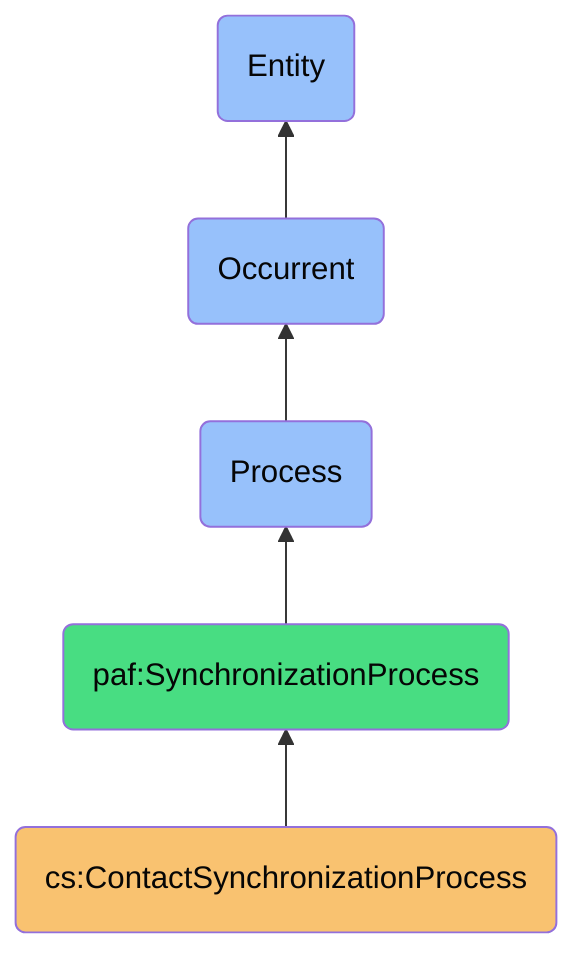
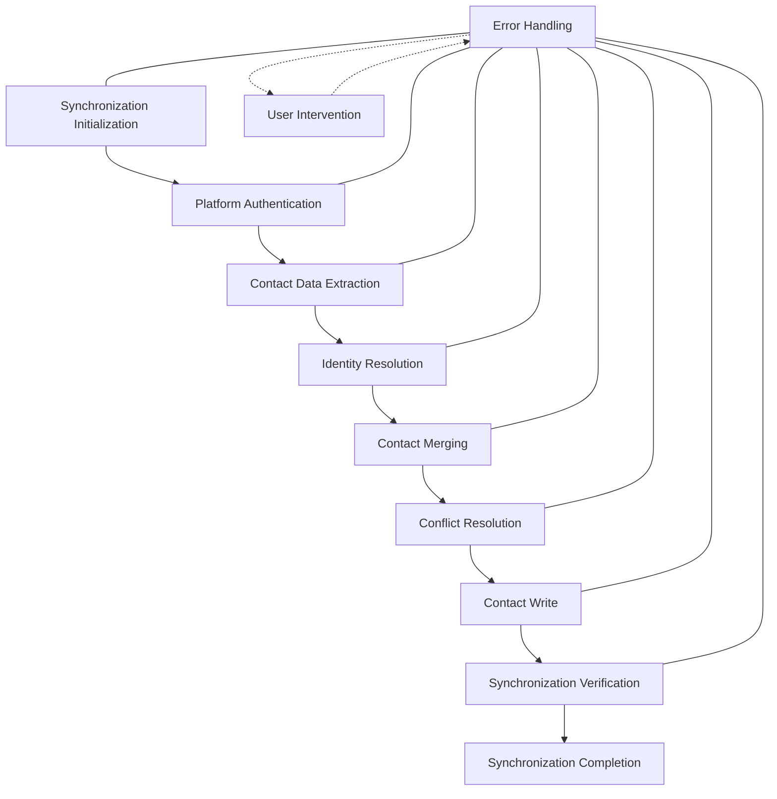

# ContactSynchronizationProcess

## Definition
ContactSynchronizationProcess is an occurrent process that orchestrates the bidirectional flow of contact information across digital platforms, while preserving data sovereignty, managing platform-specific constraints, and ensuring consistency and privacy across the contact ecosystem.

## Hierarchy in BFO


## Overview
The ContactSynchronizationProcess serves as the orchestration layer for the entire contact synchronization ecosystem. It coordinates the complex workflow of contact data movement across digital platforms while maintaining user control, preserving data sovereignty, and ensuring consistent contact representation throughout the ecosystem.

This process functions as both a controller and a coordinator, managing the execution sequence of specialized sub-processes including authentication, data extraction, identity resolution, merging, conflict resolution, writing, and verification. It establishes the necessary context for these processes, tracking the overall synchronization state, and adapting to changing platform conditions.

By providing a unified view of contacts across platforms while respecting platform boundaries and user preferences, this process embodies the core sovereignty principle of reclaiming control over fragmented personal contact data. It enables users to maintain a coherent contact ecosystem independent of platform silos, while intelligently managing the constraints and capabilities of each platform.

## Properties

### Input Properties
| Property | Type | Description | Example |
|----------|------|-------------|---------|
| targetPlatforms | Platform[] | Platforms to synchronize with | ["Gmail", "LinkedIn", "iCloud"] |
| syncDirection | Direction | Direction of synchronization | "Bidirectional", "Read-only", "Write-only" |
| syncScope | Scope | What to synchronize | {"includePhotos": false, "includeGroups": true} |
| userPreferences | Preference[] | User's synchronization preferences | ["preserveWorkContacts", "prioritizePhone"] |
| scheduleSettings | Schedule | When to perform synchronization | {"frequency": "Daily", "time": "02:00"} |

### Process Properties
| Property | Type | Description | Example |
|----------|------|-------------|---------|
| syncStatus | Status | Current status of synchronization | "InProgress", "Completed", "Failed" |
| platformProgress | Map<Platform, Progress> | Progress by platform | {"Gmail": "Completed", "LinkedIn": "InProgress"} |
| operationCounter | Counter | Counts of operations by type | {"read": 150, "merged": 120, "written": 115} |
| errorState | Map<Process, Error> | Errors by subprocess | {"ContactWrite": {"code": "API_LIMIT"}} |
| activeSubprocess | Process | Currently executing subprocess | "IdentityResolution" |

### Output Properties
| Property | Type | Description | Example |
|----------|------|-------------|---------|
| syncResults | Result[] | Results by platform | [{"platform": "Gmail", "contacts": 120, "status": "Success"}] |
| platformContactCounts | Map<Platform, Count> | Contact counts by platform | {"Gmail": 350, "LinkedIn": 275, "iCloud": 410} |
| changedContactsCount | Count | Number of contacts changed | 37 |
| syncMetadata | Metadata | Metadata about the synchronization | {"startTime": "2023-11-01T15:00:00Z", "duration": "PT25M"} |
| syncSummary | Summary | Summary of synchronization result | {"total": 500, "success": 498, "failed": 2} |

## Security

### Access Control
- **Owner Control**: Only the data owner controls synchronization
- **Execution Boundaries**: Sync occurs within the personal data boundary
- **Subprocess Authorization**: Proper authorization for all subprocesses
- **Platform Credentials**: Secure management of platform credentials
- **Result Visibility**: Sync results visible only to owner

### Privacy Controls
- **Attribute Filtering**: User control over what attributes sync
- **Platform Boundaries**: Respecting privacy context of each platform
- **Sensitive Data Protection**: Special handling for sensitive information
- **Direction Control**: Control over data flow direction
- **Consent Management**: Ensuring proper consent for synchronization

### Protection Mechanisms
- **Credential Security**: Secure handling of platform credentials
- **Connection Encryption**: Encrypted communication with platforms
- **Execution Isolation**: Isolated execution environment
- **Error Containment**: Preventing cascading failures
- **Audit Logging**: Secure logging of synchronization activities

## Datasources

### Synchronization Sources
| Platform Type | API Characteristics | Data Model | Typical Constraints |
|---------------|---------------------|------------|---------------------|
| Email Services | REST APIs, OAuth | Contact-centric | Rate limits, attribute limitations |
| Social Networks | Graph APIs, OAuth | Connection-based | Privacy controls, limited write access |
| Mobile Devices | Native APIs, Device Auth | Device-oriented | Local storage, OS limitations |
| CRM Systems | Business APIs, API Keys | Relationship-focused | Enterprise policies, complex schemas |
| Messaging Apps | Limited APIs, Various Auth | Communication-focused | Limited contact data, minimal APIs |

### Status Tracking
- **Synchronization Journal**: Complete record of sync activities
- **Platform State Cache**: Cached state of platform data
- **Differential Tracking**: Records of what has changed
- **Error Registry**: Documentation of synchronization errors
- **Performance Metrics**: Timing and efficiency measurements

### User Preference Sources
- **Synchronization Settings**: User's sync configuration
- **Platform Preferences**: Platform-specific user preferences
- **Privacy Settings**: User's privacy configuration
- **Schedule Configuration**: User's scheduling preferences
- **Priority Configuration**: User's priority settings

## Capabilities

### Orchestration Capabilities
- **Process Sequencing**: Managing the order of subprocesses
- **Context Management**: Maintaining context across processes
- **Error Handling**: Coordinating responses to errors
- **State Management**: Tracking synchronization state
- **Recovery Coordination**: Managing recovery from failures

### Adaptation Capabilities
- **Platform Adaptation**: Adapting to platform-specific requirements
- **Schedule Adaptation**: Adjusting to optimal synchronization times
- **Scope Adaptation**: Modifying sync scope based on conditions
- **Priority Adaptation**: Adjusting priorities dynamically
- **Error Adaptation**: Adjusting strategy based on error patterns

### Insight Capabilities
- **Synchronization Analytics**: Analyzing sync patterns and performance
- **Platform Health Monitoring**: Tracking platform reliability
- **Contact Ecosystem Mapping**: Understanding the contact landscape
- **Trend Identification**: Recognizing patterns over time
- **Improvement Recommendations**: Suggesting sync optimizations

## Process Flow

### Process Stages


### Stage Details
1. **Synchronization Initialization**
   - Establish synchronization context
   - Load user preferences
   - Determine synchronization scope
   - Prepare platform connections

2. **Platform Authentication**
   - Authenticate with each platform
   - Verify access permissions
   - Refresh credentials if needed
   - Establish secure connections

3. **Contact Data Extraction**
   - Extract contact data from platforms
   - Apply privacy filters
   - Normalize data formats
   - Track extraction progress

4. **Identity Resolution**
   - Identify matching contacts across platforms
   - Form identity groups
   - Calculate match confidence
   - Resolve ambiguous matches

5. **Contact Merging**
   - Combine attributes from matched contacts
   - Apply merging rules
   - Preserve attribute provenance
   - Handle multi-value attributes

6. **Conflict Resolution**
   - Identify data conflicts
   - Apply resolution strategies
   - Request user input if needed
   - Document resolution decisions

7. **Contact Write**
   - Write merged contacts to platforms
   - Adapt to platform schemas
   - Handle write errors
   - Track write operations

8. **Synchronization Verification**
   - Verify synchronization results
   - Identify discrepancies
   - Generate verification report
   - Suggest remediation for issues

9. **Synchronization Completion**
   - Finalize synchronization state
   - Generate synchronization summary
   - Update synchronization history
   - Prepare for next synchronization

### Error Handling
- **Authentication Failures**: Handling credential issues
- **Extraction Errors**: Managing platform data access problems
- **Resolution Ambiguities**: Addressing uncertain matches
- **Merging Conflicts**: Resolving attribute conflicts
- **Write Failures**: Managing platform write issues

## Interfaces

### Synchronization Controller Interface
```typescript
interface ContactSynchronizationController {
  startSynchronization(options: SyncOptions): SyncProcess;
  pauseSynchronization(processId: string): boolean;
  resumeSynchronization(processId: string): boolean;
  cancelSynchronization(processId: string): boolean;
  getSynchronizationStatus(processId: string): SyncStatus;
}
```

### Configuration Interface
```typescript
interface SynchronizationConfiguration {
  setPlatforms(platforms: Platform[]): void;
  setSyncDirection(direction: SyncDirection): void;
  setSyncScope(scope: SyncScope): void;
  setSchedule(schedule: Schedule): void;
  setUserPreferences(preferences: SyncPreferences): void;
}
```

### Monitoring Interface
```typescript
interface SynchronizationMonitor {
  getSyncProgress(syncId: string): SyncProgress;
  getPlatformStatus(platform: Platform): PlatformStatus;
  getErrorState(syncId: string): ErrorState;
  getPerformanceMetrics(syncId: string): PerformanceMetrics;
  getResourceUtilization(syncId: string): ResourceUtilization;
}
```

## Materializations

### Process Materializations
- **Synchronization Job**: Background task instance of synchronization
- **Orchestration Engine**: Component coordinating subprocesses
- **Platform Connector**: Component connecting to platforms
- **State Manager**: Component tracking synchronization state
- **Error Handler**: Component managing synchronization errors

### Result Materializations
- **Synchronization Record**: Complete record of sync activity
- **Contact Map**: Mapping of contacts across platforms
- **Change Record**: Documentation of changes made
- **Error Report**: Detailed report of synchronization errors
- **Performance Report**: Analysis of synchronization performance

### Integration Materializations
- **Sync Dashboard**: Interface showing synchronization status
- **Platform Manager**: Interface for managing platform connections
- **Schedule Manager**: Tool for managing synchronization schedule
- **Preference Editor**: Interface for editing sync preferences
- **History Browser**: Tool for exploring synchronization history

## Automations

### Process Automations
- **Scheduled Synchronization**: Automatic syncing on schedule
- **Event-Triggered Sync**: Sync triggered by specific events
- **Incremental Synchronization**: Syncing only what has changed
- **Smart Batching**: Optimizing operations in batches
- **Adaptive Scheduling**: Adjusting schedule based on conditions

### Error Automations
- **Automatic Retry**: Retrying failed operations
- **Fallback Strategies**: Using alternative approaches when primary fails
- **Graceful Degradation**: Continuing with partial success
- **Recovery Orchestration**: Managing complex recovery scenarios
- **Error Analysis**: Analyzing patterns in sync errors

### Integration Automations
- **Platform Health Check**: Verifying platform availability
- **Credential Refresh**: Automatically refreshing credentials
- **Sync Report Generation**: Creating detailed sync reports
- **User Notification**: Alerting users to sync status
- **Contact Quality Improvement**: Enhancing contact data quality

## Usage

### Primary Use Cases
- **Cross-Platform Synchronization**: Keeping contacts in sync across platforms
- **Contact Ecosystem Management**: Managing the complete contact ecosystem
- **Unified Contact View**: Creating a unified view of contacts
- **Data Sovereignty Implementation**: Reclaiming control of contact data
- **Contact Data Quality Management**: Improving contact data quality

### Integration Points
- **Works with Authentication**: Uses authentication to access platforms
- **Coordinates Extraction**: Manages contact data extraction
- **Orchestrates Resolution**: Coordinates identity resolution
- **Directs Merging**: Manages contact merging
- **Controls Writing**: Coordinates contact writing

### Query Patterns
```sparql
# Find all synchronization processes from the last week
SELECT ?sync ?startTime ?status ?contactCount
WHERE {
  ?sync a cs:ContactSynchronizationProcess ;
         cs:hasStartTime ?startTime ;
         cs:hasStatus ?status ;
         cs:processedContactCount ?contactCount .
  FILTER(?startTime > "2023-10-25T00:00:00Z"^^xsd:dateTime)
}

# Find all platforms with synchronization issues
SELECT ?platform ?errorCount ?lastSuccessTime
WHERE {
  ?platform a cs:SynchronizationPlatform ;
             cs:hasErrorCount ?errorCount ;
             cs:lastSuccessfulSync ?lastSuccessTime .
  FILTER(?errorCount > 0)
}
```

## History

### Conceptual Origin
- **Initial Concept**: Basic contact synchronization (2010s)
- **Evolution**: Platform-agnostic synchronization (2015-2020)
- **PAF Integration**: Enhanced with sovereignty principles (2022)

### Version History
- **v0.1**: Basic synchronization with common platforms (2022-Q3)
- **v0.2**: Added orchestration of subprocesses (2022-Q4)
- **v1.0**: Full contact ecosystem synchronization (2023-Q1)
- **v1.1**: Enhanced with user preference controls (2023-Q2)
- **v1.2**: Added intelligent scheduling and error handling (2023-Q3)

### Future Development
- **Planned v2.0**: Intelligent cross-platform synchronization
- **Planned v2.1**: Predictive synchronization optimization
- **Planned v2.2**: Collaborative synchronization patterns
- **Research Area**: Decentralized synchronization protocols
- **Exploration**: AI-driven synchronization optimization