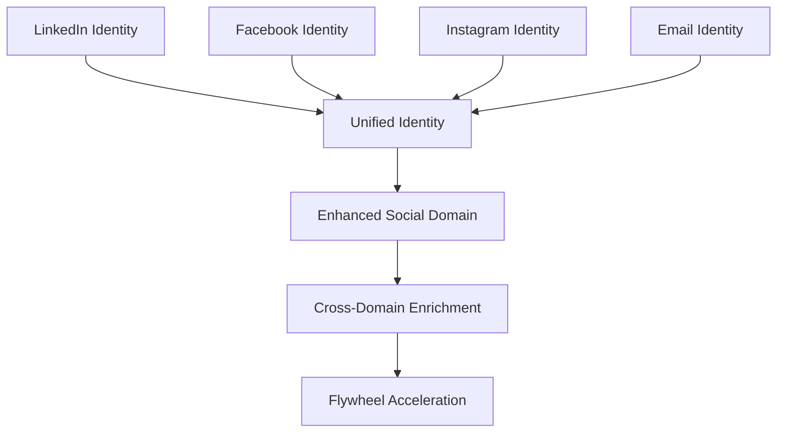

# Contact Synchronization in the Personal AI Flywheel

This document explains how the Contact Synchronization process integrates with and enhances the Personal AI Flywheel, contributing to data sovereignty and cross-domain enrichment.

## Overview

The Contact Synchronization process is a practical implementation of the Personal AI Flywheel's core principles, particularly focused on the Social domain with connections to other life domains.

```
┌─────────────────┐        ┌─────────────────┐
│                 │        │                 │
│     Health      │◄───────┤  Productivity   │
│                 │        │                 │
└────────┬────────┘        └─────┬───────────┘
         │                       │
         ▼                       ▲
┌─────────────────┐        ┌─────────────────┐
│                 │        │                 │
│    Learning     │        │     Content     │
│                 │        │                 │
└────────┬────────┘        └─────┬───────────┘
         │                       │
         ▼                       ▲
┌─────────────────┐        ┌─────────────────┐
│                 │        │                 │
│    Financial    │───────►│      Social     │◄─── Contact Synchronization
│                 │        │                 │     primarily enhances
└─────────────────┘        └─────────────────┘     this domain
```

## Domain Contributions

### Primary Domain: Social

The Contact Synchronization process directly enhances the Social domain of the Personal AI Flywheel by:

1. **Creating a Unified Social Graph**: Integrating contacts from LinkedIn, Facebook, Instagram, and Email creates a comprehensive view of the user's social connections.

2. **Preserving Relationship Context**: By maintaining the source platform for each contact attribute, the system preserves the context of relationships (professional, personal, creative).

3. **Enhancing Contact Richness**: Combining information from multiple platforms creates more complete contact profiles than any single platform can provide.

4. **Providing Contact Sovereignty**: Giving users control over their complete social graph independent of platforms.

### Cross-Domain Enrichment Processes

The Contact Synchronization model contributes to multiple cross-domain enrichment processes:

#### Social → Content Enrichment

```ttl
cs:SocialContentEnrichment a owl:Class ;
    rdfs:subClassOf paf:CrossDomainEnrichmentProcess ;
    rdfs:label "Social Content Enrichment"@en ;
    skos:definition "The process by which social connection data enhances content recommendations and creation."@en .
```

**Examples**:
- LinkedIn contacts' professional interests inform content recommendations
- Facebook social groups suggest shared content interests
- Email communication frequency identifies important content sources

#### Learning → Social Enrichment

```ttl
cs:LearningSocialEnrichment a owl:Class ;
    rdfs:subClassOf paf:CrossDomainEnrichmentProcess ;
    rdfs:label "Learning Social Enrichment"@en ;
    skos:definition "The process by which learning information enhances understanding of social connections."@en .
```

**Examples**:
- Educational background from LinkedIn provides context for professional relationships
- Skills and certifications indicate potential collaboration opportunities
- Learning interests suggest social connection possibilities

#### Financial → Social Enrichment

```ttl
cs:FinancialSocialEnrichment a owl:Class ;
    rdfs:subClassOf paf:CrossDomainEnrichmentProcess ;
    rdfs:label "Financial Social Enrichment"@en ;
    skos:definition "The process by which financial information enhances social interactions."@en .
```

**Examples**:
- Payment apps linked to contacts enable easier financial transactions
- Business relationships are contextualized with financial history
- Gift giving and social expenses are facilitated with proper contact information

## Flywheel Enhancement Mechanisms

The Contact Synchronization process enhances the Personal AI Flywheel through these specific mechanisms:

### 1. Cross-Platform Identity Resolution



By resolving identities across platforms, the system creates a more coherent understanding of social connections, which then feeds into other domains.

### 2. Contact Attribute Provenance

The system maintains detailed provenance for each contact attribute:

```
Contact: John Smith
├── Name: "John Smith" [Source: LinkedIn, Confidence: 0.95]
├── Email: "john.smith@work.com" [Source: LinkedIn, Confidence: 0.95]
├── Email: "johnsmith@personal.com" [Source: Gmail, Confidence: 0.90]
├── Phone: "+1-555-123-4567" [Source: Facebook, Confidence: 0.85]
├── Birthday: "April 15" [Source: Facebook, Confidence: 0.95]
├── Profile Photo [Source: Instagram, Confidence: 0.90]
└── Skills: "Programming, Design" [Source: LinkedIn, Confidence: 0.95]
```

This rich attribution allows the system to use the most appropriate contact information based on context when interacting with other domains.

### 3. Contact Classification and Categorization

```ttl
cs:ContactCategory a owl:Class ;
    rdfs:subClassOf bfo:BFO_0000031 ; # Generically Dependent Continuant
    rdfs:label "Contact Category"@en ;
    skos:definition "A classification of contacts based on relationship type and domains."@en ;
    skos:example "Professional contact, personal friend, family member, service provider."@en .
```

By classifying contacts into categories, the system can make intelligent decisions about:
- Which contacts are relevant for learning recommendations
- Which contacts to include in productivity tools
- Which contacts to consider for content sharing

### 4. Temporal Contact Relevance

The system tracks when contacts were last interacted with across platforms:

```ttl
cs:ContactRelevanceScore a owl:Class ;
    rdfs:subClassOf bfo:BFO_0000019 ; # Quality
    rdfs:label "Contact Relevance Score"@en ;
    skos:definition "A score reflecting the current relevance of a contact based on recency, frequency, and cross-domain importance."@en .
```

This temporal awareness allows the flywheel to prioritize socially relevant connections when making recommendations in other domains.

## Implementation Example: Contact Synchronization Flywheel Integration

```ttl
cs:FlywheelEnhancementProperty a owl:ObjectProperty ;
    rdfs:domain cs:ContactSynchronizationProcess ;
    rdfs:range paf:PersonalDataStore ;
    rdfs:label "flywheel enhancement property"@en ;
    skos:definition "Relates a contact synchronization process to a personal data store domain it enhances."@en .

cs:primaryEnhances a owl:ObjectProperty ;
    rdfs:subPropertyOf cs:FlywheelEnhancementProperty ;
    rdfs:label "primarily enhances"@en ;
    skos:definition "Indicates the primary domain enhanced by the contact synchronization."@en .

cs:secondarilyEnhances a owl:ObjectProperty ;
    rdfs:subPropertyOf cs:FlywheelEnhancementProperty ;
    rdfs:label "secondarily enhances"@en ;
    skos:definition "Indicates a secondary domain enhanced by the contact synchronization."@en .
```

**Example Usage**:

```ttl
:MyContactSyncProcess a cs:ContactSynchronizationProcess ;
    cs:primaryEnhances paf:SocialDataStore ;
    cs:secondarilyEnhances paf:ContentMemory ;
    cs:secondarilyEnhances paf:ProductivityDataStore .
```

## Sovereignty Enhancement

The Contact Synchronization model enhances data sovereignty in the Personal AI Flywheel through:

1. **Platform Independence**: Creating a unified contact repository independent of any single platform
2. **Attribute-level Ownership**: Maintaining ownership and provenance of each contact attribute
3. **Control Granularity**: Allowing fine-grained control over which contact attributes sync to which systems
4. **Consent Management**: Explicit consent handling for each platform integration
5. **Local-First Storage**: Prioritizing device-based storage (iPhone) over cloud dependencies

## Competency Questions Addressed

The Contact Synchronization model addresses these key flywheel-related competency questions:

1. How do social connections from different platforms contribute to a unified understanding of relationships?
2. What cross-domain enrichment opportunities exist based on comprehensive contact information?
3. How can contact attributes from multiple sources be integrated while maintaining provenance?
4. What consent and privacy controls are needed for cross-platform contact integration?
5. How can contact synchronization enhance the user's control over their social graph?

## Future Flywheel Enhancements

Future enhancements to integrate Contact Synchronization more deeply into the Personal AI Flywheel:

1. **Communication History Integration**: Incorporating message history across platforms for deeper relationship context
2. **Relationship Strength Modeling**: Developing metrics for relationship strength based on interaction patterns
3. **Collaborative Interest Mapping**: Identifying shared interests across contacts for content and learning recommendations
4. **Social Circle Visualization**: Creating visual representations of social networks across different life domains
5. **Interaction Scheduling**: Suggesting optimal times for social interactions based on productivity patterns 