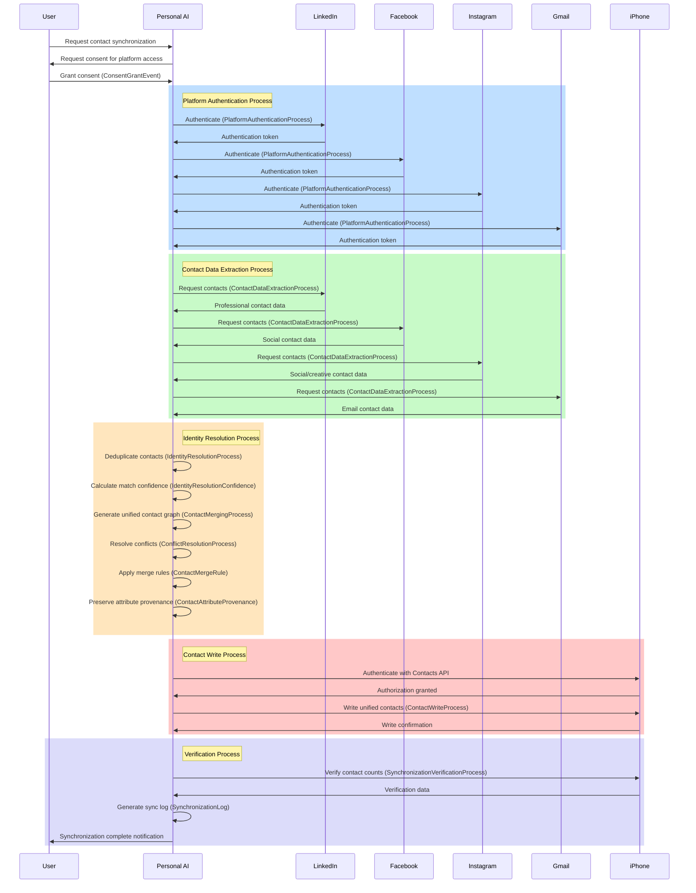

# Contact Synchronization Process Flow

This document provides a detailed flow diagram of the contact synchronization process, showing how contacts from LinkedIn, Instagram, Facebook, and Gmail are synchronized to an iPhone.

## Process Sequence Diagram

## Process Components in BFO Categories

### Material Entities (What/Who)
- User
- Personal AI System
- LinkedIn Platform
- Facebook Platform
- Instagram Platform
- Gmail Platform
- iPhone Device

### Qualities (How-it-is)
- Authentication Status
- Data Freshness
- Identity Resolution Confidence
- Synchronization Status

### Realizable Entities (Why-potential)
- Platform Authorization Function
- Contact Deduplication Function
- Contact Enrichment Function
- Privacy Preservation Function

### Processes (How-it-happens)
- Platform Authentication Process
- Contact Data Extraction Process
- Identity Resolution Process
- Contact Merging Process
- Conflict Resolution Process
- Contact Write Process
- Synchronization Verification Process

### Information Content Entities (How-we-know)
- Authentication Tokens
- Contact Records
- Contact Merge Rules
- Unified Contact Graph
- Synchronization Log
- Contact Attribute Provenance

## Data Flow Overview

1. **User Initiates Synchronization**
   - User requests contact synchronization
   - Personal AI obtains consent for accessing each platform

2. **Platform Authentication**
   - Personal AI authenticates with each platform (LinkedIn, Facebook, Instagram, Gmail)
   - Authentication tokens are securely stored in CredentialVault

3. **Contact Data Extraction**
   - Contact data is extracted from each platform
   - Each contact is associated with its platform source
   - Privacy boundaries are enforced during extraction

4. **Identity Resolution and Merging**
   - Contacts are compared across platforms to identify the same person
   - Matching algorithms generate confidence scores
   - A unified contact graph is created
   - Conflicts between data sources are resolved using predefined rules
   - Source provenance is preserved for each attribute

5. **iPhone Contact Synchronization**
   - Personal AI authenticates with iPhone Contacts API
   - Unified contacts are written to iPhone
   - Existing contacts are updated, new contacts are created

6. **Verification and Logging**
   - Contact counts and data integrity are verified
   - A synchronization log is generated
   - User is notified of completion

## Key Process Relationships

- **Platform Authentication Process** *initiates* Contact Data Extraction Process
- **Contact Data Extraction Process** *provides input to* Identity Resolution Process
- **Identity Resolution Process** *generates* Unified Contact Record
- **Contact Merging Process** *applies* Contact Merge Rules
- **Contact Write Process** *realizes* Contact Synchronization Function
- **Synchronization Verification Process** *produces* Synchronization Log

## Data Sovereignty Implementation

- All platform interactions require explicit **ConsentGrantEvent**
- Each contact attribute maintains its **ContactAttributeProvenance**
- User-defined **SynchronizationPolicy** controls what data is synchronized
- **PrivacyPreservationFunction** ensures minimal necessary data extraction
- Complete **SynchronizationLog** provides transparency and accountability 