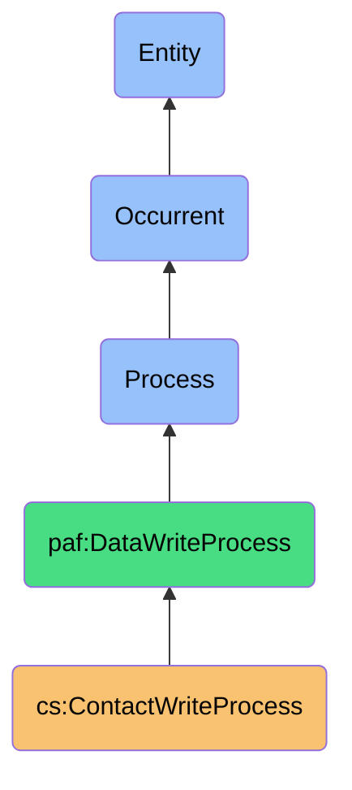
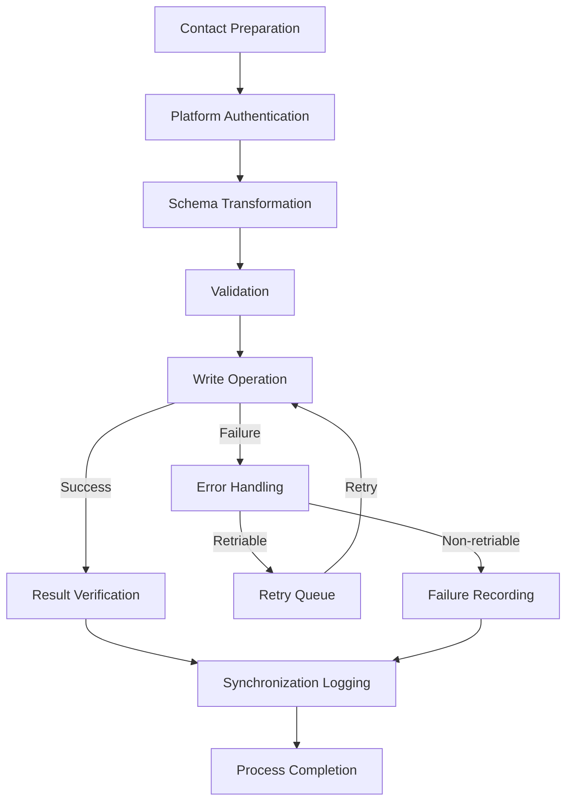

# ContactWriteProcess

## Definition
ContactWriteProcess is an occurrent process that securely propagates unified contact data to target platforms, respecting platform-specific constraints, authorization boundaries, and user synchronization preferences while maintaining data sovereignty and provenance tracking.

## Hierarchy in BFO


## Overview
The ContactWriteProcess is responsible for propagating unified contact data to various digital platforms. It operates as the final stage in the contact data lifecycle, taking the results of merging and conflict resolution processes and writing them back to respective platforms based on user preferences and platform capabilities.

This process transforms the platform-independent unified contact representation into platform-specific formats, respecting each platform's data schema, validation rules, and API constraints. It handles the complexities of authentication, rate limiting, and error recovery while maintaining detailed logs of all write operations.

A key aspect of this process is its respect for user sovereignty, allowing users to control which attributes are synchronized to which platforms. It preserves data provenance by tracking the origin and modification history of contact data across platforms, ensuring transparency and accountability in the synchronization ecosystem.

## Properties

### Input Properties
| Property | Type | Description | Example |
|----------|------|-------------|---------|
| unifiedContact | Contact | The merged and resolved contact record | {"id": "contact123", "name": "John Doe", "emails": ["john@work.com", "johnd@gmail.com"]} |
| targetPlatforms | Platform[] | Platforms to write contact data to | ["Gmail", "LinkedIn", "iCloud"] |
| writePreferences | Preference[] | User preferences for synchronization | {"restrictSensitiveToPersonal": true, "phoneNumbersToAll": true} |
| attributeMapping | Mapping[] | How attributes map to platform schemas | [{"unified": "mobilePhone", "gmail": "phone.mobile"}] |
| synchronizationScope | Scope | What data should be synchronized | {"includePhotos": false, "includeNotes": true} |

### Process Properties
| Property | Type | Description | Example |
|----------|------|-------------|---------|
| writeStatus | Status | Current status of the write process | "InProgress", "Completed", "Failed" |
| platformProgress | Map<Platform, Progress> | Progress by platform | {"Gmail": "Completed", "LinkedIn": "InProgress"} |
| writeAttempts | Integer | Number of write attempts made | 3 |
| errorCounter | Integer | Number of errors encountered | 1 |
| retryQueue | Operation[] | Operations queued for retry | [{"platform": "LinkedIn", "operation": "updateContact"}] |

### Output Properties
| Property | Type | Description | Example |
|----------|------|-------------|---------|
| writeResults | Result[] | Results of write operations by platform | [{"platform": "Gmail", "status": "Success", "contact_id": "gmail123"}] |
| failedWrites | Failure[] | Failed operations with reasons | [{"platform": "LinkedIn", "reason": "API_RATE_LIMIT", "retryAfter": "300s"}] |
| platformContactIds | Map<Platform, ID> | IDs of contacts on each platform | {"Gmail": "contact_123", "LinkedIn": "member_456"} |
| writeMetadata | Metadata | Metadata about the write process | {"timestamp": "2023-11-01T15:45:00Z", "session": "sync12345"} |
| writeSummary | Summary | Summary of write operations | {"total": 3, "success": 2, "failure": 1, "retry": 1} |

## Security

### Access Control
- **Platform Authorization**: Secure management of platform access tokens
- **Write Permission Enforcement**: Respecting platform-specific permissions
- **Attribute-Level Controls**: Filtering sensitive data per platform
- **Authentication Renewal**: Handling token expiration and renewal
- **Write Restriction**: Limiting write operations to authorized users

### Privacy Controls
- **Attribute Filtering**: Controlling which attributes are written where
- **Sensitive Data Protection**: Special handling for sensitive information
- **Platform Boundaries**: Respecting privacy context of each platform
- **Consent Management**: Ensuring user consent for each write operation
- **Data Minimization**: Writing only necessary information to each platform

### Protection Mechanisms
- **Access Token Security**: Secure storage and handling of access tokens
- **Connection Encryption**: Secure communication with platform APIs
- **Write Validation**: Verifying successful and accurate writes
- **Rollback Capability**: Ability to revert failed or incorrect writes
- **Audit Logging**: Detailed logging of all write operations

## Datasources

### Write Destinations
| Platform | API Type | Write Capabilities | Constraints |
|----------|----------|-------------------|------------|
| Gmail | REST | Create, Update, Delete | Rate limits, Google schema |
| LinkedIn | OAuth REST | Update existing only | Limited fields, professional focus |
| iCloud | WebDAV | Full CRUD | Apple ecosystem, requires Apple ID |
| Facebook | GraphQL | Limited updates | Privacy restrictions, friend relationships |
| Microsoft 365 | Microsoft Graph | Full CRUD | Enterprise policies, Microsoft schema |

### Contact Validators
- **Schema Validators**: Ensure conformance to platform schemas
- **Field Formatters**: Format data according to platform requirements
- **Constraint Checkers**: Verify platform-specific constraints
- **Relationship Validators**: Ensure valid contact relationships
- **Data Type Converters**: Convert between unified and platform types

### Write Trackers
- **Operation Logs**: Detailed records of write operations
- **Change Trackers**: Track what changed in each write
- **Error Recorders**: Log write failures and reasons
- **Retry Managers**: Track retried operations
- **Synchronization Journals**: Record complete sync history

## Capabilities

### Write Strategies
- **Full Synchronization**: Complete contact write to platform
- **Incremental Update**: Update only changed attributes
- **Smart Reconciliation**: Intelligently handle conflicts during write
- **Batched Operations**: Optimize writes by batching operations
- **Prioritized Synchronization**: Prioritize critical attributes

### Error Handling
- **Automatic Retry**: Retry failed operations with backoff
- **Error Classification**: Categorize errors by type and severity
- **Alternative Routes**: Try alternative methods when primary fails
- **Graceful Degradation**: Continue with partial success when possible
- **User Notification**: Alert users to persistent write failures

### Platform Integration
- **API Abstraction**: Abstract platform API differences
- **Schema Transformation**: Convert between unified and platform schemas
- **Authentication Management**: Handle platform authentication requirements
- **Rate Limit Awareness**: Respect platform API rate limits
- **Version Compatibility**: Handle platform API version differences

## Process Flow

### Process Stages


### Stage Details
1. **Contact Preparation**
   - Filter attributes based on user preferences
   - Prepare contact for specific platforms
   - Apply platform-specific transformations

2. **Platform Authentication**
   - Verify platform authentication status
   - Refresh tokens if necessary
   - Establish secure API connections

3. **Schema Transformation**
   - Map unified contact to platform schema
   - Format data according to platform requirements
   - Handle platform-specific data types

4. **Validation**
   - Verify contact data meets platform requirements
   - Check for missing required fields
   - Validate format and constraints

5. **Write Operation**
   - Execute create, update, or delete operations
   - Track operation status and responses
   - Handle API-specific requirements

6. **Result Verification**
   - Verify write operation results
   - Compare written data with expected data
   - Check for partial success scenarios

7. **Error Handling**
   - Classify and log errors
   - Determine if errors are retriable
   - Prepare error resolution strategies

8. **Retry Queue**
   - Queue failed operations for retry
   - Apply exponential backoff
   - Track retry attempts and results

9. **Synchronization Logging**
   - Record operation details and results
   - Update synchronization status
   - Maintain provenance information

10. **Process Completion**
    - Finalize synchronization status
    - Generate summary reports
    - Notify dependent processes

### Failure Handling
- **Connection Failures**: Handle network and API availability issues
- **Authentication Failures**: Manage token expiration and permissions
- **Validation Failures**: Address data that doesn't meet platform requirements
- **Rate Limiting**: Handle API rate limit constraints
- **Conflict Handling**: Resolve conflicts during write operations

## Interfaces

### Write Controller Interface
```typescript
interface ContactWriteController {
  writeContact(contact: UnifiedContact, options: WriteOptions): WriteOperation;
  cancelWrite(operationId: string): boolean;
  getWriteStatus(operationId: string): WriteStatus;
  retryWrite(operationId: string, options?: RetryOptions): WriteOperation;
  rollbackWrite(operationId: string): RollbackOperation;
}
```

### Platform Adapter Interface
```typescript
interface PlatformWriteAdapter {
  authenticate(): Promise<AuthResult>;
  translateContact(contact: UnifiedContact): PlatformContact;
  validateContact(contact: PlatformContact): ValidationResult;
  createContact(contact: PlatformContact): Promise<WriteResult>;
  updateContact(contactId: string, contact: PlatformContact): Promise<WriteResult>;
  deleteContact(contactId: string): Promise<WriteResult>;
}
```

### Synchronization Configuration Interface
```typescript
interface SyncConfiguration {
  setPlatformPreferences(platform: Platform, preferences: Preferences): void;
  setAttributeMappings(mappings: AttributeMapping[]): void;
  setWriteRules(rules: WriteRule[]): void;
  configureSynchronizationScope(scope: SyncScope): void;
  saveSyncProfile(profileName: string): boolean;
}
```

## Materializations

### Process Materializations
- **Write Job**: Background task instance of the write process
- **Platform Connection**: Connection to a platform API
- **Schema Transformer**: Component translating schemas
- **Write Validator**: Component validating write operations
- **Retry Manager**: Component managing operation retries

### Result Materializations
- **Write Receipt**: Confirmation of successful write
- **Synchronization Record**: Complete record of sync activity
- **Platform Contact Identity**: Identity of contact on platform
- **Error Report**: Detailed report of write errors
- **Write Metrics**: Performance metrics of write operations

### Integration Materializations
- **Sync Status UI**: Interface showing synchronization status
- **Platform Connector**: Component connecting to platform APIs
- **Credential Manager**: Component managing platform credentials
- **Write Operation Debugger**: Tool for troubleshooting write issues
- **Synchronization Scheduler**: Tool for scheduling write operations

## Automations

### Process Automations
- **Scheduled Synchronization**: Automatic syncing on schedule
- **Change-Triggered Sync**: Sync triggered by contact changes
- **Smart Batching**: Optimizing write operations in batches
- **Adaptive Retry**: Intelligently retrying failed operations
- **Conflict Resolution**: Automatically resolving write conflicts

### Integration Automations
- **Token Refresh**: Automatic refreshing of authentication tokens
- **API Adaptation**: Adjusting to platform API changes
- **Write Optimization**: Minimizing API calls and bandwidth
- **Error Recovery**: Automatic recovery from common errors
- **Cross-Platform Consistency**: Ensuring consistency across platforms

### Monitoring Automations
- **Sync Health Checks**: Monitoring synchronization health
- **Failure Alert**: Alerting on persistent write failures
- **Performance Monitoring**: Tracking write performance metrics
- **Usage Tracking**: Monitoring platform API usage
- **Synchronization Reporting**: Generating sync status reports

## Usage

### Primary Use Cases
- **Cross-Platform Synchronization**: Keeping contacts in sync across platforms
- **Contact Ecosystem Management**: Managing the complete contact ecosystem
- **Platform-Specific Optimization**: Optimizing contacts for each platform
- **Controlled Information Sharing**: Selectively sharing contact attributes
- **Contact Data Sovereignty**: Maintaining control over contact distribution

### Integration Points
- **Follows Conflict Resolution**: Consumes resolved contact data
- **Requires Authentication**: Uses platform authentication
- **Drives Verification**: Initiates verification after write
- **Updates Data Store**: Updates local contact store with results
- **Feeds User Interface**: Provides sync status to user interface

### Query Patterns
```sparql
# Find all failed write operations for a specific platform
SELECT ?operation ?contact ?reason ?timestamp
WHERE {
  ?operation a cs:WriteOperation ;
             cs:targetsPlatform "LinkedIn" ;
             cs:affectsContact ?contact ;
             cs:hasStatus "Failed" ;
             cs:hasFailureReason ?reason ;
             cs:hasTimestamp ?timestamp .
}

# Find all contacts successfully synchronized across multiple platforms
SELECT ?contact ?platformCount
WHERE {
  ?contact a cs:UnifiedContact .
  {
    SELECT ?contact (COUNT(?platform) as ?platformCount)
    WHERE {
      ?writeOp a cs:WriteOperation ;
               cs:affectsContact ?contact ;
               cs:targetsPlatform ?platform ;
               cs:hasStatus "Success" .
    }
    GROUP BY ?contact
  }
  FILTER(?platformCount > 2)
}
```

## History

### Conceptual Origin
- **Initial Concept**: Basic contact synchronization (2010s)
- **Evolution**: Platform-specific adapters and sovereign control (2015-2020)
- **PAF Integration**: Enhanced with sovereignty principles (2022)

### Version History
- **v0.1**: Basic write to common platforms (2022-Q3)
- **v0.2**: Added error handling and retries (2022-Q4)
- **v1.0**: Full platform-specific schema adaptation (2023-Q1)
- **v1.1**: Enhanced with user preference controls (2023-Q2)
- **v1.2**: Added synchronization verification (2023-Q3)

### Future Development
- **Planned v2.0**: Intelligent cross-platform synchronization
- **Planned v2.1**: Predictive conflict prevention during write
- **Planned v2.2**: Adaptive API interaction based on platform behavior
- **Research Area**: Integration with decentralized identity systems
- **Exploration**: Blockchain-based synchronization verification