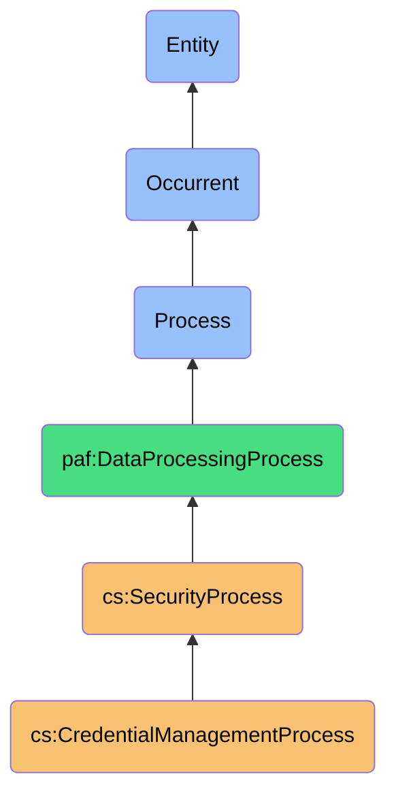
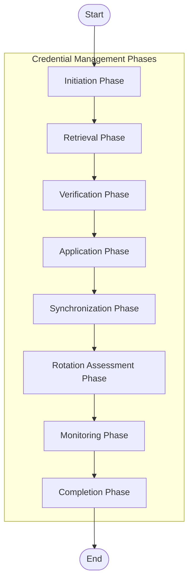

# CredentialManagementProcess

## Overview

### Definition
CredentialManagementProcess is an occurrent process that systematically manages the storage, retrieval, verification, application, and rotation of credentials across multiple digital platforms, while maintaining security integrity and enabling seamless authentication through integration with personal AI systems.

### Example

When a user needs to access a platform requiring authentication, the CredentialManagementProcess initiates through the following systematic workflow:

**1. Process Initiation Phase:**
The system detects an authentication request, either from user instruction (e.g., "Log me into my bank account") or from an application requiring credentials, and identifies the target platform and authentication context.

**2. Credential Retrieval Phase:**
The process accesses the encrypted credential vault, performs necessary decryption operations using appropriate master keys, and retrieves the specific credentials needed for the target platform.

**3. Verification Phase:**
The process verifies the retrieved credentials against security policies, checking expiration status, strength requirements, and usage patterns. It may request additional identity verification from the user based on sensitivity level.

**4. Application Phase:**
The process securely injects credentials into the appropriate authentication endpoints, either through form filling, API authentication, or secure token exchange, ensuring credentials are never exposed in plain text.

**5. Synchronization Phase:**
If multiple devices or instances require credential updates, the process securely synchronizes the credential state across authorized endpoints while maintaining end-to-end encryption.

**6. Rotation Assessment Phase:**
The process evaluates the retrieved credential against rotation policies and usage patterns to determine if credential rotation is recommended or required.

**7. Monitoring Phase:**
Throughout authentication, the process monitors for suspicious activities, unauthorized access attempts, or potential credential compromise indicators.

**8. Completion Phase:**
Upon successful authentication, the process updates usage metadata, logs the authentication event, and transitions control to the authenticated application.

Throughout these phases, the CredentialManagementProcess maintains strict security protocols, zero-knowledge architecture, and integration with biometric verification systems, creating a seamless workflow from authentication request to secure platform access.

```turtle
:credentialManagementProcess a cs:CredentialManagementProcess ;
    cs:processId "cmp-2023-09-15-102843-12345" ;
    cs:initiatedBy :userAuthenticationRequest ;
    cs:executedBy :personalAiSystem ;
    
    # Process Phases
    cs:initiationPhase [
        a cs:InitiationPhase ;
        cs:timestamp "2023-09-15T10:28:43Z"^^xsd:dateTime ;
        cs:platformIdentification true ;
        cs:platform :onlineBankingPlatform ;
        cs:authenticationContext "user-initiated" ;
        cs:requestSource :webBrowser
    ] ;
    
    cs:retrievalPhase [
        a cs:RetrievalPhase ;
        cs:timestamp "2023-09-15T10:28:44Z"^^xsd:dateTime ;
        cs:vaultAccessInitiated true ;
        cs:masterKeyVerification true ;
        cs:decryptionPerformed true ;
        cs:credentialsRetrieved :bankLoginCredentials
    ] ;
    
    cs:verificationPhase [
        a cs:VerificationPhase ;
        cs:timestamp "2023-09-15T10:28:45Z"^^xsd:dateTime ;
        cs:credentialStatus "active" ;
        cs:expirationCheck true ;
        cs:strengthVerification true ;
        cs:userVerificationRequired true ;
        cs:biometricVerificationPerformed true
    ] ;
    
    cs:applicationPhase [
        a cs:ApplicationPhase ;
        cs:timestamp "2023-09-15T10:28:47Z"^^xsd:dateTime ;
        cs:injectionMethod "form-fill" ;
        cs:twoFactorRequired true ;
        cs:twoFactorType "authenticator-app" ;
        cs:twoFactorCodeGenerated true ;
        cs:authenticationSuccessful true
    ] ;
    
    cs:synchronizationPhase [
        a cs:SynchronizationPhase ;
        cs:timestamp "2023-09-15T10:28:48Z"^^xsd:dateTime ;
        cs:deviceSyncRequired false
    ] ;
    
    cs:rotationAssessmentPhase [
        a cs:RotationAssessmentPhase ;
        cs:timestamp "2023-09-15T10:28:49Z"^^xsd:dateTime ;
        cs:credentialAge 72 ;  # in days
        cs:rotationRecommended true ;
        cs:rotationRequested false ;
        cs:reasonForRecommendation "age-based-policy"
    ] ;
    
    cs:monitoringPhase [
        a cs:MonitoringPhase ;
        cs:timestamp "2023-09-15T10:28:50Z"^^xsd:dateTime ;
        cs:loginLocationVerified true ;
        cs:deviceRecognized true ;
        cs:suspiciousActivityDetected false
    ] ;
    
    cs:completionPhase [
        a cs:CompletionPhase ;
        cs:timestamp "2023-09-15T10:28:51Z"^^xsd:dateTime ;
        cs:authenticationComplete true ;
        cs:usageLogged true ;
        cs:sessionHandoff true ;
        cs:processStatus "completed"
    ] ;
    
    # Credential Details
    cs:credentials [
        a cs:StoredCredential ;
        cs:platform :onlineBankingPlatform ;
        cs:username "encrypted-username-value" ;
        cs:passwordLastModified "2023-07-05"^^xsd:date ;
        cs:strengthScore 85 ;
        cs:twoFactorEnabled true ;
        cs:lastUsed "2023-09-10T15:42:21Z"^^xsd:dateTime ;
        cs:accessFrequency "weekly" ;
        cs:securityTier "financial"
    ] ;
    
    # Process Metadata
    cs:processDuration 8 ;  # in seconds
    cs:processStatus "completed" ;
    cs:systemComponents :vaultSystem, :biometricSystem, :securityMonitor .
```

### Comment
The CredentialManagementProcess orchestrates the secure storage, retrieval, and application of authentication credentials across digital platforms. It encompasses the full lifecycle from secure storage and retrieval through application and rotation, handling encryption, biometric verification, two-factor authentication, and cross-device synchronization. This process serves as the authentication facilitator within the personal security management system, ensuring proper access control, credential hygiene, and protection against unauthorized access.

### Hierarchy in BFO


## Properties

### Process Phases
| Phase | Description | Responsibilities |
|-------|-------------|------------------|
| Initiation | Authentication request detection | Identify platform, context, and request source |
| Retrieval | Secure credential access | Access vault, decrypt credentials, retrieve specific platform credentials |
| Verification | Credential validation | Verify status, expiration, strength, and request additional verification if needed |
| Application | Credential usage | Apply credentials to authentication endpoints, handle two-factor authentication |
| Synchronization | Cross-device consistency | Update credential state across authorized endpoints securely |
| Rotation Assessment | Credential health evaluation | Check against rotation policies, recommend updates when needed |
| Monitoring | Security oversight | Watch for suspicious activities or compromise indicators |
| Completion | Process finalization | Log usage, update metadata, handoff to authenticated application |

### Security Aspects
| Security Aspect | Description |
|-----------------|-------------|
| Zero-Knowledge Architecture | System never has access to unencrypted credentials |
| End-to-End Encryption | All credential data encrypted in transit and at rest |
| Biometric Verification | Multi-factor verification for high-security credentials |
| Anomaly Detection | Monitoring of unusual access patterns or suspicious activities |
| Post-Quantum Encryption | Advanced cryptography for future-proof security |
| Secure Sharing | Authenticated sharing mechanisms for team credentials |

### Platform Types
| Platform Type | Authentication Method | Characteristics |
|-----------------|-----------------|-----------------|
| Web Applications | Form-based credentials | Username/password pairs, OAuth, WebAuthn |
| Mobile Applications | API tokens, biometrics | App-specific authentication flows |
| Desktop Applications | Stored credentials, SSO | Local or cloud-synchronized authentication |
| Development Tools | SSH keys, API tokens | Technical credentials for development workflows |
| Financial Services | Multi-factor credentials | High-security with additional verification layers |
| Internal Systems | Corporate credentials, VPN | Enterprise authentication with policy enforcement |

## Input

### Input Properties
| Property | Type | Description | Example |
|----------|------|-------------|---------|
| platformIdentifier | String | Unique identifier for the target platform | `"banking.example.com"` |
| credentialType | String | Type of credential needed | `"login"`, `"api-key"`, `"ssh-key"` |
| authenticationContext | String | Context of authentication request | `"user-initiated"`, `"background-renewal"`, `"app-request"` |
| securityTier | String | Security level of the requested credentials | `"standard"`, `"financial"`, `"critical"` |
| requestSource | String | Application or system requesting authentication | `"web-browser"`, `"mobile-app"`, `"system-process"` |
| userVerificationLevel | String | Level of user verification required | `"none"`, `"biometric"`, `"master-password"` |

### Configuration Properties
| Property | Type | Description | Example |
|----------|------|-------------|---------|
| masterKeyType | String | Type of master key for vault decryption | `"password-derived"`, `"biometric"`, `"hardware-token"` |
| vaultSynchronization | Boolean | Whether vault syncs across devices | `true` |
| autoFillEnabled | Boolean | Whether to automatically fill credentials | `true` |
| rotationPolicy | Object | Policy for credential rotation recommendations | `{"maxAge": 90, "weaknessThreshold": 70}` |
| twoFactorPreference | String | Preferred 2FA method if available | `"authenticator-app"`, `"sms"`, `"push"` |
| offlineAccessEnabled | Boolean | Whether credentials are available offline | `true` |

### Input Capabilities

#### Authentication Capabilities
- Multiple authentication methods (username/password, OAuth, SSO)
- SSH key management
- API token handling
- WebAuthn/FIDO support
- Hardware security key integration

#### Security Capabilities
- Biometric verification
- Master password validation
- Hardware token support
- Offline authentication
- Session management

## Model

### Process Flow


### Terminological Model
```turtle
# Process Class Definition
cs:CredentialManagementProcess a owl:Class ;
    rdfs:label "Credential Management Process"@en ;
    rdfs:subClassOf cs:SecurityProcess, bfo:0000015 ;
    skos:definition "An occurrent process that systematically manages the storage, retrieval, verification, application, and rotation of credentials across multiple digital platforms while maintaining security integrity."@en .

# Phase Classes
cs:InitiationPhase a owl:Class ;
    rdfs:label "Initiation Phase"@en ;
    rdfs:subClassOf cs:CredentialManagementProcess ;
    skos:definition "Initial phase for detecting and identifying authentication requests."@en .

cs:RetrievalPhase a owl:Class ;
    rdfs:label "Retrieval Phase"@en ;
    rdfs:subClassOf cs:CredentialManagementProcess ;
    skos:definition "Phase for securely accessing and decrypting stored credentials."@en .

cs:VerificationPhase a owl:Class ;
    rdfs:label "Verification Phase"@en ;
    rdfs:subClassOf cs:CredentialManagementProcess ;
    skos:definition "Phase for validating credential status and requesting additional verification if needed."@en .

cs:ApplicationPhase a owl:Class ;
    rdfs:label "Application Phase"@en ;
    rdfs:subClassOf cs:CredentialManagementProcess ;
    skos:definition "Phase for applying credentials to authentication endpoints and handling multi-factor authentication."@en .

cs:SynchronizationPhase a owl:Class ;
    rdfs:label "Synchronization Phase"@en ;
    rdfs:subClassOf cs:CredentialManagementProcess ;
    skos:definition "Phase for securely updating credential state across authorized devices."@en .

cs:RotationAssessmentPhase a owl:Class ;
    rdfs:label "Rotation Assessment Phase"@en ;
    rdfs:subClassOf cs:CredentialManagementProcess ;
    skos:definition "Phase for evaluating credential health and rotation requirements."@en .

cs:MonitoringPhase a owl:Class ;
    rdfs:label "Monitoring Phase"@en ;
    rdfs:subClassOf cs:CredentialManagementProcess ;
    skos:definition "Phase for security oversight during authentication."@en .

cs:CompletionPhase a owl:Class ;
    rdfs:label "Completion Phase"@en ;
    rdfs:subClassOf cs:CredentialManagementProcess ;
    skos:definition "Final phase for logging usage and transitioning control to authenticated applications."@en .

# Supporting Classes
cs:StoredCredential a owl:Class ;
    rdfs:label "Stored Credential"@en ;
    rdfs:subClassOf paf:SecurityEntity ;
    skos:definition "A securely stored authentication credential for a specific platform."@en .

cs:VaultSystem a owl:Class ;
    rdfs:label "Vault System"@en ;
    rdfs:subClassOf paf:SecuritySystem ;
    skos:definition "A system for securely storing and managing encrypted credentials."@en .

cs:CredentialUsageEvent a owl:Class ;
    rdfs:label "Credential Usage Event"@en ;
    rdfs:subClassOf paf:Event ;
    skos:definition "An event representing the use of stored credentials for authentication."@en .

# Core Properties
cs:platformIdentifier a owl:DatatypeProperty ;
    rdfs:domain cs:CredentialManagementProcess ;
    rdfs:range xsd:string ;
    rdfs:label "platform identifier"@en .

cs:credentialType a owl:DatatypeProperty ;
    rdfs:domain cs:CredentialManagementProcess ;
    rdfs:range xsd:string ;
    rdfs:label "credential type"@en .

cs:authenticationSuccessful a owl:DatatypeProperty ;
    rdfs:domain cs:ApplicationPhase ;
    rdfs:range xsd:boolean ;
    rdfs:label "authentication successful"@en .

cs:rotationRecommended a owl:DatatypeProperty ;
    rdfs:domain cs:RotationAssessmentPhase ;
    rdfs:range xsd:boolean ;
    rdfs:label "rotation recommended"@en .
```

### Authentication Capabilities
- Cross-platform credential application
- Adaptive form filling
- OAuth flow handling
- API authentication
- Session management
- Multi-factor orchestration

## Output

### Output Properties
| Property | Type | Description | Example |
|----------|------|-------------|---------|
| authenticationStatus | String | Status of authentication attempt | `"successful"`, `"failed"`, `"requires-verification"` |
| sessionToken | String | Token for authenticated session (referenced, never exposed) | `"session-token-ref-12345"` |
| authenticationMethod | String | Method used for successful authentication | `"password+2fa"`, `"sso"`, `"biometric"` |
| rotationRecommendation | Boolean | Whether credential rotation is recommended | `true` |
| suspiciousActivityFlags | Array | Flags for any suspicious patterns detected | `["unusual-location", "odd-timing"]` |
| passwordStrengthScore | Integer | Assessment of password strength (0-100) | `85` |
| authenticationDuration | Integer | Time taken for authentication in milliseconds | `1250` |

### Authentication Events
Events generated as a result of credential management processes:

- **CredentialUsedEvent**: Generated upon successful authentication
- **FailedAuthenticationEvent**: Generated when authentication fails
- **CredentialRotatedEvent**: Generated when credentials are updated
- **SuspiciousActivityEvent**: Generated when unusual patterns are detected
- **CredentialSyncEvent**: Generated when credentials are synchronized across devices

## Materializations

### Process Instance Example
```turtle
:bankAuthenticationProcess a cs:CredentialManagementProcess ;
    cs:processId "auth-12345" ;
    cs:platformIdentifier "bank.example.com" ;
    cs:credentialType "login" ;
    cs:authenticationContext "user-initiated" ;
    cs:securityTier "financial" ;
    cs:requestSource "mobile-banking-app" ;
    cs:userVerificationLevel "biometric" ;
    cs:masterKeyType "biometric" ;
    cs:vaultSynchronization true ;
    cs:autoFillEnabled true ;
    cs:rotationPolicy [
        cs:maxAge 60 ;
        cs:weaknessThreshold 80
    ] ;
    cs:twoFactorPreference "authenticator-app" ;
    cs:offlineAccessEnabled false ;
    cs:authenticationStatus "successful" ;
    cs:sessionToken "session-token-ref-67890" ;
    cs:authenticationMethod "password+2fa" ;
    cs:rotationRecommendation true ;
    cs:passwordStrengthScore 75 ;
    cs:authenticationDuration 2340 .
```

### Event Instance Example
```turtle
:authEvent12345 a cs:CredentialUsedEvent ;
    cs:eventId "auth-event-12345" ;
    cs:timestamp "2023-09-15T10:28:51Z"^^xsd:dateTime ;
    cs:platformId "bank.example.com" ;
    cs:credentialId "cred-67890" ;
    cs:authenticationDetails [
        cs:method "password+2fa" ;
        cs:twoFactorUsed true ;
        cs:twoFactorType "authenticator-app" ;
        cs:deviceId "user-iphone-13" ;
        cs:location "home" ;
        cs:ipAddress "192.168.1.1" ;
        cs:browserAgent "Mobile Banking App 2.3" ;
        cs:successful true
    ] ;
    cs:securityEvaluation [
        cs:riskScore 15 ;
        cs:knownDevice true ;
        cs:knownLocation true ;
        cs:matchesUsualPattern true
    ] ;
    cs:processingStats [
        cs:vaultAccessTime 120 ;
        cs:verificationTime 1450 ;
        cs:applicationTime 650 ;
        cs:totalProcessingTime 2340
    ] .
```

### Process State Materialization
```json
{
  "processId": "auth-12345",
  "type": "CredentialManagementProcess",
  "status": "completed",
  "platform": {
    "identifier": "bank.example.com",
    "type": "financial",
    "lastAccessed": "2023-09-15T10:28:51Z"
  },
  "authentication": {
    "status": "successful",
    "method": "password+2fa",
    "twoFactorUsed": true,
    "twoFactorType": "authenticator-app",
    "duration": 2340
  },
  "security": {
    "verificationLevel": "biometric",
    "verificationStatus": "passed",
    "suspiciousActivity": false,
    "riskScore": 15
  },
  "credential": {
    "id": "cred-67890",
    "type": "login",
    "lastModified": "2023-07-15",
    "strengthScore": 75,
    "rotationRecommended": true,
    "rotationReason": "age-based-policy"
  },
  "device": {
    "id": "user-iphone-13",
    "type": "mobile",
    "recognized": true,
    "syncState": "current"
  }
}
```

## Automations

### Authentication Automations
- Contextual credential selection
- Adaptive form recognition and filling
- Intelligent two-factor code retrieval
- Authentication method switching based on availability
- Smart retry on authentication failure
- Cross-application single sign-on facilitation

### Security Automations
- Automated credential rotation
- Suspicious activity detection and alerting
- Breach monitoring and affected credential identification
- Progressive security elevation for sensitive operations
- Secure credential sharing and revocation
- Password strength assessment and improvement suggestions

### Integration Automations
- Browser extension authentication
- Mobile app deep linking for authentication
- OAuth flow automation
- Secure notes attachment to credentials
- Cross-platform synchronization verification
- Backup verification and recovery testing

## Usage

### Primary Use Cases
- **Web Authentication**: Secure login to websites and web applications
- **Mobile App Authentication**: Secure access to mobile applications
- **Development Access**: Managing SSH keys, API tokens, and development credentials
- **Financial Services Access**: Secure authentication to banking and financial platforms
- **Team Credential Sharing**: Secure distribution of shared credentials
- **Credential Health Management**: Monitoring, rotation, and improvement of authentication security

### Integration Points
- **Browser Extensions**: Enabling form filling and website authentication
- **Mobile Apps**: Providing secure access to stored credentials
- **Password Generation**: Creating strong, unique passwords for new accounts
- **Security Monitoring**: Integrating with breach monitoring and alerting systems
- **Biometric Systems**: Leveraging device biometrics for vault access
- **Enterprise Systems**: Connecting with corporate SSO and identity providers

### Query Patterns
```sparql
# Find all credentials requiring rotation based on age
SELECT ?credential ?platform ?lastModified ?age
WHERE {
  ?credential a cs:StoredCredential ;
              cs:platform ?platform ;
              cs:passwordLastModified ?lastModified .
  BIND(NOW() - ?lastModified AS ?age)
  FILTER(?age > "P90D"^^xsd:duration)
}
ORDER BY DESC(?age)

# Find recent suspicious authentication attempts
SELECT ?event ?platform ?timestamp ?riskReason
WHERE {
  ?event a cs:FailedAuthenticationEvent ;
         cs:timestamp ?timestamp ;
         cs:platformId ?platform ;
         cs:securityEvaluation ?evaluation .
  ?evaluation cs:riskScore ?riskScore ;
             cs:riskReason ?riskReason .
  FILTER(?riskScore > 75 && 
         ?timestamp > "2023-09-01T00:00:00Z"^^xsd:dateTime)
}
ORDER BY DESC(?timestamp)
```

## History
- **Conceptual Origin**: Evolved from basic password managers into comprehensive credential management systems with advanced security, synchronization, and intelligent application
- **Evolution**:
  - v1.0: Basic password storage and retrieval
  - v1.5: Added multi-device synchronization
  - v2.0: Enhanced with biometric verification and two-factor support
  - v2.5: Integrated with breach monitoring and credential health assessments
- **Future Directions**:
  - Passwordless authentication standards (WebAuthn/FIDO)
  - Quantum-resistant encryption
  - Behavioral biometrics for continuous authentication
  - AI-driven security pattern recognition
  - Context-aware authentication policy enforcement 