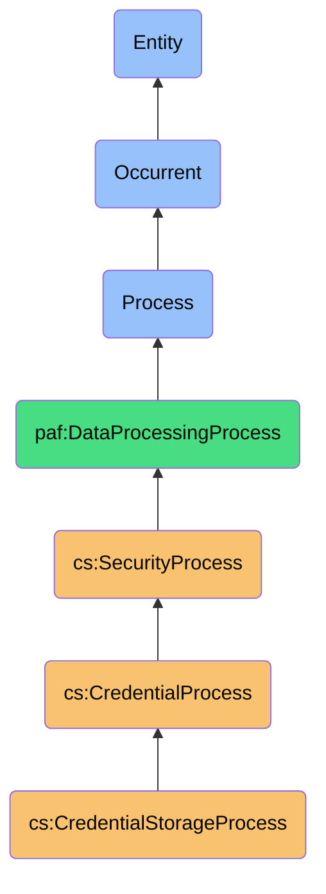
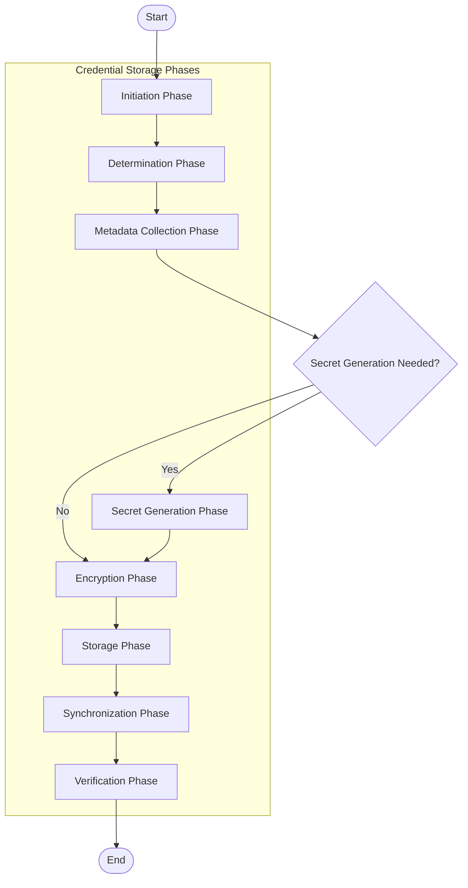

# CredentialStorageProcess

## Overview

### Definition
CredentialStorageProcess is an occurrent process that systematically manages the creation, encryption, categorization, and secure storage of credentials within a personal vault system, ensuring zero-knowledge architecture while providing flexible organization and accessibility across authorized devices.

### Example

When a user needs to store a new credential or update an existing one, the CredentialStorageProcess initiates through the following systematic workflow:

**1. Process Initiation Phase:**
The system detects a credential storage request, either from direct user instruction (e.g., "Save my new Netflix password"), form capture detection ("Would you like to save this password?"), or API integration with another system.

**2. Credential Creation/Update Determination:**
The process determines whether this is a new credential being created or an update to an existing credential, checking the vault for matching domain/username combinations.

**3. Metadata Collection Phase:**
The process collects or generates necessary metadata including platform details, username, categories, security tier, and notes. It may intelligently suggest categories based on the domain or application.

**4. Secret Generation Phase (Optional):**
If requested, the process generates a secure password or other secret based on specified parameters (length, complexity, special character requirements) and platform-specific rules.

**5. Encryption Phase:**
The process securely encrypts the credential using user-specific encryption keys, ensuring that raw credential data is never stored and follows zero-knowledge principles.

**6. Vault Storage Phase:**
The encrypted credential is stored in the appropriate location within the vault structure, maintaining organizational hierarchy and indexed for fast retrieval.

**7. Synchronization Phase:**
If multiple devices or instances are authorized, the process securely synchronizes the updated vault state across endpoints while maintaining end-to-end encryption.

**8. Verification Phase:**
The process verifies successful storage and synchronization, potentially including integrity checks to ensure the credential can be successfully retrieved.

Throughout these phases, the CredentialStorageProcess maintains strict security protocols, never exposing unencrypted credentials in memory longer than necessary, and ensuring proper authorization for all operations.

```turtle
:credentialStorageProcess a cs:CredentialStorageProcess ;
    cs:processId "csp-2023-09-15-102843-12345" ;
    cs:initiatedBy :userStorageRequest ;
    cs:executedBy :personalAiSystem ;
    
    # Process Phases
    cs:initiationPhase [
        a cs:StorageInitiationPhase ;
        cs:timestamp "2023-09-15T10:28:43Z"^^xsd:dateTime ;
        cs:initiationSource "user-command" ;
        cs:storageIntent "new-credential" ;
        cs:requestSource :voiceAssistant
    ] ;
    
    cs:determinationPhase [
        a cs:DeterminationPhase ;
        cs:timestamp "2023-09-15T10:28:44Z"^^xsd:dateTime ;
        cs:isNewCredential true ;
        cs:domainExists false ;
        cs:existingCredentialCount 0
    ] ;
    
    cs:metadataCollectionPhase [
        a cs:MetadataCollectionPhase ;
        cs:timestamp "2023-09-15T10:28:45Z"^^xsd:dateTime ;
        cs:platformIdentified true ;
        cs:platform :streamingServicePlatform ;
        cs:usernameCollected true ;
        cs:categoryAssigned true ;
        cs:suggestedCategories "entertainment", "streaming" ;
        cs:selectedCategory "entertainment" ;
        cs:securityTierAssigned "standard" ;
        cs:notesAdded true
    ] ;
    
    cs:secretGenerationPhase [
        a cs:SecretGenerationPhase ;
        cs:timestamp "2023-09-15T10:28:46Z"^^xsd:dateTime ;
        cs:generationRequested true ;
        cs:passwordLength 20 ;
        cs:requiresSpecialChars true ;
        cs:requiresNumbers true ;
        cs:requiresUppercase true ;
        cs:avoidAmbiguousChars true ;
        cs:pronounceable false ;
        cs:passwordGenerated true ;
        cs:strengthScore 95
    ] ;
    
    cs:encryptionPhase [
        a cs:EncryptionPhase ;
        cs:timestamp "2023-09-15T10:28:47Z"^^xsd:dateTime ;
        cs:masterKeyAccessed true ;
        cs:masterKeySource "biometric-derived" ;
        cs:encryptionAlgorithm "AES-256-GCM" ;
        cs:metadataEncrypted true ;
        cs:secretEncrypted true ;
        cs:memoryProtection true
    ] ;
    
    cs:storagePhase [
        a cs:StoragePhase ;
        cs:timestamp "2023-09-15T10:28:48Z"^^xsd:dateTime ;
        cs:vaultAccessInitiated true ;
        cs:vaultWriteAuthorized true ;
        cs:hierarchyPath "/entertainment/streaming" ;
        cs:indexed true ;
        cs:storageSuccessful true ;
        cs:backupTriggered true
    ] ;
    
    cs:synchronizationPhase [
        a cs:StorageSynchronizationPhase ;
        cs:timestamp "2023-09-15T10:28:49Z"^^xsd:dateTime ;
        cs:syncRequired true ;
        cs:deviceTargets :userLaptop, :userSmartphone, :userTablet ;
        cs:syncMethod "end-to-end-encrypted" ;
        cs:syncInitiated true ;
        cs:syncCompleted true
    ] ;
    
    cs:verificationPhase [
        a cs:StorageVerificationPhase ;
        cs:timestamp "2023-09-15T10:28:50Z"^^xsd:dateTime ;
        cs:integrityVerified true ;
        cs:retrievalTested true ;
        cs:userNotified true ;
        cs:processStatus "completed"
    ] ;
    
    # Credential Details
    cs:newCredential [
        a cs:StoredCredential ;
        cs:platform :streamingServicePlatform ;
        cs:platformName "Netflix" ;
        cs:username "user@example.com" ;
        cs:passwordLastModified "2023-09-15"^^xsd:date ;
        cs:strengthScore 95 ;
        cs:twoFactorAvailable true ;
        cs:twoFactorEnabled false ;
        cs:category "entertainment" ;
        cs:tags "streaming", "subscription" ;
        cs:securityTier "standard" ;
        cs:notes "Family account, premium plan"
    ] ;
    
    # Process Metadata
    cs:processDuration 7 ;  # in seconds
    cs:processStatus "completed" ;
    cs:systemComponents :vaultSystem, :encryptionSystem, :passwordGenerator .
```

### Comment
The CredentialStorageProcess orchestrates the secure creation and storage of authentication credentials within a personal vault. It encompasses the full lifecycle from credential creation through encryption and synchronized storage, handling metadata collection, optional password generation, secure encryption, and cross-device synchronization. This process serves as the credential management foundation within the personal security management system, ensuring proper organization, zero-knowledge security, and accessibility of credentials across authenticated devices and applications.

### Hierarchy in BFO


## Properties

### Process Phases
| Phase | Description | Responsibilities |
|-------|-------------|------------------|
| Initiation | Storage request detection | Identify request source and intent |
| Determination | Credential type determination | Determine if new credential or update to existing |
| Metadata Collection | Credential context gathering | Collect platform details, username, categories, notes |
| Secret Generation | Password/key creation | Generate secure secrets with appropriate parameters |
| Encryption | Secure data protection | Encrypt credential data with appropriate keys |
| Storage | Vault integration | Store encrypted credential in structured vault hierarchy |
| Synchronization | Cross-device consistency | Update credential state across authorized endpoints |
| Verification | Process confirmation | Verify storage integrity and successful operation |

### Security Aspects
| Security Aspect | Description |
|-----------------|-------------|
| Zero-Knowledge Design | Raw credentials never stored or transmitted |
| Memory Protection | Secure memory handling to prevent leakage |
| Encryption Key Handling | Secure derivation and application of encryption keys |
| Vault Integrity | Protection of vault structure and contents |
| Access Control | Authorization enforcement for all operations |
| Audit Logging | Secure logging of credential operations |

### Storage Categories
| Category Type | Examples | Characteristics |
|-----------------|---------|-----------------|
| Authentication Credentials | Website logins, application passwords | Username/password pairs, 2FA settings |
| Financial Credentials | Credit cards, bank accounts | High security tier, masked display |
| Identity Documents | Passports, licenses, SSNs | Sensitive personal information |
| Secure Notes | Private information, PINs, seed phrases | Encrypted text storage |
| Application Secrets | API keys, SSH keys, certificates | Technical credentials for development |
| Shared Credentials | Family accounts, team access | Multiple user access control |

## Input

### Input Properties
| Property | Type | Description | Example |
|----------|------|-------------|---------|
| initiationSource | String | Source of the storage request | `"user-command"`, `"form-capture"`, `"api-request"` |
| storageIntent | String | Type of storage operation | `"new-credential"`, `"credential-update"`, `"auto-save"` |
| platformIdentifier | String | Platform being stored | `"netflix.com"`, `"chase.com"` |
| username | String | Username for the credential | `"user@example.com"` |
| secret | String | Password or secret to store | `"P@s$w0rd123!"` (never logged) |
| category | String | Organizational category | `"entertainment"`, `"financial"`, `"work"` |
| securityTier | String | Security level for storage | `"standard"`, `"financial"`, `"critical"` |
| notes | String | Additional context information | `"Family account, monthly billing"` |

### Configuration Properties
| Property | Type | Description | Example |
|----------|------|-------------|---------|
| passwordGenerationConfig | Object | Configuration for password generation | `{"length": 20, "symbols": true, "digits": true}` |
| encryptionType | String | Type of encryption to use | `"AES-256-GCM"`, `"ChaCha20-Poly1305"` |
| vaultSynchronization | Boolean | Whether to sync across devices | `true` |
| categorization | Object | Category hierarchy and tags | `{"autoCategories": true, "defaultCategory": "uncategorized"}` |
| backupSettings | Object | Configuration for backup creation | `{"autoBackup": true, "backupFrequency": "daily"}` |
| duplicateHandling | String | How to handle duplicate entries | `"prompt"`, `"update"`, `"create-new"` |

### Input Capabilities

#### Password Generation Capabilities
- Configurable password length and composition
- Platform-specific rule compliance (max length, allowed characters)
- Pronounceable password options
- Passphrase generation
- Pattern-based password creation
- Strength analysis and feedback

#### Organization Capabilities
- Hierarchical folder structures
- Tagging and labeling
- Smart categorization based on domain
- Favorites and frequently-used marking
- Custom fields and templates
- Search indexing preparation

## Model

### Process Flow


### Terminological Model
```turtle
# Process Class Definition
cs:CredentialStorageProcess a owl:Class ;
    rdfs:label "Credential Storage Process"@en ;
    rdfs:subClassOf cs:CredentialProcess, bfo:0000015 ;
    skos:definition "An occurrent process that systematically manages the creation, encryption, categorization, and secure storage of credentials within a personal vault system."@en .

# Phase Classes
cs:StorageInitiationPhase a owl:Class ;
    rdfs:label "Storage Initiation Phase"@en ;
    rdfs:subClassOf cs:CredentialStorageProcess ;
    skos:definition "Initial phase for detecting and identifying credential storage requests."@en .

cs:DeterminationPhase a owl:Class ;
    rdfs:label "Determination Phase"@en ;
    rdfs:subClassOf cs:CredentialStorageProcess ;
    skos:definition "Phase for determining whether this is a new credential or update to existing credential."@en .

cs:MetadataCollectionPhase a owl:Class ;
    rdfs:label "Metadata Collection Phase"@en ;
    rdfs:subClassOf cs:CredentialStorageProcess ;
    skos:definition "Phase for collecting credential context information including platform, username, and categories."@en .

cs:SecretGenerationPhase a owl:Class ;
    rdfs:label "Secret Generation Phase"@en ;
    rdfs:subClassOf cs:CredentialStorageProcess ;
    skos:definition "Optional phase for generating secure passwords or other secrets."@en .

cs:EncryptionPhase a owl:Class ;
    rdfs:label "Encryption Phase"@en ;
    rdfs:subClassOf cs:CredentialStorageProcess ;
    skos:definition "Phase for securely encrypting credential data using appropriate encryption keys."@en .

cs:StoragePhase a owl:Class ;
    rdfs:label "Storage Phase"@en ;
    rdfs:subClassOf cs:CredentialStorageProcess ;
    skos:definition "Phase for storing the encrypted credential in the appropriate vault location."@en .

cs:StorageSynchronizationPhase a owl:Class ;
    rdfs:label "Storage Synchronization Phase"@en ;
    rdfs:subClassOf cs:CredentialStorageProcess ;
    skos:definition "Phase for securely synchronizing credential changes across authorized devices."@en .

cs:StorageVerificationPhase a owl:Class ;
    rdfs:label "Storage Verification Phase"@en ;
    rdfs:subClassOf cs:CredentialStorageProcess ;
    skos:definition "Final phase for verifying successful storage and operation completion."@en .

# Supporting Classes
cs:CredentialProcess a owl:Class ;
    rdfs:label "Credential Process"@en ;
    rdfs:subClassOf cs:SecurityProcess ;
    skos:definition "A process that manages credential operations for personal security."@en .

cs:PasswordGenerator a owl:Class ;
    rdfs:label "Password Generator"@en ;
    rdfs:subClassOf paf:SecuritySystem ;
    skos:definition "A system for generating secure passwords based on configurable parameters."@en .

cs:EncryptionSystem a owl:Class ;
    rdfs:label "Encryption System"@en ;
    rdfs:subClassOf paf:SecuritySystem ;
    skos:definition "A system for securely encrypting and decrypting sensitive data."@en .

cs:CredentialStorageEvent a owl:Class ;
    rdfs:label "Credential Storage Event"@en ;
    rdfs:subClassOf paf:Event ;
    skos:definition "An event representing the storage or update of a credential."@en .

# Core Properties
cs:initiationSource a owl:DatatypeProperty ;
    rdfs:domain cs:StorageInitiationPhase ;
    rdfs:range xsd:string ;
    rdfs:label "initiation source"@en .

cs:storageIntent a owl:DatatypeProperty ;
    rdfs:domain cs:StorageInitiationPhase ;
    rdfs:range xsd:string ;
    rdfs:label "storage intent"@en .

cs:isNewCredential a owl:DatatypeProperty ;
    rdfs:domain cs:DeterminationPhase ;
    rdfs:range xsd:boolean ;
    rdfs:label "is new credential"@en .

cs:platformIdentified a owl:DatatypeProperty ;
    rdfs:domain cs:MetadataCollectionPhase ;
    rdfs:range xsd:boolean ;
    rdfs:label "platform identified"@en .

cs:passwordGenerated a owl:DatatypeProperty ;
    rdfs:domain cs:SecretGenerationPhase ;
    rdfs:range xsd:boolean ;
    rdfs:label "password generated"@en .
```

### Storage Capabilities
- Structured vault hierarchies
- Cross-device synchronization
- Conflict resolution for simultaneous updates
- Automatic backup creation
- Attachment handling for credential-related files
- Versioning and history tracking

## Output

### Output Properties
| Property | Type | Description | Example |
|----------|------|-------------|---------|
| storageStatus | String | Status of storage operation | `"successful"`, `"failed"`, `"partial"` |
| credentialId | String | Unique identifier for stored credential | `"cred-12345-abc"` |
| vaultPath | String | Path within vault hierarchy | `"/entertainment/streaming/netflix"` |
| strengthAssessment | Object | Assessment of credential strength | `{"score": 95, "feedback": "excellent strength"}` |
| syncStatus | Object | Status of synchronization | `{"completedDevices": 3, "pendingDevices": 0}` |
| duplicateDetection | Boolean | Whether duplicates were detected | `false` |
| backupStatus | String | Status of triggered backup | `"completed"`, `"scheduled"`, `"failed"` |

### Storage Events
Events generated as a result of credential storage processes:

- **CredentialCreatedEvent**: Generated when a new credential is created
- **CredentialUpdatedEvent**: Generated when an existing credential is modified
- **CredentialSyncEvent**: Generated when credentials are synchronized across devices
- **PasswordGeneratedEvent**: Generated when a new password is created
- **VaultBackupEvent**: Generated when a vault backup is created

## Materializations

### Process Instance Example
```turtle
:netflixCredentialStorage a cs:CredentialStorageProcess ;
    cs:processId "storage-12345" ;
    cs:initiationSource "browser-extension" ;
    cs:storageIntent "new-credential" ;
    cs:platformIdentifier "netflix.com" ;
    cs:username "user@example.com" ;
    cs:category "entertainment" ;
    cs:tags "streaming", "subscription" ;
    cs:securityTier "standard" ;
    cs:notes "Family account" ;
    cs:passwordGenerationConfig [
        cs:length 20 ;
        cs:includeSymbols true ;
        cs:includeNumbers true ;
        cs:includeUppercase true ;
        cs:excludeAmbiguous true
    ] ;
    cs:encryptionType "AES-256-GCM" ;
    cs:vaultSynchronization true ;
    cs:categorization [
        cs:autoCategories true ;
        cs:defaultCategory "uncategorized"
    ] ;
    cs:storageStatus "successful" ;
    cs:credentialId "cred-netflix-54321" ;
    cs:vaultPath "/entertainment/streaming" ;
    cs:strengthAssessment [
        cs:score 95 ;
        cs:feedback "excellent password strength"
    ] ;
    cs:syncStatus [
        cs:completedDevices 3 ;
        cs:pendingDevices 0
    ] ;
    cs:duplicateDetection false ;
    cs:processDuration 890 .  # in milliseconds
```

### Event Instance Example
```turtle
:storageEvent12345 a cs:CredentialCreatedEvent ;
    cs:eventId "storage-event-12345" ;
    cs:timestamp "2023-09-15T10:28:50Z"^^xsd:dateTime ;
    cs:platformId "netflix.com" ;
    cs:credentialId "cred-netflix-54321" ;
    cs:storageDetails [
        cs:method "browser-extension" ;
        cs:generatedPassword true ;
        cs:device "user-macbook-pro" ;
        cs:location "home" ;
        cs:successful true
    ] ;
    cs:organizationDetails [
        cs:category "entertainment" ;
        cs:tags "streaming", "subscription" ;
        cs:autoCategorizationApplied true
    ] ;
    cs:syncDetails [
        cs:syncInitiated true ;
        cs:devicesTargeted 3 ;
        cs:syncCompleted true
    ] ;
    cs:processingStats [
        cs:metadataCollectionTime 120 ;
        cs:passwordGenerationTime 50 ;
        cs:encryptionTime 75 ;
        cs:storageTime 220 ;
        cs:syncTime 425 ;
        cs:totalProcessingTime 890
    ] .
```

### Process State Materialization
```json
{
  "processId": "storage-12345",
  "type": "CredentialStorageProcess",
  "status": "completed",
  "platform": {
    "identifier": "netflix.com",
    "type": "entertainment",
    "category": "streaming"
  },
  "credential": {
    "id": "cred-netflix-54321",
    "type": "login",
    "username": "user@example.com",
    "isNewCredential": true,
    "passwordGenerated": true,
    "strengthScore": 95
  },
  "storage": {
    "status": "successful",
    "vaultPath": "/entertainment/streaming",
    "duplicateDetected": false,
    "backupCreated": true
  },
  "synchronization": {
    "status": "completed",
    "devicesCompleted": 3,
    "devicesPending": 0
  },
  "security": {
    "encryptionType": "AES-256-GCM",
    "masterKeySource": "biometric",
    "memoryProtection": true,
    "secretsRedacted": true
  }
}
```

## Automations

### Storage Automations
- Form field detection and capture
- Domain identification and metadata extraction
- Automatic categorization based on URL patterns
- Duplicate credential detection and resolution
- Secure password generation with site-specific rules
- Auto-save for frequently accessed sites

### Organization Automations
- Smart folder suggestions
- Category inference from domain
- Relationship detection between accounts
- Frequency-based organization
- Usage pattern recognition
- Tag and category standardization

### Security Automations
- Automatic secure memory wiping
- Clipboard protection and clearing
- Secure encryption key derivation
- Breach detection integration
- Inactive account identification
- Security tier assignment based on content

## Usage

### Primary Use Cases
- **Web Form Capture**: Saving credentials during website registration or login
- **Manual Credential Entry**: User-initiated storage of existing credentials
- **Password Generation**: Creating new secure passwords for accounts
- **Credential Organization**: Categorizing and structuring stored credentials
- **Credential Update**: Modifying existing stored credentials
- **Secure Note Storage**: Storing sensitive information beyond login credentials

### Integration Points
- **Browser Extensions**: Capturing and filling web forms
- **Mobile Apps**: Storing app-specific credentials
- **Authentication Systems**: Integrating with system authentication providers
- **Biometric Systems**: Using biometrics for vault access
- **Backup Systems**: Ensuring credential vault preservation
- **Security Monitoring**: Checking for compromised credentials

### Query Patterns
```sparql
# Find all credentials in a specific category
SELECT ?credential ?platform ?username ?lastModified
WHERE {
  ?credential a cs:StoredCredential ;
              cs:platform ?platform ;
              cs:username ?username ;
              cs:passwordLastModified ?lastModified ;
              cs:category "financial" .
}
ORDER BY ?platform

# Find credentials with generated passwords
SELECT ?credential ?platform ?strengthScore
WHERE {
  ?storageEvent a cs:CredentialCreatedEvent ;
                cs:credentialId ?credentialId ;
                cs:storageDetails ?details ;
                cs:platformId ?platform .
  ?details cs:generatedPassword true .
  ?credential cs:credentialId ?credentialId ;
             cs:strengthScore ?strengthScore .
}
ORDER BY DESC(?strengthScore)
```

## History
- **Conceptual Origin**: Evolved from simple text storage of passwords to sophisticated encrypted vaults with rich organization and cross-device capabilities
- **Evolution**:
  - v1.0: Basic encrypted password storage
  - v1.5: Added categories and organization
  - v2.0: Enhanced with password generation and strength assessment
  - v2.5: Integrated with browser extensions and form detection
  - v3.0: Added cross-device synchronization and cloud backup
- **Future Directions**:
  - Passwordless credential storage (passkeys/WebAuthn)
  - AI-driven credential organization
  - Context-aware security tier assignment
  - Quantum-resistant encryption models
  - Behavioral credential usage optimization 