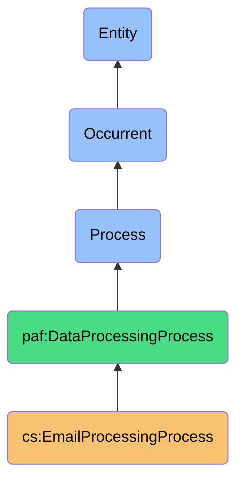
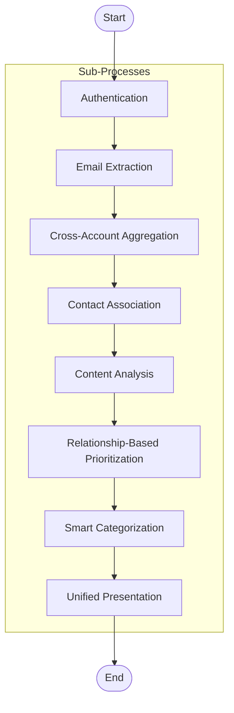

# EmailProcessingProcess

## Definition
EmailProcessingProcess is an occurrent process that systematically aggregates, analyzes, and prioritizes email communications from multiple sources based on contact intelligence, enabling efficient information processing and relationship-driven email management.

## Hierarchy in BFO


## Overview
The EmailProcessingProcess orchestrates the end-to-end management of email communications across multiple accounts and platforms. It encompasses authentication with email providers, extraction of email data, correlation with contact information, intelligent categorization, prioritization based on relationship context, and presentation of a unified view. This process leverages contact intelligence to surface high-value communications while reducing information overload.

## Properties

### Input Properties
| Property | Type | Description | Example |
|----------|------|-------------|---------|
| emailAccounts | EmailAccount[] | Array of email accounts to process | `[{"provider": "gmail", "email": "personal@gmail.com"}, {"provider": "outlook", "email": "work@company.com"}]` |
| scanDepth | Integer | Number of days to look back for emails | `30` |
| contactContext | Boolean | Whether to use contact data for prioritization | `true` |
| processingRules | Rule[] | Custom rules for email categorization | `[{"condition": "from:boss@company.com", "action": "priority:high"}]` |
| excludedLabels | String[] | Email labels/folders to exclude from processing | `["newsletters", "promotions", "social"]` |

### Process Properties
| Property | Type | Description | Example |
|----------|------|-------------|---------|
| batchSize | Integer | Number of emails processed in each batch | `100` |
| prioritizationAlgorithm | String | Algorithm used for ranking emails | `"contact-frequency-recency"` |
| parallelAccounts | Boolean | Whether accounts are processed in parallel | `true` |
| deduplicationEnabled | Boolean | Whether to merge duplicate emails | `true` |
| enrichmentSources | String[] | Additional data sources for enrichment | `["calendar", "task-list", "meeting-history"]` |

### Output Properties
| Property | Type | Description | Example |
|----------|------|-------------|---------|
| processedEmails | Integer | Total number of emails processed | `1250` |
| priorityDistribution | Map<String, Integer> | Count of emails by priority level | `{"high": 42, "medium": 138, "low": 1070}` |
| contactMappings | Map<String, String[]> | Emails grouped by contact | `{"contact-id-123": ["msg-1", "msg-7"]}` |
| categorizedEmails | Map<String, String[]> | Emails grouped by category | `{"work-projects": ["msg-1", "msg-3"]}` |
| processingDuration | Duration | Time taken to complete processing | `PT2M15S` (ISO 8601 duration: 2 min, 15 sec) |

## Security Qualifiers
| Security Aspect | Description |
|-----------------|-------------|
| Authentication | OAuth2 for secure API access to email providers |
| Authorization | User-approved scopes with minimum necessary permissions |
| Data Privacy | Local processing of email content when possible |
| Access Control | Processing occurs only on user-owned devices and accounts |
| Encryption | End-to-end encryption for data in transit and at rest |

## Email Sources
| Source | Description | Characteristics |
|--------|-------------|-----------------|
| Gmail | Google's email service | Label-based, API access, OAuth2 |
| Outlook | Microsoft email platform | Folder-based, Microsoft Graph API |
| iCloud Mail | Apple's email service | Limited API access, app passwords |
| ProtonMail | Encrypted email service | E2E encryption, limited API access |
| IMAP Servers | Generic IMAP protocol | Wide compatibility, basic functionality |

## Capabilities

### Aggregation Capabilities
- Cross-account email unification
- Thread reconstruction across providers
- Smart deduplication of forwarded/copied emails
- Unified search across all sources
- Consistent labeling/folder synchronization

### Analysis Capabilities
- Sender relationship identification
- Communication frequency patterns
- Response time tracking
- Content semantic analysis
- Attachment categorization

### Prioritization Capabilities
- Contact relationship-based ranking
- Context-aware importance scoring
- Time-sensitivity detection
- Conversation thread significance
- User attention pattern learning

## Process Flow


## Sub-Processes

### Authentication Process
1. Securely authenticate with each email provider
2. Validate and refresh access tokens
3. Ensure appropriate permission scopes
4. Handle multi-factor authentication when required
5. Maintain persistent secure connections

### Email Extraction Process
1. Efficiently query email APIs for new messages
2. Retrieve full message content including metadata
3. Extract attachments when necessary
4. Handle pagination and rate limits
5. Track changes since last extraction

### Contact Association Process
1. Extract sender and recipient information
2. Match email addresses to contact records
3. Enrich with relationship context
4. Calculate contact importance score
5. Identify organizational affiliations

### Prioritization Process
1. Apply contact relationship scoring
2. Consider communication frequency patterns
3. Factor in message content relevance
4. Account for temporal urgency signals
5. Incorporate user behavior feedback

## Interfaces

### Configuration Interface
```typescript
interface EmailProcessingConfig {
  // Account settings
  accounts: EmailAccount[];
  authenticationSettings: AuthSettings;
  
  // Processing parameters
  scanDepth: number;  // days
  refreshInterval: number;  // minutes
  batchSize: number;
  
  // Prioritization settings
  prioritizationWeights: {
    contactRelationship: number;   // 0-1
    messageRecency: number;        // 0-1
    conversationActivity: number;  // 0-1
    contentRelevance: number;      // 0-1
    explicitFlags: number;         // 0-1
  };
  
  // Filtering options
  excludedSenders: string[];
  excludedLabels: string[];
  includedLabels: string[];
}
```

### Control Interface
```typescript
interface EmailProcessingControl {
  // Process management
  startProcessing(): Promise<ProcessingSession>;
  pauseProcessing(sessionId: string): Promise<void>;
  resumeProcessing(sessionId: string): Promise<void>;
  cancelProcessing(sessionId: string): Promise<void>;
  
  // Status monitoring
  getProcessingStatus(sessionId: string): Promise<ProcessingStatus>;
  getProcessingStatistics(sessionId: string): Promise<ProcessingStats>;
  
  // Manual controls
  reprocessEmail(emailId: string): Promise<ProcessedEmail>;
  updatePriority(emailId: string, priority: Priority): Promise<void>;
}
```

## Materializations

### Process Materialization
```json
{
  "processId": "ep_12345",
  "type": "EmailProcessingProcess",
  "status": "active",
  "startTime": "2023-04-10T08:30:00Z",
  "accounts": [
    { "id": "acc_gmail", "provider": "gmail", "email": "user@gmail.com", "status": "connected" },
    { "id": "acc_outlook", "provider": "outlook", "email": "user@company.com", "status": "connected" }
  ],
  "progress": {
    "totalEmails": 1423,
    "processed": 876,
    "prioritized": 876,
    "categorized": 845,
    "percentComplete": 61.6
  },
  "processingRate": 128, // emails per minute
  "estimatedCompletion": "2023-04-10T08:41:23Z"
}
```

### Result Materialization
```json
{
  "emailId": "em_89012",
  "sourceAccountId": "acc_gmail",
  "originalId": "<CAE+iOf1MCWSMVzP3=1-i2wLK@mail.gmail.com>",
  "sender": {
    "email": "important.client@company.com",
    "name": "Important Client",
    "contactId": "c_4567"
  },
  "subject": "Project Timeline Update",
  "receivedAt": "2023-04-09T14:23:17Z",
  "priority": {
    "level": "high",
    "score": 0.89,
    "factors": [
      { "type": "contact_relationship", "weight": 0.6, "score": 0.95 },
      { "type": "content_relevance", "weight": 0.3, "score": 0.82 },
      { "type": "temporal_urgency", "weight": 0.1, "score": 0.75 }
    ]
  },
  "categories": ["work", "projects", "client-communications"],
  "conversationId": "conv_5678",
  "unread": true,
  "hasAttachments": true
}
```

## Automations

### Scheduling Automations
- Periodic email processing on defined intervals
- Background refresh during user activity
- Event-triggered processing (new email notifications)
- Idle-time processing optimization
- Smart batching based on volume

### Integration Automations
- Contact system synchronization
- Calendar event correlation
- Task creation from email content
- Document management for attachments
- Chat system notifications for high-priority emails

### Learning Automations
- Priority adjustment based on user engagement
- Contact importance refinement from behavior
- Category effectiveness monitoring
- Time-of-day optimized processing
- Personalized prioritization model adaptation

## Usage Scenarios

### Primary Use Cases
- **Personal Unified Inbox**: Combining multiple personal email accounts with contact-based prioritization
- **Professional Email Management**: Separating critical business communications from noise using contact intelligence
- **Team Collaboration**: Identifying and elevating team-relevant communications across shared contexts
- **Client Relationship Management**: Prioritizing client communications based on relationship importance
- **Research Correspondence**: Organizing research communications by topic and relationship networks

### Integration Points
- **Contact Management Systems**: Leveraging relationship data for prioritization
- **Calendar Systems**: Correlating emails with scheduled events
- **Task Management**: Converting actionable emails to tasks
- **Knowledge Management**: Archiving important communications by topic
- **AI Assistants**: Providing prioritized content for AI processing

### SPARQL Query Patterns
```sparql
# Find all high-priority emails from important contacts
SELECT ?email ?subject ?date ?sender
WHERE {
  ?email a cs:ProcessedEmail ;
         cs:priority cs:HighPriority ;
         cs:sender ?senderEmail ;
         cs:subject ?subject ;
         cs:receivedTimestamp ?date .
  ?contact cs:emailAddress ?senderEmail ;
           cs:importanceScore ?score .
  FILTER(?score > 0.8)
}

# Retrieve emails requiring attention across accounts
SELECT ?email ?subject ?account ?priority
WHERE {
  ?email a cs:ProcessedEmail ;
         cs:subject ?subject ;
         cs:sourceAccount ?account ;
         cs:priority ?priority ;
         cs:readStatus false ;
         cs:receivedTimestamp ?date .
  ?priority cs:priorityScore ?score .
  FILTER(?score > 0.7 && ?date > "2023-04-01T00:00:00Z"^^xsd:dateTime)
}
```

## History
- **Conceptual Origin**: Emerged from the need to manage information overload across fragmented email accounts while prioritizing communications based on relationship context
- **Evolution**: 
  - v1.0: Basic multi-account aggregation
  - v1.5: Added contact-based prioritization
  - v2.0: Integrated machine learning for content relevance
  - v2.5: Enhanced with temporal and contextual awareness
- **Future Directions**:
  - Advanced natural language understanding for nuanced content classification
  - Predictive prioritization based on communication patterns and deadlines
  - Cross-platform communication unification (email, messaging, social) 