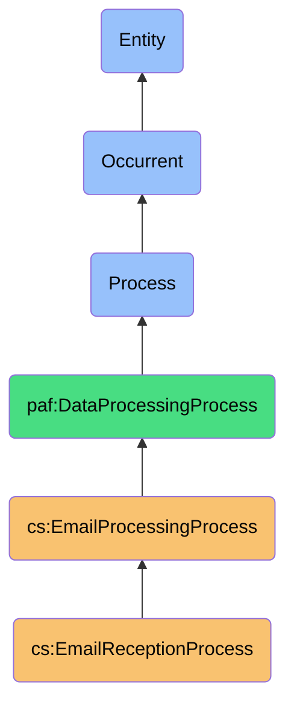
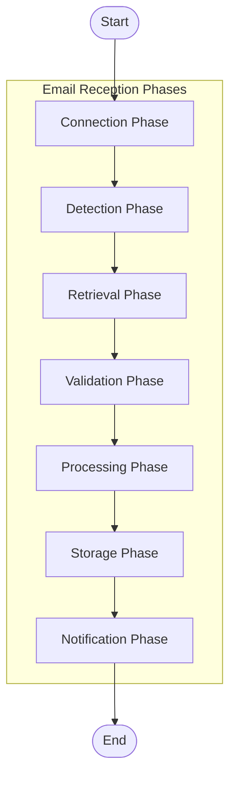

# EmailReceptionProcess

## Definition
EmailReceptionProcess is an occurrent process that systematically monitors, retrieves, validates, and processes incoming email messages from multiple account sources, enabling real-time awareness of new communications while preparing them for subsequent prioritization based on contact intelligence.

## Hierarchy in BFO


## Overview
The EmailReceptionProcess orchestrates the discovery and acquisition of new email messages across configured accounts through either polling mechanisms or push notifications. It handles the transport-level protocols necessary for message retrieval, manages security validations, processes message structures, and prepares incoming emails for downstream operations like prioritization and categorization. This process is the entry point for all external email communications into the personal email management system.

## Properties

### Input Properties
| Property | Type | Description | Example |
|----------|------|-------------|---------|
| emailAccounts | EmailAccount[] | Array of email accounts to monitor | `[{"provider": "gmail", "email": "personal@gmail.com"}, {"provider": "outlook", "email": "work@company.com"}]` |
| pollingInterval | Integer | Seconds between polling checks | `300` (checks every 5 minutes) |
| pushNotificationsEnabled | Boolean | Whether to use push notifications when available | `true` |
| maxHistorySync | Integer | Maximum days to sync on initial connection | `30` |
| filterCriteria | FilterRule[] | Rules for pre-filtering incoming mail | `[{"field": "from", "operator": "contains", "value": "newsletter"}]` |
| retrievalBatchSize | Integer | Number of messages to fetch in a batch | `50` |

### Process Properties
| Property | Type | Description | Example |
|----------|------|-------------|---------|
| connectionTimeout | Integer | Seconds to wait before connection timeout | `30` |
| autoRetryAttempts | Integer | Number of retries for failed retrievals | `3` |
| autoDownloadAttachments | Boolean | Whether to automatically download attachments | `false` |
| validateSPF | Boolean | Whether to validate SPF records | `true` |
| validateDKIM | Boolean | Whether to validate DKIM signatures | `true` |
| validateDARC | Boolean | Whether to validate DARC policies | `true` |
| maxConcurrentConnections | Integer | Maximum simultaneous provider connections | `5` |

### Output Properties
| Property | Type | Description | Example |
|----------|------|-------------|---------|
| messagesReceived | Integer | Total number of new messages received | `57` |
| receivedMessageIds | String[] | IDs of newly received messages | `["msg123", "msg124", "msg125"]` |
| receivedByAccount | Map<String, Integer> | Count of messages by account | `{"personal@gmail.com": 42, "work@company.com": 15}` |
| failedRetrievals | Integer | Count of failed message retrievals | `2` |
| successRate | Float | Percentage of successful retrievals | `96.5` |
| processingLatency | Duration | Time from detection to processing completion | `PT1.45S` (ISO 8601 duration: 1.45 seconds) |

## Security Qualifiers
| Security Aspect | Description |
|-----------------|-------------|
| Transport Security | TLS 1.3 for all connections to email providers |
| Message Authentication | SPF, DKIM, and DMARC validation for incoming messages |
| Phishing Protection | URL and sender analysis for potential phishing attempts |
| Spam Detection | Bayesian and rule-based filtering of suspected spam messages |
| Data Integrity | Message hash verification and content validation |

## Email Reception Sources
| Source Type | Reception Method | Characteristics |
|-------------|------------------|-----------------|
| IMAP Servers | Polling | Wide compatibility, folder synchronization |
| Gmail API | Push Notifications | Real-time updates, efficient, requires OAuth |
| Microsoft Graph | Delta Queries | Efficient polling, change tracking |
| POP3 Servers | Polling | Simple retrieval, limited synchronization |
| Webhook Endpoints | Push Notifications | Instant delivery, requires public endpoint |

## Capabilities

### Monitoring Capabilities
- Real-time push notification integration
- Efficient polling with change tokens
- Health checking and auto-recovery
- Connection management across providers
- Adaptive polling frequency based on activity patterns

### Retrieval Capabilities
- Parallel message fetching
- Incremental header and body retrieval
- Selective attachment downloading
- MIME parsing and structure preservation
- Thread reconstruction from incoming messages

### Validation Capabilities
- Email authentication verification (SPF/DKIM/DMARC)
- Malicious content detection
- Character encoding normalization
- Structure validation and repair
- Digital signature verification

## Process Flow


## Sub-Processes

### Connection Phase
1. Authenticate with email provider
2. Establish secure connection
3. Verify account access privileges
4. Configure session parameters
5. Initialize change tracking tokens

### Detection Phase
1. Poll for changes or listen for push notifications
2. Identify new message IDs
3. Calculate batch retrieval strategy
4. Prioritize urgent messages
5. Schedule retrieval operations

### Retrieval Phase
1. Fetch message headers
2. Retrieve message bodies
3. Download critical attachments
4. Handle pagination and quotas
5. Track retrieval completion status

### Validation Phase
1. Verify message authentication headers
2. Check for spoofing indicators
3. Scan for malicious content
4. Validate message structure
5. Ensure data integrity

### Processing Phase
1. Parse message structure
2. Extract metadata and headers
3. Process MIME parts
4. Handle encodings and charsets
5. Extract plaintext and HTML content

### Storage Phase
1. Index message content
2. Store in local database
3. Organize by conversation/thread
4. Update synchronization state
5. Record message fingerprints

### Notification Phase
1. Determine notification worthiness
2. Generate appropriate alerts
3. Trigger downstream processes
4. Update UI components
5. Log reception events

## Interfaces

### Reception Configuration Interface
```typescript
interface EmailReceptionConfig {
  // Connection settings
  accounts: EmailAccount[];
  pollingInterval: number;  // seconds
  pushNotificationsEnabled: boolean;
  connectionTimeout: number;  // seconds
  
  // Retrieval settings
  maxHistorySync: number;  // days
  retrievalBatchSize: number;
  autoDownloadAttachments: boolean;
  downloadAttachmentTypes: string[];  // mime types
  
  // Security settings
  securityCheckLevel: 'minimal' | 'standard' | 'strict';
  spamFilterStrength: number;  // 0-10
  
  // Advanced settings
  adaptivePollingEnabled: boolean;
  maxConcurrentConnections: number;
  retryPolicy: {
    maxAttempts: number;
    backoffMultiplier: number;
    initialDelayMs: number;
  };
}
```

### Reception Control Interface
```typescript
interface EmailReceptionControl {
  // Manual operations
  forceCheckForNewMail(accountId?: string): Promise<CheckResult>;
  retrieveSpecificMessage(messageId: string, accountId: string): Promise<EmailMessage>;
  cancelPendingRetrievals(): Promise<void>;
  
  // Status operations
  getReceptionStatus(): Promise<ReceptionStatus>;
  getLastSyncTimes(): Promise<{[accountId: string]: Date}>;
  
  // Configuration operations
  updatePollingInterval(newInterval: number): Promise<void>;
  togglePushNotifications(enabled: boolean): Promise<void>;
  setAccountActive(accountId: string, active: boolean): Promise<void>;
}
```

## Materializations

### Reception Process Materialization
```json
{
  "processId": "er_56789",
  "type": "EmailReceptionProcess",
  "status": "active",
  "activeConnections": [
    {
      "accountId": "acc_gmail",
      "connectionType": "push",
      "status": "connected",
      "lastActivity": "2023-04-10T14:23:17Z"
    },
    {
      "accountId": "acc_outlook",
      "connectionType": "poll",
      "status": "connected",
      "lastPoll": "2023-04-10T14:25:00Z",
      "nextPoll": "2023-04-10T14:30:00Z"
    }
  ],
  "statistics": {
    "totalMessagesReceived": 1247,
    "messagesReceivedToday": 89,
    "lastMessageReceived": "2023-04-10T14:23:17Z",
    "currentRetrievalQueue": 3,
    "failedRetrievalsLastHour": 1
  }
}
```

### Message Reception Event Materialization
```json
{
  "eventId": "recv_78901",
  "eventType": "message_received",
  "timestamp": "2023-04-10T14:23:17Z",
  "accountId": "acc_gmail",
  "messageId": "<CAE+iOf1MCWSMVzP3=1-i2wLK@mail.gmail.com>",
  "messageMetadata": {
    "sender": "important.client@company.com",
    "subject": "Project Timeline Update",
    "receivedTimestamp": "2023-04-10T14:23:15Z",
    "size": 28456,
    "hasAttachments": true,
    "isThreadStart": false,
    "threadId": "thread-f:1687934582439631289"
  },
  "securityChecks": {
    "spfResult": "pass",
    "dkimResult": "pass",
    "dmarcResult": "pass",
    "spamProbability": 0.02
  },
  "processingStats": {
    "detectionLatency": 213,  // ms
    "retrievalLatency": 428,  // ms
    "processingLatency": 156,  // ms
    "totalProcessingTime": 797  // ms
  }
}
```

## Automations

### Monitoring Automations
- Adaptive polling frequency based on time of day and user activity
- Health checks with automatic reconnection when providers go offline
- Rate limit management to prevent API quota exhaustion
- Periodic account verification to ensure continued access
- Log rotation and performance monitoring

### Security Automations
- Automatic spam classification and quarantine
- Suspicious sender detection and warning
- Phishing URL identification and neutralization
- Attachment scanning for malicious content
- Authentication failures reporting

### Efficiency Automations
- Selective message part retrieval (headers first, bodies as needed)
- Bandwidth optimization for mobile connections
- Background processing during low usage periods
- Batched operations to reduce API calls
- Incremental synchrochization with change tokens

## Usage Scenarios

### Primary Use Cases
- **Real-time Communication Awareness**: Immediate notification of important incoming messages
- **Multi-Account Management**: Unified reception across personal and work accounts
- **Secure Communication Channel**: Validated and authenticated message reception
- **Mobile-First Reception**: Optimized retrieval for varying network conditions
- **Offline-Capable System**: Queued reception that handles intermittent connectivity

### Integration Points
- **Notification Systems**: Triggering alerts about important new messages
- **Email Processing Pipeline**: Feeding newly received messages into prioritization
- **Security Infrastructure**: Integrating with spam and threat protection
- **Storage Systems**: Persisting received messages in appropriate data stores
- **Analytics Platform**: Providing reception metrics and patterns

### SPARQL Query Patterns
```sparql
# Find all recently received messages with security issues
SELECT ?message ?sender ?securityIssue
WHERE {
  ?event a cs:MessageReceivedEvent ;
         cs:timestamp ?timestamp ;
         cs:messageId ?message ;
         cs:securityChecks ?checks .
  ?message cs:sender ?sender .
  ?checks cs:securityIssue ?securityIssue .
  FILTER(?timestamp > "2023-04-10T00:00:00Z"^^xsd:dateTime && ?securityIssue != "none")
}

# Analyze reception performance by account
SELECT ?account (AVG(?totalTime) as ?avgProcessingTime) (COUNT(?event) as ?messageCount)
WHERE {
  ?event a cs:MessageReceivedEvent ;
         cs:accountId ?account ;
         cs:processingStats ?stats .
  ?stats cs:totalProcessingTime ?totalTime .
  FILTER(?event cs:timestamp > "2023-04-01T00:00:00Z"^^xsd:dateTime)
}
GROUP BY ?account
```

## History
- **Conceptual Origin**: Evolved from legacy POP3/IMAP polling systems into modern multi-protocol, real-time email reception architecture
- **Evolution**:
  - v1.0: Basic IMAP polling for new messages
  - v1.5: Added push notification support for compatible providers
  - v2.0: Enhanced with security validation framework
  - v2.5: Optimized with adaptive and intelligent monitoring
- **Future Directions**:
  - Advanced message importance pre-screening at reception time
  - Encrypted messaging protocol support (PGP, S/MIME)
  - End-to-end encrypted storage pipeline
  - AI-assisted security validation and phishing detection 