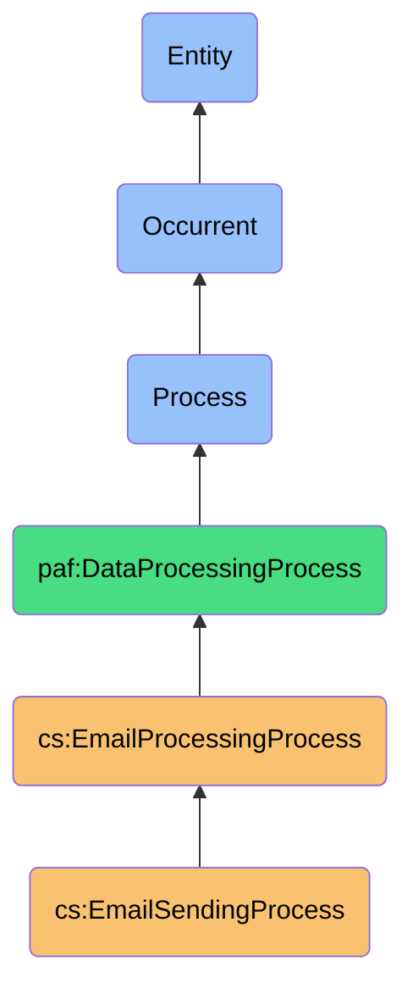
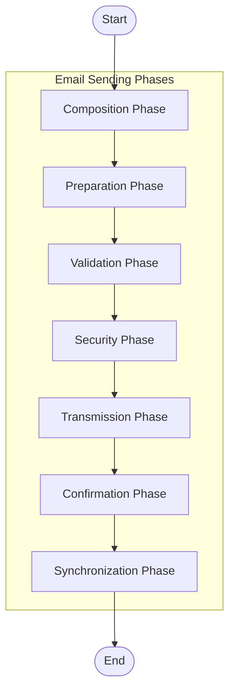

# EmailSendingProcess

## Overview

### Definition
EmailSendingProcess is an occurrent process that systematically manages the composition, preparation, security validation, transmission, and delivery confirmation of outgoing email messages across multiple account sources, while maintaining a coherent relationship context through integration with contact intelligence.

### Example

When a user inputs the natural language instruction "Send a follow-up about our coffee meeting tomorrow and attach the market report PDF from my downloads folder," the EmailSendingProcess initiates through the following systematic workflow:

The AI assistant immediately springs into action. Understanding Alex's relationships and communication patterns, it determines this is a professional message that should come from Alex's personal Gmail account rather than their work address. The assistant identifies "Sarah" as Sarah Johnson, a business contact Alex meets with regularly, and accesses their conversation history to understand the context of tomorrow's coffee meeting.

Behind the scenes, the AI navigates to Alex's downloads folder and locates the most recent market report PDF. It crafts a professionally-toned email with an appropriate subject line: "Follow-up on Tomorrow's Coffee Meeting." The message references their previous discussion points and confirms details about tomorrow's meeting, maintaining Alex's typical communication style with Sarah.

Before sending, the AI applies enhanced security settings and verifies Sarah's identity as the intended recipient. It presents the draft to Alex for review, who approves it with a quick glance. The email is sent immediately, with delivery confirmation logged, and the interaction is recorded to further refine the AI's understanding of Alex's communication patterns with Sarah.

What would have taken Alex several minutes of focused attention was accomplished with a single natural language instruction, with the AI handling the entire workflow from composition to delivery while preserving the human-centered relationship context.

```turtle
:humanAiEmailSending a cs:EmailSendingProcess ;
    cs:processId "ai-assisted-email-12345" ;
    cs:initiatedBy :humanUser ;
    cs:executedBy :personalAiAssistant ;
    cs:userInstruction "Send Sarah a follow-up about our coffee meeting tomorrow and attach the market report PDF from my downloads folder" ;
    cs:emailAccounts :gmailAccount, :workAccount ;
    cs:selectedSenderAccount :gmailAccount ;
    cs:recipient :contact_sarah ;
    cs:messageComposed [
        cs:subject "Follow-up on Tomorrow's Coffee Meeting" ;
        cs:generatedByAI true ;
        cs:reviewedByHuman true ;
        cs:attachments :marketReportPdf ;
        cs:contentContext :previousCoffeeDiscussion, :upcomingMeeting ;
        cs:contextualData [
            cs:relationshipType "professional" ;
            cs:communicationHistory "frequent" ;
            cs:lastInteraction "2023-09-15"^^xsd:date
        ]
    ] ;
    cs:securitySettings :enhancedSecurity ;
    cs:deliveryStatus "sent" ;
    cs:aiAssistance [
        cs:draftGeneration true ;
        cs:attachmentSuggestion true ;
        cs:recipientVerification true ;
        cs:toneSetting "professional" ;
        cs:userModificationsRequired false
    ] .
```

### Comment
The EmailSendingProcess orchestrates the creation and delivery of outbound email communications across configured accounts. It encompasses the full lifecycle from draft composition through final delivery confirmation, handling message structure creation, security signing, attachment processing, contact association, and transport-level protocols. This process serves as the output channel for email communications within the personal email management system, ensuring proper authentication, delivery tracking, and synchronization with sent mail folders.

### Hierarchy in BFO


## Properties

### Process Phases
| Phase | Description | Responsibilities |
|-------|-------------|------------------|
| Composition | Initial message creation | Apply templates, format content, insert dynamic fields, attach signature |
| Preparation | Message structure processing | Process attachments, calculate encoding, create MIME structure, set headers |
| Validation | Content and recipient verification | Verify addresses, check limits, validate content, ensure required fields |
| Security | Protection measures | Apply DKIM signing, encrypt content, sanitize harmful content, set security headers |
| Transmission | Physical sending | Select transport, establish connection, authenticate, transmit data |
| Confirmation | Delivery verification | Verify acceptance, record tracking, update status, handle errors |
| Synchronization | System updates | Update sent items, record history, update contact records, finalize operation |

### Security Aspects
| Security Aspect | Description |
|-----------------|-------------|
| Transport Security | TLS 1.3 for all SMTP connections |
| Message Signing | DKIM signature application for outgoing messages |
| Content Encryption | Optional S/MIME or PGP encryption for sensitive content |
| Data Integrity | Message hash generation and verification |
| Authentication | Proper SMTP authentication with secure credential management |

### Destination Types
| Destination Type | Protocol/Method | Characteristics |
|-----------------|-----------------|-----------------|
| SMTP Servers | Direct SMTP | Universal compatibility, standard protocol |
| Gmail API | REST API | Token-based, quota managed, enhanced features |
| Microsoft Graph | REST API | Modern Microsoft platform integration |
| Exchange Web Services | SOAP API | Legacy Exchange server support |
| Email Service Providers | API Gateways | Bulk sending capabilities, delivery optimization |

## Input

### Input Properties
| Property | Type | Description | Example |
|----------|------|-------------|---------|
| emailAccounts | EmailAccount[] | Array of email accounts available for sending | `[{"provider": "gmail", "email": "personal@gmail.com"}, {"provider": "outlook", "email": "work@company.com"}]` |
| defaultSenderAccount | String | Default account ID for sending emails | `"personal@gmail.com"` |
| outgoingRateLimits | Map<String, Integer> | Per-account rate limits (messages per hour) | `{"personal@gmail.com": 100, "work@company.com": 500}` |
| signatureSettings | SignatureSettings | Email signature configuration | `{"enabled": true, "format": "html", "position": "bottom"}` |
| securitySettings | SecuritySettings | Outbound security options | `{"encryptSensitive": true, "signMessages": true}` |
| deliveryReporting | Boolean | Whether to request delivery receipts | `true` |

### Configuration Properties
| Property | Type | Description | Example |
|----------|------|-------------|---------|
| maxAttachmentSize | Integer | Maximum attachment size in bytes | `25000000` |
| connectTimeout | Integer | Seconds to wait for SMTP connection | `30` |
| sendTimeout | Integer | Seconds to wait for sending completion | `60` |
| retryAttempts | Integer | Number of retries for failed sends | `3` |
| retryInterval | Integer | Seconds between retry attempts | `300` |
| queueStrategy | String | How to handle message queue | `"priority-fifo"` |
| concurrentSends | Integer | Maximum simultaneous sends | `5` |

### Input Capabilities

#### Composition Capabilities
- Message template support
- Rich text/HTML formatting
- Contact field merging
- Smart content suggestions
- Multi-part MIME creation

#### Attachment Capabilities
- File size optimization
- Format conversion when needed
- Preview generation
- Inline image handling
- Secured attachment options

## Model

### Process Flow


### Terminological Model
```turtle
# Process Class Definition
cs:EmailSendingProcess a owl:Class ;
    rdfs:label "Email Sending Process"@en ;
    rdfs:subClassOf cs:EmailProcessingProcess, bfo:0000015 ;
    skos:definition "An occurrent process that systematically manages the composition, preparation, security validation, transmission, and delivery confirmation of outgoing email messages across multiple account sources."@en .

# Phase Classes
cs:CompositionPhase a owl:Class ;
    rdfs:label "Composition Phase"@en ;
    rdfs:subClassOf cs:EmailSendingProcess ;
    skos:definition "Initial phase for creating and formatting message content."@en .

cs:PreparationPhase a owl:Class ;
    rdfs:label "Preparation Phase"@en ;
    rdfs:subClassOf cs:EmailSendingProcess ;
    skos:definition "Phase for processing attachments and preparing message structure."@en .

cs:ValidationPhase a owl:Class ;
    rdfs:label "Validation Phase"@en ;
    rdfs:subClassOf cs:EmailSendingProcess ;
    skos:definition "Phase for validating message content and recipients."@en .

cs:SecurityPhase a owl:Class ;
    rdfs:label "Security Phase"@en ;
    rdfs:subClassOf cs:EmailSendingProcess ;
    skos:definition "Phase for applying security measures to outgoing messages."@en .

cs:TransmissionPhase a owl:Class ;
    rdfs:label "Transmission Phase"@en ;
    rdfs:subClassOf cs:EmailSendingProcess ;
    skos:definition "Phase for transmitting the message to mail servers."@en .

cs:ConfirmationPhase a owl:Class ;
    rdfs:label "Confirmation Phase"@en ;
    rdfs:subClassOf cs:EmailSendingProcess ;
    skos:definition "Phase for confirming message delivery status."@en .

cs:SynchronizationPhase a owl:Class ;
    rdfs:label "Synchronization Phase"@en ;
    rdfs:subClassOf cs:EmailSendingProcess ;
    skos:definition "Final phase for syncing sent messages with providers and updating related data."@en .

# Supporting Classes
cs:SignatureSettings a owl:Class ;
    rdfs:label "Signature Settings"@en ;
    rdfs:subClassOf paf:ConfigurationSettings ;
    skos:definition "Configuration for email signatures."@en .

cs:SecuritySettings a owl:Class ;
    rdfs:label "Security Settings"@en ;
    rdfs:subClassOf paf:ConfigurationSettings ;
    skos:definition "Security configuration for outgoing emails."@en .

cs:MessageSentEvent a owl:Class ;
    rdfs:label "Message Sent Event"@en ;
    rdfs:subClassOf paf:Event ;
    skos:definition "An event representing the sending of an email message."@en .

# Core Properties
cs:emailAccounts a owl:ObjectProperty ;
    rdfs:domain cs:EmailSendingProcess ;
    rdfs:range cs:EmailAccount ;
    rdfs:label "email accounts"@en .

cs:defaultSenderAccount a owl:DatatypeProperty ;
    rdfs:domain cs:EmailSendingProcess ;
    rdfs:range xsd:string ;
    rdfs:label "default sender account"@en .

cs:maxAttachmentSize a owl:DatatypeProperty ;
    rdfs:domain cs:EmailSendingProcess ;
    rdfs:range xsd:integer ;
    rdfs:label "maximum attachment size"@en .

cs:messagesSent a owl:DatatypeProperty ;
    rdfs:domain cs:EmailSendingProcess ;
    rdfs:range xsd:integer ;
    rdfs:label "messages sent"@en .
```

### Delivery Capabilities
- Multiple account routing
- Smart transport selection
- Delivery confirmation
- Bounce handling
- Send scheduling

## Output

### Output Properties
| Property | Type | Description | Example |
|----------|------|-------------|---------|
| messagesSent | Integer | Total number of messages sent | `12` |
| sentMessageIds | String[] | IDs of successfully sent messages | `["msg456", "msg457", "msg458"]` |
| failedMessageIds | String[] | IDs of messages that failed to send | `["msg459"]` |
| sentByAccount | Map<String, Integer> | Count of messages by sending account | `{"personal@gmail.com": 8, "work@company.com": 4}` |
| deliveryConfirmations | Integer | Number of confirmed deliveries | `10` |
| avgDeliveryTime | Duration | Average time from send to delivery | `PT2M15S` (ISO 8601 duration: 2 min, 15 sec) |

### Message Events
Events generated as a result of email sending processes:

- **MessageSentEvent**: Generated upon successful transmission of a message
- **MessageDeliveredEvent**: Generated when delivery confirmation is received
- **MessageFailedEvent**: Generated when sending fails
- **MessageBounceEvent**: Generated when a message is bounced back by recipient server

## Materializations

### Process Instance Example
```turtle
:personalEmailSender a cs:EmailSendingProcess ;
    cs:emailAccounts :gmailAccount, :outlookAccount ;
    cs:defaultSenderAccount "personal@gmail.com" ;
    cs:outgoingRateLimits [
        cs:account "personal@gmail.com" ;
        cs:limit 100
    ], [
        cs:account "work@company.com" ;
        cs:limit 500
    ] ;
    cs:signatureSettings :personalSignature ;
    cs:securitySettings :enhancedSecurity ;
    cs:deliveryReporting true ;
    cs:maxAttachmentSize 25000000 ;
    cs:connectTimeout 30 ;
    cs:sendTimeout 60 ;
    cs:retryAttempts 3 ;
    cs:retryInterval 300 ;
    cs:queueStrategy "priority-fifo" ;
    cs:concurrentSends 5 .

# Example Settings
:personalSignature a cs:SignatureSettings ;
    cs:enabled true ;
    cs:format "html" ;
    cs:position "bottom" ;
    cs:content "<div>Best regards,<br>John Doe</div>" .

:enhancedSecurity a cs:SecuritySettings ;
    cs:signMessages true ;
    cs:encryptSensitive true ;
    cs:securityLevel "enhanced" .
```

### Event Instance Example
```turtle
:sentMessageEvent123 a cs:MessageSentEvent ;
    cs:eventId "send_12345" ;
    cs:timestamp "2023-04-10T14:35:22Z"^^xsd:dateTime ;
    cs:accountId "acc_gmail" ;
    cs:messageId "<CAE+iOf1MFGLMVzP3=1-i2wLK@mail.gmail.com>" ;
    cs:messageDetails [
        cs:sender "user@gmail.com" ;
        cs:recipients "client@company.com", "colleague@company.com" ;
        cs:subject "Project Proposal - April 2023" ;
        cs:sentTimestamp "2023-04-10T14:35:20Z"^^xsd:dateTime ;
        cs:size 256789 ;
        cs:hasAttachments true ;
        cs:threadId "thread-f:1687934582439631289"
    ] ;
    cs:securityMeasures [
        cs:dkimSigned true ;
        cs:encrypted false ;
        cs:spfAligned true
    ] ;
    cs:deliveryStatus [
        cs:status "delivered" ;
        cs:deliveredTimestamp "2023-04-10T14:35:25Z"^^xsd:dateTime ;
        cs:serverResponse "250 2.0.0 OK  1618069722"
    ] ;
    cs:processingStats [
        cs:queueTime 125 ;
        cs:preparationTime 187 ;
        cs:transmissionTime 2143 ;
        cs:totalProcessingTime 2455
    ] .
```

### Process State Materialization
```json
{
  "processId": "es_34567",
  "type": "EmailSendingProcess",
  "status": "active",
  "activeTransports": [
    {
      "accountId": "acc_gmail",
      "transportType": "gmail-api",
      "status": "connected",
      "lastActivity": "2023-04-10T14:35:22Z",
      "quotaRemaining": 97
    },
    {
      "accountId": "acc_outlook",
      "transportType": "smtp",
      "status": "connected",
      "lastActivity": "2023-04-10T14:30:45Z"
    }
  ],
  "queueStatus": {
    "pendingMessages": 3,
    "processingMessages": 1,
    "failedMessages": 0,
    "nextScheduledSend": "2023-04-10T15:00:00Z"
  },
  "statistics": {
    "totalMessagesSent": 248,
    "messagesSentToday": 27,
    "lastMessageSent": "2023-04-10T14:35:22Z",
    "deliverySuccessRate": 99.2
  }
}
```

### Message Event Materialization
```json
{
  "eventId": "send_12345",
  "eventType": "message_sent",
  "timestamp": "2023-04-10T14:35:22Z",
  "accountId": "acc_gmail",
  "messageId": "<CAE+iOf1MFGLMVzP3=1-i2wLK@mail.gmail.com>",
  "messageDetails": {
    "sender": "user@gmail.com",
    "recipients": ["client@company.com", "colleague@company.com"],
    "subject": "Project Proposal - April 2023",
    "sentTimestamp": "2023-04-10T14:35:20Z",
    "size": 256789,
    "hasAttachments": true,
    "threadId": "thread-f:1687934582439631289"
  },
  "securityMeasures": {
    "dkimSigned": true,
    "encrypted": false,
    "spfAligned": true
  },
  "deliveryStatus": {
    "status": "delivered",
    "deliveredTimestamp": "2023-04-10T14:35:25Z",
    "serverResponse": "250 2.0.0 OK  1618069722"
  },
  "processingStats": {
    "queueTime": 125,
    "preparationTime": 187,
    "transmissionTime": 2143,
    "totalProcessingTime": 2455
  }
}
```

## Automations

### Sending Automations
- Smart account selection based on context
- Scheduled sends with timezone awareness
- Optimal sending time calculation
- Attachment optimization for size/format
- Batch processing for multiple recipients

### Delivery Automations
- Automatic retry on transient failures
- Bounce management and address correction
- SMTP fallback when APIs are unavailable
- Rate limit compliance across providers
- Queue management during connectivity issues

### Contact Integration Automations
- Signature selection based on recipient relationship
- Contact record updates on successful sends
- Communication frequency tracking
- Relationship strength reinforcement
- Follow-up scheduling based on importance

## Usage

### Primary Use Cases
- **Individual Communication**: Direct person-to-person email sending
- **Group Communication**: Messages to multiple recipients with appropriate personalization
- **Response Management**: Replying to incoming messages with appropriate context
- **Scheduled Communication**: Timing message delivery for optimal impact
- **Multi-Account Management**: Sending from the most appropriate account based on context

### Integration Points
- **Contact Management Systems**: Leveraging relationship data for sender selection
- **Template Systems**: Using standardized templates for consistent messaging
- **Calendar Systems**: Coordinating emails with scheduled events
- **Task Management**: Sending task-related communications
- **Document Management**: Distributing documents via properly formatted attachments

### Query Patterns
```sparql
# Find all emails sent to a specific domain with delivery issues
SELECT ?message ?subject ?deliveryIssue
WHERE {
  ?event a cs:MessageSentEvent ;
         cs:timestamp ?timestamp ;
         cs:messageId ?message ;
         cs:deliveryStatus ?status .
  ?message cs:recipients ?recipient ;
           cs:subject ?subject .
  ?status cs:status ?deliveryStatus ;
          cs:issue ?deliveryIssue .
  FILTER(?deliveryStatus != "delivered" && 
         CONTAINS(STR(?recipient), "@important-client.com") && 
         ?timestamp > "2023-04-01T00:00:00Z"^^xsd:dateTime)
}

# Track sent message volumes by recipient relationship
SELECT ?relationshipType (COUNT(?message) as ?messageCount) (AVG(?size) as ?avgSize)
WHERE {
  ?message a cs:SentMessage ;
           cs:recipients ?recipient ;
           cs:size ?size .
  ?contact cs:emailAddress ?recipient ;
           cs:relationshipType ?relationshipType .
  FILTER(?message cs:sentTimestamp > "2023-04-01T00:00:00Z"^^xsd:dateTime)
}
GROUP BY ?relationshipType
```

## History
- **Conceptual Origin**: Evolved from basic SMTP client interfaces into a comprehensive sending process with multi-account support, security features, and contact integration
- **Evolution**:
  - v1.0: Basic SMTP sending capability
  - v1.5: Added multi-account support
  - v2.0: Enhanced with security signing and encryption
  - v2.5: Integrated with contact relationships and scheduling
- **Future Directions**:
  - Advanced AI-assisted composition
  - Predictive response generation
  - Context-aware content optimization
  - Multi-channel unified communications
  - Enhanced delivery analytics and path optimization 