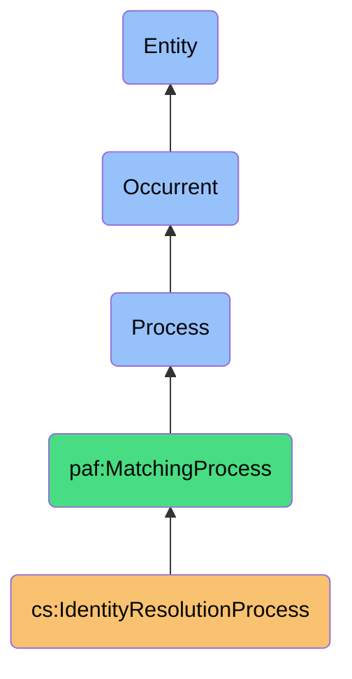
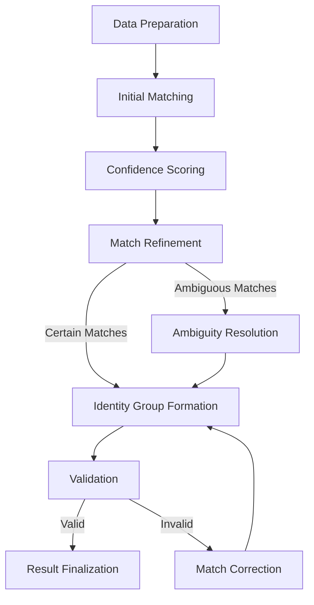

# IdentityResolutionProcess

## Definition
IdentityResolutionProcess is an occurrent process that systematically analyzes contact records across multiple digital platforms to determine which records represent the same real-world entity, using probabilistic and deterministic matching algorithms while maintaining privacy and security of personal data.

## Hierarchy in BFO


## Overview
The IdentityResolutionProcess is a foundational process in the contact synchronization ecosystem that determines which contact records from disparate digital platforms refer to the same real-world entity. It operates across platform boundaries to establish identity equivalence, enabling subsequent processes to create unified contact representations.

This process employs sophisticated matching techniques—both deterministic (exact matching of key identifiers) and probabilistic (confidence-based matching using multiple attributes)—to determine identity equivalence while accounting for data variations, incomplete information, and platform-specific idiosyncrasies. It considers various attributes including names, email addresses, phone numbers, social relationships, and interaction patterns to build confidence in identity matches.

By accurately identifying equivalent contact records, this process enables the creation of a coherent cross-platform contact graph that preserves the user's social network structure while respecting platform boundaries. It forms the foundation for data sovereignty by allowing users to reclaim a unified view of their fragmented contact ecosystem.

## Properties

### Input Properties
| Property | Type | Description | Example |
|----------|------|-------------|---------|
| contactSets | PlatformContacts[] | Sets of contacts from different platforms | [{"platform": "LinkedIn", "contacts": [...]}, {"platform": "Gmail", "contacts": [...]}] |
| matchingRules | Rule[] | Rules defining match criteria | ["exactEmailMatch", "fuzzyNameMatch", "phoneNumberNormalized"] |
| matchThreshold | Decimal | Confidence threshold for matches | 0.85 |
| exclusionPatterns | Pattern[] | Patterns to exclude from matching | ["noreply@*", "info@*", "support@*"] |
| priorityContacts | Contact[] | Contacts with priority for matching | ["user@example.com", "important@client.org"] |

### Process Properties
| Property | Type | Description | Example |
|----------|------|-------------|---------|
| resolutionStatus | Status | Current status of resolution | "InProgress", "Completed", "Failed" |
| matchCounters | Map<Rule, Count> | Match counts by rule type | {"exactEmailMatch": 143, "fuzzyNameMatch": 37} |
| confidenceDistribution | Distribution | Distribution of match confidences | {"0.9-1.0": 87, "0.8-0.9": 45, "0.7-0.8": 23} |
| ambiguousMatches | Match[] | Matches requiring further analysis | [{"contact1": "linkedin123", "contact2": "gmail456", "reason": "SimilarName"}] |
| processingStage | Stage | Current stage of processing | "InitialMatching", "RefinementPhase", "FinalResolution" |

### Output Properties
| Property | Type | Description | Example |
|----------|------|-------------|---------|
| identityGroups | Group[] | Groups of contacts representing same entity | [{"id": "group123", "contacts": ["linkedin123", "gmail456", "icloud789"]}] |
| matchConfidence | Map<Group, Confidence> | Confidence score for each match group | {"group123": 0.95, "group456": 0.83} |
| unmatchedContacts | Contact[] | Contacts with no matches | ["facebook123", "outlook456"] |
| ambiguityResolutions | Resolution[] | How ambiguities were resolved | [{"contacts": ["linkedin123", "gmail456"], "resolution": "Matched", "reason": "SharedPhoneAndEmail"}] |
| resolutionMetadata | Metadata | Metadata about the resolution process | {"timestamp": "2023-11-01T15:45:00Z", "rulesVersion": "1.2"} |

## Security

### Access Control
- **Owner Boundary**: Resolution only occurs within owner's data boundary
- **Platform Isolation**: No cross-user data access during matching
- **Result Privacy**: Match results private to the data owner
- **Algorithm Protection**: Matching algorithms secure from tampering
- **Audit Control**: Authorized access to match audit trails

### Privacy Controls
- **Attribute Sensitivity**: Recognition of sensitive identifiers
- **Minimized Processing**: Using minimal data needed for matching
- **Matching Boundaries**: Respecting platform privacy boundaries
- **Identity Safeguards**: Protecting against unintended identity exposure
- **Match Consent**: User consent for identity resolution process

### Protection Mechanisms
- **Data Isolation**: Matching in secure processing environment
- **Algorithm Security**: Protection of matching algorithms
- **Confidence Thresholds**: Preventing low-confidence matches
- **Risk Assessment**: Evaluation of matching privacy risks
- **Revocation Support**: Ability to revoke incorrect matches

## Datasources

### Primary Identifiers
| Identifier | Uniqueness | Stability | Privacy Sensitivity |
|------------|------------|-----------|-------------------|
| Email Address | High | Medium-High | Medium |
| Phone Number | Medium-High | Medium | High |
| Social IDs | High within platform | High | Medium |
| Full Name | Low | High | Low |
| Handle/Username | Medium | Medium | Low-Medium |

### Supporting Attributes
- **Demographic Data**: Age, location, occupation
- **Relationship Graphs**: Mutual connections
- **Interaction History**: Communication patterns
- **Temporal Markers**: First connection date, last interaction
- **Context Indicators**: Groups, organizations, events

### Data Quality Factors
- **Completeness**: How complete the contact record is
- **Freshness**: How recently the data was updated
- **Consistency**: Internal consistency of the record
- **Accuracy**: Historical accuracy of the source
- **Format Standardization**: Adherence to standard formats

## Capabilities

### Matching Approaches
- **Deterministic Matching**: Exact matching on unique identifiers
- **Probabilistic Matching**: Statistical matching using multiple attributes
- **Fuzzy Matching**: Approximate matching allowing for variations
- **Social Graph Matching**: Using relationship networks to confirm identity
- **Temporal Pattern Matching**: Using interaction patterns over time

### Resolution Strategies
- **Hierarchical Resolution**: Starting with high-confidence matches
- **Iterative Resolution**: Refining matches through multiple passes
- **Feedback-Based Resolution**: Using feedback to improve matching
- **Confidence-Weighted Resolution**: Weighting matches by confidence
- **Context-Aware Resolution**: Using context to resolve ambiguities

### Ambiguity Handling
- **Confidence Thresholds**: Setting minimum confidence for matches
- **Multiple Match Management**: Handling one-to-many scenarios
- **Conflict Resolution**: Resolving conflicting match evidence
- **User-Guided Resolution**: Involving users in ambiguous cases
- **Learning-Based Improvement**: Improving from resolution history

## Process Flow

### Process Stages


### Stage Details
1. **Data Preparation**
   - Normalize contact attributes
   - Filter out excluded contacts
   - Prioritize important contacts
   - Index contacts for efficient matching

2. **Initial Matching**
   - Apply deterministic matching rules
   - Identify exact matches on key identifiers
   - Create preliminary match candidates
   - Track match evidence

3. **Confidence Scoring**
   - Calculate match confidence scores
   - Apply probabilistic matching algorithms
   - Weight evidence by attribute reliability
   - Generate confidence distribution

4. **Match Refinement**
   - Apply fuzzy matching for near-matches
   - Use social graph to confirm identities
   - Consider interaction patterns
   - Refine confidence scores

5. **Ambiguity Resolution**
   - Identify ambiguous matches
   - Apply resolution strategies
   - Request user input if needed
   - Document resolution decisions

6. **Identity Group Formation**
   - Create groups of matched contacts
   - Assign group identifiers
   - Record match evidence
   - Track confidence by group

7. **Validation**
   - Verify logical consistency of matches
   - Check for impossible scenarios
   - Validate against known constraints
   - Identify potential errors

8. **Result Finalization**
   - Finalize identity groups
   - Generate match metadata
   - Prepare for contact merging
   - Record unmatched contacts

### Decision Flow
- **Certainty Determination**: Evaluating match confidence
- **Ambiguity Detection**: Identifying unclear matches
- **Escalation Criteria**: When to involve user decision
- **Resolution Documentation**: Recording how decisions were made
- **Validation Requirements**: Ensuring match integrity

## Interfaces

### Resolution Controller Interface
```typescript
interface IdentityResolutionController {
  startResolution(contactSets: PlatformContacts[], options: ResolutionOptions): ProcessId;
  pauseResolution(processId: string): boolean;
  resumeResolution(processId: string): boolean;
  cancelResolution(processId: string): boolean;
  getResolutionStatus(processId: string): ResolutionStatus;
}
```

### Matching Configuration Interface
```typescript
interface MatchingConfiguration {
  setMatchingRules(rules: MatchingRule[]): void;
  setConfidenceThresholds(thresholds: ConfidenceThresholds): void;
  setExclusionPatterns(patterns: ExclusionPattern[]): void;
  configurePriority(prioritySettings: PrioritySettings): void;
  saveConfiguration(configName: string): boolean;
}
```

### Ambiguity Resolution Interface
```typescript
interface AmbiguityResolver {
  getAmbiguousMatches(filters: AmbiguityFilters): AmbiguousMatch[];
  suggestResolution(match: AmbiguousMatch): SuggestedResolution;
  resolveAmbiguity(match: AmbiguousMatch, resolution: Resolution): boolean;
  getResolutionHistory(contact: Contact): ResolutionHistory[];
  applyBulkResolution(matches: AmbiguousMatch[], strategy: ResolutionStrategy): ResolutionResults;
}
```

## Materializations

### Process Materializations
- **Resolution Job**: Background task instance of resolution
- **Matching Engine**: Component applying matching algorithms
- **Confidence Calculator**: Component calculating match confidence
- **Identity Grouper**: Component forming identity groups
- **Ambiguity Handler**: Component resolving ambiguities

### Result Materializations
- **Identity Graph**: Network of identity relationships
- **Match Evidence**: Documentation of match evidence
- **Confidence Map**: Visualization of match confidence
- **Resolution History**: Record of resolution decisions
- **Unmatched Contacts**: List of contacts without matches

### Integration Materializations
- **Match Visualization**: Interface for exploring matches
- **Resolution Assistant**: Tool for resolving ambiguities
- **Contact Graph Explorer**: Tool for exploring contact relationships
- **Match Rule Editor**: Interface for configuring match rules
- **Resolution Dashboard**: Overview of resolution status

## Automations

### Process Automations
- **Batch Resolution**: Automatic processing of contact batches
- **Incremental Resolution**: Processing only new or changed contacts
- **Rule Optimization**: Tuning rules based on results
- **Priority-Based Processing**: Prioritizing important contacts
- **Schedule-Based Resolution**: Running resolution on schedule

### Learning Automations
- **Match Pattern Learning**: Learning from successful matches
- **Resolution Improvement**: Improving from resolution history
- **Confidence Calibration**: Adjusting confidence calculations
- **Rule Effectiveness Analysis**: Evaluating rule performance
- **Error Pattern Detection**: Identifying common error patterns

### Integration Automations
- **Merge Triggering**: Initiating merge after successful resolution
- **User Notification**: Alerting users to ambiguous matches
- **Resolution Reporting**: Generating resolution reports
- **Quality Monitoring**: Tracking resolution quality metrics
- **Feedback Collection**: Gathering feedback on match quality

## Usage

### Primary Use Cases
- **Cross-Platform Contact Unification**: Identifying same contacts across platforms
- **Contact Ecosystem Mapping**: Building a map of the contact ecosystem
- **Identity Disambiguation**: Distinguishing between similar contacts
- **Relationship Graph Construction**: Building a unified relationship graph
- **Data Sovereignty Support**: Enabling users to reclaim fragmented identity data

### Integration Points
- **Precedes Contact Merging**: Provides identity groups for merging
- **Works with Conflict Resolution**: Identifies potential conflicts
- **Feeds Verification**: Supplies identity mappings for verification
- **Uses Authentication**: Requires platform authentication
- **Informs User Interface**: Provides match information to users

### Query Patterns
```sparql
# Find all contacts identified across multiple platforms
SELECT ?contactGroup ?platform ?platformContactId 
WHERE {
  ?contactGroup a cs:IdentityGroup ;
                cs:includesContact ?contact .
  ?contact cs:onPlatform ?platform ;
          cs:hasPlatformId ?platformContactId .
}

# Find high-confidence matches requiring review
SELECT ?match ?confidence ?reason
WHERE {
  ?match a cs:IdentityMatch ;
         cs:hasConfidence ?confidence ;
         cs:requiresReview true ;
         cs:reviewReason ?reason .
  FILTER(?confidence > 0.8)
}
```

## History

### Conceptual Origin
- **Initial Concept**: Basic contact matching across systems (2010s)
- **Evolution**: Sophisticated identity resolution with confidence scoring (2015-2020)
- **PAF Integration**: Enhanced with sovereignty principles (2022)

### Version History
- **v0.1**: Basic deterministic matching (2022-Q3)
- **v0.2**: Added probabilistic matching (2022-Q4)
- **v1.0**: Full identity resolution with confidence scoring (2023-Q1)
- **v1.1**: Enhanced with social graph matching (2023-Q2)
- **v1.2**: Added user-guided ambiguity resolution (2023-Q3)

### Future Development
- **Planned v2.0**: Context-aware intelligent matching
- **Planned v2.1**: Predictive identity resolution
- **Planned v2.2**: Cross-user collaborative identity patterns
- **Research Area**: Machine learning for improved matching
- **Exploration**: Decentralized identity resolution protocols 