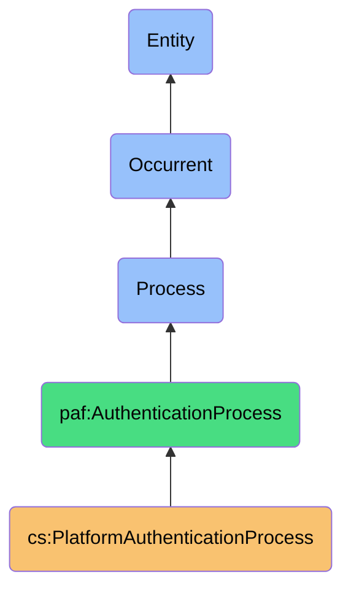
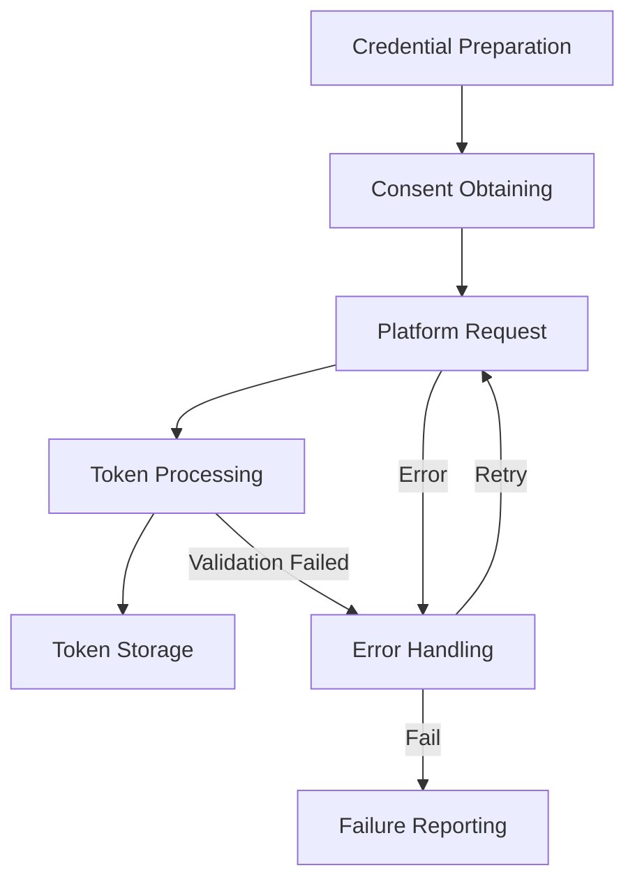

# PlatformAuthenticationProcess

## Definition
PlatformAuthenticationProcess is an occurrent process that establishes secure connections with digital platforms by verifying identity credentials, obtaining proper authorization, and managing consent to access platform resources in a manner that preserves user sovereignty and security.

## Hierarchy in BFO


## Overview
The PlatformAuthenticationProcess serves as the gateway for securely accessing platform-specific contact information, acting as the foundational security layer for cross-platform contact synchronization. This process manages the complex interaction between user consent, platform security requirements, and data access permissions.

Unlike simple username/password authentication, modern platform authentication requires navigating OAuth flows, API permissions, scope limitations, and token management. This process encapsulates all these complexities while maintaining precise control over what data can be accessed.

This process embodies the sovereignty principle by ensuring explicit user consent for each platform connection, providing transparency about data access scopes, and maintaining revocable credentials that can be managed by the user.

## Properties

### Input Properties
| Property | Type | Description | Example |
|----------|------|-------------|---------|
| platform | Platform | Platform to authenticate with | "LinkedIn", "Gmail", "Facebook" |
| authenticationCredentials | Credentials | Credentials for platform authentication | {"clientId": "abc123", "clientSecret": "xyz789"} |
| consentRequest | ConsentRequest | Request for user consent specifications | {"scopes": ["contacts.read"], "purpose": "Contact sync"} |
| authenticationScope | Scope[] | Specific access permissions requested | ["contacts:read", "basic_profile"] |

### Process Properties
| Property | Type | Description | Example |
|----------|------|-------------|---------|
| authenticationMethod | Method | Method used for authentication | "OAuth2", "APIKey", "Password" |
| authenticationStatus | Status | Current status of the authentication process | "Pending", "Completed", "Failed" |
| retryAttempt | Integer | Number of retry attempts made | 2 |

### Output Properties
| Property | Type | Description | Example |
|----------|------|-------------|---------|
| authenticationToken | Token | Token received upon successful authentication | "eyJhbGciOiJIUzI1NiIsInR5cCI6..." |
| tokenExpiry | DateTime | Expiration time for the authentication token | "2023-12-15T12:00:00Z" |
| authorizationGrant | Grant | Authorization grant for accessing resources | {"scopes": ["contacts.read"], "duration": "6 months"} |
| authenticationError | Error | Error encountered during authentication | {"code": "401", "message": "Invalid credentials"} |

## Security

### Access Control
- **User Consent**: All authentication requires explicit user approval
- **Limited Scopes**: Only minimum necessary permissions are requested
- **Revocable Access**: Tokens can be revoked by user at any time
- **Time-Limited**: Authentication tokens expire automatically
- **Secure Storage**: Credentials stored with strong encryption

### Privacy Controls
- **Scope Minimization**: Only request access to required data
- **Purpose Limitation**: Clearly defined purpose for authentication
- **Transparency**: Clear presentation of requested permissions
- **Consent Records**: Preservation of user consent decisions
- **Audit Trail**: Complete logging of authentication events

### Protection Mechanisms
- **Secure Transport**: All authentication occurs over encrypted channels
- **Credential Isolation**: Separation of authentication secrets
- **Token Rotation**: Regular rotation of long-lived tokens
- **Anomaly Detection**: Monitoring for unusual authentication patterns
- **Rate Limiting**: Protection against brute force attempts

## Datasources

### Primary Platforms
| Platform | Authentication Methods | Token Types | Typical Scopes |
|----------|------------------------|-------------|----------------|
| LinkedIn | OAuth 2.0 | Bearer Token | r_emailaddress, r_liteprofile, r_contactinfo |
| Gmail | OAuth 2.0 | Bearer Token | https://www.googleapis.com/auth/contacts.readonly |
| Facebook | OAuth 2.0 | Bearer Token | email, public_profile, user_friends |
| Twitter | OAuth 1.0a, OAuth 2.0 | Bearer Token | read-only access to followers |
| Microsoft | OAuth 2.0 | Bearer Token | Contacts.Read, User.Read |

### Authentication Flows
- **Authorization Code Flow**: Most secure for server applications
- **PKCE Flow**: Enhanced security for native/mobile applications
- **Implicit Flow**: Legacy flow for browser-based applications
- **Client Credentials**: For service-to-service authentication
- **Resource Owner Password**: For trusted first-party applications

### Token Management
- **Access Tokens**: Short-lived for immediate platform access
- **Refresh Tokens**: Long-lived for obtaining new access tokens
- **ID Tokens**: For user identity verification
- **API Keys**: For simpler platform authentication
- **App Passwords**: For platforms without modern authentication

## Capabilities

### Authentication Methods
- **OAuth 2.0 Authentication**: Industry standard for delegated authorization
- **API Key Authentication**: Simple authentication for some platforms
- **Username/Password Authentication**: Basic authentication for legacy systems
- **Token-Based Authentication**: Using pre-existing authentication tokens
- **Multi-factor Authentication**: Enhanced security with multiple verification factors

### Consent Management
- **Explicit Consent Capture**: Clear user approval for each platform
- **Granular Permission Control**: Fine-grained control over requested scopes
- **Consent History**: Record of all consent decisions and changes
- **Scope Explanation**: Human-readable explanation of requested permissions
- **Consent Revocation**: Simple mechanism for withdrawing consent

### Token Handling
- **Secure Storage**: Encrypted storage of authentication credentials
- **Token Refresh**: Automatic renewal of expiring tokens
- **Token Validation**: Verification of token integrity and validity
- **Token Revocation**: Ability to invalidate compromised tokens
- **Token Expiry Management**: Handling of token lifecycle events

## Process Flow

### Process Stages


### Stage Details
1. **Credential Preparation**
   - Retrieve platform-specific credentials
   - Prepare authentication parameters
   - Generate state and verification tokens

2. **Consent Obtaining**
   - Present consent interface to user
   - Explain requested permissions
   - Capture explicit consent decision

3. **Platform Request**
   - Initiate authentication flow with platform
   - Direct user to platform authentication
   - Handle redirects and callbacks

4. **Token Processing**
   - Exchange authorization code for tokens
   - Validate received tokens
   - Extract token metadata (expiry, scopes)

5. **Token Storage**
   - Securely store authentication tokens
   - Record token metadata and provenance
   - Associate tokens with platform context

### Error Handling
- **Retry Logic**: Automatic retry for transient failures
- **Graceful Degradation**: Partial functionality when some platforms fail
- **User Notification**: Clear communication about authentication issues
- **Recovery Options**: Alternative authentication paths when primary fails
- **Diagnostics**: Detailed error information for troubleshooting

## Interfaces

### Authentication Controller Interface
```typescript
interface PlatformAuthenticationController {
  startAuthentication(platform: Platform, options: AuthOptions): ProcessId;
  checkAuthenticationStatus(processId: string): AuthStatus;
  completeAuthentication(processId: string, responseData: any): AuthResult;
  cancelAuthentication(processId: string): boolean;
  refreshToken(platform: Platform): AuthResult;
}
```

### Consent Management Interface
```typescript
interface ConsentManager {
  requestConsent(platform: Platform, scopes: string[]): ConsentRequest;
  recordConsentDecision(request: ConsentRequest, approved: boolean): void;
  getConsentHistory(platform: Platform): ConsentRecord[];
  revokeConsent(platform: Platform): boolean;
  checkConsentStatus(platform: Platform): ConsentStatus;
}
```

### Token Management Interface
```typescript
interface TokenManager {
  storeToken(platform: Platform, token: Token): void;
  retrieveToken(platform: Platform): Token;
  isTokenValid(platform: Platform): boolean;
  refreshTokenIfNeeded(platform: Platform): Token;
  revokeToken(platform: Platform): boolean;
}
```

## Materializations

### Process Materializations
- **Authentication Session**: Concrete instance of an authentication flow
- **Consent Dialog**: UI materialization of the consent request
- **Platform Redirect**: Navigation to platform authentication
- **Callback Handler**: Component processing platform response
- **Token Refresh Job**: Background process to maintain fresh tokens

### Result Materializations
- **Token Vault**: Secure storage for authentication tokens
- **Credential Store**: Repository of platform connection credentials
- **Authentication Log**: Record of authentication activities
- **Platform Connection**: Representation of an authenticated platform
- **Access Grant Registry**: Record of authorized platform accesses

### Error Materializations
- **Authentication Error**: Representation of authentication failure
- **Consent Rejection**: Record of user declining consent
- **Token Validation Error**: Failed token validation
- **Connection Timeout**: Authentication process timeout
- **Scope Limitation**: Platform rejected requested scopes

## Automations

### Authentication Automations
- **Token Refresh**: Automatic renewal of expiring tokens
- **Silent Authentication**: Background re-authentication when possible
- **Cross-Platform Authentication**: Sequential authentication to related platforms
- **Graduated Authentication**: Progressive access to platform capabilities
- **Scheduled Re-authentication**: Regular renewal of platform connections

### Recovery Automations
- **Retry With Backoff**: Exponential backoff for failed authentication attempts
- **Alternative Auth Paths**: Fallback to secondary authentication methods
- **Reconnection Attempts**: Periodic attempts to restore lost connections
- **Token Regeneration**: Automatic handling of invalidated tokens
- **Auth Error Resolution**: Guided recovery from common authentication failures

### Notification Automations
- **Expiry Alerts**: Notification of impending token expiration
- **Auth Status Updates**: Real-time updates on authentication progress
- **Consent Requirements**: Alerts for new consent requirements
- **Security Events**: Notification of suspicious authentication activities
- **Platform Changes**: Alerts for platform authentication policy changes

## Usage

### Primary Use Cases
- **Platform Data Access**: Enabling secure access to platform contact data
- **Contact Synchronization**: Authentication for cross-platform contact sync
- **Platform Integration**: Enabling integration with platform services
- **Identity Verification**: Confirming user identity across platforms
- **Access Maintenance**: Maintaining ongoing access to platform resources

### Integration Points
- **Pre-process for Contact Extraction**: Authentication before data retrieval
- **Integration with Consent Framework**: Works with broader consent system
- **Component of Synchronization Pipeline**: Authentication stage of sync process
- **Provider for Platform API Access**: Authentication for all platform operations
- **Consumer of Security Services**: Uses encryption and secure storage services

### Query Patterns
```sparql
# Find all active platform authentications
SELECT ?platform ?tokenExpiry ?scopes
WHERE {
  ?auth a cs:PlatformAuthenticationProcess ;
        cs:hasPlatform ?platform ;
        cs:generatesToken ?token .
  ?token cs:hasTokenExpiry ?tokenExpiry ;
         cs:hasScopes ?scopes .
  FILTER(?tokenExpiry > NOW())
}

# Find failed authentication attempts
SELECT ?platform ?errorCode ?errorMessage ?timestamp
WHERE {
  ?auth a cs:PlatformAuthenticationProcess ;
        cs:hasPlatform ?platform ;
        cs:hasAuthenticationStatus "Failed" ;
        cs:encountersError ?error ;
        cs:hasTimestamp ?timestamp .
  ?error cs:hasErrorCode ?errorCode ;
         cs:hasErrorMessage ?errorMessage .
}
```

## History

### Conceptual Origin
- **Initial Concept**: Basic platform API access (2010s)
- **Evolution**: OAuth standardization and adoption (2012-2018)
- **PAF Integration**: Sovereignty-focused authentication (2022)

### Version History
- **v0.1**: Basic OAuth implementation for key platforms (2022-Q3)
- **v0.2**: Enhanced consent management and token storage (2022-Q4)
- **v1.0**: Full multi-platform support with unified interface (2023-Q1)
- **v1.1**: Added token refresh and error recovery (2023-Q2)
- **v1.2**: Enhanced with security monitoring and reporting (2023-Q3)

### Future Development
- **Planned v2.0**: Decentralized authentication with verifiable credentials
- **Planned v2.1**: Zero-knowledge proof authentication options
- **Planned v2.2**: Cross-platform consent delegation
- **Research Area**: Authentication without persistent token storage
- **Exploration**: Self-sovereign identity integration 