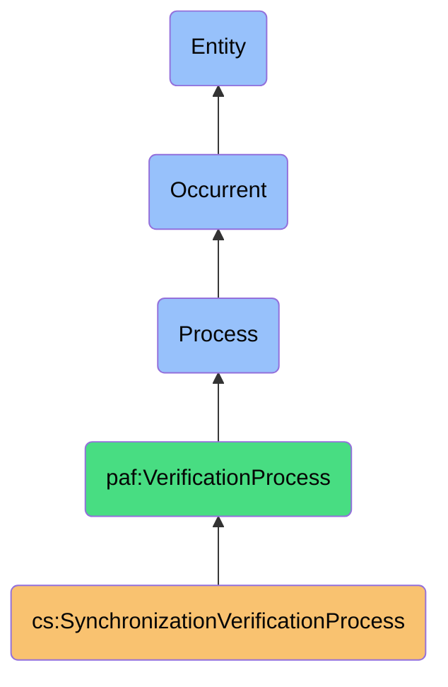
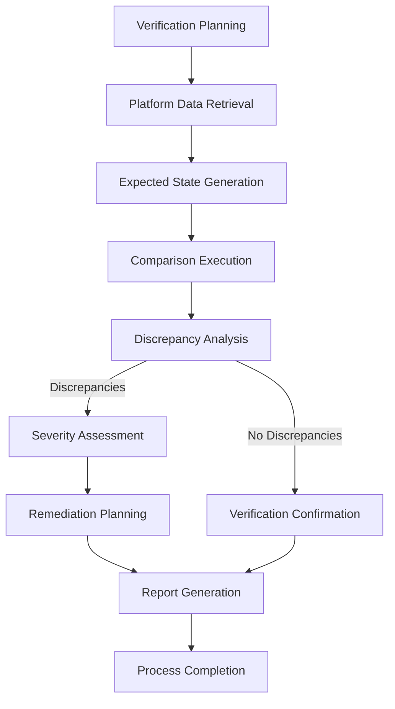

# SynchronizationVerificationProcess

## Definition
SynchronizationVerificationProcess is an occurrent process that systematically validates the consistency, completeness, and correctness of contact data synchronization across multiple platforms, ensuring data integrity while detecting and reporting discrepancies that might require remediation.

## Hierarchy in BFO


## Overview
The SynchronizationVerificationProcess serves as the quality assurance mechanism for the contact synchronization ecosystem. Operating after contact write operations, this process verifies that the intended changes were successfully applied across all target platforms and that the resulting contact data maintains consistency and integrity.

This process performs comprehensive validation through multiple verification strategies, including platform re-reading, checksum comparison, attribute verification, and relationship validation. It detects various types of synchronization issues, from simple data inconsistencies to more complex structural discrepancies, providing detailed reports on verification results.

By ensuring the reliability of synchronization operations, this process builds user trust in the contact ecosystem while supporting data sovereignty by providing transparency into the actual state of contact data across platforms. The verification results help close the synchronization feedback loop, informing future synchronization operations and improvement of the overall synchronization system.

## Properties

### Input Properties
| Property | Type | Description | Example |
|----------|------|-------------|---------|
| syncOperations | Operation[] | Synchronization operations to verify | [{"id": "op123", "contact": "contact456", "platform": "Gmail"}] |
| verificationScope | Scope | What aspects to verify | {"attributeLevel": true, "relationships": false} |
| expectedState | Expected[] | Expected state after synchronization | [{"contact": "contact456", "attribute": "email", "value": "john@example.com"}] |
| targetPlatforms | Platform[] | Platforms to verify against | ["Gmail", "LinkedIn", "iCloud"] |
| verificationThreshold | Threshold | Minimum success threshold | {"attributeMatch": 0.95, "critical": 1.0} |

### Process Properties
| Property | Type | Description | Example |
|----------|------|-------------|---------|
| verificationStatus | Status | Current status of verification | "InProgress", "Completed", "Failed" |
| platformProgress | Map<Platform, Progress> | Progress by platform | {"Gmail": "Completed", "LinkedIn": "InProgress"} |
| discrepancyCounter | Integer | Number of discrepancies found | 3 |
| criticalIssueCounter | Integer | Number of critical issues | 1 |
| verificationAttempts | Integer | Number of verification attempts | 2 |

### Output Properties
| Property | Type | Description | Example |
|----------|------|-------------|---------|
| verificationResults | Result[] | Results by platform and attribute | [{"platform": "Gmail", "attribute": "email", "status": "Verified"}] |
| discrepancies | Discrepancy[] | Identified synchronization issues | [{"contact": "John Doe", "attribute": "phone", "expected": "+1234567890", "actual": "+0987654321"}] |
| verificationSummary | Summary | Summary of verification results | {"total": 50, "verified": 48, "discrepancies": 2} |
| criticalIssues | Issue[] | Critical synchronization issues | [{"type": "MISSING_CONTACT", "platform": "LinkedIn", "contact": "Jane Smith"}] |
| remedyRecommendations | Remedy[] | Suggested fixes for issues | [{"issue": "issue123", "recommendation": "Resynchronize email attribute"}] |

## Security

### Access Control
- **Platform Read Authorization**: Secure access for verification
- **Verification Boundaries**: Limiting verification to authorized data
- **Result Access Control**: Controlling access to verification results
- **Private Data Verification**: Special handling for sensitive attributes
- **History Protection**: Protecting verification history from unauthorized access

### Privacy Controls
- **Minimal Access**: Reading only necessary data during verification
- **Sensitive Data Protection**: Special handling for sensitive information
- **Secure Comparison**: Comparing sensitive data securely
- **Report Filtering**: Filtering sensitive details from reports
- **Anonymized Discrepancies**: Reporting issues without exposing private data

### Protection Mechanisms
- **Secure Connections**: Encrypted communication with platforms
- **Throttled Verification**: Respecting platform rate limits
- **Access Scoping**: Limiting verification to necessary attributes
- **Credential Protection**: Secure handling of platform credentials
- **Audit Trail**: Logging verification activities securely

## Datasources

### Verification Sources
| Source Type | Description | Reliability | Challenges |
|-------------|-------------|------------|------------|
| Platform API Reads | Direct reads from platform APIs | High | Rate limits, API changes |
| Cached Platform Data | Recently cached platform data | Medium | Potential staleness |
| Expected State Models | Predicted state after operations | Medium | Prediction errors |
| Synchronization Logs | Records of sync operations | High for operations | Limited for results |
| Previous Verification | Results of previous verifications | Medium | Changes since verification |

### Discrepancy Types
- **Attribute Mismatch**: Attribute values don't match expected values
- **Missing Attribute**: Expected attribute not present on platform
- **Relationship Inconsistency**: Contact relationships differ across platforms
- **Update Timestamp Mismatch**: Modification timestamps inconsistent
- **Structural Discrepancy**: Contact structure differs from expected

### Verification Metadata
- **Verification Timestamps**: When verification was performed
- **Verification Method**: How verification was conducted
- **Confidence Scores**: Confidence in verification results
- **Coverage Metrics**: What percentage of data was verified
- **Platform Status**: State of platform during verification

## Capabilities

### Verification Strategies
- **Direct Comparison**: Compare expected and actual values
- **Checksum Verification**: Verify data integrity via checksums
- **Structural Validation**: Validate contact structure integrity
- **Relationship Verification**: Verify contact relationships
- **Temporal Verification**: Verify consistency of timestamps

### Discrepancy Detection
- **Value Discrepancy**: Detect mismatched attribute values
- **Missing Data**: Identify missing attributes or contacts
- **Structural Issues**: Detect structural inconsistencies
- **Relationship Anomalies**: Identify relationship inconsistencies
- **Synchronization Failures**: Detect failed synchronization operations

### Reporting Capabilities
- **Detailed Discrepancy Reports**: Comprehensive discrepancy information
- **Severity Classification**: Categorizing issues by severity
- **Trend Analysis**: Analyzing patterns in synchronization issues
- **Root Cause Identification**: Determining causes of discrepancies
- **Remediation Recommendations**: Suggesting fixes for issues

## Process Flow

### Process Stages


### Stage Details
1. **Verification Planning**
   - Determine verification scope and strategy
   - Select attributes and platforms to verify
   - Establish verification criteria

2. **Platform Data Retrieval**
   - Retrieve current contact data from platforms
   - Handle authentication and access requirements
   - Manage API rate limits and constraints

3. **Expected State Generation**
   - Determine expected state after synchronization
   - Apply platform-specific expectations
   - Account for known platform limitations

4. **Comparison Execution**
   - Compare actual and expected states
   - Apply verification algorithms
   - Track verification results

5. **Discrepancy Analysis**
   - Analyze identified discrepancies
   - Classify discrepancy types
   - Determine potential causes

6. **Severity Assessment**
   - Evaluate impact of discrepancies
   - Classify issues by severity
   - Identify critical issues requiring attention

7. **Remediation Planning**
   - Develop recommendations for fixing issues
   - Prioritize remediation actions
   - Prepare for resynchronization if needed

8. **Verification Confirmation**
   - Confirm successful verification
   - Record verification results
   - Update synchronization status

9. **Report Generation**
   - Compile comprehensive verification report
   - Include discrepancies and recommendations
   - Format for appropriate audience

10. **Process Completion**
    - Finalize verification status
    - Notify dependent processes
    - Update verification history

### Failure Handling
- **Verification Failures**: Handle platform access issues
- **Unexpected Discrepancies**: Address unexpected data discrepancies
- **Critical Issues**: Flag and escalate critical synchronization issues
- **Platform Unavailability**: Handle temporary platform unavailability
- **Data Inconsistency**: Address fundamental data inconsistencies

## Interfaces

### Verification Controller Interface
```typescript
interface SyncVerificationController {
  startVerification(operations: SyncOperation[], options: VerificationOptions): VerificationProcess;
  pauseVerification(processId: string): boolean;
  resumeVerification(processId: string): boolean;
  cancelVerification(processId: string): boolean;
  getVerificationStatus(processId: string): VerificationStatus;
}
```

### Discrepancy Management Interface
```typescript
interface DiscrepancyManager {
  getDiscrepancies(filters: DiscrepancyFilters): Discrepancy[];
  classifyDiscrepancy(discrepancy: Discrepancy): Classification;
  prioritizeDiscrepancies(discrepancies: Discrepancy[]): PrioritizedDiscrepancies;
  generateRemediationPlan(discrepancies: Discrepancy[]): RemediationPlan;
  trackDiscrepancyResolution(discrepancy: Discrepancy): ResolutionStatus;
}
```

### Reporting Interface
```typescript
interface VerificationReporting {
  generateSummaryReport(verificationId: string): SummaryReport;
  generateDetailedReport(verificationId: string, options: ReportOptions): DetailedReport;
  getVerificationMetrics(verificationId: string): VerificationMetrics;
  compareVerifications(verificationIds: string[]): ComparisonReport;
  exportVerificationResults(verificationId: string, format: ExportFormat): ExportedReport;
}
```

## Materializations

### Process Materializations
- **Verification Job**: Background task instance of verification
- **Platform Reader**: Component for reading platform data
- **State Comparator**: Component comparing expected and actual states
- **Discrepancy Analyzer**: Component analyzing discrepancies
- **Report Generator**: Component generating verification reports

### Result Materializations
- **Verification Record**: Complete record of verification activity
- **Discrepancy Report**: Detailed report of identified issues
- **Verification Metrics**: Performance metrics of verification
- **Remediation Plan**: Plan for addressing discrepancies
- **Verification Certificate**: Confirmation of successful verification

### Integration Materializations
- **Verification Dashboard**: Interface showing verification status
- **Discrepancy Explorer**: Tool for exploring identified issues
- **Platform Monitor**: Component monitoring platform state during verification
- **Verification Scheduler**: Tool for scheduling verification operations
- **Alert Manager**: Component for managing verification alerts

## Automations

### Process Automations
- **Scheduled Verification**: Automatic verification on schedule
- **Post-Sync Verification**: Verification triggered after synchronization
- **Incremental Verification**: Verifying only changed attributes
- **Smart Retries**: Intelligently retrying failed verifications
- **Verification Optimization**: Minimizing platform API usage

### Analysis Automations
- **Pattern Detection**: Identifying patterns in synchronization issues
- **Root Cause Analysis**: Automatically determining issue causes
- **Impact Assessment**: Evaluating impact of discrepancies
- **Trend Monitoring**: Tracking verification trends over time
- **Quality Improvement**: Identifying synchronization quality trends

### Integration Automations
- **Remediation Triggering**: Initiating fixes for identified issues
- **Notification Routing**: Routing alerts based on issue severity
- **Verification Reporting**: Generating and distributing reports
- **Platform Health Monitoring**: Tracking platform reliability
- **System Learning**: Improving verification based on results

## Usage

### Primary Use Cases
- **Quality Assurance**: Ensuring synchronization quality
- **Issue Detection**: Identifying synchronization problems
- **Data Consistency**: Verifying cross-platform consistency
- **Trust Building**: Building user trust in synchronization
- **System Improvement**: Improving synchronization processes

### Integration Points
- **Follows Contact Write**: Verifies results of write operations
- **Feeds Conflict Resolution**: Identifies conflicts requiring resolution
- **Informs Synchronization**: Provides feedback for future synchronization
- **Updates User Interface**: Provides verification status to users
- **Drives Remediation**: Initiates remediation for identified issues

### Query Patterns
```sparql
# Find all critical verification discrepancies
SELECT ?discrepancy ?contact ?attribute ?expected ?actual ?severity
WHERE {
  ?discrepancy a cs:VerificationDiscrepancy ;
               cs:affectsContact ?contact ;
               cs:involvesAttribute ?attribute ;
               cs:hasExpectedValue ?expected ;
               cs:hasActualValue ?actual ;
               cs:hasSeverity "Critical" .
}

# Find verification success rate by platform
SELECT ?platform (COUNT(?verification) as ?totalVerifications) (COUNT(?success) as ?successfulVerifications)
WHERE {
  ?verification a cs:VerificationProcess ;
                cs:targetsPlatform ?platform .
  OPTIONAL {
    ?verification cs:hasStatus "Success" .
    BIND(?verification as ?success)
  }
}
GROUP BY ?platform
```

## History

### Conceptual Origin
- **Initial Concept**: Basic synchronization validation (2010s)
- **Evolution**: Comprehensive verification with remediation (2015-2020)
- **PAF Integration**: Enhanced with sovereignty principles (2022)

### Version History
- **v0.1**: Basic attribute verification (2022-Q3)
- **v0.2**: Added discrepancy classification (2022-Q4)
- **v1.0**: Full verification with reporting (2023-Q1)
- **v1.1**: Enhanced with remediation recommendations (2023-Q2)
- **v1.2**: Added synchronization quality metrics (2023-Q3)

### Future Development
- **Planned v2.0**: Intelligent cross-platform verification
- **Planned v2.1**: Predictive verification and discrepancy prevention
- **Planned v2.2**: Adaptive verification based on platform behavior
- **Research Area**: Machine learning for verification optimization
- **Exploration**: Blockchain-based verification and certification 