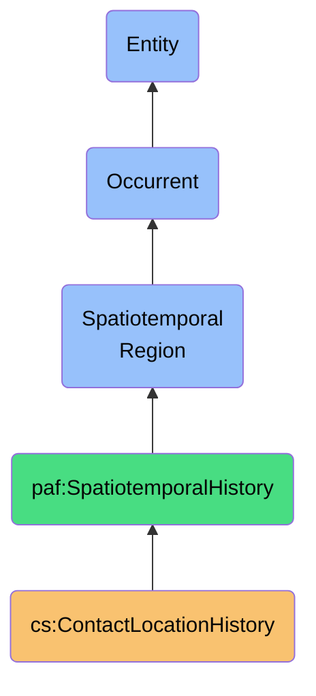
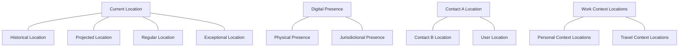

# ContactLocationHistory

## Definition
A ContactLocationHistory is an occurrent spatiotemporal region that represents the evolving geographical presence of a contact across space and time, capturing the sequence of locations, duration of stays, contextual patterns, and jurisdictional boundaries relevant to the contact's physical or digital presence.

## Hierarchy in BFO


## Overview
A ContactLocationHistory captures the spatial and temporal dimensions of a contact's presence throughout the relationship, providing a comprehensive record of where and when the contact existed in various locations. Unlike simple location data points or temporal records, this spatiotemporal region represents the complete four-dimensional continuum of a contact's geographical movement and existence.

This entity is crucial for understanding context-dependent aspects of contact relationships, as location often determines communication patterns, relevance of information, availability, and applicable legal frameworks. By modeling location history as a spatiotemporal region rather than discrete data points, the system can reason about proximity, co-location, trajectories, and jurisdictional implications over time.

From a sovereignty perspective, ContactLocationHistory enables awareness of jurisdiction-bound privacy requirements, helps identify contextually appropriate modes of communication, and provides a foundation for territory-aware data governance, while respecting the contact's privacy through appropriate granularity controls and purpose limitations.

## Properties

### Spatial Properties
| Property | Type | Description | Example |
|----------|------|-------------|---------|
| locationPoints | GeoPoint[] | Sequence of geographic coordinates | [{"lat": 37.7749, "lng": -122.4194, "alt": 16}, ...] |
| addressHistory | Address[] | Sequence of structured addresses | [{"street": "123 Main St", "city": "San Francisco", ...}, ...] |
| regionHistory | Region[] | Administrative regions of residence | [{"country": "US", "state": "CA", "locality": "San Francisco"}, ...] |
| locationPrecision | Enum | Granularity of location data | "Exact", "City", "Region", "Country" |
| jurisdictionHistory | Jurisdiction[] | Legal jurisdictions inhabited | [{"code": "US-CA", "type": "SubNational", "name": "California"}, ...] |

### Temporal Properties
| Property | Type | Description | Example |
|----------|------|-------------|---------|
| timeRanges | TimeRange[] | Time intervals at locations | [{"start": "2022-01-15T00:00:00Z", "end": "2022-06-22T00:00:00Z"}, ...] |
| locationTransitions | Transition[] | Movement between locations | [{"from": "US-CA", "to": "US-NY", "date": "2022-06-23"}, ...] |
| temporalPrecision | Enum | Granularity of temporal data | "Exact", "Day", "Month", "Year" |
| recurrencePatterns | Pattern[] | Cyclical location patterns | [{"pattern": "Weekdays", "location": "Office"}, ...] |
| seasonalPresence | Season[] | Season-based location changes | [{"season": "Summer", "location": "Beach House"}, ...] |

### Contextual Properties
| Property | Type | Description | Example |
|----------|------|-------------|---------|
| locationType | Map<Location, Type> | Classification of locations | {"Office": "Professional", "Home": "Personal"} |
| coLocatedContacts | Map<TimeRange, Contact[]> | Co-present contacts | {"2022-Summer": ["contact-123", "contact-456"]} |
| locationSource | Map<Location, Source> | Where location data originated | {"Home": "Address Book", "Office": "LinkedIn"} |
| locationConfidence | Map<Location, Decimal> | Certainty about locations | {"PrimaryResidence": 0.95, "VacationHome": 0.8} |
| contextualTags | Map<Location, Tag[]> | Semantic labels for locations | {"London": ["Business", "Conference", "Client"]} |

## Spatiotemporal Structures

### Location Types
- **Physical Locations**: Actual geographic places the contact inhabits
- **Digital Presence**: Online spaces where contact is virtually present
- **Transit Locations**: Places the contact passes through when traveling
- **Jurisdictional Regions**: Legal/administrative spaces affecting governance
- **Functional Locations**: Places defined by the contact's activities there

### Temporal Patterns
- **Residence Periods**: Long-term stays at primary locations
- **Travel Periods**: Short-term presence in temporary locations
- **Recurring Presence**: Regular patterns at specific locations
- **Progressive Movements**: Sequential location changes showing trajectory
- **Exceptional Presence**: Unusual or one-time location occurrences

### Spatiotemporal Relationships


## Spatial Context

### Geographic Hierarchies
- **Global**: Planet-wide presence (relevant for international contacts)
- **Continental**: Presence on specific continents
- **National**: Presence in specific countries
- **Regional**: Presence in states/provinces
- **Local**: Presence in cities/municipalities
- **Micro-local**: Specific neighborhoods or venues

### Spatial Proximity
| Proximity Type | Description | Use Cases |
|----------------|-------------|-----------|
| Co-location | Same exact location | In-person meetings, event attendance |
| Near Proximity | Very close locations | Local meetups, delivery options |
| Same City | Within same city boundaries | Local services, city-specific references |
| Same Region | Within same state/province | Regional regulations, regional events |
| Same Country | Within national boundaries | National regulations, cultural context |
| Different Continent | Substantial distance | Time zone awareness, international shipping |

### Jurisdictional Implications
- **Data Protection Regions**: GDPR, CCPA, and other privacy regime boundaries
- **Legal Jurisdictions**: Different applicable laws based on location
- **Regulatory Domains**: Industry-specific regulation territories
- **Tax Jurisdictions**: Regions with specific tax implications
- **Export Control Zones**: Areas with technology or content restrictions

## Temporal Dynamics

### Time-based Patterns
- **Historical Trajectory**: Past movement patterns
- **Current Status**: Present location information
- **Future Projections**: Anticipated locations based on patterns
- **Cyclical Patterns**: Recurring location changes (seasonal, work-related)
- **Event-driven Changes**: Locations tied to specific events

### Duration Categories
| Duration | Description | Example |
|----------|-------------|---------|
| Transient | Very brief presence | Airport layover, conference visit |
| Short-term | Days to weeks | Business trip, vacation |
| Medium-term | Weeks to months | Extended work assignment, seasonal residence |
| Long-term | Months to years | Primary residence, long-term employment location |
| Permanent | Effectively indefinite | Homeland, permanent residence |

### Temporal Segmentation
```
Contact: John Smith
───────────────────────────────────────────────────────────────────────▶ Time
   New York (2018-2020)    London (2020-2021)    San Francisco (2021-present)
   ┌─────────────────┐     ┌──────────────┐      ┌─────────────────────────┐
   │                 │     │              │      │                         │
───┴─────────────────┴─────┴──────────────┴──────┴─────────────────────────┴──▶
   ▲                 ▲     ▲              ▲      ▲                         ▲
   │                 │     │              │      │                         │
   Start of          │     │              │      │                         Current
   Relationship      │     │              │      │                         Time
                     │     │              │      │
                     Move  Start          End    Start
                     Planned London Job   London SF Job
```

## Privacy & Sovereignty

### Privacy Controls
- **Precision Degradation**: Reducing location specificity for privacy
- **Purpose Limitation**: Restricting use of location data to specific purposes
- **Temporal Limits**: Retaining only recent location history
- **Context Segregation**: Separating work/personal location tracking
- **Consent Management**: Tracking consent for location data usage

### Sovereignty Implications
- **Legal Compliance**: Understanding which laws apply based on location
- **Data Localization**: Requirements to store data in specific territories
- **Cross-Border Transfers**: Managing movement of data across jurisdictions
- **Territorial Rights**: Different data subject rights in different regions
- **Cultural Context**: Location-appropriate communication norms

### Ethical Considerations
| Consideration | Description | Mitigation |
|---------------|-------------|------------|
| Location Privacy | Risk of revealing sensitive places | Apply appropriate granularity controls |
| Pattern Exposure | Risk of revealing behavioral patterns | Limit historical analysis scope |
| Inference Risks | Deriving sensitive information from location | Restrict derived insights |
| Third-Party Sharing | Location data shared with platforms | Clear boundaries on data sharing |
| Location Tracking | Continuous monitoring concerns | User-controlled tracking periods |

## Implementation

### Location Representation
```typescript
interface GeoCoordinate {
  latitude: number;    // Decimal latitude
  longitude: number;   // Decimal longitude
  altitude?: number;   // Optional altitude in meters
  accuracy?: number;   // Accuracy radius in meters
  timestamp: Date;     // When coordinates were recorded
}

interface StructuredAddress {
  street?: string;     // Street address
  city?: string;       // City/locality
  region?: string;     // State/province/region
  postalCode?: string; // ZIP/postal code
  country: string;     // Country code (ISO 3166-1)
  formatted: string;   // Human-readable address
  validFrom: Date;     // When address became valid
  validTo?: Date;      // When address validity ended
}

interface LocationContext {
  type: LocationType;  // Home, Work, Travel, etc.
  label?: string;      // User-assigned label
  source: string;      // Origin of location data
  confidence: number;  // Confidence in accuracy (0-1)
}
```

### History Data Modeling
```typescript
class ContactLocationHistory {
  readonly contactId: string;
  private locationEntries: LocationEntry[];
  private locationIndex: Map<string, LocationEntry[]>; // Indexed by region
  
  constructor(contactId: string, entries: LocationEntry[] = []) {
    this.contactId = contactId;
    this.locationEntries = entries.sort((a, b) => a.startTime.getTime() - b.startTime.getTime());
    this.buildIndex();
  }
  
  private buildIndex(): void {
    this.locationIndex = new Map();
    for (const entry of this.locationEntries) {
      const key = this.getRegionKey(entry.location);
      if (!this.locationIndex.has(key)) {
        this.locationIndex.set(key, []);
      }
      this.locationIndex.get(key)!.push(entry);
    }
  }
  
  addLocationEntry(entry: LocationEntry): void {
    // Add entry, maintain chronological order
    const insertIndex = this.locationEntries.findIndex(e => 
      e.startTime.getTime() > entry.startTime.getTime());
    
    if (insertIndex === -1) {
      this.locationEntries.push(entry);
    } else {
      this.locationEntries.splice(insertIndex, 0, entry);
    }
    
    // Update index
    const key = this.getRegionKey(entry.location);
    if (!this.locationIndex.has(key)) {
      this.locationIndex.set(key, []);
    }
    this.locationIndex.get(key)!.push(entry);
  }
  
  getLocationAtTime(time: Date): LocationEntry | null {
    // Find location valid at specified time
    return this.locationEntries.find(entry => 
      entry.startTime <= time && (!entry.endTime || entry.endTime >= time)
    ) || null;
  }
  
  getLocationHistory(options: HistoryOptions = {}): LocationEntry[] {
    // Apply filtering, granularity controls, etc.
    let result = [...this.locationEntries];
    
    if (options.timeRange) {
      result = result.filter(entry => 
        entry.startTime <= options.timeRange!.end && 
        (!entry.endTime || entry.endTime >= options.timeRange!.start)
      );
    }
    
    if (options.granularity) {
      result = this.applyGranularity(result, options.granularity);
    }
    
    if (options.locationType) {
      result = result.filter(entry => entry.context.type === options.locationType);
    }
    
    return result;
  }
  
  getJurisdictionsInTimeRange(start: Date, end: Date): string[] {
    // Get all jurisdictions the contact was in during time period
    const relevantEntries = this.locationEntries.filter(entry => 
      entry.startTime <= end && (!entry.endTime || entry.endTime >= start)
    );
    
    return [...new Set(relevantEntries.map(entry => entry.jurisdiction))];
  }
  
  // Additional methods for spatial-temporal queries...
}
```

### Usage Examples
```typescript
// Create a contact location history
const johnLocationHistory = new ContactLocationHistory("contact-123", [
  {
    location: {
      coordinates: { latitude: 40.7128, longitude: -74.0060, timestamp: new Date("2018-01-01") },
      address: { city: "New York", region: "NY", country: "US", formatted: "New York, NY, USA", validFrom: new Date("2018-01-01") }
    },
    jurisdiction: "US-NY",
    startTime: new Date("2018-01-01"),
    endTime: new Date("2020-06-30"),
    context: { type: "Home", source: "Contact Record", confidence: 0.95 }
  },
  {
    location: {
      coordinates: { latitude: 51.5074, longitude: -0.1278, timestamp: new Date("2020-07-01") },
      address: { city: "London", country: "GB", formatted: "London, UK", validFrom: new Date("2020-07-01") }
    },
    jurisdiction: "GB",
    startTime: new Date("2020-07-01"),
    endTime: new Date("2021-08-15"),
    context: { type: "Work", source: "LinkedIn", confidence: 0.9 }
  },
  {
    location: {
      coordinates: { latitude: 37.7749, longitude: -122.4194, timestamp: new Date("2021-09-01") },
      address: { city: "San Francisco", region: "CA", country: "US", formatted: "San Francisco, CA, USA", validFrom: new Date("2021-09-01") }
    },
    jurisdiction: "US-CA",
    startTime: new Date("2021-09-01"),
    endTime: null, // Current location
    context: { type: "Work", source: "Email Signature", confidence: 0.85 }
  }
]);

// Find where John was in February 2020
const feb2020Location = johnLocationHistory.getLocationAtTime(new Date("2020-02-15"));
console.log(`John was in ${feb2020Location.location.address.city} in February 2020`);

// Check if John was in the EU during 2020
const eu2020 = johnLocationHistory.getJurisdictionsInTimeRange(
  new Date("2020-01-01"), 
  new Date("2020-12-31")
).some(j => euJurisdictions.includes(j));
console.log(`John was ${eu2020 ? '' : 'not '}subject to GDPR in 2020`);

// List all of John's work locations
const workLocations = johnLocationHistory.getLocationHistory({ locationType: "Work" });
console.log(`John has worked in ${workLocations.map(l => l.location.address.city).join(", ")}`);
```

## Applications

### Contact Context Applications
- **Time Zone Awareness**: Determining appropriate contact times
- **Regional Communication**: Adapting communication to local context
- **Local Recommendations**: Providing location-relevant suggestions
- **Proximity Detection**: Identifying nearby contacts
- **Meeting Planning**: Facilitating in-person or virtual meetings based on location

### Compliance Applications
- **Privacy Regime Determination**: Identifying applicable privacy laws
- **Data Residency Compliance**: Ensuring data stays in appropriate jurisdictions
- **Territorial Rights Management**: Implementing region-specific rights
- **Legal Obligation Detection**: Identifying reporting requirements by jurisdiction
- **Cross-Border Transfer Controls**: Managing international data flows

### Analytics Applications
- **Relationship Geography**: Understanding spatial patterns in social network
- **Contact Mobility Analysis**: Tracking frequency and patterns of movement
- **Co-location Detection**: Identifying when contacts were in same place
- **Journey Mapping**: Visualizing contact's geographical trajectory
- **Context Switching**: Identifying transition between personal/professional contexts

## Integration with Other Entities

### Material Entity Relations
- **Contact Record**: Bears the location history
- **PlatformAccount**: Source of location information
- **User**: Person managing contact with location history
- **Physical Device**: Where location might be recorded
- **Geographic Region**: Physical areas referenced in history

### Process Relations
- **ContactSynchronizationProcess**: Updates location history
- **JurisdictionalComplianceProcess**: Uses location for compliance
- **CommunicationContextProcess**: Adapts to location context
- **LocationVerificationProcess**: Confirms location accuracy
- **LocationPrivacyProcess**: Manages location data protection

### Related Temporal Entities
- **ContactInteractionHistory**: When interactions occurred relative to locations
- **ValidityPeriod**: Temporal validity of location information
- **RelationshipTimeline**: How relationship evolved across locations
- **TravelPeriod**: Specific timeframes of travel
- **JurisdictionalPresence**: Time periods in specific legal jurisdictions

## Query Patterns

### Spatiotemporal Queries
```sparql
# Find contacts who were in the same city during 2022
SELECT ?contact1 ?contact2 ?city ?startDate ?endDate
WHERE {
  ?contact1 a cs:Contact ;
            cs:hasLocationHistory ?history1 .
  ?contact2 a cs:Contact ;
            cs:hasLocationHistory ?history2 .
  ?history1 cs:hasLocationEntry ?entry1 .
  ?entry1 cs:hasLocation/cs:hasCity ?city ;
          cs:hasStartTime ?start1 ;
          cs:hasEndTime ?end1 .
  ?history2 cs:hasLocationEntry ?entry2 .
  ?entry2 cs:hasLocation/cs:hasCity ?city ;
          cs:hasStartTime ?start2 ;
          cs:hasEndTime ?end2 .
          
  # Calculate overlap period
  BIND(IF(?start1 > ?start2, ?start1, ?start2) AS ?startDate)
  BIND(IF(?end1 < ?end2, ?end1, ?end2) AS ?endDate)
  
  FILTER(?contact1 != ?contact2 && 
         ?startDate < ?endDate && 
         YEAR(?startDate) = 2022)
}

# Find all contacts currently in GDPR jurisdictions
SELECT ?contact ?currentLocation
WHERE {
  ?contact a cs:Contact ;
           cs:hasLocationHistory ?history .
  ?history cs:hasLocationEntry ?entry .
  ?entry cs:hasLocation ?currentLocation ;
         cs:hasJurisdiction ?jurisdiction ;
         cs:hasEndTime ?end .
  FILTER(?end IS NULL && ?jurisdiction IN ("EU", "EEA"))
}
```

### Complex Spatiotemporal Patterns
- **Sequential Co-location**: "Find contacts who were in London after being in New York within 3 months"
- **Jurisdictional Transitions**: "Find contacts who moved from GDPR to non-GDPR jurisdictions"
- **Seasonal Patterns**: "Find contacts who spend summers in Spain"
- **Trajectory Similarity**: "Find contacts with similar travel patterns to Jane"
- **Contextual Location**: "Find contacts whose work location changed but home location remained the same"

## Governance

### Policy Implementation
- **Location Privacy Policies**: Governing collection and use of location data
- **Retention Rules**: How long location history is maintained
- **Precision Controls**: When to degrade location precision for privacy
- **Cross-Border Policy**: Rules for handling data across jurisdictions
- **Notification Requirements**: When to inform contacts about location use

### Ethical Framework
- **Proportionality**: Collecting only location data proportionate to need
- **Transparency**: Being clear about location data collection and use
- **Agency**: Giving contacts control over their location data
- **Contextual Integrity**: Respecting context-appropriate location norms
- **Minimization**: Collecting minimum necessary location precision

### Compliance Requirements
| Regulation | Requirement | Implementation |
|------------|-------------|----------------|
| GDPR | Lawful basis for location data | Consent tracking per location entry |
| GDPR | Data minimization | Precision degradation policies |
| CCPA/CPRA | Right to delete | Purge capability for location history |
| National Security | Data localization | Jurisdiction-aware storage |
| Industry Regulations | Audit trails | Immutable location history changes |

## History

### Conceptual Origin
- **Initial Concept**: Simple location fields in contact records
- **Evolution**: Temporal databases with location tracking capability
- **PAF Integration**: Reformulated as spatiotemporal region (2022)

### Version History
- **v0.1**: Basic current location tracking (2022-Q1)
- **v0.2**: Added historical location capabilities (2022-Q2)
- **v1.0**: Full spatiotemporal region model with jurisdictions (2022-Q4)
- **v1.1**: Enhanced with context-aware location patterns (2023-Q1)
- **v1.2**: Added sovereignty and compliance capabilities (2023-Q3)

### Evolution Roadmap
- **Planned v2.0**: Advanced spatiotemporal reasoning capabilities
- **Planned v2.1**: Predictive location modeling
- **Planned v2.2**: Multi-context location representation
- **Research Area**: Privacy-preserving location analytics
- **Exploration**: Decentralized verifiable location claims 