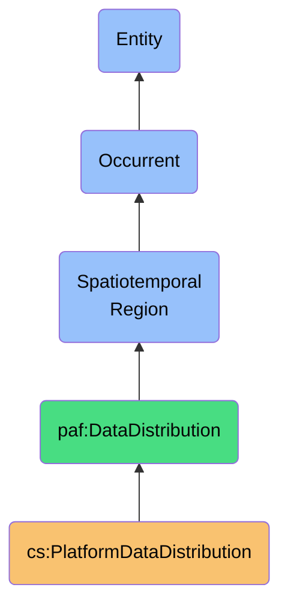
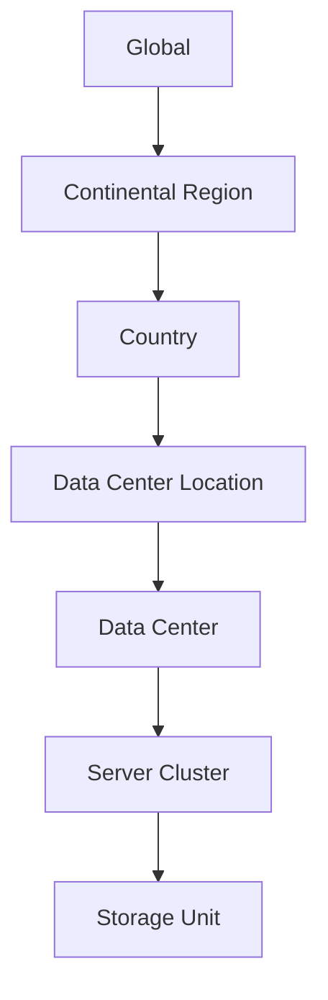

# PlatformDataDistribution

## Definition
A PlatformDataDistribution is an occurrent spatiotemporal region that represents the physical and temporal dispersion of platform-specific contact data across geographic locations, data centers, and jurisdictions, capturing how data moves, replicates, and persists throughout its lifecycle within platform boundaries.

## Hierarchy in BFO


## Overview
A PlatformDataDistribution represents the four-dimensional reality of where and when contact data exists within external platform ecosystems. This spatiotemporal region encompasses not just the current state of data, but its complete existence footprint across both space (geographic locations, data centers, replicas) and time (creation, replication, backup, archival, deletion).

Unlike simpler metadata about data location, this entity captures the complex distributive nature of modern cloud platforms, where contact data may simultaneously exist in multiple locations, move dynamically between systems, have varying retention periods, and cross jurisdictional boundaries. It provides critical context for understanding data sovereignty implications, compliance requirements, and practical limitations of control.

This entity is essential for implementing meaningful data sovereignty, as it makes transparent the often opaque reality of how platform providers physically manage user data. By modeling these distributions, the personal AI ecosystem can make informed decisions about data handling, implement jurisdiction-aware policies, and provide users with meaningful control over their distributed digital footprint.

## Properties

### Spatial Properties
| Property | Type | Description | Example |
|----------|------|-------------|---------|
| dataLocations | Location[] | Geographic locations of data | [{"region": "us-west-2", "city": "Portland", "coordinates": {...}}, ...] |
| dataCenters | DataCenter[] | Specific facilities housing data | [{"id": "iad-3", "provider": "AWS", "tier": "Tier IV"}, ...] |
| jurisdictions | Jurisdiction[] | Legal territories containing data | [{"code": "US", "type": "Country"}, {"code": "EU", "type": "Union"}, ...] |
| replicaCount | Integer | Number of data copies | 3 |
| distributionTopology | TopologyType | Pattern of data distribution | "Centralized", "Regional", "Global", "Edge" |

### Temporal Properties
| Property | Type | Description | Example |
|----------|------|-------------|---------|
| creationTime | DateTime | When data first appeared on platform | "2023-01-15T10:30:45Z" |
| retentionPeriod | Duration | How long data is kept | "P2Y" (2 years) |
| backupSchedule | Schedule | When backups are created | {"frequency": "Daily", "retention": "P90D"} |
| dataMovementEvents | Event[] | When data moved between locations | [{"from": "us-east", "to": "eu-west", "time": "2023-03-01T08:00:00Z"}, ...] |
| dataLifecycleStage | Enum | Current stage in data lifecycle | "Active", "Archived", "PendingDeletion" |

### Distribution Properties
| Property | Type | Description | Example |
|----------|------|-------------|---------|
| dataSovereigntyClass | Enum | Sovereignty classification | "Exclusive", "Shared", "LimitedControl", "Opaque" |
| crossBorderTransfers | Transfer[] | International data movements | [{"from": "US", "to": "EU", "basis": "StandardContractualClauses"}, ...] |
| dataResidencyCommitments | Commitment[] | Platform location promises | [{"type": "RegionalStorage", "region": "EU"}, ...] |
| distributionVisibility | Enum | Transparency of distribution | "Transparent", "PartiallyVisible", "Opaque" |
| technicalConstraints | Constraint[] | Limits on distribution control | [{"type": "ReplicationRequirement", "reason": "Availability"}, ...] |

## Spatiotemporal Dimensions

### Geographic Distribution Patterns
- **Centralized**: Data stored in a single geographic region
- **Regional**: Data stored within specific continental regions
- **Global**: Data distributed across multiple continents
- **Edge**: Data distributed to edge locations near users
- **Hybrid**: Different data components with different distribution patterns

### Location Hierarchies


### Temporal Distribution Patterns
- **Persistent**: Long-term storage in primary locations
- **Ephemeral**: Temporary caching in intermediate locations
- **Progressive**: Moving through different storage tiers over time
- **Cyclical**: Regular movement between hot and cold storage
- **Event-driven**: Distribution triggered by specific events

## Data Replication

### Replication Strategies
- **Synchronous Replication**: Immediate duplication across locations
- **Asynchronous Replication**: Delayed duplication with potential lag
- **Incremental Replication**: Only changes are propagated
- **Snapshot Replication**: Point-in-time complete copies
- **Bidirectional Replication**: Changes sync in multiple directions

### Replication Topologies
| Topology | Description | Examples | Implications |
|----------|-------------|----------|--------------|
| Single Primary | One authoritative copy, multiple read-only replicas | Traditional databases | Clear data lineage, potential bottlenecks |
| Multi-Primary | Multiple writable copies with conflict resolution | Distributed databases | Higher availability, complex reconciliation |
| Ring | Each node replicates to the next in a circular pattern | Cassandra, Riak | Resilient to failures, potential consistency issues |
| Star | Central hub replicates to multiple spokes | Hub-spoke architectures | Centralized control, single point of failure |
| Mesh | Each node can replicate to multiple others | Modern cloud systems | Highly resilient, complex to manage |

### Replication Quality Factors
- **Consistency Level**: How synchronized replicas remain
- **Propagation Delay**: Time for changes to reach all replicas
- **Durability Guarantee**: Assurance of data persistence
- **Replica Diversity**: Independence of failure domains
- **Verification Mechanisms**: How replica integrity is checked

## Jurisdictional Mapping

### Jurisdiction Types
- **National Jurisdictions**: Country-level legal frameworks
- **Regional Jurisdictions**: Multi-country unions (EU, ASEAN)
- **Sub-national Jurisdictions**: States with specific laws (California)
- **Sectoral Jurisdictions**: Industry-specific regulatory domains
- **Extraterritorial Jurisdictions**: Laws with cross-border reach

### Jurisdiction-Specific Regulations
| Jurisdiction | Regulation | Requirements | Distribution Impact |
|--------------|------------|--------------|---------------------|
| European Union | GDPR | Data localization options, transfer restrictions | May require EU-only or adequacy mechanism |
| China | PIPL | Data localization, security assessment | May restrict distribution outside China |
| Russia | Data Protection Law | Mandatory data localization | Primary storage must be in Russia |
| India | Digital Personal Data Protection | Cross-border transfer restrictions | Limits countries data can flow to |
| Brazil | LGPD | Accountability for transfers | Must document distribution |

### Cross-Border Transfer Mechanisms
- **Adequacy Decisions**: Jurisdictions deemed adequate by source country
- **Standard Contractual Clauses**: Pre-approved contractual terms
- **Binding Corporate Rules**: Internal company rules for transfers
- **Explicit Consent**: User permission for specific transfers
- **Derogations**: Exceptions for specific circumstances

## Platform-Specific Patterns

### Platform Distribution Models
- **Hyperscale Cloud**: Global infrastructure with regional isolation options
- **Social Networks**: Global distribution with regional caching and localization
- **Business Software**: Regional deployment with global replication
- **Consumer Services**: Edge-focused distribution for performance
- **Legacy Platforms**: Centralized data with limited geographic distribution

### Common Platform Approaches
| Platform | Typical Distribution | Transparency | Control Options | Data Residency |
|----------|----------------------|--------------|----------------|----------------|
| Google Workspace | Global, multi-region replication | Moderate | Partial (Data Regions) | Regional options available |
| Microsoft 365 | Geo, multi-region replication | High | Good (Data Residency) | Strong regional options |
| LinkedIn | Global distribution | Low | Limited | Limited regional options |
| Salesforce | Regional with global options | Moderate | Partial (Shield) | Some regional options |
| Facebook | Global with local caching | Low | Very limited | No regional options |

### Platform Distribution Visibility
- **Transparent**: Clear documentation of all data locations
- **Partially Visible**: Some information about regions but not specifics
- **Region-level Only**: Only broad geographic regions disclosed
- **Opaque**: No specific information about data distribution
- **Contractually Documented**: Details available in legal agreements

## Implementation

### Technical Implementation
```typescript
class PlatformDataDistribution {
  readonly platformId: string;
  readonly dataSubject: string;
  readonly distributionProfile: DistributionProfile;
  private locations: DataLocation[];
  private movements: DataMovement[];
  
  constructor(config: DistributionConfig) {
    this.platformId = config.platformId;
    this.dataSubject = config.dataSubject;
    this.distributionProfile = config.profile;
    this.locations = config.initialLocations || [];
    this.movements = [];
  }
  
  getDataLocationsAtTime(time: Date): DataLocation[] {
    // Calculate data locations at a specific point in time
    const activeLocations = this.locations.filter(location => {
      return location.startTime <= time && 
             (!location.endTime || location.endTime >= time);
    });
    
    // Apply any movements that occurred before the specified time
    const relevantMovements = this.movements.filter(m => m.time <= time);
    relevantMovements.sort((a, b) => a.time.getTime() - b.time.getTime());
    
    // Apply movements to determine final state at requested time
    let currentLocations = [...activeLocations];
    for (const movement of relevantMovements) {
      currentLocations = this.applyMovement(currentLocations, movement);
    }
    
    return currentLocations;
  }
  
  getJurisdictionsAtTime(time: Date): string[] {
    const locations = this.getDataLocationsAtTime(time);
    return [...new Set(locations.flatMap(l => l.jurisdictions))];
  }
  
  recordMovement(movement: DataMovement): void {
    this.movements.push(movement);
    this.movements.sort((a, b) => a.time.getTime() - b.time.getTime());
  }
  
  addLocation(location: DataLocation): void {
    this.locations.push(location);
  }
  
  removeLocation(locationId: string, time: Date): void {
    const location = this.locations.find(l => l.id === locationId);
    if (location && (!location.endTime || location.endTime > time)) {
      location.endTime = time;
    }
  }
  
  getCurrentDistributionMap(): DistributionMap {
    return this.getDistributionMapAtTime(new Date());
  }
  
  getDistributionMapAtTime(time: Date): DistributionMap {
    const locations = this.getDataLocationsAtTime(time);
    const jurisdictionMap = new Map<string, DataLocation[]>();
    
    for (const location of locations) {
      for (const jurisdiction of location.jurisdictions) {
        if (!jurisdictionMap.has(jurisdiction)) {
          jurisdictionMap.set(jurisdiction, []);
        }
        jurisdictionMap.get(jurisdiction)!.push(location);
      }
    }
    
    return {
      locations,
      jurisdictionMap,
      timestamp: time,
      totalReplicas: locations.length,
      jurisdictions: [...jurisdictionMap.keys()]
    };
  }
  
  // Other methods for analysis and query...
}
```

### Model Example
```json
{
  "platformId": "linkedin",
  "dataSubject": "contact-12345",
  "distributionProfile": {
    "type": "GlobalSocialNetwork",
    "dataSovereigntyClass": "LimitedControl",
    "retentionPolicy": "BusinessPurposes",
    "transparencyLevel": "RegionOnly"
  },
  "locations": [
    {
      "id": "loc-1",
      "type": "PrimaryStorage",
      "region": "us-west-2",
      "dataCenter": "sv3",
      "coordinates": {
        "latitude": 37.3882,
        "longitude": -122.0669
      },
      "jurisdictions": ["US", "US-CA"],
      "startTime": "2022-03-15T00:00:00Z",
      "endTime": null
    },
    {
      "id": "loc-2",
      "type": "ReadReplica",
      "region": "eu-west-1",
      "dataCenter": "du2",
      "coordinates": {
        "latitude": 53.3498,
        "longitude": -6.2603
      },
      "jurisdictions": ["EU", "IE"],
      "startTime": "2022-03-15T02:15:30Z",
      "endTime": null
    }
  ],
  "movements": [
    {
      "id": "mov-1",
      "type": "InitialReplication",
      "source": "loc-1",
      "destination": "loc-2",
      "time": "2022-03-15T02:15:30Z",
      "trigger": "UserCreation"
    },
    {
      "id": "mov-2",
      "type": "BackupCreation",
      "source": "loc-1",
      "destination": "backup-us-central",
      "time": "2022-03-16T01:00:00Z",
      "trigger": "DailyBackup"
    }
  ]
}
```

### Application Example
```typescript
// Create distribution representation
const linkedInDistribution = new PlatformDataDistribution({
  platformId: "linkedin",
  dataSubject: "contact-12345",
  profile: {
    type: "GlobalSocialNetwork",
    dataSovereigntyClass: "LimitedControl",
    retentionPolicy: "BusinessPurposes",
    transparencyLevel: "RegionOnly"
  },
  initialLocations: [
    {
      id: "primary-us",
      type: "PrimaryStorage",
      region: "us-west-2",
      dataCenter: "sv3",
      coordinates: {
        latitude: 37.3882,
        longitude: -122.0669
      },
      jurisdictions: ["US", "US-CA"],
      startTime: new Date("2022-03-15T00:00:00Z")
    }
  ]
});

// Record subsequent distribution events
linkedInDistribution.addLocation({
  id: "replica-eu",
  type: "ReadReplica",
  region: "eu-west-1",
  dataCenter: "du2",
  coordinates: {
    latitude: 53.3498,
    longitude: -6.2603
  },
  jurisdictions: ["EU", "IE"],
  startTime: new Date("2022-03-15T02:15:30Z")
});

linkedInDistribution.recordMovement({
  id: "mov-1",
  type: "InitialReplication",
  source: "primary-us",
  destination: "replica-eu",
  time: new Date("2022-03-15T02:15:30Z"),
  trigger: "UserCreation"
});

// Check GDPR applicability over time
const may2022Distribution = linkedInDistribution.getDistributionMapAtTime(
  new Date("2022-05-01T00:00:00Z")
);

const hasEUPresence = may2022Distribution.jurisdictions.some(j => 
  ["EU", "EEA"].includes(j)
);

console.log(`Contact data was ${hasEUPresence ? '' : 'not '}subject to GDPR in May 2022`);

// Get current distribution map
const currentDistribution = linkedInDistribution.getCurrentDistributionMap();
console.log(`Data currently exists in ${currentDistribution.jurisdictions.join(", ")}`);
```

## Sovereignty Implications

### Data Control Dimensions
- **Location Transparency**: Visibility into where data resides
- **Transfer Control**: Ability to restrict cross-border movement
- **Residency Enforcement**: Capability to ensure data stays in specific jurisdictions
- **Deletion Verification**: Confirmation that data is removed from all locations
- **Replica Management**: Control over number and location of copies

### Sovereignty Challenges
| Challenge | Description | Mitigation Strategies |
|-----------|-------------|------------------------|
| Opaque Distribution | Platforms don't disclose specific locations | Contractual transparency requirements |
| Jurisdictional Conflicts | Multiple contradictory laws may apply | Data residency selection, jurisdiction mapping |
| Technical Constraints | Platform architecture may require distribution | Selective data sharing, encryption |
| Transfer Mechanisms | Complex legal bases for cross-border transfers | Transfer impact assessments |
| Verification Limitations | Can't verify platform compliance | Audit rights, certifications |

### Sovereignty-Preserving Approaches
- **Data Residency Selection**: Choosing platforms with regional options
- **Data Minimization**: Limiting what is shared with platforms
- **Jurisdictional Mapping**: Understanding which laws apply where
- **Transfer Impact Assessment**: Evaluating cross-border data movement risks
- **Client-side Encryption**: Preserving confidentiality across jurisdictions

## Compliance Framework

### Regulatory Requirements
- **GDPR Article 44-50**: International transfer restrictions
- **PIPL Article 38-40**: Rules for cross-border provision
- **APPI Article 24**: Overseas transfer limitations
- **CCPA § 1798.140**: Service provider obligations
- **Data Residency Laws**: Country-specific localization mandates

### Compliance Documentation
```typescript
interface ComplianceDocumentation {
  platform: string;
  transferMechanisms: TransferMechanism[];
  riskAssessment: RiskAssessment;
  mitigationMeasures: Mitigation[];
  legalBases: LegalBasis[];
  reviewDate: Date;
}

interface TransferMechanism {
  type: "AdequacyDecision" | "SCC" | "BCR" | "Consent" | "Derogation";
  jurisdictions: string[];
  documentation: string;
  validFrom: Date;
  validTo?: Date;
  supplementaryMeasures?: string[];
}
```

### Jurisdictional Analysis
```
Platform: LinkedIn
Data Subject: contact-12345
Date: 2023-11-15

Primary Jurisdiction: United States (California)
  - Governing Law: CCPA/CPRA
  - Controller: LinkedIn Corporation
  - Data Location: Primary storage in US-West

Secondary Jurisdictions:
  - European Union (Ireland)
    - Governing Law: GDPR
    - Transfer Mechanism: EU-US Data Privacy Framework
    - Replica Location: EU-West (Dublin)
  
  - Australia
    - Governing Law: Privacy Act 1988
    - Transfer Mechanism: APP 8.2 contractual measures
    - Replica Location: AP-Southeast (Sydney)

Transfer Impact Assessment:
  - US surveillance risk: Medium (mitigated by DPF)
  - Technical safeguards: Partial (TLS, access controls)
  - Transparency: Limited (region-level only)
  - Data subject rights: Partially exercisable
```

## Integration with Other Entities

### Related Independent Continuants
- **PlatformAccount**: Associated with the distribution
- **ContactRecord**: Data being distributed
- **PlatformDataModel**: Structure of distributed data
- **DataCenter**: Physical locations in the distribution
- **GeographicRegion**: Areas containing the data

### Related Processes
- **ContactSynchronizationProcess**: Updates distribution tracking
- **DataDeletionProcess**: Triggers distribution changes
- **IdentityResolutionProcess**: Uses distribution for compliance
- **PlatformAuditProcess**: Verifies distribution accuracy
- **CrossBorderTransferProcess**: Manages compliant transfers

### Related Temporal Entities
- **DataRetentionPeriod**: How long distribution persists
- **SynchronizationEvent**: When distribution changes
- **ComplianceReviewPeriod**: When distribution is evaluated
- **AuditCycle**: When distribution is verified
- **DeleteRequestResponse**: When distribution should contract

## Query Patterns

### Spatiotemporal Queries
```sparql
# Find all contacts with data in GDPR jurisdictions
SELECT ?contact ?platform ?location
WHERE {
  ?distribution a cs:PlatformDataDistribution ;
                cs:forPlatform ?platform ;
                cs:forContact ?contact ;
                cs:hasDataLocation ?location .
  ?location cs:hasJurisdiction ?jurisdiction ;
           cs:isActive true .
  FILTER(?jurisdiction IN ("EU", "EEA"))
}

# Find all cross-border transfers in the last 30 days
SELECT ?platform ?fromJurisdiction ?toJurisdiction ?transferTime ?transferMechanism
WHERE {
  ?movement a cs:DataMovement ;
            cs:fromLocation/cs:hasJurisdiction ?fromJurisdiction ;
            cs:toLocation/cs:hasJurisdiction ?toJurisdiction ;
            cs:onPlatform ?platform ;
            cs:atTime ?transferTime ;
            cs:hasTransferMechanism ?transferMechanism .
  FILTER(?fromJurisdiction != ?toJurisdiction && 
         ?transferTime > NOW() - "P30D"^^xsd:duration)
}
```

### Complex Analysis Queries
- **Multi-jurisdictional Presence**: "Which contacts have data in both the EU and China?"
- **Temporal Compliance**: "When did this contact's data first enter GDPR jurisdiction?"
- **Sovereignty Risks**: "Which contacts have data in jurisdictions without adequate protection?"
- **Distribution Evolution**: "How has the distribution of this contact's data changed over time?"
- **Deletion Verification**: "Has this contact's data been confirmed deleted from all locations?"

## Governance

### Policy Framework
- **Data Distribution Policy**: Rules for acceptable platform distribution
- **Jurisdictional Requirements**: Mandatory controls for specific regions
- **Transparency Standards**: Required platform disclosure level
- **Transfer Safeguards**: Required protections for cross-border movement
- **Retention Monitoring**: Tracking duration of distribution

### Ethical Considerations
- **Jurisdictional Exposure**: Minimizing exposure to problematic legal regimes
- **Platform Dependency**: Avoiding lock-in to specific distribution patterns
- **Sovereignty Balance**: Weighing convenience against control
- **Transparency Gap**: Addressing platform opacity about distribution
- **Verification Challenge**: Ethical implications of trust-based verification

### Practical Limitations
- **Architecture Constraints**: Platform technical requirements
- **Verification Challenges**: Inability to directly confirm compliance
- **Economic Factors**: Cost implications of distribution control
- **Competitive Landscape**: Available alternatives with better distribution
- **Technical Debt**: Legacy platforms with opaque distribution

## History

### Conceptual Origin
- **Initial Concept**: Data residency concepts in cloud computing
- **Evolution**: Cross-border transfer frameworks in privacy law
- **PAF Integration**: Reformulated as spatiotemporal region (2022)

### Version History
- **v0.1**: Basic platform location tracking (2022-Q2)
- **v0.2**: Added multi-jurisdictional mapping (2022-Q3)
- **v1.0**: Full spatiotemporal model with distribution tracking (2023-Q1)
- **v1.1**: Enhanced with compliance documentation (2023-Q2)
- **v1.2**: Added transfer impact assessment (2023-Q3)

### Evolution Roadmap
- **Planned v2.0**: Real-time distribution monitoring capabilities
- **Planned v2.1**: Automated compliance documentation
- **Planned v2.2**: Multi-platform distribution correlation
- **Research Area**: Cryptographic verification of platform claims
- **Exploration**: Decentralized distribution attestation 