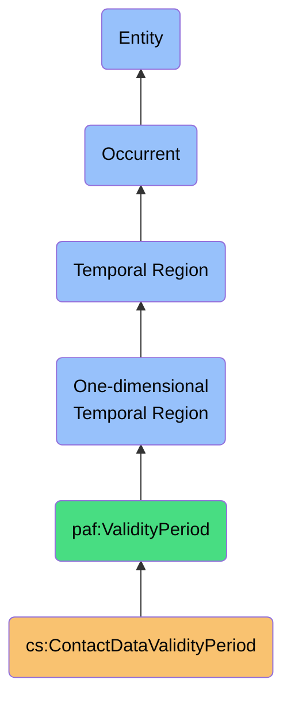
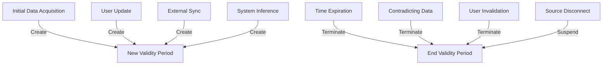

# ContactDataValidityPeriod

## Definition
A ContactDataValidityPeriod is an occurrent temporal region that represents the time interval during which specific contact information is considered accurate, authoritative, and appropriate for use, bounded by creation or verification events and expiration or invalidation events.

## Hierarchy in BFO


## Overview
A ContactDataValidityPeriod is a fundamental temporal structure that captures the dynamic nature of contact information truth over time. Unlike static timestamps, this temporal region defines the complete interval throughout which specific contact attributes or entire contact records can be considered valid representations of reality.

This entity plays a crucial role in addressing the temporal dimension of data sovereignty, enabling the personal AI system to reason about when different pieces of information were valid, which should take precedence during conflicts, and when information should be updated or verified. It provides the temporal foundation for maintaining an accurate, up-to-date understanding of contacts while preserving historical context.

By explicitly modeling validity periods rather than just modification timestamps, the system can capture nuanced temporal semantics such as prospective changes, retroactive corrections, planned obsolescence, and cyclical validity patterns, allowing for sophisticated temporal reasoning about contact data.

## Properties

### Boundary Properties
| Property | Type | Description | Example |
|----------|------|-------------|---------|
| validityStart | DateTime | Beginning of validity period | "2023-01-15T00:00:00Z" |
| validityEnd | DateTime | End of validity period | "2023-12-31T23:59:59Z" |
| isOpenEnded | Boolean | Whether end is undetermined | true |
| startBoundaryType | Enum | Type of starting boundary | "Inclusive", "Exclusive", "Fuzzy" |
| endBoundaryType | Enum | Type of ending boundary | "Inclusive", "Exclusive", "FutureEstimate" |

### Qualification Properties
| Property | Type | Description | Example |
|----------|------|-------------|---------|
| validityScope | ValidityScope | What data is covered | {"fields": ["email", "phoneNumber"], "aspects": ["accessibility"]} |
| validityContext | ContextType | Situational context | "Professional", "Personal", "Legal" |
| confidenceLevel | Decimal | Certainty about validity | 0.95 |
| authoritySource | Reference | Authority that established validity | "userVerification", "platformSync:LinkedIn" |
| validityType | Enum | Category of validity | "Verified", "Estimated", "Inferred", "Default" |

### Lifecycle Properties
| Property | Type | Description | Example |
|----------|------|-------------|---------|
| creationEvent | Reference | Event establishing validity | {"type": "UserUpdate", "id": "update-123", "time": "2023-01-15T10:23:45Z"} |
| terminationEvent | Reference | Event ending validity | {"type": "NewDataReceived", "id": "sync-456", "time": "2023-12-31T08:15:30Z"} |
| supersededBy | Reference | Newer validity period | "validity-period-789" |
| supersedes | Reference | Older validity period | "validity-period-123" |
| verificationEvents | Reference[] | Confirmation events | [{"type": "UserConfirmation", "time": "2023-06-15T14:22:10Z"}] |

## Temporal Structures

### Temporal Topology
- **Bounded Period**: Well-defined start and end points
- **Open-Ended Period**: Defined start with indefinite end
- **Retrospective Period**: Retroactively defined validity
- **Prospective Period**: Future planned validity
- **Recurring Period**: Cyclical or repeating validity

### Temporal Relations
- **Temporal Overlap**: Periods with shared valid time
- **Temporal Precedence**: One period before another
- **Temporal Containment**: One period fully within another
- **Temporal Adjacency**: Periods meeting at boundaries
- **Temporal Disjunction**: Non-overlapping periods

### Temporal Granularity
- **Instant-Level**: Precise moment of validity
- **Day-Level**: Valid throughout specific days
- **Month-Level**: Valid throughout specific months
- **Season-Level**: Valid during specific seasons
- **Fuzzy Boundary**: Approximate period boundaries

## Validity Contexts

### Domain-Specific Validity
- **Professional Contexts**: Validity in work environments
- **Personal Contexts**: Validity in private interactions
- **Social Contexts**: Validity in social settings
- **Legal Contexts**: Validity for legal purposes
- **Emergency Contexts**: Validity for urgent situations

### Temporal Context Patterns
| Context Type | Typical Duration | Verification Frequency | Examples |
|--------------|------------------|------------------------|----------|
| Professional | Long-term | Annual | Job title, work email |
| Contact Info | Medium-term | Bi-annual | Phone number, email |
| Location | Medium-term | Quarterly | Address, timezone |
| Preferences | Variable | Event-driven | Communication preferences |
| Social Media | Short-term | Monthly | Handles, profile links |

### Contextual Authority
- **User-Verified**: Directly confirmed by user
- **Platform-Sourced**: Provided by external platform
- **System-Inferred**: Determined by system logic
- **Third-Party-Provided**: Supplied by external entity
- **Default-Assigned**: Standard validity assumption

## Validity Determination

### Establishment Processes


### Transition Types
- **Creation**: Establishing a new validity period
- **Verification**: Confirming ongoing validity
- **Adjustment**: Modifying validity parameters
- **Expiration**: Natural end of validity
- **Invalidation**: Forced end of validity

### Confidence Factors
- **Recency**: How recently validity was confirmed
- **Source Authority**: Reliability of validity source
- **Consistency**: Agreement with other data points
- **Verification Method**: How validity was established
- **User Input**: Degree of user involvement

## Data Objects

### Covered Data Types
- **Contact Identity Fields**: Name, identifiers, etc.
- **Contact Information Fields**: Email, phone, address, etc.
- **Relationship Metadata**: Connection type, strength, etc.
- **Professional Data**: Job title, company, etc.
- **Platform-Specific Data**: Platform IDs, handles, etc.

### Validation Coverage
```typescript
interface ValidityScope {
  // What specifically this validity period covers
  dataType: 'ContactRecord' | 'ContactField' | 'ContactRelationship';
  
  // If field-specific, which fields
  fields?: string[];
  
  // If record-specific, which record
  recordId?: string;
  
  // If relationship-specific, which relationship
  relationshipId?: string;
  
  // Optional context limitation
  contextLimitation?: ContextType[];
}
```

### Validation Examples
```json
{
  "validityPeriodId": "vp-123456",
  "validityStart": "2023-03-15T00:00:00Z",
  "validityEnd": null,
  "isOpenEnded": true,
  "startBoundaryType": "Inclusive",
  "endBoundaryType": null,
  "validityScope": {
    "dataType": "ContactField",
    "fields": ["workEmail", "phoneNumber"],
    "recordId": "contact-789",
    "contextLimitation": ["Professional"]
  },
  "confidenceLevel": 0.95,
  "authoritySource": "platformSync:LinkedIn",
  "validityType": "Verified",
  "creationEvent": {
    "type": "SyncEvent",
    "id": "sync-234",
    "time": "2023-03-15T14:22:10Z"
  },
  "verificationEvents": [
    {
      "type": "UserConfirmation",
      "id": "user-verify-345",
      "time": "2023-06-10T09:15:22Z"
    }
  ]
}
```

## Implementation Aspects

### Temporal Model Implementation
```typescript
class ContactDataValidityPeriod {
  readonly id: string;
  
  // Core temporal boundaries
  readonly start: Date;
  readonly end: Date | null;
  readonly isOpenEnded: boolean;
  
  // Validity metadata
  readonly scope: ValidityScope;
  readonly confidence: number;
  readonly authority: AuthoritySource;
  readonly validityType: ValidityType;
  
  // Lifecycle tracking
  readonly createdBy: Event;
  readonly terminatedBy: Event | null;
  readonly verifications: Event[];
  
  // Relation to other periods
  readonly supersedes: string[];
  readonly supersededBy: string[];
  
  constructor(config: ValidityPeriodConfig) {
    this.id = config.id;
    this.start = new Date(config.start);
    this.end = config.end ? new Date(config.end) : null;
    this.isOpenEnded = !config.end;
    this.scope = config.scope;
    this.confidence = config.confidence || 1.0;
    this.authority = config.authority;
    this.validityType = config.validityType;
    this.createdBy = config.createdBy;
    this.terminatedBy = config.terminatedBy || null;
    this.verifications = config.verifications || [];
    this.supersedes = config.supersedes || [];
    this.supersededBy = config.supersededBy || [];
  }
  
  isActive(date: Date = new Date()): boolean {
    const isAfterStart = date >= this.start;
    const isBeforeEnd = this.isOpenEnded || (this.end && date <= this.end);
    return isAfterStart && isBeforeEnd;
  }
  
  overlaps(otherPeriod: ContactDataValidityPeriod): boolean {
    const thisEnd = this.end || new Date(8640000000000000); // Max date
    const otherEnd = otherPeriod.end || new Date(8640000000000000);
    
    return this.start <= otherEnd && otherPeriod.start <= thisEnd;
  }
  
  contains(date: Date): boolean {
    return this.isActive(date);
  }
  
  verify(event: VerificationEvent): ContactDataValidityPeriod {
    return new ContactDataValidityPeriod({
      ...this,
      verifications: [...this.verifications, event],
      confidence: Math.min(1.0, this.confidence + 0.1)
    });
  }
  
  terminate(event: TerminationEvent): ContactDataValidityPeriod {
    return new ContactDataValidityPeriod({
      ...this,
      end: event.time,
      isOpenEnded: false,
      terminatedBy: event
    });
  }
}
```

### Query Examples
```typescript
// Find all currently valid email addresses
const validEmails = contactStore.findValidData({
  fieldType: "email",
  validAt: new Date(),
  minConfidence: 0.7
});

// Check if a specific phone number is valid in a professional context
const isPhoneValid = contactDataValidityService.isValid({
  contactId: "contact-456",
  field: "phoneNumber",
  context: "Professional",
  atTime: new Date()
});

// Get history of address validity
const addressValidityHistory = contactDataValidityService.getValidityHistory({
  contactId: "contact-789",
  field: "address",
  timeRange: {
    start: new Date("2020-01-01"),
    end: new Date()
  }
});
```

## Integration with Other Entities

### Relates to Material Entities
- **Contact Record**: Whose data is governed by validity period
- **Platform Account**: Source of validity information
- **Data Source**: Origin of the valid information
- **User**: Person who verifies or invalidates data

### Relates to Processes
- **ContactSynchronizationProcess**: Establishes/updates validity periods
- **DataVerificationProcess**: Confirms continued validity
- **DataCleansingProcess**: Removes invalid data
- **IdentityResolutionProcess**: Uses validity to weigh evidence
- **ContactMergingProcess**: Considers validity in conflict resolution

### Relates to Qualities
- **DataFreshness**: Quality related to recency of validity period
- **DataAccuracy**: Quality influenced by validity confidence
- **DataCompleteness**: Quality related to scope of validity period
- **DataCoherence**: Quality of consistency between validity periods
- **DataAuthority**: Quality reflecting source of validity assertion

## Temporal Reasoning

### Temporal Logic Operations
- **Validity at Time T**: Whether data was valid at specific moment
- **Most Recently Valid**: Latest valid data as of time T
- **Validity Duration**: How long data remained valid
- **Validity Overlap**: Period when multiple values were valid
- **Validity Gap**: Period with no valid value

### Conflict Resolution Strategies
| Conflict Type | Resolution Strategy | Example |
|---------------|---------------------|---------|
| Overlapping Periods | Higher confidence wins | Work email vs. personal email |
| Sequential Periods | Most recent wins | New address vs. old address |
| Context Mismatch | Apply context-specificity | Work phone vs. home phone |
| Authority Conflict | Higher authority wins | User-verified vs. auto-synced |
| Partial Overlap | Create new boundary | Partial corrections to validity |

### Temporal Inference
- **Validity Projection**: Predicting future validity
- **Validity Interpolation**: Filling gaps between validity periods
- **Expiration Forecasting**: Predicting when validity will end
- **Verification Need Assessment**: Determining when to verify
- **Temporal Anomaly Detection**: Identifying unusual validity patterns

## Governance

### Policy Aspects
- **Default Validity Duration**: Standard validity lifetime by data type
- **Verification Requirements**: When verification is required
- **Confidence Decay**: How confidence decreases over time
- **Minimum Confidence Threshold**: Required for data use
- **Cross-Context Rules**: How validity transfers between contexts

### Ethical Considerations
- **Outdated Data Risks**: Implications of using expired data
- **Premature Invalidation**: Consequences of early termination
- **Verification Burden**: Balancing verification needs with user effort
- **Temporal Privacy**: Protecting historical information
- **Right to be Forgotten**: Implementing data expiration

### Compliance Aspects
- **GDPR Storage Limitation**: Aligning with retention requirements
- **Data Accuracy**: Meeting obligations for correct data
- **Audit Requirements**: Tracking validity for compliance purposes
- **Evidence Preservation**: Maintaining proof of validity
- **Rectification Support**: Enabling correction of invalid data

## History

### Conceptual Origin
- **Initial Concept**: Basic valid-from/valid-to fields in databases
- **Evolution**: Temporal database research and bi-temporal modeling
- **PAF Integration**: Reformulated as first-class entity (2022)

### Version History
- **v0.1**: Simple valid-from/valid-to implementation (2022-Q2)
- **v0.2**: Added context-specific validity (2022-Q3)
- **v1.0**: Full temporal region model with confidence (2023-Q1)
- **v1.1**: Enhanced with verification events tracking (2023-Q2)
- **v1.2**: Added authority-based validity reasoning (2023-Q3)

### Evolution Roadmap
- **Planned v2.0**: Advanced temporal reasoning capabilities
- **Planned v2.1**: Predictive validity projection
- **Planned v2.2**: Contextual validity inference
- **Research Area**: Confidence-based temporal logic
- **Exploration**: Self-adapting validity periods 