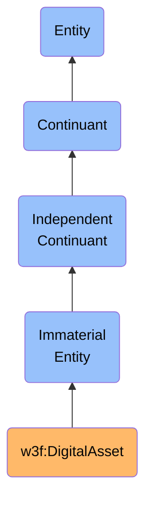

# DigitalAsset

## Definition
A DigitalAsset is an independent continuant immaterial entity that represents tokenized value on a blockchain network, which can be owned, transferred, and managed through cryptographic mechanisms, and may embody rights, value, or utility within digital ecosystems.

## Hierarchy in BFO

## Overview
A DigitalAsset exists as an immaterial entity on blockchain networks, representing value or rights that can be cryptographically transferred between parties without requiring trusted intermediaries. Unlike physical assets, digital assets derive their properties from the consensus rules of their host blockchain networks and the smart contracts that govern them. Their immateriality is manifested through cryptographic proofs of ownership recorded on distributed ledgers, while their value stems from scarcity, utility, social consensus, or rights they confer.

Digital assets can range from cryptocurrencies (fungible tokens with monetary properties) to non-fungible tokens (NFTs) representing unique digital items, collectibles, or rights to physical assets. They can also embody governance rights in decentralized protocols, access permissions to services, or claims on future revenue streams. Their behavior is determined by their underlying code and the rules of the networks on which they operate.

## Types of Digital Assets

### By Fungibility
- **Fungible Tokens**: Interchangeable units with identical properties (e.g., Bitcoin, Ethereum, ERC-20 tokens)
- **Non-Fungible Tokens (NFTs)**: Unique, non-interchangeable assets with distinct properties (e.g., ERC-721 tokens)
- **Semi-Fungible Tokens**: Partially fungible assets with both unique and standard properties (e.g., ERC-1155 tokens)

### By Purpose
- **Cryptocurrencies**: Digital assets designed primarily as mediums of exchange or stores of value
- **Utility Tokens**: Assets that provide access to services or functionality within a specific ecosystem
- **Security Tokens**: Digital representations of traditional securities or investment contracts
- **Governance Tokens**: Assets that confer voting rights in protocol decision-making
- **Stablecoins**: Assets designed to maintain a stable value relative to a reference asset (e.g., USD)
- **Collectibles**: Unique digital items valued for their rarity, aesthetics, or cultural significance

### By Technical Standard
- **Native Network Assets**: Primary cryptocurrencies of blockchain networks (e.g., BTC, ETH)
- **ERC-20 Tokens**: Fungible tokens on Ethereum following the ERC-20 standard
- **ERC-721 Tokens**: Non-fungible tokens on Ethereum following the ERC-721 standard
- **ERC-1155 Tokens**: Multi-token standard on Ethereum supporting both fungible and non-fungible assets
- **BEP-20 Tokens**: Fungible tokens on Binance Smart Chain
- **SPL Tokens**: Token standard on Solana

## Related Classes
- **w3f:Web3Identity** - An independent continuant material entity that represents a cryptographic identity capable of owning and transferring digital assets.
- **w3f:BlockchainNetwork** - An independent continuant material entity that provides the distributed infrastructure on which digital assets exist.
- **w3f:SmartContract** - An immaterial entity that defines the rules governing digital assets' behavior, transfers, and other operations.
- **w3f:Transaction** - An occurrent entity representing the transfer of digital assets between identities.
- **w3f:TokenStandard** - An immaterial entity that defines the technical specification that a digital asset follows. 