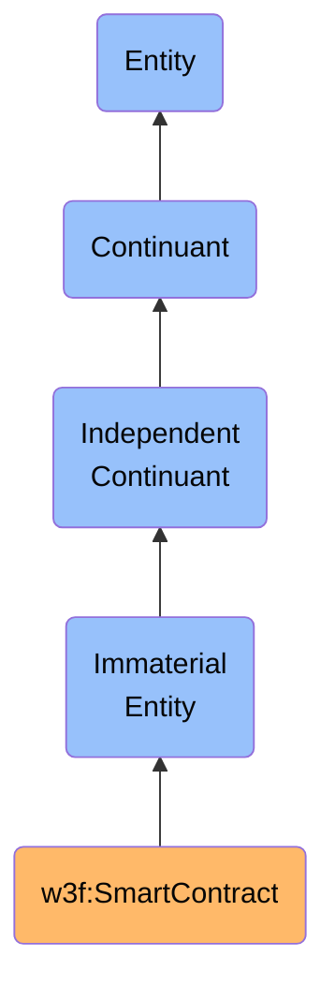

# SmartContract

## Definition
A SmartContract is an independent continuant immaterial entity that represents self-executing code deployed on a blockchain network, which automatically enforces and executes predefined rules and agreements when specific conditions are met, without requiring intermediary involvement.

## Hierarchy in BFO

## Overview
A SmartContract exists as an immaterial entity on blockchain networks that embodies programmatic logic to automate the execution of agreements and transactions. Unlike traditional contracts that require third-party enforcement, smart contracts are self-executing and self-enforcing through code that automatically evaluates conditions and executes consequences when triggered. Their immateriality is manifested through their existence as bytecode stored on blockchain networks, while their functionality derives from the deterministic execution of this code by the network's virtual machine.

Smart contracts can range from simple token transfers to complex decentralized applications (dApps) that manage digital assets, coordinate multi-party agreements, govern protocols, or facilitate decentralized finance (DeFi) operations. They provide trustless guarantees about execution outcomes by leveraging the security, transparency, and immutability properties of their underlying blockchain networks.

## Types of Smart Contracts

### By Complexity
- **Token Contracts**: Define and manage digital assets (e.g., ERC-20, ERC-721 contracts)
- **Multi-signature Wallets**: Require multiple signatures to authorize transactions
- **Escrow Contracts**: Hold assets in custody until specified conditions are met
- **Governance Contracts**: Manage voting and proposal systems for DAOs
- **DeFi Protocols**: Enable lending, borrowing, trading, or other financial operations
- **Oracle Contracts**: Connect blockchain systems with external data sources

### By Access Control
- **Ownable Contracts**: Controlled by a single administrative address
- **Role-Based Access Control**: Define multiple permission levels for different operations
- **Autonomous Contracts**: Self-governing without administrative intervention
- **Proxy Contracts**: Delegate calls to implementation contracts that can be upgraded

### By Mutability
- **Immutable Contracts**: Cannot be modified after deployment
- **Upgradeable Contracts**: Can be updated through proxy patterns or other mechanisms
- **Parameterized Contracts**: Allow specific parameters to be adjusted without full upgrades

## Related Classes
- **w3f:Web3Identity** - An independent continuant material entity that represents a cryptographic identity capable of deploying, interacting with, and administering smart contracts.
- **w3f:BlockchainNetwork** - An independent continuant material entity that provides the execution environment for smart contracts.
- **w3f:DigitalAsset** - An immaterial entity that can be created, managed, and transferred by smart contracts.
- **w3f:Transaction** - An occurrent entity representing the invocation of smart contract functions.
- **w3f:ContractState** - A dependent continuant representing the current values stored in a smart contract.
- **w3f:ContractFunction** - An immaterial entity representing a callable function defined in a smart contract.
- **w3f:ContractEvent** - An immaterial entity representing a logged event emitted by a smart contract. 