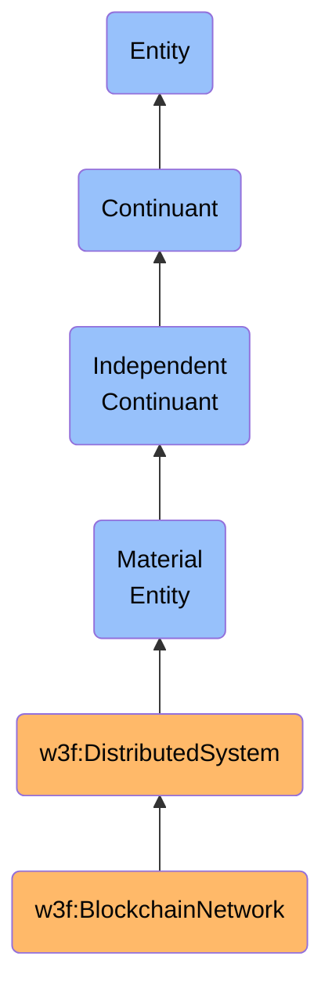

# BlockchainNetwork

## Definition
A BlockchainNetwork is an independent continuant material entity that represents a distributed computing infrastructure composed of physically distributed nodes that collectively maintain a shared, append-only ledger of cryptographically secured and linked data blocks according to a consensus protocol.

## Hierarchy in BFO


## Overview
A BlockchainNetwork is a physical distributed system comprised of interconnected computing nodes that collectively maintain a shared state according to predefined consensus rules. As a material entity, it encompasses the physical computing infrastructure, network connections, and storage systems that enable the operation of the blockchain. Unlike traditional centralized databases, a BlockchainNetwork operates through distributed consensus where no single entity controls the system, and truth is determined through cryptographic verification and adherence to protocol rules.

The materiality of a BlockchainNetwork is manifested in its constituent nodes—physical servers, mining equipment, validation hardware, and network infrastructure—that span geographical boundaries. While the data within a blockchain is immaterial, the BlockchainNetwork itself is the material substrate that maintains, secures, and propagates this data through physical computing processes.

Each BlockchainNetwork implements specific consensus mechanisms, block validation rules, and cryptographic primitives that define its operational characteristics. These networks vary in their design choices regarding security models, performance characteristics, degree of decentralization, and intended applications, leading to a rich taxonomy of blockchain implementations.

## Properties

### Physical Properties
| Property | Type | Description | Example |
|----------|------|-------------|---------|
| nodeCount | Integer | Total number of participating nodes | 10,457 nodes |
| geographicDistribution | Map | Distribution of nodes by geography | {"North America": 48%, "Europe": 32%, "Asia": 15%, "Other": 5%} |
| hashingPower | Number | Total computational power securing network | 180 EH/s (exahashes per second) |
| hardwareTypes | Set | Types of hardware running the network | ["ASICs", "GPUs", "CPUs", "Validators"] |
| energyConsumption | Number | Energy used by the network | 150 TWh/year |
| networkConnectivity | Graph | Topology of node connections | Peer-to-peer mesh network |

### Technical Properties
| Property | Type | Description | Example |
|----------|------|-------------|---------|
| consensusMechanism | String | Method for achieving agreement | "Proof of Work", "Proof of Stake", "Delegated Proof of Stake" |
| blockTime | Duration | Average time between blocks | 10 minutes, 12 seconds |
| transactionCapacity | Number | Transactions per time unit | 7 transactions per second |
| chainLength | Integer | Current number of blocks | 800,245 blocks |
| activeSince | DateTime | Genesis block timestamp | "2009-01-03T18:15:05Z" |
| protocolVersion | String | Current version of protocol | "Taproot 0.21.1" |
| currentDifficulty | Number | Difficulty target for mining | 27.55 trillion |

### Economic Properties
| Property | Type | Description | Example |
|----------|------|-------------|---------|
| nativeAsset | String | Primary token of the network | "BTC", "ETH", "SOL" |
| marketCapitalization | Number | Total value of native asset | $565 billion |
| totalTransactionVolume | Number | Historical transaction value | $23.5 trillion |
| averageFee | Number | Average cost per transaction | 0.0005 BTC, 25 gwei |
| totalValueLocked | Number | Value secured by the network | $89 billion |
| dailyActiveAddresses | Integer | Unique addresses per day | 1.2 million |
| memPoolSize | Integer | Pending transactions | 15,673 transactions |

## Subtypes

### By Consensus Mechanism
- **Proof of Work Networks**: Secured by computational work (e.g., Bitcoin, Litecoin)
- **Proof of Stake Networks**: Secured by economic stake (e.g., Ethereum 2.0, Cardano)
- **Delegated Proof of Stake Networks**: Secured by elected validators (e.g., EOS, Tron)
- **Proof of Authority Networks**: Secured by identified validators (e.g., private chains)
- **Hybrid Consensus Networks**: Combining multiple mechanisms (e.g., Dash)

### By Access Control
- **Public Networks**: Open participation (e.g., Ethereum, Bitcoin)
- **Private Networks**: Restricted participation (e.g., Hyperledger Fabric deployments)
- **Permissioned Networks**: Authorized participation (e.g., R3 Corda deployments)
- **Consortium Networks**: Multi-organization governance (e.g., Energy Web Chain)

### By Architecture
- **Layer 1 Networks**: Base consensus layers (e.g., Bitcoin, Ethereum)
- **Layer 2 Networks**: Scaling solutions on top of base layers (e.g., Lightning Network, Optimism)
- **Sidechains**: Independent chains connected to parent chains (e.g., Liquid)
- **Parachains**: Specialized chains in a shared security ecosystem (e.g., Polkadot parachains)

### By Capability
- **Smart Contract Platforms**: Programmable blockchains (e.g., Ethereum, Solana)
- **Currency Networks**: Value transfer focused (e.g., Bitcoin, Monero)
- **Storage Networks**: Data persistence focused (e.g., Filecoin, Arweave)
- **Oracle Networks**: External data focused (e.g., Chainlink)
- **Identity Networks**: Self-sovereign identity focused (e.g., Sovrin)

## Related Entities

### Dependent Continuants Inherent In
- **NetworkState**: Current state of the blockchain and mempool
- **ConsensusState**: Current state of agreement among nodes
- **ForkChoice**: Rules determining the canonical chain
- **NetworkHealth**: Metrics about network performance and security

### Material Entities That Are Part Of
- **Node**: Individual computing system participating in the network
- **Miner/Validator**: Specialized node that creates blocks
- **NetworkInfrastructure**: Physical connections between nodes
- **DataCenter**: Physical hosting location for multiple nodes

### Immaterial Entities That Inhere In
- **ConsensusProtocol**: Rules governing network agreement
- **CryptographicPrimitives**: Mathematical functions securing the network
- **NetworkProtocol**: Communication standards between nodes
- **TokenEconomics**: Incentive design of the network

## Capabilities

### Data Persistence
- **Immutable Storage**: Preserving historical data permanently
- **Tamper Resistance**: Protecting against data manipulation
- **Data Availability**: Ensuring retrievability of stored information
- **State Transitions**: Managing changes to global state

### Security Enforcement
- **Double-Spend Prevention**: Ensuring assets are not spent multiple times
- **Sybil Attack Resistance**: Preventing identity spoofing
- **51% Attack Resistance**: Resisting majority control
- **Transaction Validation**: Enforcing transaction rule compliance

### Network Operations
- **Block Production**: Creating new blocks of transactions
- **Transaction Broadcasting**: Propagating new transactions
- **Peer Discovery**: Finding and connecting to network nodes
- **State Synchronization**: Updating nodes with current state

### Economic Functions
- **Value Transfer**: Moving assets between addresses
- **Fee Market**: Determining transaction inclusion priority
- **Validator Incentives**: Rewarding network security providers
- **Tokenized Asset Management**: Handling digital assets

## Relationships

### To Web3Identity
BlockchainNetworks authenticate interactions from Web3Identities through cryptographic signatures, providing a permissionless environment where any valid identity can transact according to protocol rules without prior authorization.

### To DigitalAsset
BlockchainNetworks provide the material substrate for DigitalAssets, maintaining their ownership records, managing their transfers, and enforcing their scarcity or uniqueness properties through consensus.

### To SmartContract
BlockchainNetworks execute SmartContracts according to predefined execution environments, maintaining their state and processing their state transitions in a deterministic, transparent manner.

### To Transaction
BlockchainNetworks process Transactions, including them in blocks, validating their correctness, and maintaining an immutable record of their execution and effects.

### To ConsensusProtocol
BlockchainNetworks implement ConsensusProtocols, which define the rules by which they operate, determine valid state transitions, and establish agreement among distributed participants.

## Examples

### Bitcoin Network
```json
{
  "type": "BlockchainNetwork",
  "id": "bitcoin-mainnet",
  "consensusMechanism": "Proof of Work",
  "hashingAlgorithm": "SHA-256",
  "nativeAsset": "BTC",
  "genesisDate": "2009-01-03T18:15:05Z",
  "blockTime": "600 seconds",
  "currentBlockHeight": 800245,
  "nodeCount": 15000,
  "hashingPower": "340 EH/s",
  "implementation": "Bitcoin Core",
  "maxSupply": 21000000,
  "blockReward": 6.25,
  "blockSize": "1 MB",
  "transactionCapacity": "7 TPS"
}
```

### Ethereum Network
```json
{
  "type": "BlockchainNetwork",
  "id": "ethereum-mainnet",
  "consensusMechanism": "Proof of Stake",
  "executionEnvironment": "Ethereum Virtual Machine",
  "nativeAsset": "ETH",
  "genesisDate": "2015-07-30T00:00:00Z",
  "blockTime": "12 seconds",
  "currentBlockHeight": 17500000,
  "nodeCount": 8000,
  "activeValidators": 500000,
  "implementation": "Geth, Erigon, Nethermind",
  "issuanceModel": "Minimum necessary issuance",
  "gasLimit": "30,000,000",
  "transactionCapacity": "15 TPS",
  "layer2Solutions": ["Optimism", "Arbitrum", "zkSync"]
}
```

### Solana Network
```json
{
  "type": "BlockchainNetwork",
  "id": "solana-mainnet",
  "consensusMechanism": "Proof of Stake with Proof of History",
  "executionEnvironment": "Sealevel",
  "nativeAsset": "SOL",
  "genesisDate": "2020-03-16T00:00:00Z",
  "blockTime": "400 milliseconds",
  "currentBlockHeight": 180000000,
  "nodeCount": 1675,
  "activeValidators": 1900,
  "implementation": "Solana-labs",
  "stakeDistribution": "100M SOL",
  "transactionCapacity": "65,000 TPS",
  "storageRequirements": "High-performance SSD"
}
```

## Implementation

### Data Integration
When integrating with BlockchainNetworks, systems must:

1. Connect to network nodes via RPC, WebSockets, or P2P protocols
2. Verify cryptographic proofs of data authenticity
3. Handle chain reorganizations and temporary forks
4. Manage network-specific serialization formats
5. Track finality guarantees specific to each network

```typescript
// Example of connecting to multiple blockchain networks
class BlockchainNetworkConnector {
  private networks: Map<string, NetworkConnection> = new Map();
  
  async connectToNetwork(networkId: string, connectionConfig: ConnectionConfig): Promise<NetworkConnection> {
    // Determine network type and create appropriate connection
    const networkType = this.determineNetworkType(networkId);
    
    let connection;
    switch (networkType) {
      case 'bitcoin':
        connection = new BitcoinNetworkConnection(connectionConfig);
        break;
      case 'ethereum':
        connection = new EthereumNetworkConnection(connectionConfig);
        break;
      case 'solana':
        connection = new SolanaNetworkConnection(connectionConfig);
        break;
      // Other network types...
      default:
        throw new Error(`Unsupported network type: ${networkType}`);
    }
    
    await connection.initialize();
    this.networks.set(networkId, connection);
    return connection;
  }
  
  async getNetworkState(networkId: string): Promise<NetworkState> {
    const connection = this.networks.get(networkId);
    if (!connection) {
      throw new Error(`Not connected to network: ${networkId}`);
    }
    
    return await connection.getCurrentState();
  }
  
  // Additional methods for network interaction...
}

// Example of monitoring blockchain network health
class BlockchainNetworkMonitor {
  async getNetworkHealth(networkId: string): Promise<NetworkHealth> {
    const nodeCount = await this.getActiveNodeCount(networkId);
    const blockHeight = await this.getLatestBlockHeight(networkId);
    const blockTime = await this.getAverageBlockTime(networkId, 100); // Last 100 blocks
    const feeEstimate = await this.estimateTransactionFee(networkId);
    const networkLoad = await this.getNetworkLoad(networkId);
    
    return {
      id: networkId,
      timestamp: new Date(),
      metrics: {
        nodeCount,
        blockHeight,
        blockTime,
        feeEstimate,
        networkLoad,
        status: this.determineNetworkStatus({
          nodeCount,
          blockHeight,
          blockTime,
          feeEstimate,
          networkLoad
        })
      }
    };
  }
  
  // Implementation of specific monitoring functions...
}
```

### Interoperability
To achieve interoperability between different BlockchainNetworks, systems must:

1. Implement cross-chain communication protocols
2. Manage asset bridges between networks
3. Verify cross-chain transaction proofs
4. Handle different finality guarantees and trust assumptions
5. Normalize data representations across different networks

```typescript
// Example of cross-chain asset transfer
class CrossChainBridge {
  async transferAsset(
    sourceNetwork: string,
    destinationNetwork: string,
    assetId: string,
    amount: string,
    fromAddress: string,
    toAddress: string
  ): Promise<TransferResult> {
    // Verify networks are supported
    this.verifyNetworkSupport(sourceNetwork, destinationNetwork);
    
    // Lock or burn assets on source chain
    const sourceTx = await this.lockAssetOnSourceChain(
      sourceNetwork,
      assetId,
      amount,
      fromAddress
    );
    
    // Wait for source transaction confirmation
    await this.waitForTransactionFinality(sourceNetwork, sourceTx.hash);
    
    // Generate proof of lock/burn
    const proof = await this.generateCrossChainProof(
      sourceNetwork,
      sourceTx.hash
    );
    
    // Mint or release assets on destination chain
    const destinationTx = await this.releaseAssetOnDestinationChain(
      destinationNetwork,
      assetId,
      amount,
      toAddress,
      proof
    );
    
    // Return transfer result
    return {
      sourceTransaction: sourceTx,
      destinationTransaction: destinationTx,
      transferId: this.generateTransferId(sourceTx.hash, destinationTx.hash),
      status: 'completed'
    };
  }
  
  // Implementation of specific bridge functions...
}
```

## Governance

### Technical Evolution
BlockchainNetworks evolve through:

1. Improvement Proposals (BIPs, EIPs, etc.)
2. Reference Implementation Development
3. Soft Forks (backward compatible upgrades)
4. Hard Forks (backward incompatible upgrades)
5. Community Consensus Formation

### Governance Models
Different networks employ various governance approaches:

1. **Off-Chain Governance**: Informal processes (e.g., Bitcoin)
2. **On-Chain Governance**: Protocol-defined processes (e.g., Tezos)
3. **DAO Governance**: Token-based voting (e.g., MakerDAO)
4. **Foundation Governance**: Entity-led direction (e.g., Cardano)
5. **Hybrid Governance**: Combining multiple approaches (e.g., Polkadot)

### Forks and Network Splits
When governance consensus fails, networks may split:

1. **Contentious Hard Fork**: Community divides, chain splits (e.g., Bitcoin/Bitcoin Cash)
2. **Planned Hard Fork**: Community agrees, single chain continues (e.g., Ethereum's London fork)
3. **Chain Reorganization**: Short-term forks resolved by consensus rules

## History and Evolution

### Bitcoin (2009)
The first successful implementation of a blockchain network, introducing Proof of Work consensus and focused on peer-to-peer electronic cash.

### Ethereum (2015)
Expanded the blockchain concept to include general-purpose computation through smart contracts, introducing the concept of a "world computer."

### Proof of Stake Networks (2016+)
Moved away from energy-intensive Proof of Work to stake-based security models (e.g., Tezos, Cosmos, Ethereum 2.0).

### Layer 2 Scaling Solutions (2018+)
Added execution layers above base blockchains to improve scalability while inheriting security from the parent chain.

### Cross-Chain Ecosystems (2020+)
Developed specialized blockchains that can communicate with each other in a secure ecosystem (e.g., Polkadot, Cosmos).

### Hybrid Systems (2022+)
Combined blockchain networks with traditional systems and privacy technologies to address enterprise and regulatory requirements.

## Practical Considerations

### Selection Criteria
When selecting a BlockchainNetwork for a specific use case, consider:

1. **Security Model**: Threat model alignment and security guarantees
2. **Performance Characteristics**: Throughput, latency, and finality time
3. **Cost Structure**: Transaction fees and operational costs
4. **Development Ecosystem**: Available tools, libraries, and developer community
5. **Governance Process**: How changes to the network are proposed and implemented
6. **Regulatory Compliance**: Alignment with relevant regulatory frameworks
7. **Interoperability**: Ability to connect with other systems and networks

### Technical Limitations
Current BlockchainNetworks face various challenges:

1. **Scalability Trilemma**: Balancing decentralization, security, and scalability
2. **Energy Consumption**: Sustainability concerns for Proof of Work networks
3. **Data Availability**: Managing growing state size and node requirements
4. **Privacy Limitations**: Default transparency vs. confidentiality needs
5. **User Experience**: Complex key management and interaction paradigms
6. **Interoperability Challenges**: Fragmentation across multiple networks
7. **Oracle Problem**: Securely connecting to external data sources 