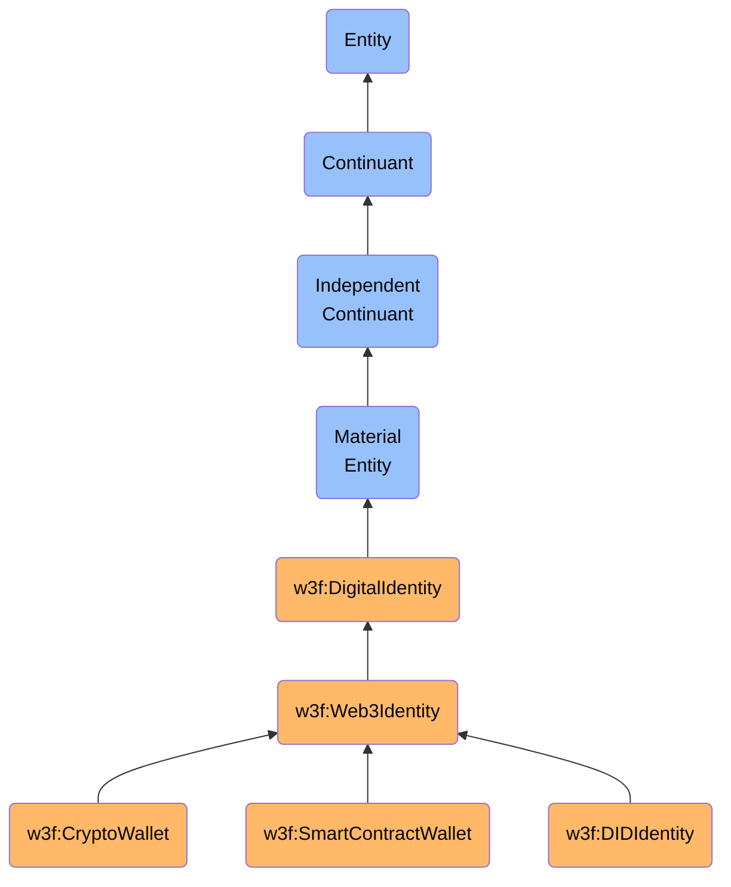

# Web3Identity

## Definition
A Web3Identity is an independent continuant material entity that represents a cryptographically secured digital identity within Web3 ecosystems, consisting of one or more cryptographic key pairs that enable authentication, authorization, and engagement with blockchain networks, decentralized applications, and digital assets without reliance on centralized identity providers.

## Hierarchy in BFO


## Overview
A Web3Identity is a self-sovereign digital identity that operates through cryptographic key pairs stored in physical computing devices or specialized hardware. Unlike traditional platform-mediated identities, Web3Identities are directly controlled by their owners through possession of private keys, requiring no permission from central authorities to create or use. These identities manifest as addresses or account identifiers on blockchain networks, enabling a wide range of cryptographically verified interactions including asset transfers, smart contract executions, governance participation, and digital signatures.

The materiality of a Web3Identity comes from the physical storage of private keys (in hardware wallets, secure enclaves, or other physical media) and the computational processes required to generate signatures and verify transactions. While the address or identifier itself is immaterial, the Web3Identity as a whole encompasses the material components necessary for its operation.

Web3Identities can exist across multiple blockchain networks simultaneously, maintain different capabilities and reputation on each network, and may employ various key management strategies ranging from simple private key storage to complex multi-signature or threshold schemes. They represent a paradigm shift from organizational-granted identity to self-generated, cryptographically verifiable identity that can operate without intermediaries.

## Properties

### Cryptographic Properties
| Property | Type | Description | Example |
|----------|------|-------------|---------|
| addressFormat | String | Address derivation standard | "EIP-55", "Bech32", "Base58Check" |
| keyType | String | Cryptographic key algorithm | "ECDSA (secp256k1)", "EdDSA (ed25519)" |
| derivationPath | String | HD wallet path (if applicable) | "m/44'/60'/0'/0/0" |
| publicKey | String | Public component of key pair | "0x04a1b2c3..." (hex encoded) |
| securityLevel | String | Key security categorization | "Hardware secured", "Software wallet", "Custodial" |
| multiSigConfiguration | Object | Details if multi-signature | {"threshold": 2, "signers": 3, "timelock": "24h"} |
| recoveryMechanism | String | Method to recover access | "Social recovery", "Seed phrase", "None" |

### Network Properties
| Property | Type | Description | Example |
|----------|------|-------------|---------|
| addresses | Map | Network-specific addresses | {"ethereum": "0xabc...", "solana": "DX5d..."} |
| firstActive | Map | First activity by network | {"ethereum": "2021-05-12T15:30:00Z"} |
| transactionCount | Map | Number of transactions by network | {"ethereum": 1250, "polygon": 342} |
| controlledAssets | Map | Value controlled by network | {"ethereum": "$15,245", "optimism": "$2,345"} |
| networkPermissions | Map | Network-specific capabilities | {"aave": ["borrower", "supplier"], "compound": ["governor"]} |
| delegations | Array | Authority delegated to others | [{"to": "0xdef...", "purpose": "voting", "network": "ethereum"}] |
| reputation | Map | On-chain reputation scores | {"gitcoin": 87, "coordinape": 94} |

### Identity Properties
| Property | Type | Description | Example |
|----------|------|-------------|---------|
| ensName | String | Human-readable name | "vitalik.eth" |
| displayName | String | User-chosen name | "Alice's Main Wallet" |
| avatarUri | String | Profile image link | "ipfs://Qmz4a..." |
| verifiedCredentials | Array | Attestations held | [{"type": "KYC", "issuer": "Civic", "issued": "2022-01-15"}] |
| socialVerifications | Array | Linked social accounts | [{"platform": "Twitter", "handle": "@alice", "verified": true}] |
| controllerDID | String | Associated DID | "did:ethr:0xabc..." |
| primaryUse | String | Main identity purpose | "Personal", "DAO governance", "DeFi trading" |
| privacyPreferences | Object | Privacy settings | {"transactionHistory": "private", "assetDisclosure": "selective"} |

## Subtypes

### By Implementation
- **EOA Wallets**: Simple key pair-based (e.g., MetaMask, hardware wallets)
- **Smart Contract Wallets**: Programmable identity contracts (e.g., Argent, Safe)
- **MPC Wallets**: Distributed key management (e.g., ZenGo, Fireblocks)
- **Social Recovery Wallets**: Guardian-based recovery (e.g., Loopring Wallet)
- **Decentralized Identifiers**: Standard-compliant DIDs (e.g., Ceramic, ION)

### By Control Model
- **Self-Custodial**: Directly controlled by owner (e.g., hardware wallets)
- **Custodial**: Third-party controlled (e.g., exchange accounts)
- **Hybrid Custody**: Shared control (e.g., institutional MPC solutions)
- **Self-Sovereign**: Full user control with portable credentials
- **Proxy Identity**: Delegated control to another entity

### By Capability
- **Basic Transfer Wallets**: Asset transfer only (e.g., Bitcoin wallets)
- **Smart Contract Interaction Wallets**: DApp engagement (e.g., most Ethereum wallets)
- **Governance Identities**: Voting and DAO participation (e.g., governance delegation)
- **Service Provider Identities**: Business entities offering on-chain services
- **Privacy-Preserving Identities**: Zero-knowledge enabled identities (e.g., Tornado Cash users)

### By Authentication Method
- **Key Pair Identities**: Direct cryptographic signature (most common)
- **Multi-Signature Identities**: Requiring multiple keys (e.g., Safe)
- **Social Authentication**: Using social verification (e.g., Civic)
- **Biometric Authentication**: Using physical traits (e.g., Passkey integrations)
- **Threshold Signature**: Using threshold cryptography (e.g., TSS wallets)

## Related Entities

### Dependent Continuants Inherent In
- **DigitalSignature**: Cryptographic proof of transaction authorization
- **OwnershipClaim**: Association between identity and owned assets
- **ReputationScore**: Measure of trust or achievement in specific contexts
- **VerificationStatus**: State of identity verification within a system

### Material Entities That Are Part Of
- **HardwareWallet**: Physical device storing private keys
- **MobileDevice**: Phone or tablet running wallet software
- **SecureEnclave**: Specialized hardware for key protection
- **ComputationHardware**: Physical computing equipment for transaction signing

### Immaterial Entities That Inhere In
- **PrivateKey**: Secret cryptographic key for signature generation
- **RecoveryPhrase**: Seed words to regenerate keys
- **VerifiableCredential**: Attestation about the identity
- **SmartContractPermission**: On-chain defined capabilities

## Capabilities

### Authentication
- **Self-Authentication**: Proving identity through cryptographic signatures
- **Challenge-Response**: Responding to authentication challenges
- **Non-Repudiation**: Creating undeniable proof of actions
- **Selective Disclosure**: Revealing only necessary identity attributes

### Authorization
- **Transaction Approval**: Authorizing value transfers and contract interactions
- **Permission Granting**: Delegating rights to other entities
- **Access Control**: Managing resource access based on identity
- **Revocation**: Removing previously granted permissions

### Asset Management
- **Ownership Control**: Exercising rights over digital assets
- **Transfer Initiation**: Sending assets to other identities
- **Token Interaction**: Managing different token standards
- **Yield Generation**: Participating in staking and DeFi protocols

### Governance
- **Proposal Creation**: Initiating governance actions
- **Voting**: Participating in on-chain decisions
- **Delegation**: Assigning voting power to representatives
- **Policy Enforcement**: Implementing on-chain rules and permissions

## Relationships

### To BlockchainNetwork
Web3Identities interact with BlockchainNetworks by submitting cryptographically signed transactions, receiving state updates, and maintaining persistent state across the network's history.

### To DigitalAsset
Web3Identities establish ownership over DigitalAssets through cryptographic control, enabling exclusive rights to transfer, modify, or utilize these assets according to their programmed capabilities.

### To SmartContract
Web3Identities invoke SmartContracts by initiating transactions that trigger contract execution, potentially altering the contract's state based on the identity's permissions and the contract's logic.

### To Transaction
Web3Identities authorize Transactions through cryptographic signatures, establishing non-repudiable proof of intent to perform specific actions within blockchain ecosystems.

### To VerifiableCredential
Web3Identities may possess VerifiableCredentials that attest to specific attributes, qualifications, or entitlements while maintaining privacy and selective disclosure capabilities.

## Examples

### Basic EOA Wallet
```json
{
  "type": "Web3Identity",
  "subtype": "EOA",
  "addresses": {
    "ethereum": "0x742d35Cc6634C0532925a3b844Bc454e4438f44e",
    "polygon": "0x742d35Cc6634C0532925a3b844Bc454e4438f44e"
  },
  "keyType": "ECDSA (secp256k1)",
  "derivationPath": "m/44'/60'/0'/0/0",
  "securityLevel": "Hardware secured",
  "recoveryMechanism": "Seed phrase (BIP-39)",
  "ensName": "alice.eth",
  "firstActive": {
    "ethereum": "2020-04-12T14:22:33Z"
  },
  "transactionCount": {
    "ethereum": 847,
    "polygon": 142
  },
  "verifiedCredentials": [],
  "controlledAssets": {
    "ethereum": "$12,456.78",
    "polygon": "$2,765.43"
  }
}
```

### Smart Contract Wallet
```json
{
  "type": "Web3Identity",
  "subtype": "SmartContractWallet",
  "contractImplementation": "Safe (formerly Gnosis Safe)",
  "addresses": {
    "ethereum": "0x1a2B3c4D5e6F7a8B9c0D1e2F3a4B5c6D7e8F9a0b"
  },
  "multiSigConfiguration": {
    "threshold": 2,
    "signers": [
      {
        "address": "0x742d35Cc6634C0532925a3b844Bc454e4438f44e",
        "name": "Alice's Hardware Wallet"
      },
      {
        "address": "0x8a7B6c5D4e3F2a1B0c9D8a7B6c5D4e3F2a1B0c9D",
        "name": "Alice's Mobile Wallet"
      },
      {
        "address": "0xD4e3F2a1B0c9D8a7B6c5D4e3F2a1B0c9D8a7B6c5",
        "name": "Recovery Guardian (Bob)"
      }
    ],
    "timelock": "24h"
  },
  "securityLevel": "Multi-signature",
  "recoveryMechanism": "Social recovery",
  "ensName": "alice-multisig.eth",
  "firstActive": {
    "ethereum": "2021-06-22T09:45:21Z"
  },
  "transactionCount": {
    "ethereum": 124
  },
  "controlledAssets": {
    "ethereum": "$145,892.54"
  },
  "capabilities": [
    "ERC-721 interaction",
    "Batch transactions",
    "Module support",
    "Delegated transactions"
  ]
}
```

### Decentralized Identifier (DID)
```json
{
  "type": "Web3Identity",
  "subtype": "DIDIdentity",
  "did": "did:ethr:0x742d35Cc6634C0532925a3b844Bc454e4438f44e",
  "methods": ["ethr", "key", "web"],
  "controller": "0x742d35Cc6634C0532925a3b844Bc454e4438f44e",
  "addresses": {
    "ethereum": "0x742d35Cc6634C0532925a3b844Bc454e4438f44e"
  },
  "verificationMethods": [
    {
      "id": "did:ethr:0x742d35Cc6634C0532925a3b844Bc454e4438f44e#controller",
      "type": "EcdsaSecp256k1RecoveryMethod2020",
      "controller": "did:ethr:0x742d35Cc6634C0532925a3b844Bc454e4438f44e"
    }
  ],
  "verifiableCredentials": [
    {
      "type": ["VerifiableCredential", "KYCAMLAttestation"],
      "issuer": "did:web:verifycredential.io",
      "issuanceDate": "2022-05-12T16:30:45Z",
      "expirationDate": "2023-05-12T16:30:45Z",
      "credentialSubject": {
        "id": "did:ethr:0x742d35Cc6634C0532925a3b844Bc454e4438f44e",
        "kycAmlStatus": "verified"
      }
    }
  ],
  "services": [
    {
      "id": "did:ethr:0x742d35Cc6634C0532925a3b844Bc454e4438f44e#messaging",
      "type": "MessagingService",
      "serviceEndpoint": "https://ceramic.network/alice/messaging"
    }
  ]
}
```

## Implementation

### Key Management
```typescript
// Example of Web3Identity key management system
class Web3IdentityManager {
  private identities: Map<string, Web3Identity> = new Map();
  private keyManager: KeyManager;
  private credentialStore: CredentialStore;
  
  constructor(securityLevel: SecurityLevel) {
    this.keyManager = KeyManagerFactory.create(securityLevel);
    this.credentialStore = new CredentialStore();
  }
  
  async createIdentity(options: IdentityCreationOptions): Promise<Web3Identity> {
    // Generate or import cryptographic key material
    const keyPair = await this.keyManager.generateKeyPair(options.keyType);
    
    // Derive addresses for requested networks
    const addresses: Record<string, string> = {};
    for (const network of options.networks) {
      addresses[network] = await this.deriveAddress(keyPair.publicKey, network);
    }
    
    // Create identity object
    const identity: Web3Identity = {
      id: generateUniqueId(),
      type: options.type || 'EOA',
      keyType: options.keyType,
      addresses,
      securityLevel: this.keyManager.securityLevel,
      createdAt: new Date(),
      metadata: options.metadata || {}
    };
    
    // Store identity
    this.identities.set(identity.id, identity);
    return identity;
  }
  
  async signTransaction(identityId: string, network: string, transaction: Transaction): Promise<SignedTransaction> {
    const identity = this.identities.get(identityId);
    if (!identity) {
      throw new Error(`Identity not found: ${identityId}`);
    }
    
    // Retrieve key for signing
    const privateKey = await this.keyManager.getPrivateKey(identityId);
    
    // Create appropriate signer for network
    const signer = SignerFactory.createForNetwork(network);
    
    // Sign transaction
    return await signer.signTransaction(transaction, privateKey);
  }
  
  async addVerifiableCredential(identityId: string, credential: VerifiableCredential): Promise<void> {
    await this.credentialStore.storeCredential(identityId, credential);
  }
  
  async proveAttribute(identityId: string, attributeName: string, verifier: string): Promise<VerifiablePresentation> {
    const identity = this.identities.get(identityId);
    if (!identity) {
      throw new Error(`Identity not found: ${identityId}`);
    }
    
    // Get relevant credentials
    const credentials = await this.credentialStore.getCredentialsForAttribute(identityId, attributeName);
    
    // Create presentation with minimal disclosure
    const presentation = await this.createMinimalPresentation(credentials, attributeName, verifier);
    
    // Sign presentation
    const privateKey = await this.keyManager.getPrivateKey(identityId);
    return await this.signPresentation(presentation, privateKey);
  }
  
  // Implementation of supporting methods...
}
```

### Interoperability
When working with Web3Identities across different systems, implementations must support:

1. Multiple address formats and derivation methods
2. Cross-chain identity correlation and resolution
3. Verifiable credential interchange formats
4. Different signature schemes and verification methods
5. Permission and delegation models specific to each blockchain

```typescript
// Example of Web3Identity interoperability system
class IdentityResolver {
  private networkConnectors: Map<string, NetworkConnector> = new Map();
  private didResolver: DIDResolver;
  
  constructor(networks: string[], didMethods: string[]) {
    // Initialize network connections
    for (const network of networks) {
      this.networkConnectors.set(network, NetworkConnectorFactory.create(network));
    }
    
    // Initialize DID resolver
    this.didResolver = new DIDResolver(didMethods);
  }
  
  async resolveIdentity(identifier: string): Promise<ResolvedIdentity> {
    // Determine identifier type
    if (identifier.startsWith('did:')) {
      return await this.resolveFromDID(identifier);
    } else if (identifier.endsWith('.eth')) {
      return await this.resolveFromENS(identifier);
    } else if (identifier.match(/^0x[a-fA-F0-9]{40}$/)) {
      return await this.resolveFromEthereumAddress(identifier);
    } else if (identifier.includes('@')) {
      return await this.resolveFromSocial(identifier);
    } else {
      throw new Error(`Unsupported identifier format: ${identifier}`);
    }
  }
  
  async correlateIdentities(identifiers: string[]): Promise<CorrelatedIdentity> {
    // Resolve all identifiers
    const resolvedIdentities = await Promise.all(
      identifiers.map(id => this.resolveIdentity(id))
    );
    
    // Analyze relationships between identities
    const correlations = this.analyzeCorrelations(resolvedIdentities);
    
    // Determine confidence in identity correlation
    const confidenceScore = this.calculateConfidenceScore(correlations);
    
    // Build correlated identity
    return {
      identifiers,
      resolvedIdentities,
      correlations,
      confidenceScore,
      unifiedProfile: this.buildUnifiedProfile(resolvedIdentities, correlations)
    };
  }
  
  // Implementation of various resolution methods...
}
```

## Governance

### Identity Self-Sovereignty
Web3Identities adhere to self-sovereign identity principles:

1. **User Control**: The identity holder maintains exclusive control
2. **Permissionless Creation**: No authority required to create an identity
3. **Portable Recognition**: Identity functions across multiple systems
4. **Transparency**: Open standards and verifiable operations
5. **Interoperability**: Compatible with multiple networks and protocols

### Security Considerations
Web3Identity security encompasses:

1. **Key Management**: Secure generation, storage, and use of private keys
2. **Recovery Mechanisms**: Processes to restore access if keys are lost
3. **Authentication Factors**: Possibly combining multiple verification methods
4. **Privacy Protection**: Minimizing correlation and tracking risks
5. **Revocation Handling**: Managing credential and permission invalidation

### Development Standards
Web3Identity development follows standards including:

1. **Cryptographic Standards**: Elliptic curve cryptography, hashing algorithms
2. **Address Formats**: Network-specific address derivation and representation
3. **Signature Schemes**: Transaction and message signing processes
4. **Key Derivation**: Hierarchical deterministic wallet standards
5. **Verifiable Credentials**: W3C standards for portable attestations

## History and Evolution

### Single-Key Identity (2009-2015)
Early blockchain identities with simple key pairs, focused on direct custody with limited recovery options, exemplified by Bitcoin addresses.

### Smart Contract Identity (2015-2019)
The addition of programmable identity contracts with more complex logic, multi-signature capabilities, and social recovery mechanisms.

### Cross-Chain Identity (2019-2021)
Development of identities spanning multiple blockchains with unified management interfaces and cross-chain authentication capabilities.

### Decentralized Identifiers (2020-Present)
Standardized DIDs with verifiable credentials, improved privacy features, and selective disclosure capabilities.

### Account Abstraction (2022-Present)
Evolution towards more flexible and programmable identities with improved user experience and security models through account abstraction standards.

## Practical Considerations

### Selection Criteria
When choosing a Web3Identity implementation, consider:

1. **Security Requirements**: Appropriate key management for the use case
2. **Recovery Needs**: Balance between security and recoverability
3. **Usability Factors**: How the identity will be used and by whom
4. **Interoperability**: Compatibility with required systems and networks
5. **Cost Implications**: Transaction fees and operational expenses
6. **Privacy Needs**: Disclosure requirements and anonymity levels
7. **Regulatory Compliance**: Alignment with relevant legal frameworks

### Technical Limitations
Current Web3Identity systems face various challenges:

1. **Key Management Complexity**: Difficult for non-technical users
2. **Recovery Tradeoffs**: Balance between security and recoverability
3. **Cross-Chain Fragmentation**: Lack of unified identity across ecosystems
4. **Scalability Costs**: High transaction fees on some networks
5. **UX Friction**: Complex workflows for signature requests
6. **Privacy Leakage**: Public blockchain transparency exposing activity
7. **Regulatory Uncertainty**: Evolving legal framework for self-sovereign identity 