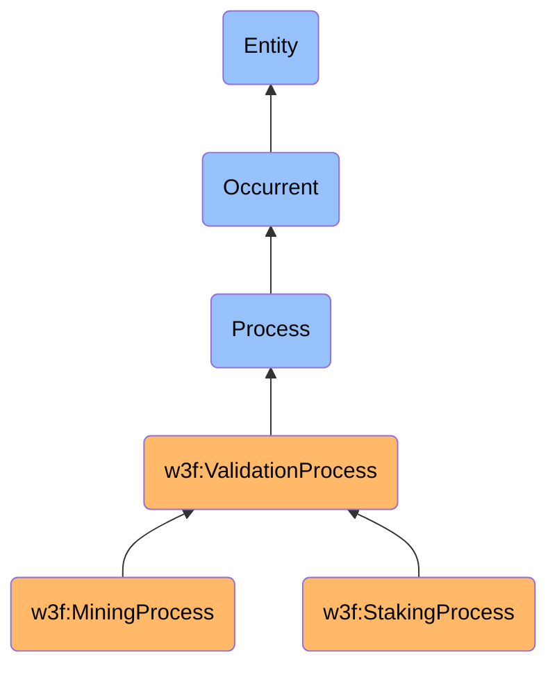

# Mining/Validation Process

## Definition
A ValidationProcess is an occurrent process entity that represents the activity of verifying transactions and blocks according to consensus rules to maintain the integrity of a blockchain network. A MiningProcess, as a specific type of ValidationProcess, represents the activity of validating transactions, creating new blocks, and securing a blockchain network through computational work, resulting in consensus on the canonical state of the ledger.

## Hierarchy in BFO

## Overview
Validation is a critical process in blockchain networks that ensures the integrity and consistency of the distributed ledger. It encompasses various activities to verify that transactions adhere to the network's rules, detect and prevent double-spending, and establish consensus on the canonical chain state. The validation process differs across blockchain networks based on their consensus mechanisms, with mining (Proof of Work) and staking (Proof of Stake) being the predominant approaches.

In mining-based validation, participants (miners) compete to solve complex cryptographic puzzles, requiring significant computational resources. The first to find a valid solution earns the right to create the next block and receives rewards in the form of newly minted cryptocurrency and transaction fees. This process secures the network by making attacks economically unfeasible due to the high computational costs.

In stake-based validation, participants (validators) lock up cryptocurrency as collateral to participate in block production. Validators are selected to create blocks based on factors such as the amount staked, time staked, or randomized selection. This approach secures the network through economic incentives and penalties, as validators risk losing their stake if they behave maliciously.

Both validation methods serve the same fundamental purpose: to establish trust in a trustless environment by creating a secure, tamper-resistant record of transactions that all network participants can verify independently.

## Types of Validation Processes

### By Consensus Mechanism
- **Proof of Work (Mining)**: Validation through computational puzzle-solving (e.g., Bitcoin, Ethereum 1.0)
- **Proof of Stake**: Validation through cryptocurrency staking (e.g., Ethereum 2.0, Cardano)
- **Delegated Proof of Stake**: Validation through elected representatives (e.g., EOS, Tron)
- **Proof of Authority**: Validation through authorized identities (e.g., private blockchains)
- **Proof of Space**: Validation through storage commitment (e.g., Chia, Filecoin)
- **Hybrid Approaches**: Combinations of multiple validation methods (e.g., Dash)

### By Participation Model
- **Permissionless Validation**: Open participation where anyone can become a validator
- **Permissioned Validation**: Restricted participation requiring authorization
- **Delegated Validation**: Validation performed on behalf of token holders
- **Sharded Validation**: Validation of subsets of transactions in parallel
- **Federated Validation**: Validation by a predetermined set of trusted validators

### By Reward Mechanism
- **Block Reward Validation**: Validators receive newly minted cryptocurrency
- **Transaction Fee Validation**: Validators receive fees from included transactions
- **Hybrid Reward Validation**: Validators receive both new coins and transaction fees
- **Inflationary Reward Validation**: Rewards based on currency inflation mechanisms
- **Slashing-Protected Validation**: Rewards with penalties for misbehavior

## Validation Process Stages

### 1. Transaction Collection
Validators gather unconfirmed transactions from the mempool.

### 2. Transaction Verification
Validators verify transaction signatures, formats, and state changes.

### 3. Block Proposal
Validators create candidate blocks containing verified transactions.

### 4. Consensus Participation
Validators participate in the network's consensus process to determine the next block.

### 5. Block Propagation
Successful validators propagate new blocks to the network.

### 6. Chain Selection
Validators follow fork choice rules to identify the canonical chain.

### 7. State Update
Validators update their local copy of the ledger state.

### 8. Reward Distribution
Validators receive rewards for their successful participation.

## Related Classes
- **w3f:BlockchainNetwork** - An independent continuant material entity that is secured through the validation process.
- **w3f:Validator** - An independent continuant material entity that performs the validation process.
- **w3f:Miner** - A specialized validator that performs the mining process in Proof of Work systems.
- **w3f:Staker** - A specialized validator that performs the staking process in Proof of Stake systems.
- **w3f:ConsensusProtocol** - An immaterial entity that defines the rules for validation.
- **w3f:Block** - An immaterial entity created through the validation process.
- **w3f:Transaction** - An occurrent entity that is validated during the validation process.
- **w3f:ValidationReward** - An immaterial entity representing the rewards for successful validation. 