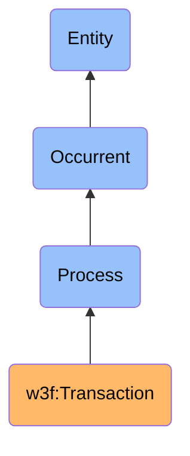

# Transaction

## Definition
A Transaction is an occurrent process entity that represents the atomic transfer of assets, data, or function calls between Web3 identities or smart contracts on a blockchain network, which is cryptographically signed, validated by consensus, and immutably recorded on the distributed ledger.

## Hierarchy in BFO

## Overview
A Transaction is a fundamental process in blockchain systems that represents the transfer of value, invocation of smart contract functions, or execution of operations that change the state of the network. Unlike traditional database operations, blockchain transactions are cryptographically secured, publicly verifiable, and immutably recorded once confirmed. Each transaction undergoes several phases: creation, signing, propagation, validation, inclusion in a block, and confirmation through consensus.

Transactions are characterized by their atomic nature—they either execute completely or not at all—and their resistance to tampering once confirmed. They establish a cryptographically verifiable chain of ownership and state changes that enables trustless interactions between participants without requiring centralized mediation. The transaction mechanism forms the core interaction model for blockchain networks, enabling the movement of digital assets, execution of smart contract logic, and recording of state changes in a decentralized environment.

## Types of Transactions

### By Purpose
- **Value Transfers**: Simple movements of native cryptocurrency between addresses
- **Token Transfers**: Movements of fungible or non-fungible tokens between addresses
- **Contract Deployments**: Publication of new smart contract code to the blockchain
- **Contract Interactions**: Calls to existing smart contract functions
- **Data Publication**: Storage of arbitrary data on the blockchain
- **Governance Actions**: Voting or proposal submissions in on-chain governance systems

### By Execution Model
- **Standard Transactions**: Simple, direct operations between accounts
- **Contract Calls**: Operations that invoke smart contract logic
- **Internal Transactions**: Sub-transactions initiated by smart contracts
- **Composite Transactions**: Operations that execute multiple actions atomically
- **Meta-Transactions**: Gas-abstracted transactions where a relayer pays fees

### By Fee Structure
- **Fixed-Fee Transactions**: Transactions with predetermined, fixed costs
- **Gas-Based Transactions**: Transactions where fees are calculated based on computational complexity
- **Priority-Fee Transactions**: Transactions with adjustable user-defined tips to incentivize miners/validators
- **Fee-Delegated Transactions**: Transactions where fees are paid by a third party
- **Zero-Fee Transactions**: Transactions on networks that do not require transaction fees

## Lifecycle Stages

### 1. Creation
The transaction is constructed with parameters such as sender, recipient, value, data, and fee information.

### 2. Signing
The transaction is cryptographically signed using the sender's private key to authorize the operation.

### 3. Propagation
The signed transaction is broadcast to the network's nodes via peer-to-peer propagation.

### 4. Mempool Residence
The transaction resides in nodes' mempools (memory pools) awaiting inclusion in a block.

### 5. Validation
Nodes validate the transaction's format, signature, and state changes according to consensus rules.

### 6. Block Inclusion
A validator/miner includes the transaction in a new block proposal.

### 7. Consensus Confirmation
The network reaches consensus on the block containing the transaction.

### 8. State Finalization
The transaction's effects on the blockchain state become increasingly final as more blocks are added.

## Related Classes
- **w3f:Web3Identity** - An independent continuant material entity that initiates or receives transactions.
- **w3f:BlockchainNetwork** - An independent continuant material entity that provides the infrastructure for executing transactions.
- **w3f:SmartContract** - An immaterial entity that can be invoked or deployed by transactions.
- **w3f:DigitalAsset** - An immaterial entity that can be transferred or managed through transactions.
- **w3f:Block** - An immaterial entity that contains and organizes multiple transactions.
- **w3f:Mining** - A process through which transactions are validated and included in blocks.
- **w3f:BlockTime** - A temporal region representing the time at which a transaction is included in a block. 