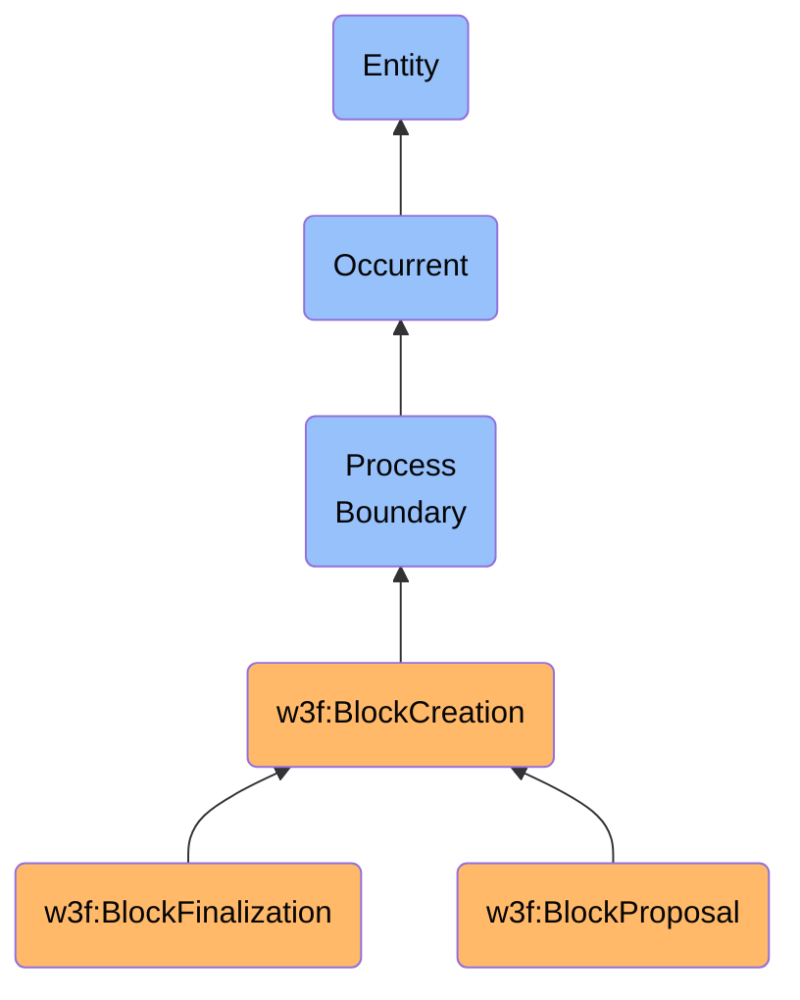

# BlockCreation

## Definition
A BlockCreation is an occurrent process boundary entity that represents the instantaneous temporal boundary at which a block is finalized and appended to the blockchain, marking the transition from a candidate block to a confirmed block in the distributed ledger.

## Hierarchy in BFO

## Overview
BlockCreation represents the precise temporal boundary at which a block transforms from a proposed collection of transactions to an immutable component of the blockchain. Unlike processes that extend over time, a process boundary is instantaneous—it captures the exact moment of transition between different states of the blockchain.

In blockchain systems, block creation boundaries are critical junctures where consensus is achieved, chain state is updated, and network participants synchronize their view of the distributed ledger. These boundaries determine when transactions officially become part of the canonical chain, when mining rewards are issued, and when state transitions are finalized.

Process boundaries play a crucial role in blockchain ontology by modeling the discrete, atomic nature of block additions to the chain. While validation and mining processes have duration, block creation occurs at a singular point in time. This distinction helps capture the exact chronology of blockchain events and establish precise temporal ordering relationships between blocks.

Different consensus mechanisms implement block creation boundaries differently:
- In Proof of Work systems, it occurs when a valid nonce is found that satisfies the difficulty requirement
- In Proof of Stake systems, it occurs when sufficient validator signatures are collected
- In Byzantine Fault Tolerant systems, it occurs when a supermajority of validators reaches agreement

## Types of Block Creation Boundaries

### By Finality Status
- **Block Proposal**: The instantaneous boundary when a candidate block is first proposed to the network
- **Block Finalization**: The instantaneous boundary when a block achieves consensus-based finality
- **Checkpoint Creation**: Special block creation boundaries that mark consensus checkpoints
- **Epoch Transition**: Block creation boundaries that mark the end of one epoch and beginning of another

### By Network Impact
- **Canonical Block Creation**: Creation of blocks on the main chain
- **Orphan Block Creation**: Creation of blocks that are later abandoned from the main chain
- **Fork Block Creation**: Creation of blocks that initiate a chain fork
- **Genesis Block Creation**: The special boundary marking blockchain inception

### By Validation Context
- **PoW Block Creation**: Boundary defined by proof-of-work solution discovery
- **PoS Block Creation**: Boundary defined by validator signature threshold
- **Hybrid Block Creation**: Boundary defined by multiple consensus conditions
- **Permissioned Block Creation**: Boundary defined by authorized validator approval

## Relationships to Other Entities

### Temporal Relationships
- **Relationship to Validation Process**: Marks the conclusion of block validation
- **Relationship to Mining Process**: Marks the successful completion of mining
- **Relationship to Block Time**: Occurs at a specific BlockTimestamp
- **Relationship to Transaction Lifecycle**: Marks transition from unconfirmed to confirmed transaction status

### Network Relationships
- **Relationship to Consensus Rules**: Governed by protocol-specific rules for block validity
- **Relationship to Chain State**: Produces a state transition in the blockchain's global state
- **Relationship to Chain Forks**: May initiate or resolve chain reorganizations
- **Relationship to Network Nodes**: Requires propagation and verification across network participants

### Economic Relationships
- **Relationship to Mining Rewards**: Triggers distribution of block rewards
- **Relationship to Transaction Fees**: Finalizes collection of transaction fees by miners/validators
- **Relationship to Tokenomics**: May impact token supply through minting or burning
- **Relationship to Market Effects**: May influence market activity based on included transactions

## Related Classes
- **w3f:Block** - An immaterial entity that is created at this process boundary.
- **w3f:ValidationProcess** - A process that is bounded by this block creation boundary.
- **w3f:MiningProcess** - A specialized validation process in Proof of Work systems that is bounded by this process boundary.
- **w3f:BlockchainNetwork** - An independent continuant material entity on which this process boundary occurs.
- **w3f:Transaction** - An occurrent entity that is confirmed at this process boundary.
- **w3f:ChainReorganization** - A process that may be initiated at this process boundary.
- **w3f:StateTransition** - An occurrent entity that results from the block creation at this boundary. 