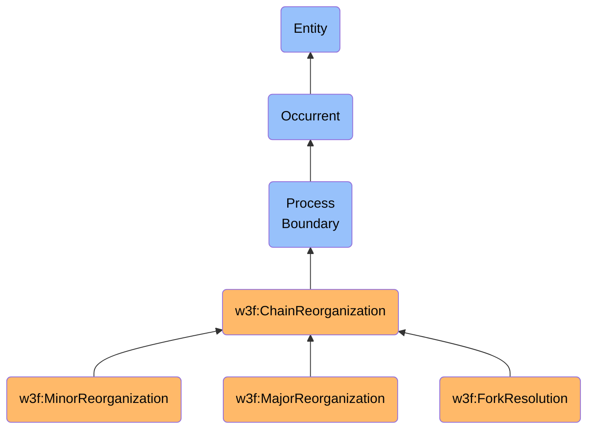

# ChainReorganization

## Definition
A ChainReorganization is an occurrent process boundary entity that represents the instantaneous temporal boundary at which a blockchain network transitions from one version of the canonical chain to another, typically due to the resolution of competing chain branches according to consensus rules.

## Hierarchy in BFO

## Overview
ChainReorganization represents the precise instantaneous boundary at which a blockchain network shifts from one canonical view of its history to another. This occurs when consensus mechanisms resolve competing versions of the blockchain by selecting one branch over another, resulting in some previously accepted blocks being orphaned and a new set of blocks being recognized as the canonical chain.

Chain reorganizations are intrinsic to many blockchain consensus protocols, especially those based on Proof of Work. They ensure that all network participants eventually converge on a single canonical version of the blockchain despite network latency, concurrent block discovery, or potential adversarial actions. These reorganizations maintain the consistency and integrity of the distributed ledger while accommodating the probabilistic nature of consensus in decentralized systems.

As a process boundary, a chain reorganization captures the exact moment of transition between different chain states. While the validation processes leading to competing chain branches have duration, the reorganization itself is instantaneous—representing the discrete moment when the consensus rules determine a new canonical chain. This instantaneous quality is important for precisely tracking the chronology of blockchain state changes and understanding transaction finality.

Different consensus mechanisms handle reorganizations differently:
- In Proof of Work systems, reorganizations occur naturally when a longer/heavier chain is discovered
- In Proof of Stake systems, reorganizations may occur when a branch with more stake weight is confirmed
- In Byzantine Fault Tolerant systems, reorganizations are typically rare and occur only during network partitions

## Types of Chain Reorganizations

### By Depth
- **Minor Reorganizations**: Affecting few blocks (1-3), common and typically benign
- **Major Reorganizations**: Affecting many blocks, uncommon and potentially concerning
- **Deep Reorganizations**: Extremely rare events affecting a significant portion of recent history
- **Consensus Failures**: Catastrophic reorganizations requiring intervention to resolve

### By Cause
- **Natural Reorganizations**: Normal result of concurrent block production and network latency
- **Adversarial Reorganizations**: Result of malicious attempts to rewrite chain history
- **Network Partition Reorganizations**: Result of healed network partitions
- **Protocol Upgrade Reorganizations**: Result of hard or soft forks in the protocol

### By Security Impact
- **Benign Reorganizations**: No security impact, part of normal consensus
- **Double-Spend Reorganizations**: Enable transactions to be reversed and funds redirected
- **Censorship Reorganizations**: Remove specific transactions from the canonical history
- **Eclipse Reorganizations**: Result from isolation of network segments from broader consensus

## Implications of Chain Reorganizations

### Technical Implications
- **State Consistency**: Chain reorganizations challenge the consistency of state across network nodes
- **Finality Depth**: The depth of potential reorganizations determines practical transaction finality
- **Node Synchronization**: Nodes must resolve chain conflict by adopting the new canonical chain
- **Protocol Design**: Consensus protocols must balance quick finality against reorganization resistance

### Economic Implications
- **Transaction Reversal**: Previously confirmed transactions may be temporarily or permanently reversed
- **Double-Spend Vulnerability**: Reorganizations create opportunity for double-spending attacks
- **Confirmation Depth Requirements**: Exchanges and services adjust required confirmations based on reorganization risk
- **Mining/Validation Economics**: Orphaned blocks result in lost rewards for validators

### User Implications
- **Apparent Transaction Reversal**: Transactions may appear confirmed then unconfirmed
- **Confirmation Delay**: Deep confirmation requirements may delay finality for users
- **User Interface Considerations**: Wallets and applications must handle reorganization edge cases
- **Risk Models**: Different applications require different risk assessments for reorganization depth

## Related Classes
- **w3f:Block** - An immaterial entity that can be orphaned or adopted during a chain reorganization.
- **w3f:BlockchainNetwork** - An independent continuant material entity on which chain reorganizations occur.
- **w3f:ValidationProcess** - A process that produces competing chain branches potentially leading to reorganization.
- **w3f:Transaction** - An occurrent entity that can be affected (reverted or reconfirmed) by a chain reorganization.
- **w3f:ConsensusProtocol** - An immaterial entity that defines the rules determining how reorganizations are resolved.
- **w3f:BlockCreation** - A process boundary that may initiate chain reorganization when creating blocks on competing branches.
- **w3f:StateTransition** - An occurrent entity representing the global state change that results from a chain reorganization. 