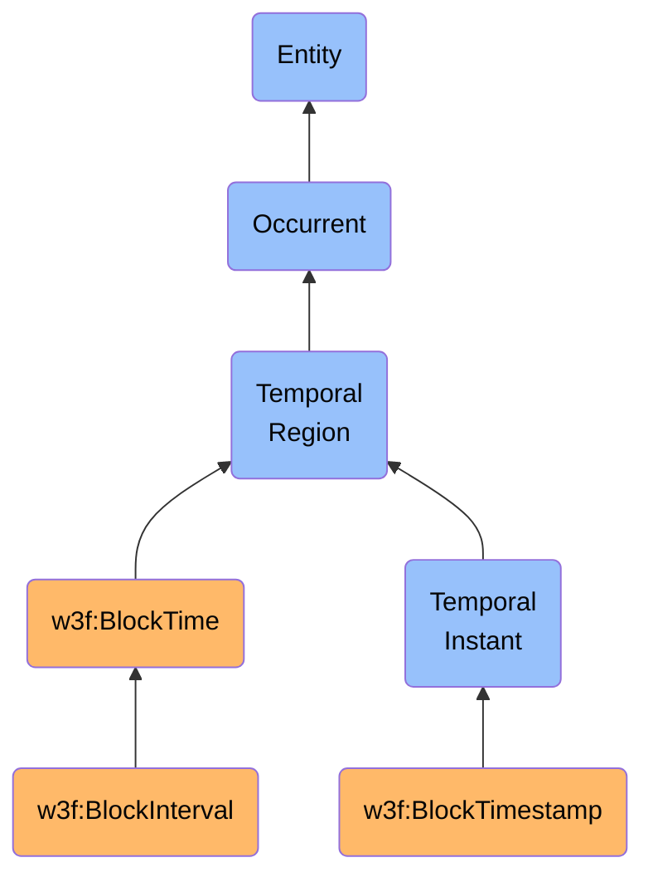

# BlockTime

## Definition
A BlockTime is an occurrent temporal region entity that represents the period between the creation of consecutive blocks in a blockchain network, defining the chronological cadence at which the distributed ledger is updated with new transactions and state changes.

## Hierarchy in BFO

## Overview
BlockTime is a fundamental concept in blockchain systems that defines the temporal cadence of the network. It represents both the intervals between consecutive blocks and the specific timestamps at which blocks are created. This temporal structure provides the chronological framework for ordering transactions, establishing causality, and synchronizing the distributed system.

In most blockchain networks, block times are not precisely uniform but follow statistical distributions influenced by the consensus mechanism, network conditions, and protocol parameters. For instance, Proof of Work networks like Bitcoin aim for an average block time (approximately 10 minutes) that is maintained through difficulty adjustments. Proof of Stake networks often have more predictable and shorter block times (seconds to minutes) due to their scheduled block production mechanisms.

BlockTime serves multiple critical functions in blockchain systems:
1. It establishes the temporal ordering of transactions
2. It determines the transaction throughput capacity of the network
3. It affects the finality time of transactions
4. It influences the security properties of the network against various attacks
5. It creates a shared sense of time across all participants in the decentralized system

## Types of BlockTime Entities

### By Duration Pattern
- **Fixed Block Times**: Networks with consistent, predetermined block intervals (e.g., most PoS chains)
- **Variable Block Times**: Networks with block intervals that follow probability distributions (e.g., PoW chains)
- **Adaptive Block Times**: Networks that adjust block timing based on network conditions
- **Hybrid Block Times**: Systems with multiple timing mechanisms for different layer operations

### By Temporal Context
- **Block Intervals**: The time periods between consecutive blocks (temporal regions with duration)
- **Block Timestamps**: The specific moments when blocks are created (temporal instants)
- **Epoch Times**: Larger time periods encompassing multiple blocks (e.g., Ethereum epochs)
- **Slot Times**: Scheduled time periods during which blocks may be produced (e.g., Cardano slots)

### By Consensus Relationship
- **Mining Times**: Block times in Proof of Work systems determined by hash puzzle difficulty
- **Validation Times**: Block times in Proof of Stake systems determined by validator selection mechanisms
- **Finality Periods**: Time regions after which transactions are considered irreversible
- **Confirmation Periods**: Time regions representing multiple block confirmations for transaction security

## BlockTime Properties

### Temporal Characteristics
- **Duration**: The length of time between consecutive blocks
- **Variability**: The statistical variance in block times
- **Target Time**: The protocol-defined goal for average block times
- **Timestamp Precision**: The granularity of time recording in the blockchain

### Network Implications
- **Throughput Relationship**: How block time affects transaction processing capacity
- **Latency Effects**: How block time influences transaction confirmation delays
- **Security Tradeoffs**: How block time impacts resistance to various attack vectors
- **Synchronization Requirements**: How block time relates to network clock synchronization needs

## Related Classes
- **w3f:BlockchainNetwork** - An independent continuant material entity whose operations are measured and organized by block time.
- **w3f:Block** - An immaterial entity that marks the boundaries of block time intervals and contains block timestamps.
- **w3f:Transaction** - An occurrent entity that is processed and ordered within the context of block times.
- **w3f:ValidationProcess** - An occurrent entity that occurs during block times to create and validate blocks.
- **w3f:ConsensusProtocol** - An immaterial entity that defines the rules governing block times.
- **w3f:MiningProcess** - An occurrent entity whose success and timing determine block times in Proof of Work systems. 