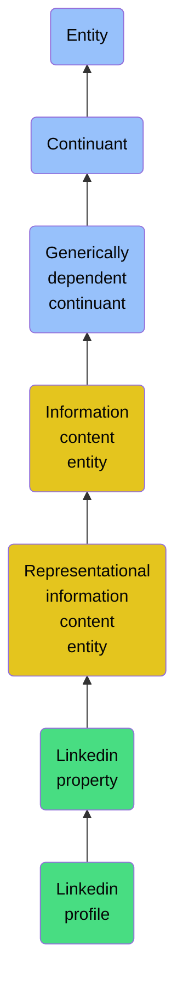

# Linkedin profile

## Overview

### Definition
Represents a profile of a LinkedIn entity stored in type 'com.linkedin.voyager.identity.profile.Profile'.

### Examples
John Doe's Profile included entityUrn, firstName, lastName, birthDate, headline, summary, etc.

### Aliases
Not defined.

### URI
http://ontology.naas.ai/abi/linkedin#LinkedInProfile

### Subclass Of

- [Entity](/docs/ontology/reference/model/Entity/Entity.md)
- [Continuant](/docs/ontology/reference/model/Entity/Continuant/Continuant.md)
- [Generically dependent continuant](/docs/ontology/reference/model/Entity/Continuant/Generically%20dependent%20continuant/Generically%20dependent%20continuant.md)
- [Information content entity](/docs/ontology/reference/model/Entity/Continuant/Generically%20dependent%20continuant/Information%20content%20entity/Information%20content%20entity.md)
- [Representational information content entity](/docs/ontology/reference/model/Entity/Continuant/Generically%20dependent%20continuant/Information%20content%20entity/Representational%20information%20content%20entity/Representational%20information%20content%20entity.md)
- [Linkedin property](/docs/ontology/reference/model/Entity/Continuant/Generically%20dependent%20continuant/Information%20content%20entity/Representational%20information%20content%20entity/Linkedin%20property/Linkedin%20property.md)
- [Linkedin profile](/docs/ontology/reference/model/Entity/Continuant/Generically%20dependent%20continuant/Information%20content%20entity/Representational%20information%20content%20entity/Linkedin%20property/Linkedin%20profile/Linkedin%20profile.md)

### Ontology Reference
- [abi](http://ontology.naas.ai/abi/)

## Properties
### Data Properties
| Ontology | Label | Definition | Example | Domain | Range |
|----------|-------|------------|---------|--------|-------|
| abi | [is curated in foundry](http://ontology.naas.ai/abi/is_curated_in_foundry) | Relates a class to the foundry it is curated in. | The class cco:ont00001262 is curated in the foundry 'enterprise_management_foundry' and 'personal_ai_foundry'. | [entity](/docs/ontology/reference/model/Entity/Entity.md) | [string](http://www.w3.org/2001/XMLSchema#string) |
| abi | [extracted at](http://ontology.naas.ai/abi/extracted_at) | The timestamp in ISO 8601 format when a generically dependent continuant was extracted or retrieved from its source. | 2025-06-05T12:00:00+00:00 | [generically dependent continuant](/docs/ontology/reference/model/Entity/Continuant/Generically%20dependent%20continuant/Generically%20dependent%20continuant.md) | [dateTime](http://www.w3.org/2001/XMLSchema#dateTime) |

### Object Properties
| Ontology | Label | Definition | Example | Domain | Range | Inverse Of |
|----------|-------|------------|---------|--------|-------|------------|
| abi | [has backing data source](http://ontology.naas.ai/abi/hasBackingDataSource) | Relates an entity to the data source that provides the underlying data for that entity. This property indicates the origin or source of the data that supports the entity. | A report entity may have a backing data source that provides the raw data used to generate the report. | [entity](/docs/ontology/reference/model/Entity/Entity.md) | [Data Source](/docs/ontology/reference/model/Entity/Continuant/Generically%20dependent%20continuant/Data%20source/Data%20source.md) |  |
| bfo | [exists at](http://purl.obolibrary.org/obo/BFO_0000108) | (Elucidation) exists at is a relation between a particular and some temporal region at which the particular exists | First World War exists at 1914-1916; Mexico exists at January 1, 2000 | [entity](/docs/ontology/reference/model/Entity/Entity.md) | [temporal region](/docs/ontology/reference/model/Entity/Occurrent/Temporal%20region/Temporal%20region.md) |  |
| bfo | [continuant part of](http://purl.obolibrary.org/obo/BFO_0000176) | b continuant part of c =Def b and c are continuants & there is some time t such that b and c exist at t & b continuant part of c at t | Milk teeth continuant part of human; surgically removed tumour continuant part of organism | [continuant](/docs/ontology/reference/model/Entity/Continuant/Continuant.md) | [continuant](/docs/ontology/reference/model/Entity/Continuant/Continuant.md) | [has continuant part](http://purl.obolibrary.org/obo/BFO_0000178) |
| bfo | [has continuant part](http://purl.obolibrary.org/obo/BFO_0000178) | b has continuant part c =Def c continuant part of b |  | [continuant](/docs/ontology/reference/model/Entity/Continuant/Continuant.md) | [continuant](/docs/ontology/reference/model/Entity/Continuant/Continuant.md) |  |
| cco | [is output of](https://www.commoncoreontologies.org/ont00001816) | x is_output_of y iff x is an instance of Continuant and y is an instance of Process, such that the presence of x at the end of y is a necessary condition for the completion of y. |  | [continuant](/docs/ontology/reference/model/Entity/Continuant/Continuant.md) | [process](/docs/ontology/reference/model/Entity/Occurrent/Process/Process.md) | [has output](https://www.commoncoreontologies.org/ont00001986) |
| cco | [is input of](https://www.commoncoreontologies.org/ont00001841) | x is_input_of y iff x is an instance of Continuant and y is an instance of Process, such that the presence of x at the beginning of y is a necessary condition for the start of y. |  | [continuant](/docs/ontology/reference/model/Entity/Continuant/Continuant.md) | [process](/docs/ontology/reference/model/Entity/Occurrent/Process/Process.md) | [has input](https://www.commoncoreontologies.org/ont00001921) |
| cco | [is affected by](https://www.commoncoreontologies.org/ont00001886) | x is_affected_by y iff x is an instance of Continuant and y is an instance of Process, and y influences x in some manner, most often by producing a change in x. |  | [continuant](/docs/ontology/reference/model/Entity/Continuant/Continuant.md) | [process](/docs/ontology/reference/model/Entity/Occurrent/Process/Process.md) |  |
| bfo | [is concretized by](http://purl.obolibrary.org/obo/BFO_0000058) | c is concretized by b =Def b concretizes c |  | [generically dependent continuant](/docs/ontology/reference/model/Entity/Continuant/Generically%20dependent%20continuant/Generically%20dependent%20continuant.md) | [{'or': ['http://purl.obolibrary.org/obo/BFO_0000015', 'http://purl.obolibrary.org/obo/BFO_0000020']}](/docs/ontology/reference/model/%7B%27or%27%3A%20%5B%27http%3A//purl.obolibrary.org/obo/BFO_0000015%27%2C%20%27http%3A//purl.obolibrary.org/obo/BFO_0000020%27%5D%7D/%7B%27or%27%3A%20%5B%27http%3A//purl.obolibrary.org/obo/bfo_0000015%27%2C%20%27http%3A//purl.obolibrary.org/obo/bfo_0000020%27%5D%7D.md) | [concretizes](http://purl.obolibrary.org/obo/BFO_0000059) |
| bfo | [generically depends on](http://purl.obolibrary.org/obo/BFO_0000084) | b generically depends on c =Def b is a generically dependent continuant & c is an independent continuant that is not a spatial region & at some time t there inheres in c a specifically dependent continuant which concretizes b at t |  | [generically dependent continuant](/docs/ontology/reference/model/Entity/Continuant/Generically%20dependent%20continuant/Generically%20dependent%20continuant.md) | [{'and': ['http://purl.obolibrary.org/obo/BFO_0000004', {'not': ['http://purl.obolibrary.org/obo/BFO_0000006']}]}](/docs/ontology/reference/model/%7B%27and%27%3A%20%5B%27http%3A//purl.obolibrary.org/obo/BFO_0000004%27%2C%20%7B%27not%27%3A%20%5B%27http%3A//purl.obolibrary.org/obo/BFO_0000006%27%5D%7D%5D%7D/%7B%27and%27%3A%20%5B%27http%3A//purl.obolibrary.org/obo/bfo_0000004%27%2C%20%7B%27not%27%3A%20%5B%27http%3A//purl.obolibrary.org/obo/bfo_0000006%27%5D%7D%5D%7D.md) | [is carrier of](http://purl.obolibrary.org/obo/BFO_0000101) |
| cco | [is about](https://www.commoncoreontologies.org/ont00001808) | A primitive relationship between an Information Content Entity and some Entity. |  | [Information Content Entity](/docs/ontology/reference/model/Entity/Continuant/Generically%20dependent%20continuant/Information%20content%20entity/Information%20content%20entity.md) | [entity](/docs/ontology/reference/model/Entity/Entity.md) |  |
| cco | [represents](https://www.commoncoreontologies.org/ont00001938) | x represents y iff x is an instance of Information Content Entity, y is an instance of Entity, and z is carrier of x, such that x is about y in virtue of there existing an isomorphism between characteristics of z and y. |  | [Representational Information Content Entity](/docs/ontology/reference/model/Entity/Continuant/Generically%20dependent%20continuant/Information%20content%20entity/Representational%20information%20content%20entity/Representational%20information%20content%20entity.md) | [None](/docs/ontology/reference/model/Entity/Occurrent/Process/None.md) |  |
| abi | [is certification of](http://ontology.naas.ai/abi/linkedin#isCertificationOf) | Relates a certification to the LinkedIn profile it belongs to. | A certification is listed on John Doe's LinkedIn profile. | [LinkedIn Property](/docs/ontology/reference/model/Entity/Continuant/Generically%20dependent%20continuant/Information%20content%20entity/Representational%20information%20content%20entity/Linkedin%20property/Linkedin%20property.md) | [LinkedIn Profile](/docs/ontology/reference/model/Entity/Continuant/Generically%20dependent%20continuant/Information%20content%20entity/Representational%20information%20content%20entity/Linkedin%20property/Linkedin%20profile/Linkedin%20profile.md) | [has certification](http://ontology.naas.ai/abi/linkedin#hasCertification) |
| abi | [is course of](http://ontology.naas.ai/abi/linkedin#isCourseOf) | Relates a course to the LinkedIn profile it belongs to. | A course is listed on John Doe's LinkedIn profile. | [LinkedIn Property](/docs/ontology/reference/model/Entity/Continuant/Generically%20dependent%20continuant/Information%20content%20entity/Representational%20information%20content%20entity/Linkedin%20property/Linkedin%20property.md) | [LinkedIn Profile](/docs/ontology/reference/model/Entity/Continuant/Generically%20dependent%20continuant/Information%20content%20entity/Representational%20information%20content%20entity/Linkedin%20property/Linkedin%20profile/Linkedin%20profile.md) | [has course](http://ontology.naas.ai/abi/linkedin#hasCourse) |
| abi | [is education of](http://ontology.naas.ai/abi/linkedin#isEducationOf) | Relates an education entry to the LinkedIn profile it belongs to. | An education entry is listed on John Doe's LinkedIn profile. | [LinkedIn Property](/docs/ontology/reference/model/Entity/Continuant/Generically%20dependent%20continuant/Information%20content%20entity/Representational%20information%20content%20entity/Linkedin%20property/Linkedin%20property.md) | [LinkedIn Profile](/docs/ontology/reference/model/Entity/Continuant/Generically%20dependent%20continuant/Information%20content%20entity/Representational%20information%20content%20entity/Linkedin%20property/Linkedin%20profile/Linkedin%20profile.md) | [has education](http://ontology.naas.ai/abi/linkedin#hasEducation) |
| abi | [is honor of](http://ontology.naas.ai/abi/linkedin#isHonorOf) | Relates an honor to the LinkedIn profile it belongs to. | An honor is listed on John Doe's LinkedIn profile. | [LinkedIn Property](/docs/ontology/reference/model/Entity/Continuant/Generically%20dependent%20continuant/Information%20content%20entity/Representational%20information%20content%20entity/Linkedin%20property/Linkedin%20property.md) | [LinkedIn Profile](/docs/ontology/reference/model/Entity/Continuant/Generically%20dependent%20continuant/Information%20content%20entity/Representational%20information%20content%20entity/Linkedin%20property/Linkedin%20profile/Linkedin%20profile.md) | [has honor](http://ontology.naas.ai/abi/linkedin#hasHonor) |
| abi | [is language of](http://ontology.naas.ai/abi/linkedin#isLanguageOf) | Relates a language to the LinkedIn profile it belongs to. | A language is listed on John Doe's LinkedIn profile. | [LinkedIn Property](/docs/ontology/reference/model/Entity/Continuant/Generically%20dependent%20continuant/Information%20content%20entity/Representational%20information%20content%20entity/Linkedin%20property/Linkedin%20property.md) | [LinkedIn Profile](/docs/ontology/reference/model/Entity/Continuant/Generically%20dependent%20continuant/Information%20content%20entity/Representational%20information%20content%20entity/Linkedin%20property/Linkedin%20profile/Linkedin%20profile.md) | [has language](http://ontology.naas.ai/abi/linkedin#hasLanguage) |
| abi | [is organization of](http://ontology.naas.ai/abi/linkedin#isOrganizationOf) | Relates an organization to the LinkedIn profile it belongs to. | An organization is listed on John Doe's LinkedIn profile. | [LinkedIn Property](/docs/ontology/reference/model/Entity/Continuant/Generically%20dependent%20continuant/Information%20content%20entity/Representational%20information%20content%20entity/Linkedin%20property/Linkedin%20property.md) | [LinkedIn Profile](/docs/ontology/reference/model/Entity/Continuant/Generically%20dependent%20continuant/Information%20content%20entity/Representational%20information%20content%20entity/Linkedin%20property/Linkedin%20profile/Linkedin%20profile.md) | [has organization](http://ontology.naas.ai/abi/linkedin#hasOrganization) |
| abi | [is patent of](http://ontology.naas.ai/abi/linkedin#isPatentOf) | Relates a patent to the LinkedIn profile it belongs to. | A patent is listed on John Doe's LinkedIn profile. | [LinkedIn Property](/docs/ontology/reference/model/Entity/Continuant/Generically%20dependent%20continuant/Information%20content%20entity/Representational%20information%20content%20entity/Linkedin%20property/Linkedin%20property.md) | [LinkedIn Profile](/docs/ontology/reference/model/Entity/Continuant/Generically%20dependent%20continuant/Information%20content%20entity/Representational%20information%20content%20entity/Linkedin%20property/Linkedin%20profile/Linkedin%20profile.md) | [has patent](http://ontology.naas.ai/abi/linkedin#hasPatent) |
| abi | [is position group of](http://ontology.naas.ai/abi/linkedin#isPositionGroupOf) | Relates a position group to the LinkedIn profile it belongs to. | A position group is listed on John Doe's LinkedIn profile. | [LinkedIn Property](/docs/ontology/reference/model/Entity/Continuant/Generically%20dependent%20continuant/Information%20content%20entity/Representational%20information%20content%20entity/Linkedin%20property/Linkedin%20property.md) | [LinkedIn Profile](/docs/ontology/reference/model/Entity/Continuant/Generically%20dependent%20continuant/Information%20content%20entity/Representational%20information%20content%20entity/Linkedin%20property/Linkedin%20profile/Linkedin%20profile.md) | [has position group](http://ontology.naas.ai/abi/linkedin#hasPositionGroup) |
| abi | [is position of](http://ontology.naas.ai/abi/linkedin#isPositionOf) | Relates a position to the LinkedIn profile it belongs to. | A position is listed on John Doe's LinkedIn profile. | [LinkedIn Property](/docs/ontology/reference/model/Entity/Continuant/Generically%20dependent%20continuant/Information%20content%20entity/Representational%20information%20content%20entity/Linkedin%20property/Linkedin%20property.md) | [LinkedIn Profile](/docs/ontology/reference/model/Entity/Continuant/Generically%20dependent%20continuant/Information%20content%20entity/Representational%20information%20content%20entity/Linkedin%20property/Linkedin%20profile/Linkedin%20profile.md) | [has position](http://ontology.naas.ai/abi/linkedin#hasPosition) |
| abi | [is project of](http://ontology.naas.ai/abi/linkedin#isProjectOf) | Relates a project to the LinkedIn profile it belongs to. | A project is listed on John Doe's LinkedIn profile. | [LinkedIn Property](/docs/ontology/reference/model/Entity/Continuant/Generically%20dependent%20continuant/Information%20content%20entity/Representational%20information%20content%20entity/Linkedin%20property/Linkedin%20property.md) | [LinkedIn Profile](/docs/ontology/reference/model/Entity/Continuant/Generically%20dependent%20continuant/Information%20content%20entity/Representational%20information%20content%20entity/Linkedin%20property/Linkedin%20profile/Linkedin%20profile.md) | [has project](http://ontology.naas.ai/abi/linkedin#hasProject) |
| abi | [is publication of](http://ontology.naas.ai/abi/linkedin#isPublicationOf) | Relates a publication to the LinkedIn profile it belongs to. | A publication is listed on John Doe's LinkedIn profile. | [LinkedIn Property](/docs/ontology/reference/model/Entity/Continuant/Generically%20dependent%20continuant/Information%20content%20entity/Representational%20information%20content%20entity/Linkedin%20property/Linkedin%20property.md) | [LinkedIn Profile](/docs/ontology/reference/model/Entity/Continuant/Generically%20dependent%20continuant/Information%20content%20entity/Representational%20information%20content%20entity/Linkedin%20property/Linkedin%20profile/Linkedin%20profile.md) |  |
| abi | [is skill of](http://ontology.naas.ai/abi/linkedin#isSkillOf) | Relates a skill to the LinkedIn profile it belongs to. | A skill is listed on John Doe's LinkedIn profile. | [LinkedIn Property](/docs/ontology/reference/model/Entity/Continuant/Generically%20dependent%20continuant/Information%20content%20entity/Representational%20information%20content%20entity/Linkedin%20property/Linkedin%20property.md) | [LinkedIn Profile](/docs/ontology/reference/model/Entity/Continuant/Generically%20dependent%20continuant/Information%20content%20entity/Representational%20information%20content%20entity/Linkedin%20property/Linkedin%20profile/Linkedin%20profile.md) | [has skill](http://ontology.naas.ai/abi/linkedin#hasSkill) |
| abi | [is test score of](http://ontology.naas.ai/abi/linkedin#isTestScoreOf) | Relates a test score to the LinkedIn profile it belongs to. | A test score is listed on John Doe's LinkedIn profile. | [LinkedIn Property](/docs/ontology/reference/model/Entity/Continuant/Generically%20dependent%20continuant/Information%20content%20entity/Representational%20information%20content%20entity/Linkedin%20property/Linkedin%20property.md) | [LinkedIn Profile](/docs/ontology/reference/model/Entity/Continuant/Generically%20dependent%20continuant/Information%20content%20entity/Representational%20information%20content%20entity/Linkedin%20property/Linkedin%20profile/Linkedin%20profile.md) | [has test score](http://ontology.naas.ai/abi/linkedin#hasTestScore) |
| abi | [is volunteer cause of](http://ontology.naas.ai/abi/linkedin#isVolunteerCauseOf) | Relates a volunteer cause to the LinkedIn profile it belongs to. | A volunteer cause is listed on John Doe's LinkedIn profile. | [LinkedIn Property](/docs/ontology/reference/model/Entity/Continuant/Generically%20dependent%20continuant/Information%20content%20entity/Representational%20information%20content%20entity/Linkedin%20property/Linkedin%20property.md) | [LinkedIn Profile](/docs/ontology/reference/model/Entity/Continuant/Generically%20dependent%20continuant/Information%20content%20entity/Representational%20information%20content%20entity/Linkedin%20property/Linkedin%20profile/Linkedin%20profile.md) | [has volunteer cause](http://ontology.naas.ai/abi/linkedin#hasVolunteerCause) |
| abi | [is volunteer experience of](http://ontology.naas.ai/abi/linkedin#isVolunteerExperienceOf) | Relates a volunteer experience to the LinkedIn profile it belongs to. | A volunteer experience is listed on John Doe's LinkedIn profile. | [LinkedIn Property](/docs/ontology/reference/model/Entity/Continuant/Generically%20dependent%20continuant/Information%20content%20entity/Representational%20information%20content%20entity/Linkedin%20property/Linkedin%20property.md) | [LinkedIn Profile](/docs/ontology/reference/model/Entity/Continuant/Generically%20dependent%20continuant/Information%20content%20entity/Representational%20information%20content%20entity/Linkedin%20property/Linkedin%20profile/Linkedin%20profile.md) | [has volunteer experience](http://ontology.naas.ai/abi/linkedin#hasVolunteerExperience) |
| abi | [has certification](http://ontology.naas.ai/abi/linkedin#hasCertification) | Relates a LinkedIn profile to its certifications. | John Doe's profile has certifications listed on LinkedIn. | [LinkedIn Profile](/docs/ontology/reference/model/Entity/Continuant/Generically%20dependent%20continuant/Information%20content%20entity/Representational%20information%20content%20entity/Linkedin%20property/Linkedin%20profile/Linkedin%20profile.md) | [LinkedIn Property](/docs/ontology/reference/model/Entity/Continuant/Generically%20dependent%20continuant/Information%20content%20entity/Representational%20information%20content%20entity/Linkedin%20property/Linkedin%20property.md) | [is certification of](http://ontology.naas.ai/abi/linkedin#isCertificationOf) |
| abi | [has course](http://ontology.naas.ai/abi/linkedin#hasCourse) | Relates a LinkedIn profile to its courses. | John Doe's profile has courses listed on LinkedIn. | [LinkedIn Profile](/docs/ontology/reference/model/Entity/Continuant/Generically%20dependent%20continuant/Information%20content%20entity/Representational%20information%20content%20entity/Linkedin%20property/Linkedin%20profile/Linkedin%20profile.md) | [LinkedIn Property](/docs/ontology/reference/model/Entity/Continuant/Generically%20dependent%20continuant/Information%20content%20entity/Representational%20information%20content%20entity/Linkedin%20property/Linkedin%20property.md) | [is course of](http://ontology.naas.ai/abi/linkedin#isCourseOf) |
| abi | [has education](http://ontology.naas.ai/abi/linkedin#hasEducation) | Relates a LinkedIn profile to its education history. | John Doe's profile has education details listed on LinkedIn. | [LinkedIn Profile](/docs/ontology/reference/model/Entity/Continuant/Generically%20dependent%20continuant/Information%20content%20entity/Representational%20information%20content%20entity/Linkedin%20property/Linkedin%20profile/Linkedin%20profile.md) | [LinkedIn Property](/docs/ontology/reference/model/Entity/Continuant/Generically%20dependent%20continuant/Information%20content%20entity/Representational%20information%20content%20entity/Linkedin%20property/Linkedin%20property.md) | [is education of](http://ontology.naas.ai/abi/linkedin#isEducationOf) |
| abi | [has honor](http://ontology.naas.ai/abi/linkedin#hasHonor) | Relates a LinkedIn profile to its honors. | John Doe's profile has honors and awards listed on LinkedIn. | [LinkedIn Profile](/docs/ontology/reference/model/Entity/Continuant/Generically%20dependent%20continuant/Information%20content%20entity/Representational%20information%20content%20entity/Linkedin%20property/Linkedin%20profile/Linkedin%20profile.md) | [LinkedIn Property](/docs/ontology/reference/model/Entity/Continuant/Generically%20dependent%20continuant/Information%20content%20entity/Representational%20information%20content%20entity/Linkedin%20property/Linkedin%20property.md) | [is honor of](http://ontology.naas.ai/abi/linkedin#isHonorOf) |
| abi | [has language](http://ontology.naas.ai/abi/linkedin#hasLanguage) | Relates a LinkedIn profile to its languages. | John Doe's profile has languages listed on LinkedIn. | [LinkedIn Profile](/docs/ontology/reference/model/Entity/Continuant/Generically%20dependent%20continuant/Information%20content%20entity/Representational%20information%20content%20entity/Linkedin%20property/Linkedin%20profile/Linkedin%20profile.md) | [LinkedIn Property](/docs/ontology/reference/model/Entity/Continuant/Generically%20dependent%20continuant/Information%20content%20entity/Representational%20information%20content%20entity/Linkedin%20property/Linkedin%20property.md) | [is language of](http://ontology.naas.ai/abi/linkedin#isLanguageOf) |
| abi | [has organization](http://ontology.naas.ai/abi/linkedin#hasOrganization) | Relates a LinkedIn profile to its organizations. | John Doe's profile has organizations listed on LinkedIn. | [LinkedIn Profile](/docs/ontology/reference/model/Entity/Continuant/Generically%20dependent%20continuant/Information%20content%20entity/Representational%20information%20content%20entity/Linkedin%20property/Linkedin%20profile/Linkedin%20profile.md) | [LinkedIn Property](/docs/ontology/reference/model/Entity/Continuant/Generically%20dependent%20continuant/Information%20content%20entity/Representational%20information%20content%20entity/Linkedin%20property/Linkedin%20property.md) | [is organization of](http://ontology.naas.ai/abi/linkedin#isOrganizationOf) |
| abi | [has patent](http://ontology.naas.ai/abi/linkedin#hasPatent) | Relates a LinkedIn profile to its patents. | John Doe's profile has patents listed on LinkedIn. | [LinkedIn Profile](/docs/ontology/reference/model/Entity/Continuant/Generically%20dependent%20continuant/Information%20content%20entity/Representational%20information%20content%20entity/Linkedin%20property/Linkedin%20profile/Linkedin%20profile.md) | [LinkedIn Property](/docs/ontology/reference/model/Entity/Continuant/Generically%20dependent%20continuant/Information%20content%20entity/Representational%20information%20content%20entity/Linkedin%20property/Linkedin%20property.md) | [is patent of](http://ontology.naas.ai/abi/linkedin#isPatentOf) |
| abi | [has position](http://ontology.naas.ai/abi/linkedin#hasPosition) | Relates a LinkedIn profile to its positions. | John Doe's profile has positions listed on LinkedIn. | [LinkedIn Profile](/docs/ontology/reference/model/Entity/Continuant/Generically%20dependent%20continuant/Information%20content%20entity/Representational%20information%20content%20entity/Linkedin%20property/Linkedin%20profile/Linkedin%20profile.md) | [LinkedIn Property](/docs/ontology/reference/model/Entity/Continuant/Generically%20dependent%20continuant/Information%20content%20entity/Representational%20information%20content%20entity/Linkedin%20property/Linkedin%20property.md) | [is position of](http://ontology.naas.ai/abi/linkedin#isPositionOf) |
| abi | [has position group](http://ontology.naas.ai/abi/linkedin#hasPositionGroup) | Relates a LinkedIn profile to its position groups. | John Doe's profile has position groups listed on LinkedIn. | [LinkedIn Profile](/docs/ontology/reference/model/Entity/Continuant/Generically%20dependent%20continuant/Information%20content%20entity/Representational%20information%20content%20entity/Linkedin%20property/Linkedin%20profile/Linkedin%20profile.md) | [LinkedIn Property](/docs/ontology/reference/model/Entity/Continuant/Generically%20dependent%20continuant/Information%20content%20entity/Representational%20information%20content%20entity/Linkedin%20property/Linkedin%20property.md) | [is position group of](http://ontology.naas.ai/abi/linkedin#isPositionGroupOf) |
| abi | [has project](http://ontology.naas.ai/abi/linkedin#hasProject) | Relates a LinkedIn profile to its projects. | John Doe's profile has projects listed on LinkedIn. | [LinkedIn Profile](/docs/ontology/reference/model/Entity/Continuant/Generically%20dependent%20continuant/Information%20content%20entity/Representational%20information%20content%20entity/Linkedin%20property/Linkedin%20profile/Linkedin%20profile.md) | [LinkedIn Property](/docs/ontology/reference/model/Entity/Continuant/Generically%20dependent%20continuant/Information%20content%20entity/Representational%20information%20content%20entity/Linkedin%20property/Linkedin%20property.md) | [is project of](http://ontology.naas.ai/abi/linkedin#isProjectOf) |
| abi | [has publication](http://ontology.naas.ai/abi/linkedin#hasPublication) | Relates a LinkedIn profile to its publications. | John Doe's profile has publications listed on LinkedIn. | [LinkedIn Profile](/docs/ontology/reference/model/Entity/Continuant/Generically%20dependent%20continuant/Information%20content%20entity/Representational%20information%20content%20entity/Linkedin%20property/Linkedin%20profile/Linkedin%20profile.md) | [LinkedIn Property](/docs/ontology/reference/model/Entity/Continuant/Generically%20dependent%20continuant/Information%20content%20entity/Representational%20information%20content%20entity/Linkedin%20property/Linkedin%20property.md) | [is publication of](http://ontology.naas.ai/abi/linkedin#isPublicationOf) |
| abi | [has skill](http://ontology.naas.ai/abi/linkedin#hasSkill) | Relates a LinkedIn profile to its skills. | John Doe's profile has skills listed on LinkedIn. | [LinkedIn Profile](/docs/ontology/reference/model/Entity/Continuant/Generically%20dependent%20continuant/Information%20content%20entity/Representational%20information%20content%20entity/Linkedin%20property/Linkedin%20profile/Linkedin%20profile.md) | [LinkedIn Property](/docs/ontology/reference/model/Entity/Continuant/Generically%20dependent%20continuant/Information%20content%20entity/Representational%20information%20content%20entity/Linkedin%20property/Linkedin%20property.md) | [is skill of](http://ontology.naas.ai/abi/linkedin#isSkillOf) |
| abi | [has test score](http://ontology.naas.ai/abi/linkedin#hasTestScore) | Relates a LinkedIn profile to its test scores. | John Doe's profile has test scores listed on LinkedIn. | [LinkedIn Profile](/docs/ontology/reference/model/Entity/Continuant/Generically%20dependent%20continuant/Information%20content%20entity/Representational%20information%20content%20entity/Linkedin%20property/Linkedin%20profile/Linkedin%20profile.md) | [LinkedIn Property](/docs/ontology/reference/model/Entity/Continuant/Generically%20dependent%20continuant/Information%20content%20entity/Representational%20information%20content%20entity/Linkedin%20property/Linkedin%20property.md) | [is test score of](http://ontology.naas.ai/abi/linkedin#isTestScoreOf) |
| abi | [has volunteer cause](http://ontology.naas.ai/abi/linkedin#hasVolunteerCause) | Relates a LinkedIn profile to its volunteer causes. | John Doe's profile has volunteer causes listed on LinkedIn. | [LinkedIn Profile](/docs/ontology/reference/model/Entity/Continuant/Generically%20dependent%20continuant/Information%20content%20entity/Representational%20information%20content%20entity/Linkedin%20property/Linkedin%20profile/Linkedin%20profile.md) | [LinkedIn Property](/docs/ontology/reference/model/Entity/Continuant/Generically%20dependent%20continuant/Information%20content%20entity/Representational%20information%20content%20entity/Linkedin%20property/Linkedin%20property.md) | [is volunteer cause of](http://ontology.naas.ai/abi/linkedin#isVolunteerCauseOf) |
| abi | [has volunteer experience](http://ontology.naas.ai/abi/linkedin#hasVolunteerExperience) | Relates a LinkedIn profile to its volunteer experience. | John Doe's profile has volunteer work listed on LinkedIn. | [LinkedIn Profile](/docs/ontology/reference/model/Entity/Continuant/Generically%20dependent%20continuant/Information%20content%20entity/Representational%20information%20content%20entity/Linkedin%20property/Linkedin%20profile/Linkedin%20profile.md) | [LinkedIn Property](/docs/ontology/reference/model/Entity/Continuant/Generically%20dependent%20continuant/Information%20content%20entity/Representational%20information%20content%20entity/Linkedin%20property/Linkedin%20property.md) | [is volunteer experience of](http://ontology.naas.ai/abi/linkedin#isVolunteerExperienceOf) |
| abi | [is profile of](http://ontology.naas.ai/abi/linkedin#isProfileOf) | Relates a LinkedIn profile to the LinkedIn profile page it belongs to. | John Doe's profile is the profile of his LinkedIn profile page. | [LinkedIn Profile](/docs/ontology/reference/model/Entity/Continuant/Generically%20dependent%20continuant/Information%20content%20entity/Representational%20information%20content%20entity/Linkedin%20property/Linkedin%20profile/Linkedin%20profile.md) | [LinkedIn Profile Page](/docs/ontology/reference/model/Entity/Continuant/Generically%20dependent%20continuant/Information%20content%20entity/Representational%20information%20content%20entity/Social%20page/Linkedin%20page/Linkedin%20profile%20page/Linkedin%20profile%20page.md) | [has profile](http://ontology.naas.ai/abi/linkedin#hasProfile) |

