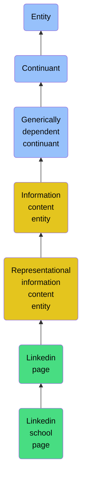

# Linkedin school page

## Overview

### Definition
A LinkedIn school page that includes information about the school's programs, faculty, students, and events, representing the educational institution's professional presence on LinkedIn.

### Examples
Not defined.

### Aliases
Not defined.

### URI
http://ontology.naas.ai/abi/LinkedInSchoolPage

### Subclass Of

- [Entity](/docs/ontology/reference/full/Entity/Entity.md)
- [Continuant](/docs/ontology/reference/full/Entity/Continuant/Continuant.md)
- [Generically dependent continuant](/docs/ontology/reference/full/Entity/Continuant/Generically%20dependent%20continuant/Generically%20dependent%20continuant.md)
- [Information content entity](/docs/ontology/reference/full/Entity/Continuant/Generically%20dependent%20continuant/Information%20content%20entity/Information%20content%20entity.md)
- [Representational information content entity](/docs/ontology/reference/full/Entity/Continuant/Generically%20dependent%20continuant/Information%20content%20entity/Representational%20information%20content%20entity/Representational%20information%20content%20entity.md)
- [Linkedin page](/docs/ontology/reference/full/Entity/Continuant/Generically%20dependent%20continuant/Information%20content%20entity/Representational%20information%20content%20entity/Linkedin%20page/Linkedin%20page.md)
- [Linkedin school page](/docs/ontology/reference/full/Entity/Continuant/Generically%20dependent%20continuant/Information%20content%20entity/Representational%20information%20content%20entity/Linkedin%20page/Linkedin%20school%20page/Linkedin%20school%20page.md)

### Ontology Reference
- [abi](http://ontology.naas.ai/abi/)

## Properties
### Data Properties
| Ontology | Label | Definition | Example | Domain | Range |
|----------|-------|------------|---------|--------|-------|
| abi | [is curated in foundry](http://ontology.naas.ai/abi/is_curated_in_foundry) | Relates a class to the foundry it is curated in. | The class cco:ont00001262 is curated in the foundry 'enterprise_management_foundry' and 'personal_ai_foundry'. | [entity](/docs/ontology/reference/full/Entity/Entity.md) | [string](http://www.w3.org/2001/XMLSchema#string) |
| abi | [data property](http://ontology.naas.ai/abi/template/dataProperty) | A data property is a property that is used to represent a data property. |  | [entity](/docs/ontology/reference/full/Entity/Entity.md) | [string](http://www.w3.org/2001/XMLSchema#string) |
| abi | [extracted at](http://ontology.naas.ai/abi/extracted_at) | The timestamp in ISO 8601 format when a generically dependent continuant was extracted or retrieved from its source. | 2025-06-05T12:00:00+00:00 | [generically dependent continuant](/docs/ontology/reference/full/Entity/Continuant/Generically%20dependent%20continuant/Generically%20dependent%20continuant.md) | [dateTime](http://www.w3.org/2001/XMLSchema#dateTime) |
| abi | [LinkedIn ID](http://ontology.naas.ai/abi/linkedin_id) | The ID of the LinkedIn page. | The unique ID of John Doe's LinkedIn profile page is 'ACoAAAa5py0Bzrp5_7OmHIsNP6xxxxxxxx'. | [LinkedIn Page](/docs/ontology/reference/full/Entity/Continuant/Generically%20dependent%20continuant/Information%20content%20entity/Representational%20information%20content%20entity/Linkedin%20page/Linkedin%20page.md) | [string](http://www.w3.org/2001/XMLSchema#string) |
| abi | [LinkedIn Public ID](http://ontology.naas.ai/abi/linkedin_public_id) | The public ID of the LinkedIn page. It might change over time. | The public ID of John Doe's LinkedIn profile page is 'johndoe'. | [LinkedIn Page](/docs/ontology/reference/full/Entity/Continuant/Generically%20dependent%20continuant/Information%20content%20entity/Representational%20information%20content%20entity/Linkedin%20page/Linkedin%20page.md) | [string](http://www.w3.org/2001/XMLSchema#string) |
| abi | [LinkedIn Public URL](http://ontology.naas.ai/abi/linkedin_public_url) | The public URL of the LinkedIn page. It uses the LinkedIn Public ID as identifier. | The public URL of John Doe's LinkedIn profile page is 'https://www.linkedin.com/in/johndoe'. | [LinkedIn Page](/docs/ontology/reference/full/Entity/Continuant/Generically%20dependent%20continuant/Information%20content%20entity/Representational%20information%20content%20entity/Linkedin%20page/Linkedin%20page.md) | [string](http://www.w3.org/2001/XMLSchema#string) |
| abi | [LinkedIn URL](http://ontology.naas.ai/abi/linkedin_url) | The URL of the LinkedIn page. It uses the LinkedIn ID as a unique identifier. | The URL of John Doe's LinkedIn profile page is 'https://www.linkedin.com/in/ACoAAAa5py0Bzrp5_7OmHIsNP6xxxxxxxx'. | [LinkedIn Page](/docs/ontology/reference/full/Entity/Continuant/Generically%20dependent%20continuant/Information%20content%20entity/Representational%20information%20content%20entity/Linkedin%20page/Linkedin%20page.md) | [string](http://www.w3.org/2001/XMLSchema#string) |

### Object Properties
| Ontology | Label | Definition | Example | Domain | Range | Inverse Of |
|----------|-------|------------|---------|--------|-------|------------|
| abi | [has backing data source](http://ontology.naas.ai/abi/hasBackingDataSource) | Relates an entity to the data source that provides the underlying data for that entity. This property indicates the origin or source of the data that supports the entity. | A report entity may have a backing data source that provides the raw data used to generate the report. | [entity](/docs/ontology/reference/full/Entity/Entity.md) | [Data Source](/docs/ontology/reference/full/Entity/Continuant/Generically%20dependent%20continuant/Data%20source/Data%20source.md) |  |
| abi | [has template class](http://ontology.naas.ai/abi/template/hasTemplateClass) | Relates a subject to its template class. |  | [entity](/docs/ontology/reference/full/Entity/Entity.md) | [Template Class](/docs/ontology/reference/full/Entity/Continuant/Generically%20dependent%20continuant/Template%20class/Template%20class.md) |  |
| bfo | [exists at](http://purl.obolibrary.org/obo/BFO_0000108) | (Elucidation) exists at is a relation between a particular and some temporal region at which the particular exists | First World War exists at 1914-1916; Mexico exists at January 1, 2000 | [entity](/docs/ontology/reference/full/Entity/Entity.md) | [temporal region](/docs/ontology/reference/full/Entity/Occurrent/Temporal%20region/Temporal%20region.md) |  |
| bfo | [continuant part of](http://purl.obolibrary.org/obo/BFO_0000176) | b continuant part of c =Def b and c are continuants & there is some time t such that b and c exist at t & b continuant part of c at t | Milk teeth continuant part of human; surgically removed tumour continuant part of organism | [continuant](/docs/ontology/reference/full/Entity/Continuant/Continuant.md) | [continuant](/docs/ontology/reference/full/Entity/Continuant/Continuant.md) | [has continuant part](http://purl.obolibrary.org/obo/BFO_0000178) |
| bfo | [has continuant part](http://purl.obolibrary.org/obo/BFO_0000178) | b has continuant part c =Def c continuant part of b |  | [continuant](/docs/ontology/reference/full/Entity/Continuant/Continuant.md) | [continuant](/docs/ontology/reference/full/Entity/Continuant/Continuant.md) |  |
| cco | [is output of](https://www.commoncoreontologies.org/ont00001816) | x is_output_of y iff x is an instance of Continuant and y is an instance of Process, such that the presence of x at the end of y is a necessary condition for the completion of y. |  | [continuant](/docs/ontology/reference/full/Entity/Continuant/Continuant.md) | [process](/docs/ontology/reference/full/Entity/Occurrent/Process/Process.md) | [has output](https://www.commoncoreontologies.org/ont00001986) |
| cco | [is input of](https://www.commoncoreontologies.org/ont00001841) | x is_input_of y iff x is an instance of Continuant and y is an instance of Process, such that the presence of x at the beginning of y is a necessary condition for the start of y. |  | [continuant](/docs/ontology/reference/full/Entity/Continuant/Continuant.md) | [process](/docs/ontology/reference/full/Entity/Occurrent/Process/Process.md) | [has input](https://www.commoncoreontologies.org/ont00001921) |
| cco | [is affected by](https://www.commoncoreontologies.org/ont00001886) | x is_affected_by y iff x is an instance of Continuant and y is an instance of Process, and y influences x in some manner, most often by producing a change in x. |  | [continuant](/docs/ontology/reference/full/Entity/Continuant/Continuant.md) | [process](/docs/ontology/reference/full/Entity/Occurrent/Process/Process.md) |  |
| bfo | [is concretized by](http://purl.obolibrary.org/obo/BFO_0000058) | c is concretized by b =Def b concretizes c |  | [generically dependent continuant](/docs/ontology/reference/full/Entity/Continuant/Generically%20dependent%20continuant/Generically%20dependent%20continuant.md) | [{'or': ['http://purl.obolibrary.org/obo/BFO_0000015', 'http://purl.obolibrary.org/obo/BFO_0000020']}](/docs/ontology/reference/full/%7B%27or%27%3A%20%5B%27http%3A//purl.obolibrary.org/obo/BFO_0000015%27%2C%20%27http%3A//purl.obolibrary.org/obo/BFO_0000020%27%5D%7D/%7B%27or%27%3A%20%5B%27http%3A//purl.obolibrary.org/obo/bfo_0000015%27%2C%20%27http%3A//purl.obolibrary.org/obo/bfo_0000020%27%5D%7D.md) | [concretizes](http://purl.obolibrary.org/obo/BFO_0000059) |
| bfo | [generically depends on](http://purl.obolibrary.org/obo/BFO_0000084) | b generically depends on c =Def b is a generically dependent continuant & c is an independent continuant that is not a spatial region & at some time t there inheres in c a specifically dependent continuant which concretizes b at t |  | [generically dependent continuant](/docs/ontology/reference/full/Entity/Continuant/Generically%20dependent%20continuant/Generically%20dependent%20continuant.md) | [{'and': ['http://purl.obolibrary.org/obo/BFO_0000004', {'not': ['http://purl.obolibrary.org/obo/BFO_0000006']}]}](/docs/ontology/reference/full/%7B%27and%27%3A%20%5B%27http%3A//purl.obolibrary.org/obo/BFO_0000004%27%2C%20%7B%27not%27%3A%20%5B%27http%3A//purl.obolibrary.org/obo/BFO_0000006%27%5D%7D%5D%7D/%7B%27and%27%3A%20%5B%27http%3A//purl.obolibrary.org/obo/bfo_0000004%27%2C%20%7B%27not%27%3A%20%5B%27http%3A//purl.obolibrary.org/obo/bfo_0000006%27%5D%7D%5D%7D.md) | [is carrier of](http://purl.obolibrary.org/obo/BFO_0000101) |
| cco | [is about](https://www.commoncoreontologies.org/ont00001808) | A primitive relationship between an Information Content Entity and some Entity. |  | [Information Content Entity](/docs/ontology/reference/full/Entity/Continuant/Generically%20dependent%20continuant/Information%20content%20entity/Information%20content%20entity.md) | [entity](/docs/ontology/reference/full/Entity/Entity.md) |  |
| cco | [represents](https://www.commoncoreontologies.org/ont00001938) | x represents y iff x is an instance of Information Content Entity, y is an instance of Entity, and z is carrier of x, such that x is about y in virtue of there existing an isomorphism between characteristics of z and y. |  | [Representational Information Content Entity](/docs/ontology/reference/full/Entity/Continuant/Generically%20dependent%20continuant/Information%20content%20entity/Representational%20information%20content%20entity/Representational%20information%20content%20entity.md) | [None](/docs/ontology/reference/full/Entity/Occurrent/Process/None.md) |  |
| abi | [is linkedin page of](http://ontology.naas.ai/abi/isLinkedInPageOf) | Relates a LinkedIn page to the entity it represents. | A LinkedIn profile page that represents John Doe's professional presence. | [LinkedIn Page](/docs/ontology/reference/full/Entity/Continuant/Generically%20dependent%20continuant/Information%20content%20entity/Representational%20information%20content%20entity/Linkedin%20page/Linkedin%20page.md) | [{'or': ['https://www.commoncoreontologies.org/ont00001180', 'https://www.commoncoreontologies.org/ont00001262']}](/docs/ontology/reference/full/%7B%27or%27%3A%20%5B%27https%3A//www.commoncoreontologies.org/ont00001180%27%2C%20%27https%3A//www.commoncoreontologies.org/ont00001262%27%5D%7D/%7B%27or%27%3A%20%5B%27https%3A//www.commoncoreontologies.org/ont00001180%27%2C%20%27https%3A//www.commoncoreontologies.org/ont00001262%27%5D%7D.md) | [has linkedin page](http://ontology.naas.ai/abi/hasLinkedInPage) |

