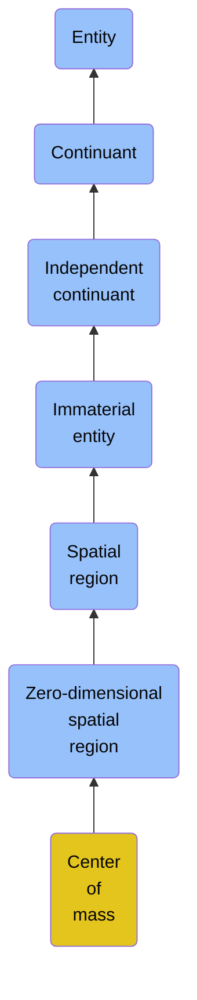

# Center of mass

## Overview

### Definition
A Zero-Dimensional Spatial Region that is the point where the weighted position vectors of the distributed Mass of a Material Entity relative to this point sum to zero.

### Examples
Not defined.

### Aliases
Not defined.

### URI
https://www.commoncoreontologies.org/ont00000505

### Subclass Of

- [Entity](/docs/ontology/reference/full/Entity/Entity.md)
- [Continuant](/docs/ontology/reference/full/Entity/Continuant/Continuant.md)
- [Independent continuant](/docs/ontology/reference/full/Entity/Continuant/Independent%20continuant/Independent%20continuant.md)
- [Immaterial entity](/docs/ontology/reference/full/Entity/Continuant/Independent%20continuant/Immaterial%20entity/Immaterial%20entity.md)
- [Spatial region](/docs/ontology/reference/full/Entity/Continuant/Independent%20continuant/Immaterial%20entity/Spatial%20region/Spatial%20region.md)
- [Zero-dimensional spatial region](/docs/ontology/reference/full/Entity/Continuant/Independent%20continuant/Immaterial%20entity/Spatial%20region/Zero-dimensional%20spatial%20region/Zero-dimensional%20spatial%20region.md)
- [Center of mass](/docs/ontology/reference/full/Entity/Continuant/Independent%20continuant/Immaterial%20entity/Spatial%20region/Zero-dimensional%20spatial%20region/Center%20of%20mass/Center%20of%20mass.md)

### Ontology Reference
- [cco](https://www.commoncoreontologies.org/): [GeospatialOntology](https://www.commoncoreontologies.org/GeospatialOntology)

## Properties
### Data Properties
| Ontology | Label | Definition | Example | Domain | Range |
|----------|-------|------------|---------|--------|-------|
| abi | [is curated in foundry](http://ontology.naas.ai/abi/is_curated_in_foundry) | Relates a class to the foundry it is curated in. | The class cco:ont00001262 is curated in the foundry 'enterprise_management_foundry' and 'personal_ai_foundry'. | [entity](/docs/ontology/reference/full/Entity/Entity.md) | [string](http://www.w3.org/2001/XMLSchema#string) |
| abi | [data property](http://ontology.naas.ai/abi/template/dataProperty) | A data property is a property that is used to represent a data property. |  | [entity](/docs/ontology/reference/full/Entity/Entity.md) | [string](http://www.w3.org/2001/XMLSchema#string) |

### Object Properties
| Ontology | Label | Definition | Example | Domain | Range | Inverse Of |
|----------|-------|------------|---------|--------|-------|------------|
| abi | [has backing data source](http://ontology.naas.ai/abi/hasBackingDataSource) | Relates an entity to the data source that provides the underlying data for that entity. This property indicates the origin or source of the data that supports the entity. | A report entity may have a backing data source that provides the raw data used to generate the report. | [entity](/docs/ontology/reference/full/Entity/Entity.md) | [Data Source](/docs/ontology/reference/full/Entity/Continuant/Generically%20dependent%20continuant/Data%20source/Data%20source.md) |  |
| abi | [has template class](http://ontology.naas.ai/abi/template/hasTemplateClass) | Relates a subject to its template class. |  | [entity](/docs/ontology/reference/full/Entity/Entity.md) | [Template Class](/docs/ontology/reference/full/Entity/Continuant/Generically%20dependent%20continuant/Template%20class/Template%20class.md) |  |
| bfo | [exists at](http://purl.obolibrary.org/obo/BFO_0000108) | (Elucidation) exists at is a relation between a particular and some temporal region at which the particular exists | First World War exists at 1914-1916; Mexico exists at January 1, 2000 | [entity](/docs/ontology/reference/full/Entity/Entity.md) | [temporal region](/docs/ontology/reference/full/Entity/Occurrent/Temporal%20region/Temporal%20region.md) |  |
| bfo | [continuant part of](http://purl.obolibrary.org/obo/BFO_0000176) | b continuant part of c =Def b and c are continuants & there is some time t such that b and c exist at t & b continuant part of c at t | Milk teeth continuant part of human; surgically removed tumour continuant part of organism | [continuant](/docs/ontology/reference/full/Entity/Continuant/Continuant.md) | [continuant](/docs/ontology/reference/full/Entity/Continuant/Continuant.md) | [has continuant part](http://purl.obolibrary.org/obo/BFO_0000178) |
| bfo | [has continuant part](http://purl.obolibrary.org/obo/BFO_0000178) | b has continuant part c =Def c continuant part of b |  | [continuant](/docs/ontology/reference/full/Entity/Continuant/Continuant.md) | [continuant](/docs/ontology/reference/full/Entity/Continuant/Continuant.md) |  |
| cco | [is output of](https://www.commoncoreontologies.org/ont00001816) | x is_output_of y iff x is an instance of Continuant and y is an instance of Process, such that the presence of x at the end of y is a necessary condition for the completion of y. |  | [continuant](/docs/ontology/reference/full/Entity/Continuant/Continuant.md) | [process](/docs/ontology/reference/full/Entity/Occurrent/Process/Process.md) | [has output](https://www.commoncoreontologies.org/ont00001986) |
| cco | [is input of](https://www.commoncoreontologies.org/ont00001841) | x is_input_of y iff x is an instance of Continuant and y is an instance of Process, such that the presence of x at the beginning of y is a necessary condition for the start of y. |  | [continuant](/docs/ontology/reference/full/Entity/Continuant/Continuant.md) | [process](/docs/ontology/reference/full/Entity/Occurrent/Process/Process.md) | [has input](https://www.commoncoreontologies.org/ont00001921) |
| cco | [is affected by](https://www.commoncoreontologies.org/ont00001886) | x is_affected_by y iff x is an instance of Continuant and y is an instance of Process, and y influences x in some manner, most often by producing a change in x. |  | [continuant](/docs/ontology/reference/full/Entity/Continuant/Continuant.md) | [process](/docs/ontology/reference/full/Entity/Occurrent/Process/Process.md) |  |
| cco | [is successor of](https://www.commoncoreontologies.org/ont00001775) | A continuant c2 is a successor of some continuant c1 iff there is some process p1 and c1 is an input to p1 and c2 is an output of p1. Inverse of is predecessor.  |  | [independent continuant](/docs/ontology/reference/full/Entity/Continuant/Independent%20continuant/Independent%20continuant.md) | [independent continuant](/docs/ontology/reference/full/Entity/Continuant/Independent%20continuant/Independent%20continuant.md) | [is predecessor of](https://www.commoncoreontologies.org/ont00001928) |
| cco | [is predecessor of](https://www.commoncoreontologies.org/ont00001928) | A continuant c1 is a predecessor of some continuant c2 iff there is some process p1 and c1 is an input to p1 and c2 is an output of p1. |  | [independent continuant](/docs/ontology/reference/full/Entity/Continuant/Independent%20continuant/Independent%20continuant.md) | [independent continuant](/docs/ontology/reference/full/Entity/Continuant/Independent%20continuant/Independent%20continuant.md) |  |
| cco | [coincides with](https://www.commoncoreontologies.org/ont00001791) | An immaterial entity im1 coincides with some immaterial entity im2 iff im1 is a spatial part of im2 and im2 is a spatial part of im1. |  | [immaterial entity](/docs/ontology/reference/full/Entity/Continuant/Independent%20continuant/Immaterial%20entity/Immaterial%20entity.md) | [immaterial entity](/docs/ontology/reference/full/Entity/Continuant/Independent%20continuant/Immaterial%20entity/Immaterial%20entity.md) |  |
| cco | [tangential part of](https://www.commoncoreontologies.org/ont00001796) | An immaterial entity im1 is a tangential part of some immaterial entity im2 iff im1 is a spatial part of im2 and there exists some immaterial entity im3 such that im3 externally connects with im1 and im3 externally connects with im2. |  | [immaterial entity](/docs/ontology/reference/full/Entity/Continuant/Independent%20continuant/Immaterial%20entity/Immaterial%20entity.md) | [immaterial entity](/docs/ontology/reference/full/Entity/Continuant/Independent%20continuant/Immaterial%20entity/Immaterial%20entity.md) | [has tangential part](https://www.commoncoreontologies.org/ont00001909) |
| cco | [partially overlaps with](https://www.commoncoreontologies.org/ont00001797) | An immaterial entity im1 partially overlaps with some immaterial entity im2 iff im1 overlaps with im2 and im1 is not a spatial part of im2 and im2 is not a spatial part of im1. |  | [immaterial entity](/docs/ontology/reference/full/Entity/Continuant/Independent%20continuant/Immaterial%20entity/Immaterial%20entity.md) | [immaterial entity](/docs/ontology/reference/full/Entity/Continuant/Independent%20continuant/Immaterial%20entity/Immaterial%20entity.md) |  |
| cco | [connected with](https://www.commoncoreontologies.org/ont00001810) | An immaterial entity im1 is connected with some immaterial entity im2 iff there exists some immaterial entity im3 that is common to both im1 and im2. |  | [immaterial entity](/docs/ontology/reference/full/Entity/Continuant/Independent%20continuant/Immaterial%20entity/Immaterial%20entity.md) | [immaterial entity](/docs/ontology/reference/full/Entity/Continuant/Independent%20continuant/Immaterial%20entity/Immaterial%20entity.md) |  |
| cco | [nontangential part of](https://www.commoncoreontologies.org/ont00001827) | An immaterial entity im1 is a nontangential part of some immaterial entity im2 iff im1 is a spatial part of im2 and there does not exist an immaterial entity im3 such that im3 externally connects with im1 and im3 externally connects with im2. |  | [immaterial entity](/docs/ontology/reference/full/Entity/Continuant/Independent%20continuant/Immaterial%20entity/Immaterial%20entity.md) | [immaterial entity](/docs/ontology/reference/full/Entity/Continuant/Independent%20continuant/Immaterial%20entity/Immaterial%20entity.md) | [has nontangential part](https://www.commoncoreontologies.org/ont00001989) |
| cco | [disconnected with](https://www.commoncoreontologies.org/ont00001838) | An immaterial entity im1 is disconnected with some immaterial entity im2 iff there does not exist some immaterial entity im3 that is common to both im1 and im2. |  | [immaterial entity](/docs/ontology/reference/full/Entity/Continuant/Independent%20continuant/Immaterial%20entity/Immaterial%20entity.md) | [immaterial entity](/docs/ontology/reference/full/Entity/Continuant/Independent%20continuant/Immaterial%20entity/Immaterial%20entity.md) |  |
| cco | [has spatial part](https://www.commoncoreontologies.org/ont00001855) | y has_spatial_part x iff x, y, z, and q are instances of Immaterial Entity, such that for any z connected with x, z is also connected with y, and q is connected with y but not connected with x. |  | [immaterial entity](/docs/ontology/reference/full/Entity/Continuant/Independent%20continuant/Immaterial%20entity/Immaterial%20entity.md) | [immaterial entity](/docs/ontology/reference/full/Entity/Continuant/Independent%20continuant/Immaterial%20entity/Immaterial%20entity.md) | [spatial part of](https://www.commoncoreontologies.org/ont00001944) |
| cco | [has tangential part](https://www.commoncoreontologies.org/ont00001909) | x has_tangential_part y iff x, y, and z are instances of Immaterial Entity, and x has_spatial_part y, such that z externally connects with both x and y. |  | [immaterial entity](/docs/ontology/reference/full/Entity/Continuant/Independent%20continuant/Immaterial%20entity/Immaterial%20entity.md) | [immaterial entity](/docs/ontology/reference/full/Entity/Continuant/Independent%20continuant/Immaterial%20entity/Immaterial%20entity.md) |  |
| cco | [externally connects with](https://www.commoncoreontologies.org/ont00001931) | An immaterial entity im1 externally connects with some immaterial entity im2 iff im1 connects with im2 and im1 does not overlap with im2. |  | [immaterial entity](/docs/ontology/reference/full/Entity/Continuant/Independent%20continuant/Immaterial%20entity/Immaterial%20entity.md) | [immaterial entity](/docs/ontology/reference/full/Entity/Continuant/Independent%20continuant/Immaterial%20entity/Immaterial%20entity.md) |  |
| cco | [spatial part of](https://www.commoncoreontologies.org/ont00001944) | x spatial_part_of y iff x, y, z, and q are instances of Immaterial Entity, such that for any z connected with x, z is also connected with y, and q is connected with y but not connected with x. |  | [immaterial entity](/docs/ontology/reference/full/Entity/Continuant/Independent%20continuant/Immaterial%20entity/Immaterial%20entity.md) | [immaterial entity](/docs/ontology/reference/full/Entity/Continuant/Independent%20continuant/Immaterial%20entity/Immaterial%20entity.md) |  |
| cco | [has nontangential part](https://www.commoncoreontologies.org/ont00001989) | x has_nontangential_part y iff x and y are instances of Immaterial Entity, and x has_spatial_part y, such that there does not exist another instance of an Immaterial Entity which externally connects with both x and y. |  | [immaterial entity](/docs/ontology/reference/full/Entity/Continuant/Independent%20continuant/Immaterial%20entity/Immaterial%20entity.md) | [immaterial entity](/docs/ontology/reference/full/Entity/Continuant/Independent%20continuant/Immaterial%20entity/Immaterial%20entity.md) |  |

