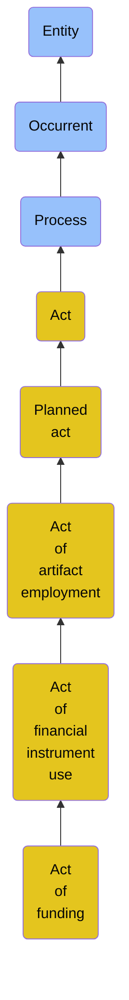

# Act of funding

## Overview

### Definition
An Act of Financial Instrument Use in which an Agent provides a sum of money to another Agent for a particular purpose.

### Examples
Not defined.

### Aliases
Not defined.

### URI
https://www.commoncoreontologies.org/ont00000322

### Subclass Of

- [Entity](/docs/ontology/reference/model/Entity/Entity.md)
- [Occurrent](/docs/ontology/reference/model/Entity/Occurrent/Occurrent.md)
- [Process](/docs/ontology/reference/model/Entity/Occurrent/Process/Process.md)
- [Act](/docs/ontology/reference/model/Entity/Occurrent/Process/Act/Act.md)
- [Planned act](/docs/ontology/reference/model/Entity/Occurrent/Process/Act/Planned%20act/Planned%20act.md)
- [Act of artifact employment](/docs/ontology/reference/model/Entity/Occurrent/Process/Act/Planned%20act/Act%20of%20artifact%20employment/Act%20of%20artifact%20employment.md)
- [Act of financial instrument use](/docs/ontology/reference/model/Entity/Occurrent/Process/Act/Planned%20act/Act%20of%20artifact%20employment/Act%20of%20financial%20instrument%20use/Act%20of%20financial%20instrument%20use.md)
- [Act of funding](/docs/ontology/reference/model/Entity/Occurrent/Process/Act/Planned%20act/Act%20of%20artifact%20employment/Act%20of%20financial%20instrument%20use/Act%20of%20funding/Act%20of%20funding.md)

### Ontology Reference
- [cco](https://www.commoncoreontologies.org/): [EventOntology](https://www.commoncoreontologies.org/EventOntology)

## Properties
### Object Properties
| Ontology | Label | Definition | Example | Domain | Range | Inverse Of |
|----------|-------|------------|---------|--------|-------|------------|
| bfo | [exists at](http://purl.obolibrary.org/obo/BFO_0000108) | (Elucidation) exists at is a relation between a particular and some temporal region at which the particular exists | First World War exists at 1914-1916; Mexico exists at January 1, 2000 | [entity](/docs/ontology/reference/model/Entity/Entity.md) | [temporal region](/docs/ontology/reference/model/Entity/Occurrent/Temporal%20region/Temporal%20region.md) |  |
| bfo | [preceded by](http://purl.obolibrary.org/obo/BFO_0000062) | b preceded by c =Def b precedes c | The temporal region occupied by the second half of the match is preceded by the temporal region occupied by the first half of the match | [occurrent](/docs/ontology/reference/model/Entity/Occurrent/Occurrent.md) | [occurrent](/docs/ontology/reference/model/Entity/Occurrent/Occurrent.md) | [precedes](http://purl.obolibrary.org/obo/BFO_0000063) |
| bfo | [precedes](http://purl.obolibrary.org/obo/BFO_0000063) | (Elucidation) precedes is a relation between occurrents o, o' such that if t is the temporal extent of o & t' is the temporal extent of o' then either the last instant of o is before the first instant of o' or the last instant of o is the first instant of o' & neither o nor o' are temporal instants | The temporal region occupied by Mary's birth precedes the temporal region occupied by Mary's death. | [occurrent](/docs/ontology/reference/model/Entity/Occurrent/Occurrent.md) | [occurrent](/docs/ontology/reference/model/Entity/Occurrent/Occurrent.md) |  |
| bfo | [has occurrent part](http://purl.obolibrary.org/obo/BFO_0000117) | b has occurrent part c =Def c occurrent part of b | Mary's life has occurrent part Mary's 5th birthday | [occurrent](/docs/ontology/reference/model/Entity/Occurrent/Occurrent.md) | [occurrent](/docs/ontology/reference/model/Entity/Occurrent/Occurrent.md) | [occurrent part of](http://purl.obolibrary.org/obo/BFO_0000132) |
| bfo | [has temporal part](http://purl.obolibrary.org/obo/BFO_0000121) | b has temporal part c =Def c temporal part of b | Your life has temporal part the first year of your life | [occurrent](/docs/ontology/reference/model/Entity/Occurrent/Occurrent.md) | [occurrent](/docs/ontology/reference/model/Entity/Occurrent/Occurrent.md) | [temporal part of](http://purl.obolibrary.org/obo/BFO_0000139) |
| bfo | [occurrent part of](http://purl.obolibrary.org/obo/BFO_0000132) | (Elucidation) occurrent part of is a relation between occurrents b and c when b is part of c | Mary's 5th birthday is an occurrent part of Mary's life; the first set of the tennis match is an occurrent part of the tennis match | [occurrent](/docs/ontology/reference/model/Entity/Occurrent/Occurrent.md) | [occurrent](/docs/ontology/reference/model/Entity/Occurrent/Occurrent.md) |  |
| bfo | [temporal part of](http://purl.obolibrary.org/obo/BFO_0000139) | b temporal part of c =Def b occurrent part of c & (b and c are temporal regions) or (b and c are spatiotemporal regions & b temporally projects onto an occurrent part of the temporal region that c temporally projects onto) or (b and c are processes or process boundaries & b occupies a temporal region that is an occurrent part of the temporal region that c occupies) | Your heart beating from 4pm to 5pm today is a temporal part of the process of your heart beating; the 4th year of your life is a temporal part of your life, as is the process boundary which separates the 3rd and 4th years of your life; the first quarter of a game of football is a temporal part of the whole game | [occurrent](/docs/ontology/reference/model/Entity/Occurrent/Occurrent.md) | [occurrent](/docs/ontology/reference/model/Entity/Occurrent/Occurrent.md) |  |
| cco | [is cause of](https://www.commoncoreontologies.org/ont00001803) | x is_cause_of y iff x and y are instances of Occurrent, and y is a consequence of x. |  | [occurrent](/docs/ontology/reference/model/Entity/Occurrent/Occurrent.md) | [occurrent](/docs/ontology/reference/model/Entity/Occurrent/Occurrent.md) | [caused by](https://www.commoncoreontologies.org/ont00001819) |
| cco | [caused by](https://www.commoncoreontologies.org/ont00001819) | x caused_by y iff x and y are instances of Occurrent, and x is a consequence of y. |  | [occurrent](/docs/ontology/reference/model/Entity/Occurrent/Occurrent.md) | [occurrent](/docs/ontology/reference/model/Entity/Occurrent/Occurrent.md) |  |
| bfo | [realizes](http://purl.obolibrary.org/obo/BFO_0000055) | (Elucidation) realizes is a relation between a process b and realizable entity c such that c inheres in some d & for all t, if b has participant d then c exists & the type instantiated by b is correlated with the type instantiated by c | A balding process realizes a disposition to go bald; a studying process realizes a student role; a process of pumping blood realizes the pumping function of a heart | [process](/docs/ontology/reference/model/Entity/Occurrent/Process/Process.md) | [realizable entity](/docs/ontology/reference/model/Entity/Continuant/Specifically%20dependent%20continuant/Realizable%20entity/Realizable%20entity.md) |  |
| bfo | [has participant](http://purl.obolibrary.org/obo/BFO_0000057) | p has participant c =Def c participates in p |  | [process](/docs/ontology/reference/model/Entity/Occurrent/Process/Process.md) |  |  |
| cco | [has process part](https://www.commoncoreontologies.org/ont00001777) | x has_process_part y iff x and y are instances of Process, such that y occurs during the temporal interval of x, and y either provides an input to x or receives an output of x, or both. |  | [process](/docs/ontology/reference/model/Entity/Occurrent/Process/Process.md) | [process](/docs/ontology/reference/model/Entity/Occurrent/Process/Process.md) | [is part of process](https://www.commoncoreontologies.org/ont00001857) |
| cco | [is disrupted by](https://www.commoncoreontologies.org/ont00001805) | Inverse of disrupts. |  | [process](/docs/ontology/reference/model/Entity/Occurrent/Process/Process.md) | [process](/docs/ontology/reference/model/Entity/Occurrent/Process/Process.md) | [disrupts](https://www.commoncoreontologies.org/ont00001888) |
| cco | [is required by](https://www.commoncoreontologies.org/ont00001807) | y is_required_by x at t iff: x is an instance of Process Regulation at time t, and y is an instance of Process at time t, and x prescribes that y must occur. |  | [process](/docs/ontology/reference/model/Entity/Occurrent/Process/Process.md) | [Process Regulation](/docs/ontology/reference/model/Entity/Continuant/Generically%20dependent%20continuant/Information%20content%20entity/Directive%20information%20content%20entity/Process%20regulation/Process%20regulation.md) | [requires](https://www.commoncoreontologies.org/ont00001974) |
| cco | [is prohibited by](https://www.commoncoreontologies.org/ont00001817) | y is_prohibited_by y at t iff: x is an instance of Process Regulation at time t, and y is an instance of Process at time t, and x prescribes that y must not occur. |  | [process](/docs/ontology/reference/model/Entity/Occurrent/Process/Process.md) | [Process Regulation](/docs/ontology/reference/model/Entity/Continuant/Generically%20dependent%20continuant/Information%20content%20entity/Directive%20information%20content%20entity/Process%20regulation/Process%20regulation.md) |  |
| cco | [has accomplice](https://www.commoncoreontologies.org/ont00001830) | A Processual Entity p1 has_accomplice some agent a1 iff a1 assists in the commission of p1, is located at the location of p1, but is not agent_in p1. |  | [process](/docs/ontology/reference/model/Entity/Occurrent/Process/Process.md) | [material entity](/docs/ontology/reference/model/Entity/Continuant/Independent%20continuant/Material%20entity/Material%20entity.md) | [accomplice in](https://www.commoncoreontologies.org/ont00001895) |
| cco | [affects](https://www.commoncoreontologies.org/ont00001834) | x affects y iff x is an instance of Process and y is an instance of Continuant, and x influences y in some manner, most often by producing a change in y. |  | [process](/docs/ontology/reference/model/Entity/Occurrent/Process/Process.md) | [continuant](/docs/ontology/reference/model/Entity/Continuant/Continuant.md) | [is affected by](https://www.commoncoreontologies.org/ont00001886) |
| cco | [is part of process](https://www.commoncoreontologies.org/ont00001857) | x is_part_of_process y iff x and y are instances of Process, such that x occurs during the temporal interval of y, and x either provides an input to y or receives an output of y. |  | [process](/docs/ontology/reference/model/Entity/Occurrent/Process/Process.md) | [process](/docs/ontology/reference/model/Entity/Occurrent/Process/Process.md) |  |
| cco | [is interest of](https://www.commoncoreontologies.org/ont00001866) | The inverse of has_interest_in.  |  | [process](/docs/ontology/reference/model/Entity/Occurrent/Process/Process.md) | [Agent](/docs/ontology/reference/model/Entity/Continuant/Independent%20continuant/Material%20entity/Agent/Agent.md) | [has interest in](https://www.commoncoreontologies.org/ont00001984) |
| cco | [disrupts](https://www.commoncoreontologies.org/ont00001888) | A relation where one process disrupts another process from occurring as it would have. |  | [process](/docs/ontology/reference/model/Entity/Occurrent/Process/Process.md) | [process](/docs/ontology/reference/model/Entity/Occurrent/Process/Process.md) |  |
| cco | [occurs at](https://www.commoncoreontologies.org/ont00001918) | x occurs_at y iff x is an instance of Process and y is an instance of Site, such that x occurs in y. |  | [process](/docs/ontology/reference/model/Entity/Occurrent/Process/Process.md) | [site](/docs/ontology/reference/model/Entity/Continuant/Independent%20continuant/Immaterial%20entity/Site/Site.md) |  |
| cco | [has input](https://www.commoncoreontologies.org/ont00001921) | y has_input x iff x is an instance of Continuant and y is an instance of Process, such that the presence of x at the beginning of y is a necessary condition for the start of y. |  | [process](/docs/ontology/reference/model/Entity/Occurrent/Process/Process.md) | [continuant](/docs/ontology/reference/model/Entity/Continuant/Continuant.md) |  |
| cco | [has accessory](https://www.commoncoreontologies.org/ont00001949) | x has_accessory y iff x is an instance of Process and y is an instance of Agent, such that y assists another agent in the commission of x, and y was not located at the location of x when x occurred, and y was not an agent_in x. |  | [process](/docs/ontology/reference/model/Entity/Occurrent/Process/Process.md) | [material entity](/docs/ontology/reference/model/Entity/Continuant/Independent%20continuant/Material%20entity/Material%20entity.md) |  |
| cco | [inhibits](https://www.commoncoreontologies.org/ont00001959) | x inhibits y iff x and y are non-identical Processes, d is a Decrease of Realizable Entity, and x is_cause_of d, and r is a Realizable Entity, and d has_participant r, and r realized_in y. |  | [process](/docs/ontology/reference/model/Entity/Occurrent/Process/Process.md) | [process](/docs/ontology/reference/model/Entity/Occurrent/Process/Process.md) | [inhibited by](https://www.commoncoreontologies.org/ont00001970) |
| cco | [inhibited by](https://www.commoncoreontologies.org/ont00001970) | y inhibited_by x iff x and y are non-identical Processes, d is a Decrease of Realizable Entity, and x is_cause_of d, and r is a Realizable Entity, and d has_participant r, and r realized_in y. |  | [process](/docs/ontology/reference/model/Entity/Occurrent/Process/Process.md) | [process](/docs/ontology/reference/model/Entity/Occurrent/Process/Process.md) |  |
| cco | [has output](https://www.commoncoreontologies.org/ont00001986) | y has_output x iff x is an instance of Continuant and y is an instance of Process, such that the presence of x at the end of y is a necessary condition for the completion of y. |  | [process](/docs/ontology/reference/model/Entity/Occurrent/Process/Process.md) | [continuant](/docs/ontology/reference/model/Entity/Continuant/Continuant.md) |  |
| cco | [is permitted by](https://www.commoncoreontologies.org/ont00001998) | y is_permitted_by x at t iff: x is an instance of Process Regulation at time t, and y is an instance of Process at time t, and x prescribes that y may occur. |  | [process](/docs/ontology/reference/model/Entity/Occurrent/Process/Process.md) | [Process Regulation](/docs/ontology/reference/model/Entity/Continuant/Generically%20dependent%20continuant/Information%20content%20entity/Directive%20information%20content%20entity/Process%20regulation/Process%20regulation.md) |  |

