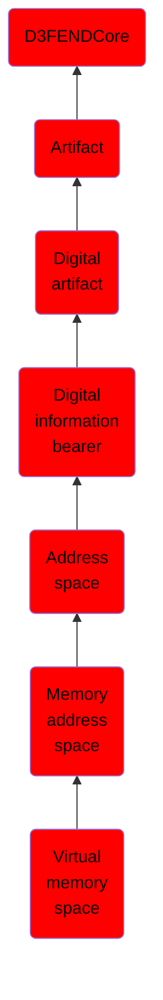

# Virtual memory space

## Overview

### Definition
Virtual memory is a memory management technique where secondary memory can be used as if it were a part of the main memory. Virtual memory uses hardware and software to enable a computer to compensate for physical memory shortages

### Examples
Not defined.

### Aliases
Not defined.

### URI
http://d3fend.mitre.org/ontologies/d3fend.owl#VirtualMemorySpace

### Subclass Of

- [D3FENDCore](/docs/ontology/reference/model/D3FENDCore/D3FENDCore.md)
- [Artifact](/docs/ontology/reference/model/D3FENDCore/Artifact/Artifact.md)
- [Digital artifact](/docs/ontology/reference/model/D3FENDCore/Artifact/Digital%20artifact/Digital%20artifact.md)
- [Digital information bearer](/docs/ontology/reference/model/D3FENDCore/Artifact/Digital%20artifact/Digital%20information%20bearer/Digital%20information%20bearer.md)
- [Address space](/docs/ontology/reference/model/D3FENDCore/Artifact/Digital%20artifact/Digital%20information%20bearer/Address%20space/Address%20space.md)
- [Memory address space](/docs/ontology/reference/model/D3FENDCore/Artifact/Digital%20artifact/Digital%20information%20bearer/Address%20space/Memory%20address%20space/Memory%20address%20space.md)
- [Virtual memory space](/docs/ontology/reference/model/D3FENDCore/Artifact/Digital%20artifact/Digital%20information%20bearer/Address%20space/Memory%20address%20space/Virtual%20memory%20space/Virtual%20memory%20space.md)

### Ontology Reference
- [d3fend](http://d3fend.mitre.org/ontologies/d3fend.owl#)

## Properties
### Data Properties
| Ontology | Label | Definition | Example | Domain | Range |
|----------|-------|------------|---------|--------|-------|
| d3fend | [d3fend-artifact-data-property](http://d3fend.mitre.org/ontologies/d3fend.owl#d3fend-artifact-data-property) | x d3fend-artifact-data-property y: The artifact x has the data property y. |  | [Digital Artifact](/docs/ontology/reference/model/D3FENDCore/Artifact/Digital%20artifact/Digital%20artifact.md) |  |

### Object Properties
| Ontology | Label | Definition | Example | Domain | Range | Inverse Of |
|----------|-------|------------|---------|--------|-------|------------|
| d3fend | [may-have-weakness](http://d3fend.mitre.org/ontologies/d3fend.owl#may-have-weakness) |  |  | [Artifact](/docs/ontology/reference/model/D3FENDCore/Artifact/Artifact.md) | [Weakness](/docs/ontology/reference/model/D3FENDCore/Weakness/Weakness.md) |  |

