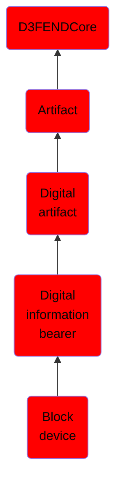

# Block device

## Overview

### Definition
A block device (or block special file) provides buffered access to hardware devices, and provides some abstraction from their specifics.

IEEE Std 1003.1-2017: A file that refers to a device. A block special file is normally distinguished from a character special file by providing access to the device in a manner such that the hardware characteristics of the device are not visible.

### Examples
Not defined.

### Aliases
Block Special File

### URI
http://d3fend.mitre.org/ontologies/d3fend.owl#BlockDevice

### Subclass Of

- [D3FENDCore](/docs/ontology/reference/model/D3FENDCore/D3FENDCore.md)
- [Artifact](/docs/ontology/reference/model/D3FENDCore/Artifact/Artifact.md)
- [Digital artifact](/docs/ontology/reference/model/D3FENDCore/Artifact/Digital%20artifact/Digital%20artifact.md)
- [Digital information bearer](/docs/ontology/reference/model/D3FENDCore/Artifact/Digital%20artifact/Digital%20information%20bearer/Digital%20information%20bearer.md)
- [Block device](/docs/ontology/reference/model/D3FENDCore/Artifact/Digital%20artifact/Digital%20information%20bearer/Block%20device/Block%20device.md)

### Ontology Reference
- [d3fend](http://d3fend.mitre.org/ontologies/d3fend.owl#)

## Properties
### Data Properties
| Ontology | Label | Definition | Example | Domain | Range |
|----------|-------|------------|---------|--------|-------|
| d3fend | [d3fend-artifact-data-property](http://d3fend.mitre.org/ontologies/d3fend.owl#d3fend-artifact-data-property) | x d3fend-artifact-data-property y: The artifact x has the data property y. |  | [Digital Artifact](/docs/ontology/reference/model/D3FENDCore/Artifact/Digital%20artifact/Digital%20artifact.md) |  |

### Object Properties
| Ontology | Label | Definition | Example | Domain | Range | Inverse Of |
|----------|-------|------------|---------|--------|-------|------------|
| d3fend | [may-have-weakness](http://d3fend.mitre.org/ontologies/d3fend.owl#may-have-weakness) |  |  | [Artifact](/docs/ontology/reference/model/D3FENDCore/Artifact/Artifact.md) | [Weakness](/docs/ontology/reference/model/D3FENDCore/Weakness/Weakness.md) |  |

