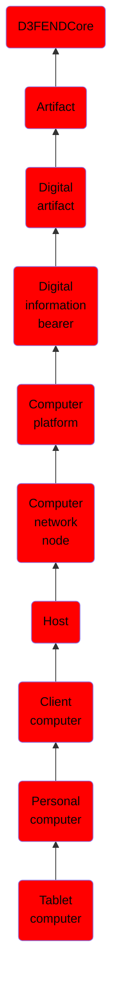

# Tablet computer

## Overview

### Definition
A tablet computer, commonly shortened to tablet, is a mobile device, typically with a mobile operating system and touchscreen display processing circuitry, and a rechargeable battery in a single, thin and flat package. Tablets, being computers, do what other personal computers do, but lack some input/output (I/O) abilities that others have. Modern tablets largely resemble modern smartphones, the only differences being that tablets are relatively larger than smartphones, with screens 7 inches (18 cm) or larger, measured diagonally, and may not support access to a cellular network.

### Examples
Not defined.

### Aliases
Tablet

### URI
http://d3fend.mitre.org/ontologies/d3fend.owl#TabletComputer

### Subclass Of

- [D3FENDCore](/docs/ontology/reference/model/D3FENDCore/D3FENDCore.md)
- [Artifact](/docs/ontology/reference/model/D3FENDCore/Artifact/Artifact.md)
- [Digital artifact](/docs/ontology/reference/model/D3FENDCore/Artifact/Digital%20artifact/Digital%20artifact.md)
- [Digital information bearer](/docs/ontology/reference/model/D3FENDCore/Artifact/Digital%20artifact/Digital%20information%20bearer/Digital%20information%20bearer.md)
- [Computer platform](/docs/ontology/reference/model/D3FENDCore/Artifact/Digital%20artifact/Digital%20information%20bearer/Computer%20platform/Computer%20platform.md)
- [Computer network node](/docs/ontology/reference/model/D3FENDCore/Artifact/Digital%20artifact/Digital%20information%20bearer/Computer%20platform/Computer%20network%20node/Computer%20network%20node.md)
- [Host](/docs/ontology/reference/model/D3FENDCore/Artifact/Digital%20artifact/Digital%20information%20bearer/Computer%20platform/Computer%20network%20node/Host/Host.md)
- [Client computer](/docs/ontology/reference/model/D3FENDCore/Artifact/Digital%20artifact/Digital%20information%20bearer/Computer%20platform/Computer%20network%20node/Host/Client%20computer/Client%20computer.md)
- [Personal computer](/docs/ontology/reference/model/D3FENDCore/Artifact/Digital%20artifact/Digital%20information%20bearer/Computer%20platform/Computer%20network%20node/Host/Client%20computer/Personal%20computer/Personal%20computer.md)
- [Tablet computer](/docs/ontology/reference/model/D3FENDCore/Artifact/Digital%20artifact/Digital%20information%20bearer/Computer%20platform/Computer%20network%20node/Host/Client%20computer/Personal%20computer/Tablet%20computer/Tablet%20computer.md)

### Ontology Reference
- [d3fend](http://d3fend.mitre.org/ontologies/d3fend.owl#)

## Properties
### Data Properties
| Ontology | Label | Definition | Example | Domain | Range |
|----------|-------|------------|---------|--------|-------|
| d3fend | [d3fend-artifact-data-property](http://d3fend.mitre.org/ontologies/d3fend.owl#d3fend-artifact-data-property) | x d3fend-artifact-data-property y: The artifact x has the data property y. |  | [Digital Artifact](/docs/ontology/reference/model/D3FENDCore/Artifact/Digital%20artifact/Digital%20artifact.md) |  |

### Object Properties
| Ontology | Label | Definition | Example | Domain | Range | Inverse Of |
|----------|-------|------------|---------|--------|-------|------------|
| d3fend | [may-have-weakness](http://d3fend.mitre.org/ontologies/d3fend.owl#may-have-weakness) |  |  | [Artifact](/docs/ontology/reference/model/D3FENDCore/Artifact/Artifact.md) | [Weakness](/docs/ontology/reference/model/D3FENDCore/Weakness/Weakness.md) |  |

