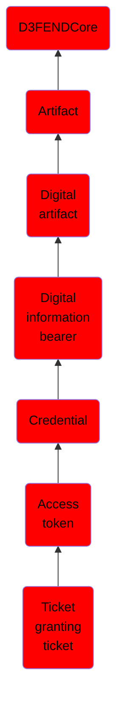

# Ticket granting ticket

## Overview

### Definition
In some computer security systems, a Ticket Granting Ticket or Ticket to Get Tickets (TGT) is a small, encrypted identification file with a limited validity period. After authentication, this file is granted to a user for data traffic protection by the key distribution center (KDC) subsystem of authentication services such as Kerberos. The TGT file contains the session key, its expiration date, and the user's IP address, which protects the user from man-in-the-middle attacks. The TGT is used to obtain a service ticket from Ticket Granting Service (TGS). User is granted access to network services only after this service ticket is provided.

### Examples
Not defined.

### Aliases
Golden Ticket

### URI
http://d3fend.mitre.org/ontologies/d3fend.owl#TicketGrantingTicket

### Subclass Of

- [D3FENDCore](/docs/ontology/reference/model/D3FENDCore/D3FENDCore.md)
- [Artifact](/docs/ontology/reference/model/D3FENDCore/Artifact/Artifact.md)
- [Digital artifact](/docs/ontology/reference/model/D3FENDCore/Artifact/Digital%20artifact/Digital%20artifact.md)
- [Digital information bearer](/docs/ontology/reference/model/D3FENDCore/Artifact/Digital%20artifact/Digital%20information%20bearer/Digital%20information%20bearer.md)
- [Credential](/docs/ontology/reference/model/D3FENDCore/Artifact/Digital%20artifact/Digital%20information%20bearer/Credential/Credential.md)
- [Access token](/docs/ontology/reference/model/D3FENDCore/Artifact/Digital%20artifact/Digital%20information%20bearer/Credential/Access%20token/Access%20token.md)
- [Ticket granting ticket](/docs/ontology/reference/model/D3FENDCore/Artifact/Digital%20artifact/Digital%20information%20bearer/Credential/Access%20token/Ticket%20granting%20ticket/Ticket%20granting%20ticket.md)

### Ontology Reference
- [d3fend](http://d3fend.mitre.org/ontologies/d3fend.owl#)

## Properties
### Data Properties
| Ontology | Label | Definition | Example | Domain | Range |
|----------|-------|------------|---------|--------|-------|
| d3fend | [d3fend-artifact-data-property](http://d3fend.mitre.org/ontologies/d3fend.owl#d3fend-artifact-data-property) | x d3fend-artifact-data-property y: The artifact x has the data property y. |  | [Digital Artifact](/docs/ontology/reference/model/D3FENDCore/Artifact/Digital%20artifact/Digital%20artifact.md) |  |

### Object Properties
| Ontology | Label | Definition | Example | Domain | Range | Inverse Of |
|----------|-------|------------|---------|--------|-------|------------|
| d3fend | [may-have-weakness](http://d3fend.mitre.org/ontologies/d3fend.owl#may-have-weakness) |  |  | [Artifact](/docs/ontology/reference/model/D3FENDCore/Artifact/Artifact.md) | [Weakness](/docs/ontology/reference/model/D3FENDCore/Weakness/Weakness.md) |  |

