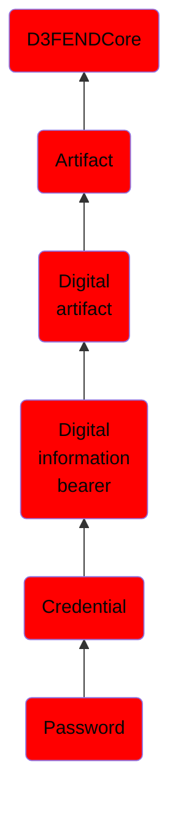

# Password

## Overview

### Definition
A password, sometimes called a passcode, is a memorized secret, typically a string of characters, usually used to confirm the identity of a user. Using the terminology of the NIST Digital Identity Guidelines, the secret is memorized by a party called the claimant while the party verifying the identity of the claimant is called the verifier. When the claimant successfully demonstrates knowledge of the password to the verifier through an established authentication protocol, the verifier is able to infer the claimant's identity.

### Examples
Not defined.

### Aliases
Passcode

### URI
http://d3fend.mitre.org/ontologies/d3fend.owl#Password

### Subclass Of

- [D3FENDCore](/docs/ontology/reference/model/D3FENDCore/D3FENDCore.md)
- [Artifact](/docs/ontology/reference/model/D3FENDCore/Artifact/Artifact.md)
- [Digital artifact](/docs/ontology/reference/model/D3FENDCore/Artifact/Digital%20artifact/Digital%20artifact.md)
- [Digital information bearer](/docs/ontology/reference/model/D3FENDCore/Artifact/Digital%20artifact/Digital%20information%20bearer/Digital%20information%20bearer.md)
- [Credential](/docs/ontology/reference/model/D3FENDCore/Artifact/Digital%20artifact/Digital%20information%20bearer/Credential/Credential.md)
- [Password](/docs/ontology/reference/model/D3FENDCore/Artifact/Digital%20artifact/Digital%20information%20bearer/Credential/Password/Password.md)

### Ontology Reference
- [d3fend](http://d3fend.mitre.org/ontologies/d3fend.owl#)

## Properties
### Data Properties
| Ontology | Label | Definition | Example | Domain | Range |
|----------|-------|------------|---------|--------|-------|
| d3fend | [d3fend-artifact-data-property](http://d3fend.mitre.org/ontologies/d3fend.owl#d3fend-artifact-data-property) | x d3fend-artifact-data-property y: The artifact x has the data property y. |  | [Digital Artifact](/docs/ontology/reference/model/D3FENDCore/Artifact/Digital%20artifact/Digital%20artifact.md) |  |

### Object Properties
| Ontology | Label | Definition | Example | Domain | Range | Inverse Of |
|----------|-------|------------|---------|--------|-------|------------|
| d3fend | [may-have-weakness](http://d3fend.mitre.org/ontologies/d3fend.owl#may-have-weakness) |  |  | [Artifact](/docs/ontology/reference/model/D3FENDCore/Artifact/Artifact.md) | [Weakness](/docs/ontology/reference/model/D3FENDCore/Weakness/Weakness.md) |  |

