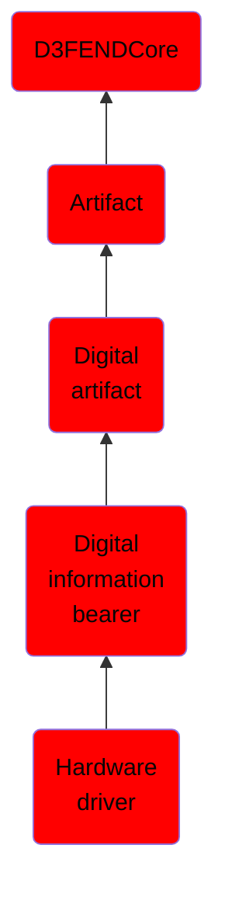

# Hardware driver

## Overview

### Definition
In computing, a device driver (commonly referred to simply as a driver) is a computer program that operates or controls a particular type of device that is attached to a computer. A driver provides a software interface to hardware devices, enabling operating systems and other computer programs to access hardware functions without needing to know precise details of the hardware being used. A driver communicates with the device through the computer bus or communications subsystem to which the hardware connects. When a calling program invokes a routine in the driver, the driver issues commands to the device. Once the device sends data back to the driver, the driver may invoke routines in the original calling program. Drivers are hardware dependent and operating-system-specific. They usually provide the interrupt handling required for any necessary asynchronous time-dependent hardware interface.

### Examples
Not defined.

### Aliases
Device Driver

### URI
http://d3fend.mitre.org/ontologies/d3fend.owl#HardwareDriver

### Subclass Of

- [D3FENDCore](/docs/ontology/reference/model/D3FENDCore/D3FENDCore.md)
- [Artifact](/docs/ontology/reference/model/D3FENDCore/Artifact/Artifact.md)
- [Digital artifact](/docs/ontology/reference/model/D3FENDCore/Artifact/Digital%20artifact/Digital%20artifact.md)
- [Digital information bearer](/docs/ontology/reference/model/D3FENDCore/Artifact/Digital%20artifact/Digital%20information%20bearer/Digital%20information%20bearer.md)
- [Hardware driver](/docs/ontology/reference/model/D3FENDCore/Artifact/Digital%20artifact/Digital%20information%20bearer/Hardware%20driver/Hardware%20driver.md)

### Ontology Reference
- [d3fend](http://d3fend.mitre.org/ontologies/d3fend.owl#)

## Properties
### Data Properties
| Ontology | Label | Definition | Example | Domain | Range |
|----------|-------|------------|---------|--------|-------|
| d3fend | [d3fend-artifact-data-property](http://d3fend.mitre.org/ontologies/d3fend.owl#d3fend-artifact-data-property) | x d3fend-artifact-data-property y: The artifact x has the data property y. |  | [Digital Artifact](/docs/ontology/reference/model/D3FENDCore/Artifact/Digital%20artifact/Digital%20artifact.md) |  |

### Object Properties
| Ontology | Label | Definition | Example | Domain | Range | Inverse Of |
|----------|-------|------------|---------|--------|-------|------------|
| d3fend | [may-have-weakness](http://d3fend.mitre.org/ontologies/d3fend.owl#may-have-weakness) |  |  | [Artifact](/docs/ontology/reference/model/D3FENDCore/Artifact/Artifact.md) | [Weakness](/docs/ontology/reference/model/D3FENDCore/Weakness/Weakness.md) |  |

