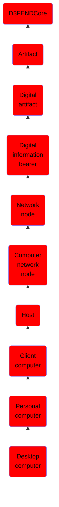

# Desktop computer

## Overview

### Definition
A desktop computer is a personal computer designed for regular use at a single location on or near a desk or table due to its size and power requirements. The most common configuration has a case that houses the power supply, motherboard (a printed circuit board with a microprocessor as the central processing unit (CPU), memory, bus, and other electronic components, disk storage (usually one or more hard disk drives, solid state drives, optical disc drives, and in early models a floppy disk drive); a keyboard and mouse for input; and a computer monitor, speakers, and, often, a printer for output. The case may be oriented horizontally or vertically and placed either underneath, beside, or on top of a desk.

### Examples
Not defined.

### Aliases
Not defined.

### URI
http://d3fend.mitre.org/ontologies/d3fend.owl#DesktopComputer

### Subclass Of

- [D3FENDCore](/docs/ontology/reference/model/D3FENDCore/D3FENDCore.md)
- [Artifact](/docs/ontology/reference/model/D3FENDCore/Artifact/Artifact.md)
- [Digital artifact](/docs/ontology/reference/model/D3FENDCore/Artifact/Digital%20artifact/Digital%20artifact.md)
- [Digital information bearer](/docs/ontology/reference/model/D3FENDCore/Artifact/Digital%20artifact/Digital%20information%20bearer/Digital%20information%20bearer.md)
- [Network node](/docs/ontology/reference/model/D3FENDCore/Artifact/Digital%20artifact/Digital%20information%20bearer/Network%20node/Network%20node.md)
- [Computer network node](/docs/ontology/reference/model/D3FENDCore/Artifact/Digital%20artifact/Digital%20information%20bearer/Network%20node/Computer%20network%20node/Computer%20network%20node.md)
- [Host](/docs/ontology/reference/model/D3FENDCore/Artifact/Digital%20artifact/Digital%20information%20bearer/Network%20node/Computer%20network%20node/Host/Host.md)
- [Client computer](/docs/ontology/reference/model/D3FENDCore/Artifact/Digital%20artifact/Digital%20information%20bearer/Network%20node/Computer%20network%20node/Host/Client%20computer/Client%20computer.md)
- [Personal computer](/docs/ontology/reference/model/D3FENDCore/Artifact/Digital%20artifact/Digital%20information%20bearer/Network%20node/Computer%20network%20node/Host/Client%20computer/Personal%20computer/Personal%20computer.md)
- [Desktop computer](/docs/ontology/reference/model/D3FENDCore/Artifact/Digital%20artifact/Digital%20information%20bearer/Network%20node/Computer%20network%20node/Host/Client%20computer/Personal%20computer/Desktop%20computer/Desktop%20computer.md)

### Ontology Reference
- [d3fend](http://d3fend.mitre.org/ontologies/d3fend.owl#)

## Properties
### Data Properties
| Ontology | Label | Definition | Example | Domain | Range |
|----------|-------|------------|---------|--------|-------|
| d3fend | [d3fend-artifact-data-property](http://d3fend.mitre.org/ontologies/d3fend.owl#d3fend-artifact-data-property) | x d3fend-artifact-data-property y: The artifact x has the data property y. |  | [Digital Artifact](/docs/ontology/reference/model/D3FENDCore/Artifact/Digital%20artifact/Digital%20artifact.md) |  |

### Object Properties
| Ontology | Label | Definition | Example | Domain | Range | Inverse Of |
|----------|-------|------------|---------|--------|-------|------------|
| d3fend | [may-have-weakness](http://d3fend.mitre.org/ontologies/d3fend.owl#may-have-weakness) |  |  | [Artifact](/docs/ontology/reference/model/D3FENDCore/Artifact/Artifact.md) | [Weakness](/docs/ontology/reference/model/D3FENDCore/Weakness/Weakness.md) |  |

