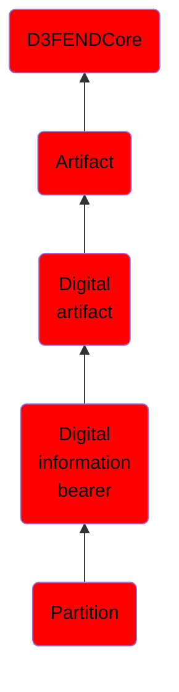

# Partition

## Overview

### Definition
A partition is a region on secondary storage device created so that the region can be managed by itself; separate from any other regions (partitions) on that secondary storage device. Creating partitions is typically the first step of preparing a newly installed storage device, before any file system is created. The device stores the information about the partitions' locations and sizes in an area known as the partition table that the operating system reads before any other part of the disk. Each partition then appears to the operating system as a distinct "logical" storage device that uses part of the actual device. System administrators use a program called a partition editor to create, resize, delete, and manipulate the partitions. Partitioning allows the use of different filesystems to be installed for different kinds of files. Separating user data from system data can prevent the system partition from becoming full and rendering the system unusable. Partitioning can also make backing up easier. [Definition adapted as generalization from definition of disk partitioning and distinct from in-memory partitions.]

### Examples
Not defined.

### Aliases
- Disk Slice
- Disk Partition

### URI
http://d3fend.mitre.org/ontologies/d3fend.owl#Partition

### Subclass Of

- [D3FENDCore](/docs/ontology/reference/model/D3FENDCore/D3FENDCore.md)
- [Artifact](/docs/ontology/reference/model/D3FENDCore/Artifact/Artifact.md)
- [Digital artifact](/docs/ontology/reference/model/D3FENDCore/Artifact/Digital%20artifact/Digital%20artifact.md)
- [Digital information bearer](/docs/ontology/reference/model/D3FENDCore/Artifact/Digital%20artifact/Digital%20information%20bearer/Digital%20information%20bearer.md)
- [Partition](/docs/ontology/reference/model/D3FENDCore/Artifact/Digital%20artifact/Digital%20information%20bearer/Partition/Partition.md)

### Ontology Reference
- [d3fend](http://d3fend.mitre.org/ontologies/d3fend.owl#)

## Properties
### Data Properties
| Ontology | Label | Definition | Example | Domain | Range |
|----------|-------|------------|---------|--------|-------|
| d3fend | [d3fend-artifact-data-property](http://d3fend.mitre.org/ontologies/d3fend.owl#d3fend-artifact-data-property) | x d3fend-artifact-data-property y: The artifact x has the data property y. |  | [Digital Artifact](/docs/ontology/reference/model/D3FENDCore/Artifact/Digital%20artifact/Digital%20artifact.md) |  |

### Object Properties
| Ontology | Label | Definition | Example | Domain | Range | Inverse Of |
|----------|-------|------------|---------|--------|-------|------------|
| d3fend | [may-have-weakness](http://d3fend.mitre.org/ontologies/d3fend.owl#may-have-weakness) |  |  | [Artifact](/docs/ontology/reference/model/D3FENDCore/Artifact/Artifact.md) | [Weakness](/docs/ontology/reference/model/D3FENDCore/Weakness/Weakness.md) |  |

