# Powershell profile script

## Overview

### Definition
A PowerShell profile script is a script that runs when PowerShell starts and can be used as a logon script to customize user environments.

### Examples
Not defined.

### Aliases
Not defined.

### URI
http://d3fend.mitre.org/ontologies/d3fend.owl#PowerShellProfileScript

### Subclass Of

```mermaid
graph BT
    d3fend.owl#PowerShellProfileScript(Powershell<br>profile<br>script):::d3fend-->d3fend.owl#UserInitScript
    d3fend.owl#UserInitScript(User<br>init<br>script):::d3fend-->d3fend.owl#InitScript
    d3fend.owl#InitScript(Init<br>script):::d3fend-->d3fend.owl#ExecutableScript
    d3fend.owl#ExecutableScript(Executable<br>script):::d3fend-->d3fend.owl#ExecutableFile
    d3fend.owl#ExecutableFile(Executable<br>file):::d3fend-->d3fend.owl#File
    d3fend.owl#File(File):::d3fend-->d3fend.owl#Resource
    d3fend.owl#Resource(Resource):::d3fend-->d3fend.owl#DigitalInformationBearer
    d3fend.owl#DigitalInformationBearer(Digital<br>information<br>bearer):::d3fend-->d3fend.owl#DigitalArtifact
    d3fend.owl#DigitalArtifact(Digital<br>artifact):::d3fend-->d3fend.owl#Artifact
    d3fend.owl#Artifact(Artifact):::d3fend-->d3fend.owl#D3FENDCore
    d3fend.owl#D3FENDCore(D3FENDCore):::d3fend
    
    classDef bfo fill:#97c1fb,color:#060606
    classDef cco fill:#e4c51e,color:#060606
    classDef abi fill:#48DD82,color:#060606
    classDef attack fill:#FF0000,color:#060606
    classDef d3fend fill:#FF0000,color:#060606
```

- [D3FENDCore](/docs/ontology/reference/model/D3FENDCore/D3FENDCore.md)
- [Artifact](/docs/ontology/reference/model/D3FENDCore/Artifact/Artifact.md)
- [Digital artifact](/docs/ontology/reference/model/D3FENDCore/Artifact/Digital%20artifact/Digital%20artifact.md)
- [Digital information bearer](/docs/ontology/reference/model/D3FENDCore/Artifact/Digital%20artifact/Digital%20information%20bearer/Digital%20information%20bearer.md)
- [Resource](/docs/ontology/reference/model/D3FENDCore/Artifact/Digital%20artifact/Digital%20information%20bearer/Resource/Resource.md)
- [File](/docs/ontology/reference/model/D3FENDCore/Artifact/Digital%20artifact/Digital%20information%20bearer/Resource/File/File.md)
- [Executable file](/docs/ontology/reference/model/D3FENDCore/Artifact/Digital%20artifact/Digital%20information%20bearer/Resource/File/Executable%20file/Executable%20file.md)
- [Executable script](/docs/ontology/reference/model/D3FENDCore/Artifact/Digital%20artifact/Digital%20information%20bearer/Resource/File/Executable%20file/Executable%20script/Executable%20script.md)
- [Init script](/docs/ontology/reference/model/D3FENDCore/Artifact/Digital%20artifact/Digital%20information%20bearer/Resource/File/Executable%20file/Executable%20script/Init%20script/Init%20script.md)
- [User init script](/docs/ontology/reference/model/D3FENDCore/Artifact/Digital%20artifact/Digital%20information%20bearer/Resource/File/Executable%20file/Executable%20script/Init%20script/User%20init%20script/User%20init%20script.md)
- [Powershell profile script](/docs/ontology/reference/model/D3FENDCore/Artifact/Digital%20artifact/Digital%20information%20bearer/Resource/File/Executable%20file/Executable%20script/Init%20script/User%20init%20script/Powershell%20profile%20script/Powershell%20profile%20script.md)

### Ontology Reference
- [d3fend](http://d3fend.mitre.org/ontologies/d3fend.owl#)

## Properties
### Data Properties
| Ontology | Label | Definition | Example | Domain | Range |
|----------|-------|------------|---------|--------|-------|
| d3fend | [d3fend-artifact-data-property](http://d3fend.mitre.org/ontologies/d3fend.owl#d3fend-artifact-data-property) | x d3fend-artifact-data-property y: The artifact x has the data property y. |  | [Digital Artifact](/docs/ontology/reference/model/D3FENDCore/Artifact/Digital%20artifact/Digital%20artifact.md) |  |

### Object Properties
| Ontology | Label | Definition | Example | Domain | Range | Inverse Of |
|----------|-------|------------|---------|--------|-------|------------|
| d3fend | [may-have-weakness](http://d3fend.mitre.org/ontologies/d3fend.owl#may-have-weakness) |  |  | [Artifact](/docs/ontology/reference/model/D3FENDCore/Artifact/Artifact.md) | [Weakness](/docs/ontology/reference/model/D3FENDCore/Weakness/Weakness.md) |  |

